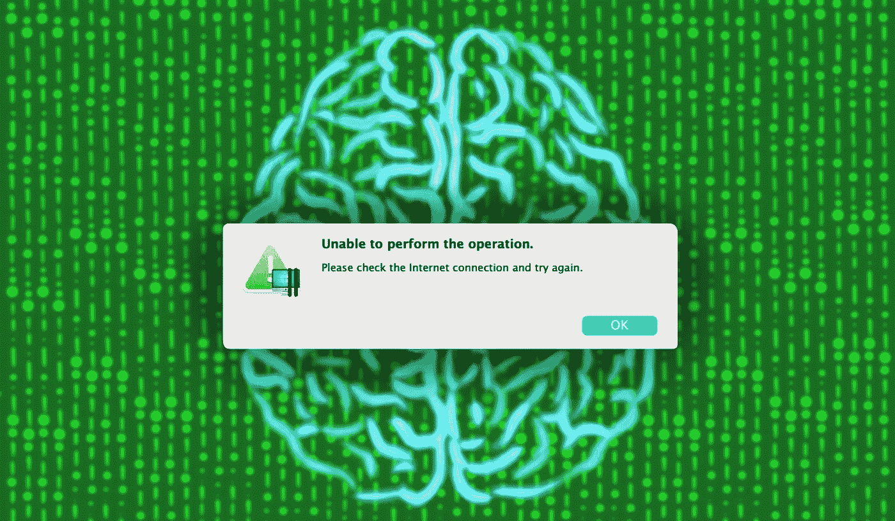
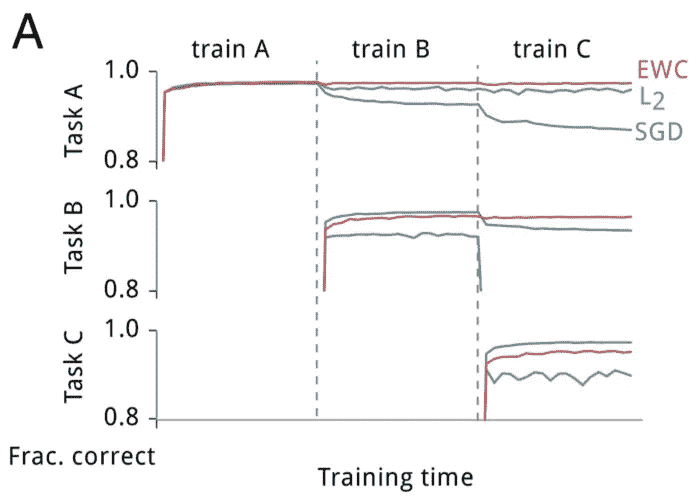
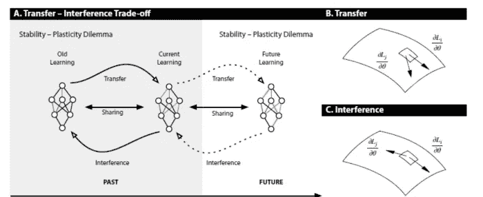
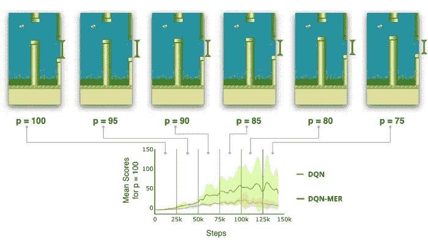

# IBM 探索了一些关于深度神经网络中灾难性遗忘的想法

> 原文：<https://pub.towardsai.net/ibm-explores-some-ideas-about-catastrophic-forgetting-in-deep-neural-networks-4cacf08f07e0?source=collection_archive---------0----------------------->

## IBM 发表了一篇论文来解决神经网络中的遗忘挑战。

来源:[https://ucsd guardian . org/2022/11/28/study-finds-the-sleep-preventing-disastant-forgetting-spiking-neural-networks/](https://ucsdguardian.org/2022/11/28/study-finds-that-sleep-prevents-catastrophic-forgetting-in-spiking-neural-networks/)

> 我最近创办了一份专注于人工智能的教育时事通讯，已经有超过 15 万名订户。《序列》是一份无废话(意思是没有炒作，没有新闻等)的 ML 导向时事通讯，需要 5 分钟阅读。目标是让你与机器学习项目、研究论文和概念保持同步。请通过订阅以下内容来尝试一下:

 [## 序列

### 与机器学习、人工智能和数据发展保持同步的最佳资源…

thesequence.substack.com](https://thesequence.substack.com/) 

“灾难性遗忘”理论很好地描述了神经网络不能在长时间内逐步积累知识的局限性。最初由 [Michael McCloskey 和 Neal J.Cohen 在 1989 年的一篇论文](https://www.sciencedirect.com/science/article/pii/S0079742108605368#!)中提出，该论文详细描述了一种现象，即神经网络倾向于快速抛弃旧知识，而无需重复来加强训练。具体来说，当网络在多个任务上被顺序训练时，灾难性遗忘发生，因为网络中对任务 A 重要的权重被改变以满足任务 b 的目标

在可以被认为是灾难性遗忘的最简单表现中，McCloskey 和 Cohen 在由 17 个一位数问题(即，1 + 1 到 9 + 1，1 + 2 到 1 + 9)组成的单个训练集上训练了一个标准的反向传播神经网络，直到网络可以代表并正确响应所有这些问题。实际输出和期望输出之间的误差在训练期间稳步下降，这反映了网络学会了在试验期间更好地表示目标输出。接下来，他们在由 17 个一位数的二进制问题(即 2 + 1 到 2 + 9，1 + 2 到 9 + 2)组成的单一训练集上训练网络，直到网络可以表示并正确响应所有这些问题。他们指出，他们的程序类似于儿童学习加法的过程。在对两个事实的每一次学习尝试之后，测试网络对一和二加法事实的知识。像一个人的事实一样，两个人的事实很容易被网络了解。然而，McCloskey 和 Cohen 注意到，即使在一次二进制加法问题的学习尝试之后，网络也不再能够正确地回答一的加法问题。响应于一个人的事实而产生的输出模式通常更类似于错误数字的输出模式而不是错误数字的输出模式。此外，包含在两个训练集中的问题 2+1 和 2+1，甚至在两个事实的第一次学习试验中显示出戏剧性的中断。

图片来源:IBM

灾难性遗忘现象是神经网络训练中另一个挑战的特例，该挑战被称为“稳定性-可塑性困境”。这个困境描述了增量、并行学习和可塑性之间的摩擦。太多的可塑性将导致先前编码的数据不断被遗忘，而太多的稳定性将阻碍这些数据在神经元之间的连接水平上的有效编码。换句话说，神经网络中的增量学习需要遗忘和稳定性之间的正确平衡。减少“遗忘”可能会提高网络的“稳定性”，但如果以“可塑性”为代价，这并不能真正解决更大的问题，因为这种情况经常发生。

几年前，IBM Research [发表了一篇论文，提出了一种持续学习的方法，允许实现可以构建增量知识的神经网络](https://www.research.ibm.com/artificial-intelligence/publications/paper/?id=Learning-to-Learn-without-Forgetting-by-Maximizing-Transfer-and-Minimizing-Interference)。在他们的研究中，IBM 团队通过提出灾难性失败和稳定性-可塑性困境的新变体，解决了神经网络中连续学习的挑战。

# 迁移-推理权衡

IBM 实现持续学习的方法的核心是对前一节中概述的困境的一种替代方法，即转移-推理-权衡。从某些角度来看，稳定性-可塑性困境只关注新的学习如何破坏旧的学习。迁移-推理权衡采用了一种新的方法，即关注向前和向后方向的权重分配。更具体地说，当决定应该在多大程度上使用相同的权重来学习不同的例子时，迁移-推理交易就表现出来了。如果使用不同的权重学习两个示例，则在学习任一示例时，示例之间的干扰和转移的可能性较低。如果这两个例子是不相关的，这是最优的，但是如果这两个例子是相关的，这是次优的，因为它消除了迁移学习的机会。相反，如果使用相同的权重学习两个示例，则迁移和干扰的可能性都很高。如果示例相关，这是最佳选择，但如果不相关，则会导致严重干扰。

图片来源:IBM

迁移-推理权衡所呈现的对称知识观对于解决持续学习问题至关重要。一般而言，如果神经网络被训练为基于其迄今为止所看到的示例的梯度之间的交互来跨示例共享其权重，这将有效地使其更容易向前执行持续学习。这将发生在模型所学习的关于平衡重量分配的普遍化的程度上。这种观点还将持续学习问题框架为元学习练习，因为目标应该是修改模型的学习，以影响一般意义上的迁移和干扰的动态。在某种程度上，元学习模型能够推广到未来，这应该使我们的模型更容易在非平稳数据中执行连续学习。

遵循迁移-推理权衡理论，IBM 创建了一种新的持续学习方法，该方法结合了深度学习世界中最热门的两个研究领域。

# 最大有效生产率

元体验回放(MER)是一种结合元学习和体验回放来实现持续学习的新框架。MER 的第一次迭代依赖于由 OpenAI 创建的名为爬虫的最先进的元学习模型。从概念上讲，元学习是深度学习的领域，专注于“学会如何学习”的过程。元学习算法通常接受任务的分布，其中每个任务都是一个学习问题，它产生一个快速的学习者——一个可以从少量例子中进行归纳的学习者。

MER 将元学习与流行的经验重放技术相结合，这些技术是处理深度学习系统中非平稳数据的黄金标准。经验重放的中心特征是保持对所看到的例子的记忆，该记忆与当前例子的训练交错，目的是使训练更加稳定。

在高层次上，元学习和经验回放的结合为解决基于迁移-推理权衡的持续学习问题提供了一种独特的思路。元学习部分的目标是产生一种最大化迁移同时最小化推理的学习方法。它的经验回放部分有助于平衡以前看过的例子和新例子之间的学习。

IBM 团队在不同的非静态数据集上测试了 MER，包括 Catcher 和 [Flappy Bird](https://flappybird.io/) 等游戏。在 Flappy Brid 的例子中，MER 被训练通过管道导航，同时制造管道间隙，随着游戏的进行，鸟需要通过越来越小的间隙。这种环境导致实现持续强化学习特别具有挑战性，因为游戏动态的突然变化真正考验了代理人在没有监督的情况下检测环境变化的能力。在实验中，MER 优于标准神经网络模型，如下图所示:

图片来源:IBM

IBM 论文的主要贡献是将持续学习框架为迁移和推理之间的权衡。这种观点允许结合元学习和经验重放技术，为通用的、持续的学习问题提供独特的体验。IBM 用 GitHub 上提供的 MER 算法的[开源实现补充了这篇研究论文。](https://github.com/mattriemer/MER)