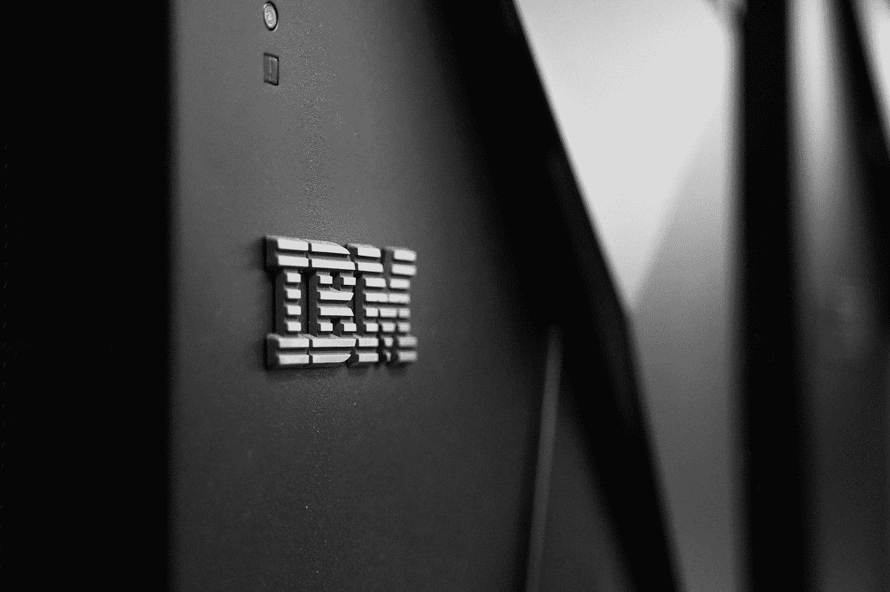

# IBM 免费提供价值 800 美元的数据科学和人工智能课程

> 原文：<https://pub.towardsai.net/ibm-is-giving-out-800-worth-of-data-science-and-ai-courses-for-free-e2e2a90a684d?source=collection_archive---------0----------------------->

## [新闻](https://towardsai.net/p/category/news)

## 外加 300 美元的其他奖金。

由[卡森·马斯特森](https://unsplash.com/@sonson?utm_source=medium&utm_medium=referral)在 [Unsplash](https://unsplash.com?utm_source=medium&utm_medium=referral) 上拍摄的照片

> “对知识的投资回报最高”——本杰明·富兰克林

# 参加即将到来的 IBM 大会

11 月 24 日，IBM 将为印度和亚太地区举办一场免费的在线[数据&人工智能会议](https://developer.ibm.com/conferences/digital-developer-conference-data-ai-in/)，涵盖四个领域:

*   人工智能生产
*   五个动手实验
*   数据和人工智能基础课程
*   数据竞赛和开源

显然，今天的人工智能比以往任何时候都更容易用像[这样的自动化工具来实现。AI](http://obviously.ai)——真正的挑战是提出有创造性和有价值的用例。这个会议是一个很好的交流和学习人工智能新用途的机会。

# 利益

除了获得参加会议的数据和人工智能基础徽章，IBM 还与 Coursera 合作，为与会者提供了一个惊人的优惠——四个免费认证:

*   [IBM AI 企业工作流专业化](https://www.coursera.org/specializations/ibm-ai-workflow) (4 个月)
*   [IBM 机器学习专业证书](https://www.coursera.org/professional-certificates/ibm-machine-learning) (6 个月)
*   [IBM 数据科学专业证书](https://www.coursera.org/professional-certificates/ibm-data-science) (10 个月)
*   [IBM 专业高级数据科学](https://www.coursera.org/specializations/advanced-data-science-ibm?action=enroll&authMode=signup#enroll) (4 个月)

如果你连续学习这些课程，并在建议的时间内完成，那么这就是 24 个月的学习材料——相当于[800](https://www.coursera.org/courseraplus)美元的价值(Coursera Plus 的 2 年！).

除了这些价值 800 美元的课程之外，参与者还可以获得 300 美元的积分，用于购买 IBM Cloud Catalog 中的任何服务，这真是令人兴奋。

# 你会学到什么

虽然课程本身提供了令人难以置信的价值，但会议本身充满了数据科学和人工智能方面的强大见解。

这 5 个动手实验室包括前沿主题，如金融中的深度强化学习，人工智能公平和偏见主题，以及为网络威胁检测建立 AutoAI 管道。

## 有用

您还有机会参加“野火代码点挑战”，在那里您将开发模型来预测澳大利亚的野火。除了有可能赢得奖品之外，这个挑战还提供了一个做出真正改变的机会。

## 向最好的人学习

这次大会是一个向像 IBM 研究 AI 副总裁 Sriram Raghavan 这样的行业领袖学习的机会；阿纳康达公司首席执行官王蒙杰；Francesca Rossi，IBM 人工智能伦理全球负责人，以及更多先驱。

# 需要更多的说服力吗？

虽然这些数据和人工智能会议相当新，但如果你需要更多的说服力，请回头看看免费的 Coursera 课程，因为你会发现超过 250，000 名学生注册了这些专业。

每个专业都有超过 4 星的评级，平均评级为 4.5 星。你将学习到获得行业工作所需的大量实际技能，包括 Jupyter、GitHub、R Studio、Watson Studio、Pandas、NumPy、Matplotlib、Seaborn、Folium、ipython-sql、Scikit-learn、SciPy 等等。

真拗口！

如果你还没有报名参加会议，我希望你尽快报名——我会(虚拟地)在那里见到你。