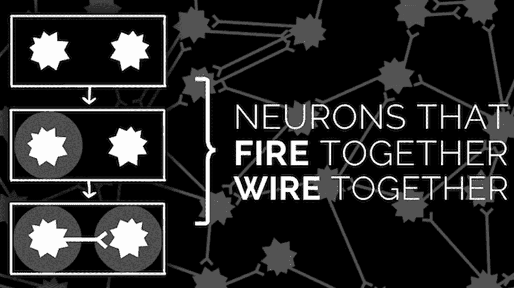
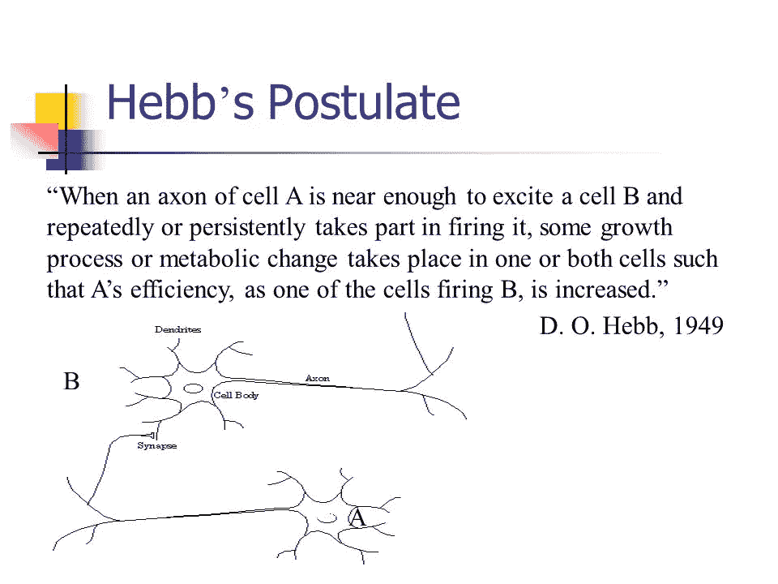
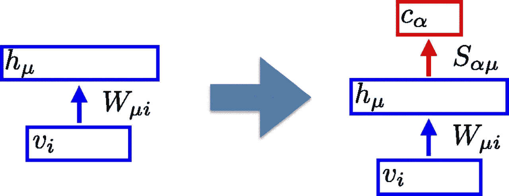
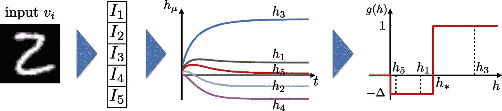
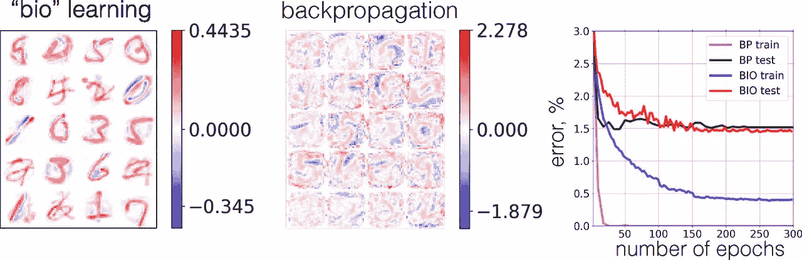

# IBM 利用这一著名的神经科学原理来构建更好的神经网络

> 原文：<https://pub.towardsai.net/ibm-uses-this-famous-principle-of-neuroscience-to-build-better-neural-networks-f5053d927529?source=collection_archive---------0----------------------->

## [人工智能](https://towardsai.net/p/category/artificial-intelligence)

## 赫布规则是描述人脑功能的最著名的观点之一。

来源:https://blog.ncase.me/neurotic-neurons-design-patterns/

> 我最近创办了一份专注于人工智能的教育时事通讯，已经有超过 80，000 名订户。《序列》是一份无废话(意思是没有炒作，没有新闻等)的 ML 导向时事通讯，需要 5 分钟阅读。目标是让你与机器学习项目、研究论文和概念保持同步。请通过订阅以下内容来尝试一下:

 [## 序列

### 订阅人工智能世界中最相关的项目和研究论文。受到 85，000 多人的信任…

thesequence.substack.com](https://thesequence.substack.com/) 

连接主义是认知科学的一个流派，旨在建立受人脑启发的人工智能(AI)系统。作为市场上最活跃的技术趋势之一，连接主义学派一直是最近深度学习和深度神经网络出现的背后原因。尽管最近取得了技术进步，但神经网络体系结构仅适用于高度专业化的任务，并且没有表现出与人类如何随着时间的推移建立知识的兼容性。2019 年，来自 IBM [的一组研究人员发表了一篇新论文，提出了一种从神经科学模式中汲取灵感的学习方法，以改善深度神经网络](https://www.pnas.org/content/early/2019/03/27/1820458116)的学习过程。

人脑仍然是整个人工智能领域的最大灵感。帮助人类获取知识的神经生物学机制和认知模式在很大程度上仍然未知，但神经科学领域在过去十年中一直在这一领域取得稳步进展。今天，我们清楚地知道，知识是由不同组神经元之间的连接形成的，这些连接在其他认知模式中发挥作用，如记忆、直觉、规划和许多其他模式。虽然概念上很简单，但这些模式不可能在神经网络中有效地重现。挑战的部分根源在于神经网络架构和人脑的基本学习模式之一之间的不匹配。

# 赫布规则与反向传播

加拿大神经心理学家唐纳德·赫布在他 1949 年的著作《组织行为》中介绍了一种新理论，这种理论被称为赫布法则或细胞组装理论。Hebb 规则的官方假设如下:

*“让我们假设一个回响活动(或“痕迹”)的持续或重复往往会诱发持久的细胞变化，增加其稳定性。……当细胞 A 的一个* [*轴突*](https://en.wikipedia.org/wiki/Axon) *足够接近并反复或持续地参与激发细胞 B 时，一个或两个细胞中会发生一些生长过程或代谢变化，从而使 A 作为激发 B 的细胞之一的效率增加。”*

神经科学界经常使用 Hebb 规则的一个更简单的版本:“一起放电的细胞连接在一起”。赫布规则是另一种重要的大脑模式的基础，这种模式被称为突触可塑性，本质上是指突触的强度根据它们的活动随着时间的推移而减弱。换句话说，经常活跃的神经连接往往会随着时间的推移变得比不活跃的神经连接更强。根据 Hebbian 理论，更强的突触连接构成了长期记忆和其他学习机制的基础。

**图片来源:IBM**

赫布规则告诉我们，一些突触连接会随着时间的推移而加强，而另一些则不会。这个原理与深度神经网络架构的核心组件之一完全矛盾。[反向传播算法](https://en.wikipedia.org/wiki/Backpropagation)通常用于计算神经网络中的梯度和权重，以改进学习模型。为了对给定的神经元执行有效的更新，反向传播不仅需要目标神经元及其连接的知识，还需要关于结构的更高层的知识，这些知识不能从特定神经元的活动中直接得知。从这个意义上说，反向传播依赖于自上而下的知识分布模型，这种模型与大脑的工作方式无关。其次，反向传播依赖于大量的标记数据来构建网络的初始组成，这也与大脑在任何学习活动中使用的无监督的、主要是观察的模型形成对比。如果人脑使用类似反向传播的算法，我们就不会有我们所知的记忆概念，因为为了形成联系，大脑必须预测未来的事件😉

将反向传播算法的数学模型与 Hebb 规则的生物学本质联系起来是深度神经网络中最近的研究领域。这是 IBM 在该领域工作的基本灵感。

# 神经网络的赫布规则

IBM 研究的主要原则是设计一个深度神经网络架构，其中包括遵循类似 Hebb 规则的突触样机制。更具体地说，IBM 将来自心理学家的观点作为基础，即突触功效的改变是学习的核心，并且生物学习的最重要的方面是突触前细胞 I 和突触后细胞 j 的协调活动将产生它们之间的突触功效的改变。利用这些想法，IBM 提出了一种受生物启发的神经网络架构，其中较低层神经元的权重是通过其连接的活动来推断的。这种学习模型允许最初使用非监督技术训练神经网络，然后使用监督模型完成训练。

在 IBM 的生物启发神经网络中，学习过程中突触强度的变化与突触前细胞的活动和突触后细胞活动的函数成比例。最初，使用该思想训练模型，直到计算出较低层的权重。此时，这些层被用作全连接感知器模型的输入，然后该模型与随机梯度下降(SGD)相结合来计算更高层的权重。

**图片来源:IBM**

将前面的数学模型放在神经网络的环境中，我们得到一个分成三个主要阶段的流水线。给定图像输入，无监督训练模型生成训练电流矢量 *I{I1，I2，…，Iu}* 。在这个阶段产生的激活被用于使用类似突触的机制来更新较低层的权重。此时，使用传统的监督学习和基于 SGD 的优化来完成神经网络的训练。

**图片来源:IBM**

IBM 的生物启发神经网络与传统模型相比有两个关键优势:

1)训练的第一部分是完全无人监督的，并且不需要大量的标记数据。

2)仅基于局部活动来推断较低隐藏层的权重，而不需要昂贵的反向传播技术。

所提出的模型的一个主要缺点是性能。首先，它是一个在线算法，因此一次只显示一个训练示例，这与 SGD 不同，在 SGD 中，训练示例可以在迷你批处理中显示。第二，对于任何训练示例，必须等到隐藏单元的集合达到稳定状态。

为了评估新模型的性能，IBM 创建了两个神经网络。第一个是使用两阶段过程训练的:第一层的建议的“生物”训练，随后是顶层中分类器的标准梯度下降训练。第二个是在监督任务上用反向传播算法进行端到端训练。这两个神经网络都已经在 MNIST 和 CIFAR-10 数据集上进行了训练。在这两种情况下，受生物启发的模型用一小部分训练数据集实现了与传统反向传播神经网络相当的性能水平。在 MNIST 的例子中，用反向传播算法端到端训练的网络证明了众所周知的基准:训练误差= 0%，测试误差= 1.5%。以“生物学”方式训练的网络在训练集上达到 0.4%的误差。因此，它永远不会完美地符合训练数据。同时，在保留测试集上的误差为 1.46%，与端到端训练的网络的误差相同。这是令人惊讶的，因为生物启发的模型学习第一层的权重，而不知道这些权重将用于什么任务，这与端到端训练的网络不同。

**图片来源:IBM**

与研究论文一起，IBM [在 GitHub](https://github.com/DimaKrotov/Biological_Learning) 上发表了他们生物神经网络的实现。当前的实现局限于非常具体的图像分析场景，但许多核心原则可以外推至其他深度学习模型。无监督和监督学习以及突触样权重计算的结合当然是 IBM 模型的一个超级创新的想法。我们真的不知道大脑的哪些认知模式可以适用于深度神经网络，但对这些想法的探索很可能是未来几年深度学习研究的前沿。