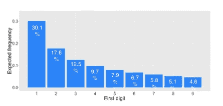
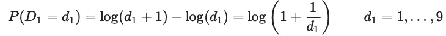
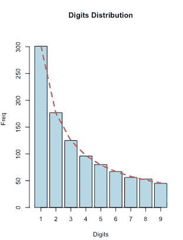

# 识别索赔、支票或会计欺诈:一个简单的检查

> 原文：<https://pub.towardsai.net/identify-claims-check-or-accounting-fraud-one-simple-check-fd024e0830dc?source=collection_archive---------2----------------------->


## 欺诈检测| R 中的实施示例

## 识别、过滤和测试欺诈假设的快速方法


马文·朗斯多夫在 [Unsplash](https://unsplash.com?utm_source=medium&utm_medium=referral) 上的照片

# 反常数定律(本福特定律)

如果你正在看报纸，你开始写下你在那一页上看到的所有数字，并计算前九个数字 1、2、3 的出现次数..9.

你认为这些第一个数字的预期频率是多少？

你猜大概是 1/9？你可能会对这个答案感到惊讶。

> 本福德定律:—是对许多现实生活中的数字数据组中前导数字的频率分布的观察。

1.  第一位数字约 30%
2.  第二位数字约为 17%…
3.  第 9 位数字~4.6%



预期频率—前九位数字

如果第一个数字 *D* 1 等于 *d* 1 的概率大约为



关于本福德定律的一个很好的起点&如何以及在哪里可以使用它，以及在哪里不可以使用它，应该是维基百科。

# 如何在 R 中使用 for 分析

编写一个简单的函数来测试本福特定律

```
ben_law ← function(d) log10(1 + 1 / d);ben_law(1) --> 0.30103
```

现在，让我们测试 2 的幂定律和斐波纳契数列。

**斐波纳契数列**通常用 Fn 表示，形成一个数列，斐波纳契数列，其特点是每个数都是前面两个数的和，从 0 和 1 开始。

## 生成前 1000 个斐波那契数:

```
n <- 1000;
num_fib <- numeric(n); 
num_fib[1] <- 1;num_fib[2] <- 1;
for (i in 3:n) {num_fib[i] <- num_fib[i-1]+num_fib[i-2] }head(num_fib); 
[1] 1 1 2 3 5 8
```

## 生成 2 的前 1000 次幂:

```
power_2 <- 2^(1:n); 
head(power_2)
[1] 2 4 8 16 32 64
```

## 证据就在情节中

下图显示了数字符合本福特定律！！

> 包装—本福特。CRAN 中提供的分析

```
benford_fib <-   benford(num_fib, number.of.digits = 1); plot(benford_fib)benford_power2 <- benford(power_2, number.of.digits =1);
plot(benford_power2)
```



## 许多数据集满足本福德定律

1.  代表**事实或事件大小的数字**
2.  与**互不相关的数字**
3.  **呈指数增长**或源于**倍增波动**的数据集
4.  不同数据集的混合

## 一些实际应用:

1.  电费和电话费
2.  会计交易
3.  信用卡交易
4.  客户余额
5.  保险索赔
6.  采购订单
7.  收入数据
8.  房价
9.  股票价格
10.  贷款数据

还有更多…..

> “欺诈通常是通过改变真实观察值或添加虚构的数字来实施的”

## 本福德定律不符合性:

> 有时候(只是有些时候)，数据不符合本福特定律。

1.  如果数据有上限或下限
2.  数据集中在一个狭窄的区间(人的身高，时薪)
3.  识别号(如航班号、汽车牌照号、电话号码、社会保险号)
4.  加法波动而不是乘法波动(如任意一天的心跳)

# 前两位数测验

本福特定律也可以用来测试前两位数的频率。这个测试**比第一个数字测试**更可靠 **。**

只需将“benford”函数中的“number.of.digits”参数更改为 2，就可以愉快地测试前两位数字的一致性了。


照片由 [NeONBRAND](https://unsplash.com/@neonbrand?utm_source=medium&utm_medium=referral) 在 [Unsplash](https://unsplash.com?utm_source=medium&utm_medium=referral) 上拍摄