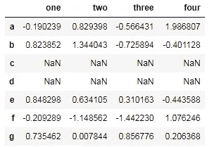
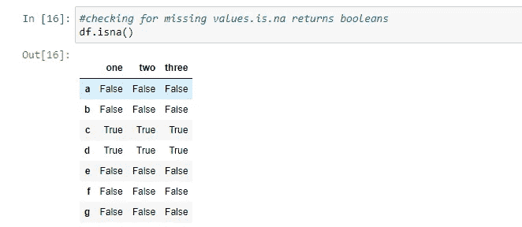
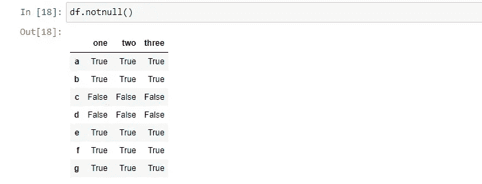
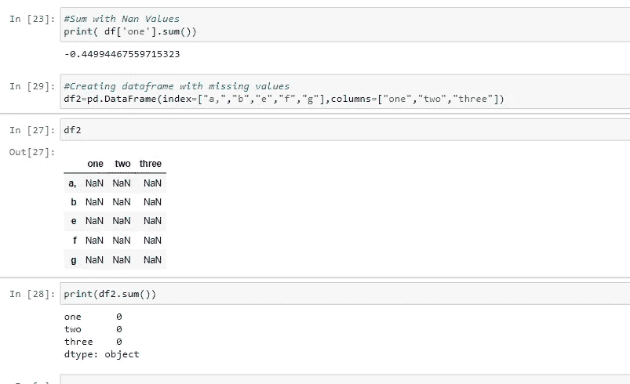
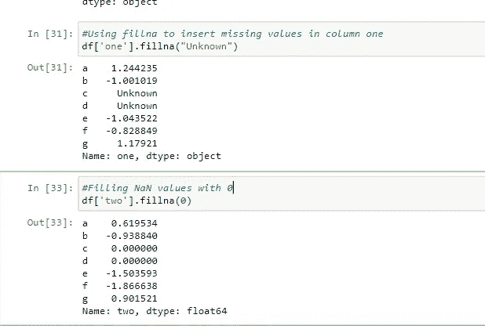
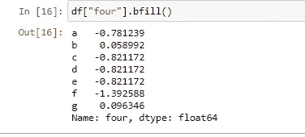
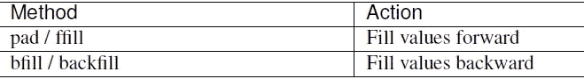
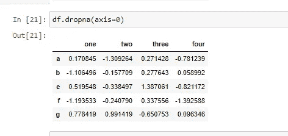
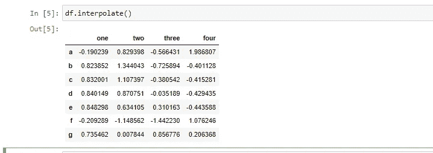

# 在 Python 中识别和处理缺失数据

> 原文：<https://pub.towardsai.net/identifying-and-handling-missing-data-in-python-ebe114776f78?source=collection_archive---------1----------------------->

## [数据分析](https://towardsai.net/p/category/data-analysis)

## 清理和转换数据


由[活动创作者](https://unsplash.com/@campaign_creators?utm_source=medium&utm_medium=referral)在 [Unsplash](https://unsplash.com?utm_source=medium&utm_medium=referral) 上拍摄的照片

数据科学项目中最耗时的部分是清理和准备用于建模的数据。实践数据集中的数据和真实世界中的数据的区别在于真实的数据是杂乱和不干净的。大约 80%的时间花在清理和转换数据上。更麻烦的是，不同的数据源可能以不同的方式指出缺失的数据。

我们将讨论缺失信息的一些广泛思考，研究 Pandas 如何决定解决它，并展示一些隐式 Pandas 工具来处理 Python 中的缺失数据。

由于计算速度和适应性的原因，NaN 是缺省的 missing worth 标记，我们应该可以选择用各种类型的数据有效地区分这个值:浮点、整数、布尔和一般对象。

> ***识别缺失数据***

让我们创建一个带有缺失值的数据帧，并检查熊猫如何处理缺失值。

```
#Importing the libraries
import pandas as pd
import numpy as np#Creating a dataframe of 5 rows and 3 columns.
#we will later insert c & d rows as blankdf=pd.DataFrame(np.random.randn(5,4),index=
      ["a","b","e","f","g"],columns=["one","two","three","four"])#reindexing the rows to insert missing values
df=df.reindex(["a","b","c","d","e","f","g"])
df
```



作者的照片

在这里的输出中，NaN 表示不是数字。np.nan、None 和 NaT(对于 datetime64[ns]类型)是熊猫的标准缺失值。

> ***检查缺失数据***

Pandas 提供 isnull()和 notnull()函数，使检测缺失值变得更容易(跨不同的数组数据类型)，这些函数也用于 Series 和 DataFrame 对象。



作者的照片



作者的照片

> ***有缺失数据的计算***

*   添加数据时，NA 将被视为零。
*   如果结果是 NA，则意味着所有数据都是 NA。



作者的照片

[](/python-examples-to-make-algorithm-more-robust-with-exception-handling-6bff7a127786) [## Python 示例通过异常处理使算法更加健壮

### 程序正常流程中的错误中断

pub.towardsai.net](/python-examples-to-make-algorithm-more-robust-with-exception-handling-6bff7a127786) [](/what-are-python-decorators-in-function-b1776b049760) [## Python Decorators 在功能上是什么？

### 向程序添加新功能

pub.towardsai.net](/what-are-python-decorators-in-function-b1776b049760) 

> ***清理/填充缺失数据***

pandas 对象使用各种数据操作方法来处理丢失的数据。

## ***A .填充缺失值:fillna()***

替换缺失值是一种常见的操作。Pandas 为这个问题提供了一个非常方便的方法:fillna()可以用非 na 数据“填充”NA 值。为了减少这种数据，fillna()提供了一些不同的策略。例如，我们可以简单地将每个 NaN 替换为“未知”或 0。



作者的照片

我们可以填充每个缺失的值，这被称为回填策略。在这里，我们用数据库中给定记录之后出现的第一个非空值填充。我们也可能有一个非空值，我们希望用另一个值来替换它。

## B.向前和向后填充 NA

使用方法参数，丢失的值可以用它们之前或之后的值替换。


作者的照片

在这里，索引 c 和 d 的 NaN 现在已经被前一行的值填充，如果我们只希望连续的间隙填充到一定数量的数据点，我们也可以限制行数

与 ffill 类似，我们也可以向后填充缺失的值，bfill 代表向后填充。



作者的照片

可用的填充方法



作者的照片

对于时间序列信息，使用 pad/ffill 是非常正常的，因此在每个时间点都可以访问“最后一个已知值”。

ffill()与 fillna(method='ffill ')相当，bfill()与 fillna(method='bfill ')相同

## C.删除缺少的值

我们还可以用 dropna()函数删除带有缺失数据的轴标签。要选择行(0)或列(1)，需要使用轴参数。



作者的照片

这里，c & d 行已被删除，因为我们取了轴 0。

此外，该参数如何用于设置条件下降。

*   how='any ':如果数据帧中有任何缺失值，则删除
*   how='all ':如果数据帧中缺少所有值，则删除

此外，使用 thresh 参数，我们可以为要删除的行/列设置缺失值的限制。

## D.插入文字

interpolate() t 默认情况下对 Series 和 DataFrame 对象在缺失的数据点执行线性插值。**插值**可以定义为一种从已知值的离散排列中找出变量中间值的方法。



作者的照片

**您正在处理的数据类型决定了合适的插值方法:**

*   如果你正在处理一个增长速度的时间序列，method='quadratic '可能是合适的。
*   如果你有一个接近累积分布函数的值，那么在那一点上 method='pchip '应该运行得很好。
*   为了用平滑绘图的目标来填补缺失的品质，考虑 method='akima '。

> ***结论***

这些方便的概念在数据科学和机器学习项目的数据争论中非常有用。

我希望你喜欢这篇文章。通过我的 [LinkedIn](https://www.linkedin.com/in/data-scientist-95040a1ab/) 和 [twitter](https://twitter.com/amitprius) 联系我。

# 推荐文章

1.[8 Python 的主动学习见解收集模块](/8-active-learning-insights-of-python-collection-module-6c9e0cc16f6b?source=friends_link&sk=4a5c9f9ad552005636ae720a658281b1)
2。 [NumPy:图像上的线性代数](/numpy-linear-algebra-on-images-ed3180978cdb?source=friends_link&sk=d9afa4a1206971f9b1f64862f6291ac0)3。[Python 中的异常处理概念](/exception-handling-concepts-in-python-4d5116decac3?source=friends_link&sk=a0ed49d9fdeaa67925eac34ecb55ea30)
4。[熊猫:处理分类数据](/pandas-dealing-with-categorical-data-7547305582ff?source=friends_link&sk=11c6809f6623dd4f6dd74d43727297cf)
5。[超参数:机器学习中的 RandomSeachCV 和 GridSearchCV](/hyper-parameters-randomseachcv-and-gridsearchcv-in-machine-learning-b7d091cf56f4?source=friends_link&sk=cab337083fb09601114a6e466ec59689)
6。[用 Python](https://medium.com/towards-artificial-intelligence/fully-explained-linear-regression-with-python-fe2b313f32f3?source=friends_link&sk=53c91a2a51347ec2d93f8222c0e06402)
7 全面讲解了线性回归。[用 Python](https://medium.com/towards-artificial-intelligence/fully-explained-logistic-regression-with-python-f4a16413ddcd?source=friends_link&sk=528181f15a44e48ea38fdd9579241a78)
充分解释了 Logistic 回归 8。[数据分发使用 Numpy 与 Python](/data-distribution-using-numpy-with-python-3b64aae6f9d6?source=friends_link&sk=809e75802cbd25ddceb5f0f6496c9803)
9。[机器学习中的决策树 vs 随机森林](/decision-trees-vs-random-forests-in-machine-learning-be56c093b0f?source=friends_link&sk=91377248a43b62fe7aeb89a69e590860)
10。[用 Python 实现数据预处理的标准化](/standardization-in-data-preprocessing-with-python-96ae89d2f658?source=friends_link&sk=f348435582e8fbb47407e9b359787e41)