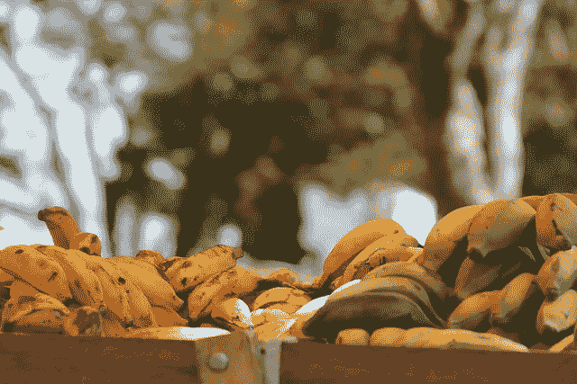
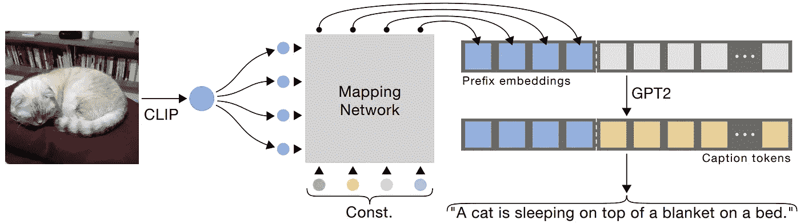
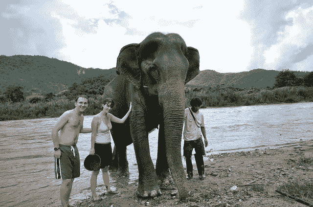

# 带剪辑和 GPT 的图像字幕

> 原文：<https://pub.towardsai.net/image-captioning-with-clip-and-gpt-d0cb3f3fddda?source=collection_archive---------0----------------------->

## [人工智能](https://towardsai.net/p/category/artificial-intelligence)

## 使用剪辑和 GPT 模型轻松生成图像的文本描述！

> 原载于 [louisbouchard.ai](https://www.louisbouchard.ai/clipcap/) ，前两天在[我的博客](https://www.louisbouchard.ai/clipcap/)上看到的！

我们已经看到人工智能使用 GANs 从其他图像生成图像。然后，有模型能够使用文本生成有问题的图像。2021 年初， [DALL-E](/openais-dall-e-text-to-image-generation-explained-1f6fb4bb5a0a?source=your_stories_page----------------------------------------) 发表，击败了所有之前使用 CLIP 从文本输入中生成图像的尝试，CLIP 是一种以文本为导向链接图像的模型。一个非常相似的任务叫做图像字幕，听起来可能很简单，但实际上也很复杂。它是机器生成图像的自然描述的能力。事实上，这几乎与机器理解图像和它生成的文本一样困难，就像文本到图像的合成一样。

生成的标题:一串香蕉放在桌子上

简单地标记你在图像中看到的对象是很容易的。这可以使用经典的分类器模型来完成。但是要理解在一张二维图片中发生了什么却是另一个挑战。人类可以很容易地做到这一点，因为我们可以根据过去的经验进行插值，我们甚至可以将自己置于照片中人的位置，并快速了解正在发生的事情。对于一台只能看到像素的机器来说，这是一个完全不同的挑战。然而，研究人员发表了一个惊人的新模型，它在这方面做得非常好。

正如研究人员明确指出的，“图像字幕是视觉语言理解中的一项基本任务”，我完全同意。结果很棒，但更酷的是它是如何工作的，所以让我们深入研究一下这个模型及其内部工作原理…

生成的标题:学生们正在观赏樱花

在这种情况下，研究人员使用 CLIP 来完成这项任务。如果你不熟悉 CLIP 是如何工作的，或者为什么它如此神奇，我强烈邀请你阅读我写的许多文章中的一篇。简而言之，CLIP 通过将两种类型的数据编码到一个相似的表示中来将图像和文本链接起来，以便进行比较。这就像用一段简短的摘要来比较电影和书籍一样。仅给出这样一个概要，你就能说出它是关于什么的，并对两者进行比较，但你不知道它是关于一部电影还是一本书。在这种情况下，电影是图像，书籍是文本描述。
然后，CLIP 创建自己的摘要，使用 bits 差异的距离计算对两个片段进行简单的比较。您已经可以看到 CLIP 似乎非常适合这个任务，但是它需要更多的工作来满足我们的需求。

在这里，CLIP 将简单地用作比较文本输入和图像输入的工具，所以我们仍然需要生成这样一个可能描述图像的文本。
他们不是用 CLIP 的编码将文本与图像进行比较，而是简单地使用 CLIP 的网络对图像进行编码，并使用这种生成的编码信息作为一种方式来指导未来使用另一种模型的文本生成过程。

ClipCap 模型。图片来自报纸。

像 GPT-3 这样的任何语言模型都可以执行这样的任务，这可以改善结果，但研究人员选择了它的前身 GPT-2，这是强大的 OpenAI 模型的一个更小更直观的版本。他们基本上是使用剪辑的编码来调节 GPT 2 的文本生成。所以 CLIP 的模型已经训练好了，他们使用了 GPT-2 的预训练版本，他们将使用 CLIP 的编码作为指导来进一步训练，以确定文本生成的方向。这并不简单，因为他们仍然需要将剪辑的编码转换为 GPT-2 可以理解的表示形式，但这也并不复杂。它将简单地学习将剪辑的编码转换成与典型的单词嵌入具有相同维度的多个向量。

学习如何将 CLIP 的输出与 GPT-2 的输入相匹配的这一步骤将在培训期间教授，因为 GPT-2 和 CLIP 都已经是完成各自任务的训练有素的强大模型。所以你可以把这看作是第三种学习模式，称为映射网络，唯一的责任是把一种语言翻译成另一种语言，这仍然是一项具有挑战性的任务。如果你对这种映射网络的实际架构感到好奇，他们尝试了简单的多层感知器或 MLP 和变压器架构，证实了后者更强大，可以学习一组细致的嵌入，当使用强大的预训练语言模型时，这些嵌入将更适合这项任务。如果你不熟悉变形金刚，你应该花 5 分钟时间阅读我写的关于变形金刚的文章，因为在不久的将来，你只会更频繁地遇到这种类型的网络。

这个模型非常简单，而且功能极其强大。想象一下，剪辑与 GPT-3 以这样的方式合并。我们可以使用这样的模型来自动描述电影，或者为盲人和视障人士创建更好的应用程序。这对于现实世界的应用程序来说非常令人兴奋！当然，这只是这个新模型的一个简单概述，您可以在下面的描述中找到关于实现的更多细节。我希望你喜欢这篇文章，如果是的话，请花一点时间和一个可能会感兴趣的朋友分享一下。

感谢您的阅读，请继续关注我的下一篇文章，这是今年的最后一篇，也是相当令人兴奋的一篇！

生成的描述:几个人站在一头大象旁边

如果你喜欢我的工作，并想与人工智能保持同步，你绝对应该关注我的其他社交媒体账户( [LinkedIn](https://www.linkedin.com/in/whats-ai/) ， [Twitter](https://twitter.com/Whats_AI) )，并订阅我的每周人工智能 [**简讯**](http://eepurl.com/huGLT5) ！

## 支持我:

*   支持我的最好方式是成为这个网站的会员，或者如果你喜欢视频格式，在 **YouTube** 上订阅我的频道。
*   在 [**中**](https://whats-ai.medium.com/) 跟我来
*   想进入 AI 或者提升自己的技能，[看这个](https://www.louisbouchard.ai/learnai/)！

## 参考

*   莫凯迪，r .，赫兹，a .和伯尔曼诺，A.H .，2021。ClipCap:图像字幕的剪辑前缀。[https://arxiv.org/abs/2111.09734](https://arxiv.org/abs/2111.09734)
*   代号:【https://github.com/rmokady/CLIP_prefix_caption 
*   Colab 演示:[https://colab . research . Google . com/drive/1 tuoac 5 f 4 sc 7 qid 56 z 0ap-str 3 rw dk 0 zv？usp =分享](https://colab.research.google.com/drive/1tuoAC5F4sC7qid56Z0ap-stR3rwdk0ZV?usp=sharing)