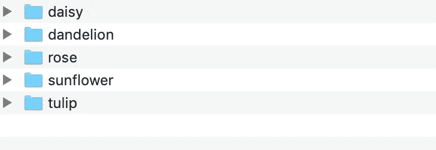
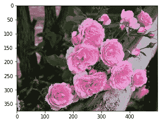
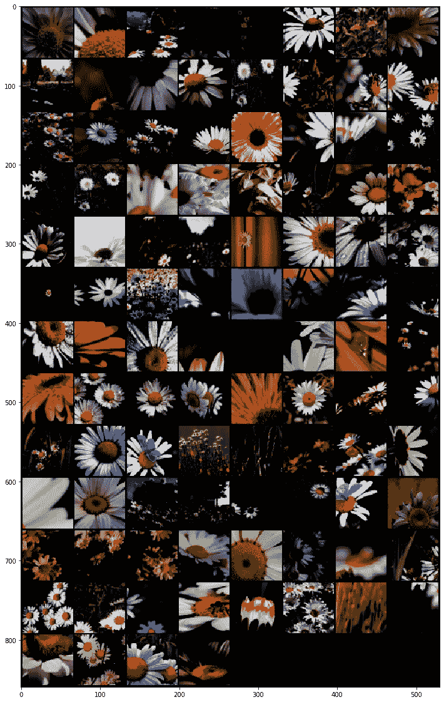
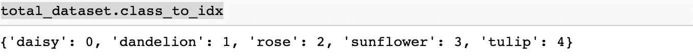
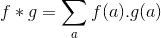
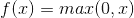
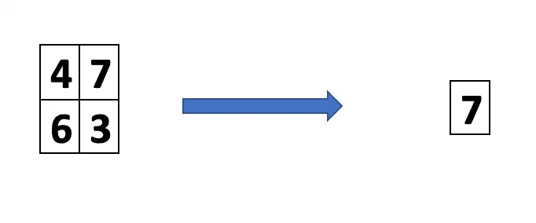
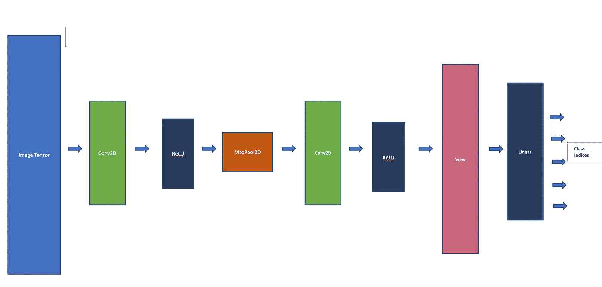
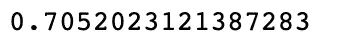

# 基于深度学习和 PyTorch 的图像分类——以花卉图像数据为例

> 原文：<https://pub.towardsai.net/image-classification-using-deep-learning-pytorch-a-case-study-with-flower-image-data-80a18554df63?source=collection_archive---------0----------------------->

## [深度学习](https://towardsai.net/p/category/machine-learning/deep-learning)、[机器学习](https://towardsai.net/p/category/machine-learning)、 [Python](https://towardsai.net/p/category/programming/python)

## 基于 PyTorch 库的卷积深度神经网络花卉图像分类


照片由 [Krystina rogers](https://unsplash.com/@krystina_elise?utm_source=medium&utm_medium=referral) 在 [Unsplash](https://unsplash.com?utm_source=medium&utm_medium=referral) 上拍摄

C 对图像数据进行分类是深度学习技术非常流行的用法之一。在本文中，我们将讨论使用深度卷积神经网络识别花卉图像。

为此，我们将使用 Python 的 PyTorch、TorchVision 和 PIL 库

# 数据探索

这个问题所需的数据集可以在 [Kaggle](https://www.kaggle.com/alxmamaev/flowers-recognition/) 找到。它包含一个文件夹结构&里面有花的图片。有 5 种不同类型的花。文件夹结构如下所示



图一

现在，我们将从文件夹“玫瑰”中看到一个花图像的样本

```
show_image("../data/flowers/rose/537207677_f96a0507bb.jpg")
```



# 数据预处理

PyTorch 总是期望数据以“张量”的形式出现。这些“张量”在神经网络的节点之间运行，包含原始和预处理或后处理的数据。简而言之，基本上“张量”类似于“numpy”数组。

同样对于图像数据，我们必须将图像作为张量读取，并在进行任何分类之前应用几个预处理阶段。

我们可以把图像看作一个三维张量。每幅图像的像素可以有 3 种颜色值，分别是红色、绿色和蓝色。我们称之为 RGB 颜色编码。另外两个维度是长度和宽度方向的像素值。

通常，图像数据需要两个非常常见的预处理阶段，如下所示:

1.  **根据模板调整大小:**将图像调整为方形。在我们的例子中，我们将把每个图像的大小调整为 64x64。
2.  **归一化:**使用每个像素值的(x — mean)/sd 机制的统计归一化。它有助于改善可视化，增强特征和拉伸图像中的对比度。

使用 PyTorch，我们将做这一套预处理

我们还可以定义一个函数来显示一组转换后的图像

现在，我们可以看到第一批的变形图像

```
show_transformed_image(make_grid(image))
```



我们也可以用这个类来索引数据字典



这将有助于识别类别。

# 构建模型

为了建立图像数据的机器学习模型，仅仅提供像素值是不够的。图像中有许多隐藏的特征仍未被发现。为此，我们应该使用卷积和最大池层的组合来提取重要的特征。

## 卷积层

数学上，两个函数 f & g 之间的卷积运算定义为



实际上，如果我们认为 f 是图像张量，那么 g 应该是另一个可以作为“卷积核”的张量。

> 它是两个张量相乘值的逐像素求和。

下图显示了卷积运算对样本图像张量的影响


大小为 3×3 的卷积核作为从(0，0)位置开始的窗口在图像张量周围移动，并且输出张量的(0，0)处的样本结果如下计算

> 输出(0，0) =图像张量(0，0) x 内核(0，0) +图像张量(0，1) x 内核(0，1) +图像张量(0，2) x 内核(0，2) +图像张量(1，0) x 内核(1，0) +图像张量(1，1)+图像张量(1，2) x 内核(1，2) +图像张量(2，0) x 内核(2，0) +图像张量(2，1) x 内核(2，1)

核将位置移动 1 位，以计算输出张量的其他位置的值。这种“转变”被称为“跨越”。

> 需要卷积层来增强和提取图像的重要和隐藏特征。在我们的例子中，可能会发生“花”位于图像的中心位置，所以应用卷积有助于检索花的核心特征，而忽略其他背景对象&颜色。

由于每个图像遵循 RGB 颜色编码，我们将对每个颜色应用卷积运算，因此我们将获得三个输出张量。最终输出将是所有三者的张量和。在 PyTorch API 术语中，这些“颜色代码”中的每一个都被称为“通道”。

> 在数学上，如果大小为 kxk 的滤波器应用于大小为 WxH 的图像，那么它产生大小为(W-k+1)×(H-k+1)的输出图像/张量

在我们的例子中，卷积是这样创建的

```
self.conv1 = nn.Conv2d(in_channels=3, out_channels=12, kernel_size=3,stride=1, padding=1)
```

> “out_channels”指定要应用多少个过滤器。这里我们应用了 12 个过滤器，它们将产生 12 个大小为 62x62 的中间图像张量。这些图像中的每一个都包含原始图像的一个独特特征。

关于“卷积滤波器”的更多细节，读者可以点击下面的链接

[](https://www.superdatascience.com/blogs/convolutional-neural-networks-cnn-step-1-convolution-operation) [## 卷积神经网络(CNN):第一步-卷积运算-博客超级数据科学-大…

### 步骤 1-卷积运算在本教程中，我们将学习卷积，这是第一步…

www.superdatascience.com](https://www.superdatascience.com/blogs/convolutional-neural-networks-cnn-step-1-convolution-operation) 

## ReLU 层

“ReLU”是一个激活函数，它捕捉另一个函数输出中的非线性。数学上，它被定义为



所以，它总是返回正值。我们可以说，它是一个“积极的过滤器”。我们将应用卷积后的“ReLU”层。

在我们的例子中，“ReLU”是这样创建的

```
self.relu1 = nn.ReLU()
```

## 最大池层

“最大池层”通常在“ReLU”之后。大小为 2 的“最大池”是一个 2×2 窗口，它遍历“ReLU”操作的输出张量，并在窗口内选择最大像素值。这个操作可以通过下图来解释



“最大池”层的目标是只选择那些影响大、价值高的功能。这有助于减少特征的尺寸。

在我们的例子中，“最大池”创建如下

```
self.maxpool1 = nn.MaxPool2d(kernel_size=2)
```

它会将图像的尺寸减少 50% (32 = 64/2)。

## 线性功能层

顾名思义，它是一个线性函数，将“Max Pool”的输出作为展平数组，并产生作为类索引的输出。预测类别指数的“线性函数”的输出值将最大。

在我们的例子中，“线性函数”创建如下

```
self.lf = nn.Linear(in_features=32 * 32 * 24, out_features=num_classes)
```

## 模型的整体架构

我们将应用不同的层，如下图所示



我们有两组“卷积”和“ReLU”层。“视图”对最后一个“ReLU”层的输出张量进行展平。我们有大小为 64x64 的图像张量作为输入，由于应用了内核大小为 2x2 (32 = 64/2)的“MaxPool2D ”,它将减少到 32x32。

首先，我们将数据集按 80:20 的比例分为训练和测试

然后，我们将编写一个自定义类，通过扩展 PyTorch 库提供的“模块”来堆叠这些层

__init__ '定义每个层及其参数，而' forward '函数执行实际调用和层堆叠。最后一层的输出从“forward”函数返回。

## 模特培训

我们需要一个优化器和损失函数来进行模型训练。为此，我们将使用' [Adam 优化器](https://engmrk.com/adam-optimization-algorithm/) ' & ' [交叉熵损失](https://ml-cheatsheet.readthedocs.io/en/latest/loss_functions.html)。

```
from torch.optim import Adamcnn_model = FlowerClassifierCNNModel()
optimizer = Adam(cnn_model.parameters())
loss_fn = nn.CrossEntropyLoss()
```

使用 PyTorch，我们需要将模型设置为训练模式，然后通过迭代训练数据集、计算优化器的损失和增量步骤来运行训练。

我们可以为此写一个函数

函数调用“loss.backward”返回到各层，并计算过程中发生的损失。

我们将使用 200 的“epoche”来训练模型

```
train_and_build(200)
```

## 模型测试和准确性

我们应该将模型设置为“评估”模式，以便在测试数据集上测试其准确性

> ' torch.max '函数返回'线性函数'输出张量的最大值。最大值推断预测的类别标签。
> 
> “torch.sum”函数对“预测”和“实际测试输出”张量之间的“与”运算输出的张量中的“1”进行求和。所以这个总和给出了正确预测的图像数量。

这里我们得到了精确度

```
test_accuracy
```



差不多是 70.52%。我们用一个简单的模型得到了很好的精确度。这个模型可以进一步调整。

# 使用模型对样本图像进行预测

现在，我们将看看如何使用来自数据集的样本图像来使用该模型。

```
show_image("../data/flowers/dandelion/13920113_f03e867ea7_m.jpg")
```


这是一个“蒲公英”的图像。

现在，我们将使用 PIL 图像 API 读取图像，并将其输入到我们的转换管道中进行必要的预处理，然后使用模型进行预测

```
class_index
```


所以，从上面提到的类到索引字典，我们可以确认它是一个‘蒲公英’。因此，我们的图像分类器模型运行良好！！

# 结论

我们学习了如何使用 PyTorch 库进行图像分类。在此过程中，我们介绍了图像的预处理、卷积层的构建以及输入图像模型的测试。

> 通过“超参数”调整，如试验“Adam optimizer”参数、添加额外的卷积层、调整内核大小和最大池窗口大小等，可以进一步提高模型的准确性。本文的读者可以自己尝试这些技术。

Jupyter 笔记本可以从下面的链接中找到

[](https://github.com/avisheknag17/public_ml_models/blob/master/image_classification_cnn_pytorch/notebook/cnn_image_classification_pytorch.ipynb) [## avisheknag17/public_ml_models

### 此时您不能执行该操作。您已使用另一个标签页或窗口登录。您已在另一个选项卡中注销，或者…

github.com](https://github.com/avisheknag17/public_ml_models/blob/master/image_classification_cnn_pytorch/notebook/cnn_image_classification_pytorch.ipynb) 

最近，我写了一本关于 ML([https://twitter.com/bpbonline/status/1256146448346988546](https://twitter.com/bpbonline/status/1256146448346988546))的书