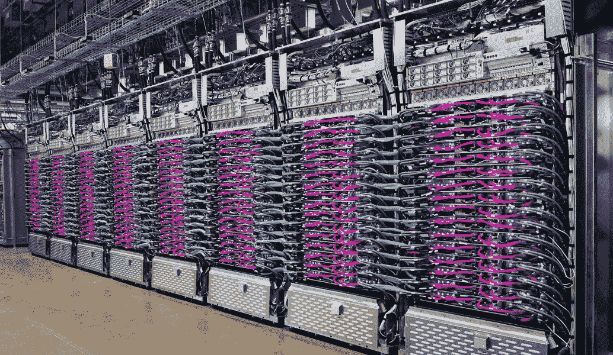
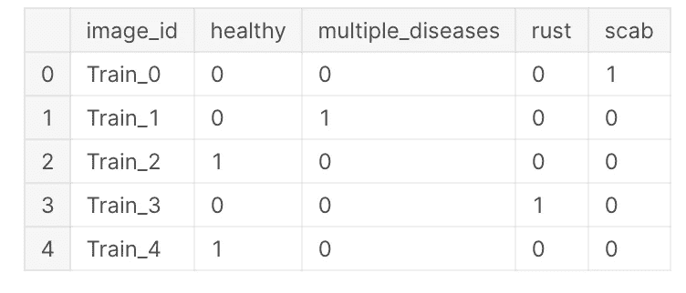
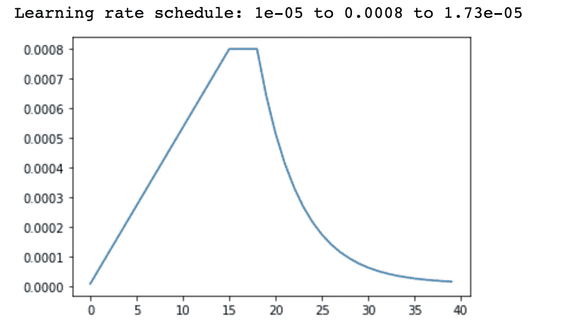

# 基于 TensorFlow + TPUs 的深度神经网络集成图像分类

> 原文：<https://pub.towardsai.net/image-classification-with-ensemble-of-deep-neural-networks-using-tensorflow-tpus-24d40d42d74b?source=collection_archive---------0----------------------->

## 深度学习

## 基于集成深度神经网络的苹果叶部病害检测。

来源:谷歌云 TPUv3 Pod

H ello 各位，欢迎来到 TensorFlow 和 Keras 的深度学习实用系列。我认为我们大多数人都经历过这样的情况:用海量图像训练一个最先进的深度学习模型需要花费很长时间。这是大多数读者最喜欢的图像分类步骤。你能猜出来吗？。是的，有助于避免模型过度拟合的非常著名的技术是图像增强。随着图像增强，图像的数量会增加一倍、三倍、甚至四倍或更多，这甚至会导致大量的训练时间。本文将帮助您了解如何使用 TPU 执行多标签图像分类。说了这么多，让我们开始学习吧。

# 什么是 TPU？

张量处理单元( **TPU** )是谷歌专门为神经网络机器学习开发的 AI 加速器专用集成电路(ASIC)，特别是使用谷歌自己的 TensorFlow 软件。[1]

# CPU vs. GPU vs. TPU

**CPU:**

*   被称为中央处理器的 CPU 以闪电般的速度执行算术运算。
*   **低延迟**，从而加快计算速度。
*   **低吞吐量**。

**图形处理器:**

*   GPU 被称为图形处理单元，以并行处理架构而闻名。
*   **高延迟**即与 CPU 相比，计算速度稍慢。
*   **高吞吐量**。

**TPU:**

*   张量处理单元是 Google 开发的，特别是用于机器学习的。

所以，现在让我们深入了解一下这个过程，弄清楚计算是如何进行的。

**举例:**考虑你要乘以两个张量，假设[1，2，3]和[4，5，6]。首先，当您使用 CPU 时，它按顺序执行(1*4)、(2*5)、(3*6)，而如果您使用 GPU，它以并行方式执行计算，即所有三个乘法同时执行，无需等待并按顺序进行。

现在，我要问你一个问题，哪个处理单元花费的时间更少，也就是说，CPU 快还是 GPU 快？。是的，CPU 执行速度比 GPU 快，因为它的延迟低，而 GPU 的延迟高。那么你可能会问一个问题“嘿，GPU 比 CPU 快对吧？”。完全正确，假设 CPU 在 2ns 内执行，如果我们用 2ns 乘以 **3(** (1*4)，(2*5)，(3*6) **)** ，那么总时间是 6ns，另一方面，GPU 在 4ns 内执行所有三次乘法。

这是由谷歌开发的 TPUs，旨在与 TensorFlow 一起使用，具有比(GPU + CPU)更高的处理能力。TPU v3 拥有 420 万亿次浮点运算能力，这意味着它一次可以执行 420 万亿次浮点运算。

假设，我们正在处理包含高分辨率图像的图像数据集，如果我们将它输入到一些最先进的模型中，如 EfficientNetB7(以其众多参数和深度而闻名)，与 TPUs 相比，使用支持 GPU 的机器会显著增加训练时间。TPU 是为人工智能目的而设计的，可以在任何时间内执行复杂的矩阵计算。

# 资料组

我们将使用 Kaggle 植物病理学竞赛数据集。它包含受四种独特类型的叶部疾病影响的苹果树的图片，任务是分类和识别苹果树中的叶部疾病；更多信息可以在 [Kaggle](https://www.kaggle.com/c/plant-pathology-2020-fgvc7) 上找到。

> 我们开始吧！

这篇文章是我为植物病理学竞赛提交的内核的演练。我建议你使用 Kaggle 内核或 Google Colab，因为它们提供免费的 TPU。😃

# 初始设置

导入必要的库…

# TPU 设置

确保您的机器支持 TPU。如果你正在使用谷歌 Colab，检查你的笔记本设置并启用 TPU，或者如果你正在使用 Kaggle 笔记本检查加速器窗口下的 TPU。

可以把它看作配置 TPU 的样板代码，这样您的模型就可以利用它们。 **TPUClusterResolver()** 检查 TPU 环境并应用分发策略。分布式训练策略就像一种使模型利用 TPU 的高计算能力的方法。

显示 TPU 数量的输出。

**get_gcs_path()** 获取位于父目录/工作目录中的数据集的路径。

# 读取数据集

数据集:Train.csv(图片由作者提供)

Kaggle 提供的 train，test (CSV)文件包含 **image_id** 列下的叶子图像。我们将利用 lambda 函数并添加**(。jpg)** 以便模特可以阅读图片。

# 数据的加载和扩充

当我们处理 TPU 时，应该使用 **tf.data.Dataset 来加载输入数据。**一旦将数据加载到 **tf.data.Dataset** 中，API 就会提供大量功能，我们可以使用这些功能来训练神经网络。

最后，我们将数据集映射到 **decode_image()** 函数，该函数将加载文件并将其解码为实际数据。 **data_augment()** 函数读取每一幅图像并执行放大，这里我们将水平和垂直翻转图像，从而减少过拟合问题并增加数据的方差。

# **学习率调度器**

深度学习模型调整与其特征相关联的权重，以使损失最小化。在模型训练的过程中，梯度损失被计算，该梯度损失乘以学习率。最后，用旧权值与学习率和梯度损失乘积之差来更新和替换神经网络的权值。学习率被认为是超参数，以便我们可以调整和调整模型性能。

学习率时间表(图片由作者提供)

# 为什么我们需要集成深度神经网络？

**集成学习**将来自多个机器学习模型的预测进行组合，以减少预测的方差和泛化误差。

每个深度学习模型都具有一定的优势，例如，考虑使用 **VGG16** 模型进行特征提取，该模型做得很好，但是已经注意到，在相当大的深度之后，模型的性能开始下降，这实际上是 VGG16 的瓶颈。这个消失梯度问题由 **ResNet** 模型解决。因此，当我们制作这种神经网络的集成时，它有助于减少预测的误差或方差，从而提高准确性。

我们将集合四种网络架构

1.  效率网 7。
2.  [效率网 B6](https://keras.io/api/applications/efficientnet/#efficientnetb6-function)
3.  [ResNet152V2](https://keras.io/api/applications/resnet/#resnet152v2-function) 。
4.  [InceptionResNetV2](https://keras.io/api/applications/inceptionresnetv2/) 。

# 培养

当我们使用 TPU 时，确保通过示波器应用**策略**(在上面的 **TPU 设置**模块中定义)，以便模型利用 TPU 进行训练。因此，必须在**战略范围()内定义模型。**重复上述功能，替换不同的模型并编译、拟合它们。

# 预言；预测；预告

最后，使用模型对 **test_dataset** 执行预测，您可以简单地对所有模型的预测进行平均，并使用它进行评估或乘以一个数字，如图所示(同样，没有使用特定的数字，这只是一种获得最佳分数的调整)

# 结论

我希望这篇文章能够帮助您以更加高效和优雅的方式训练您的模型。如果你有任何问题，欢迎在下面的评论中提出来，或者通过 [LinkedIn](https://www.linkedin.com/in/vishnudarshan/) 联系我。

# 参考

1.  https://en.wikipedia.org/wiki/Tensor_processing_unit[。](https://en.wikipedia.org/wiki/Tensor_processing_unit)
2.  [https://machine learning mastery . com/ensemble-methods-for-deep-learning-neural-networks/](https://machinelearningmastery.com/ensemble-methods-for-deep-learning-neural-networks/)

我希望这篇文章已经帮助你完成了集成深度学习模型的过程。如果你有任何问题，请在下面的评论中提出来，或者通过 LinkedIn 联系我。

在那之前，我会在下一个里抓住你！😺