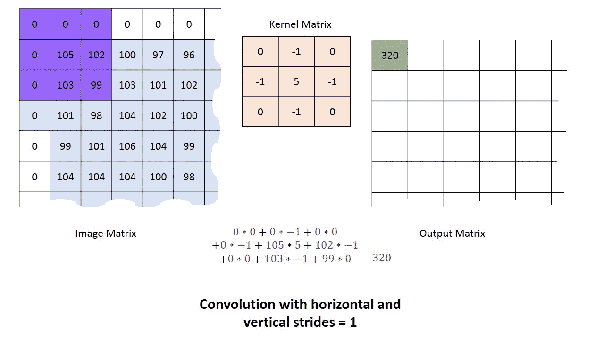
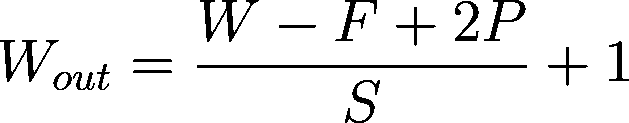

# 基于神经网络的图像分类

> 原文：<https://pub.towardsai.net/image-classification-with-neural-network-21a75cebb067?source=collection_archive---------4----------------------->

## [深度学习](https://towardsai.net/p/category/machine-learning/deep-learning)

> 一个**前馈神经网络**是一个[人工神经网络](https://en.wikipedia.org/wiki/Artificial_neural_network)，其中节点之间的连接*而非*形成一个循环。因此，它不同于它的后代:[递归神经网络](https://en.wikipedia.org/wiki/Recurrent_neural_network)。
> 
> 前馈神经网络[是第一个也是最简单的人工神经网络。在这个网络中，信息只在一个方向上移动——向前——从输入节点通过隐藏节点(如果有的话)到达输出节点。网络中没有循环或环路。](https://en.wikipedia.org/wiki/Neural_network)
> 
> —来自维基百科的参考

卷积神经网络(CNN)是一种深度学习算法，它以图像为输入，从图像中学习对象/方面，并区分每个图像。在原始方法中，滤镜是手工设计的，并应用于图像。使用 CNN，通过足够的训练从图像中学习过滤器。

**为什么 CNN 超过前馈神经网络？**

一幅图像不过是一个矩阵，为什么不把它展平成一个 1D 阵列，然后输入到一个前馈网络？。

让我用一个例子来解释这一点，考虑一个具有空间维度(64 x 64 x 3)的图像，它被转换为维度(12288 x 1)。

现在，即使模型的第一层包含 10 个神经元，单层的可学习参数也变为 10*12288 = 122880。这将增加模型中可学习参数的数量，因此计算量也会增加。

在美国有线电视新闻网的情况下，图像是这样的。(64 x 64 x 3)。卷积层是在输入体积上卷积的一组过滤器。

卷积([源](https://i.stack.imgur.com/uEoXw.gif))

这些过滤器或核心矩阵在这里充当可学习的参数。因此，这些将在数据集的每次迭代中更新。那么它是如何减少可学习参数的呢？还是那个数字！！

答案是否定的！因为在特定深度学习的权重可以应用于其他深度。所以很多参数是不一样的。

那么我们如何计算输出的维度呢？

图像的 w 维度、F 滤波器维度、P 填充、S 跨度

**步幅** S 控制过滤器移动的步长。 **padding** P 通过向输入边界添加零(或其他值)来控制输出的大小。

卷积神经网络将很容易拥有一百万个学习参数，因为它们正在从这些数据中学习。这也是移动 CNN 资源有限，缺乏计算能力的原因之一。

迁移学习将帮助每个人建模，而不是实际训练整个模型。

Tensorflow 有对象检测 API 和模型动物园来帮助检测和分类问题。

 [## 主 tensorflow/models 的模型/研究/对象检测

### 创建精确的机器学习模型，能够在单个图像中定位和识别多个对象…

github.com](https://github.com/tensorflow/models/tree/master/research/object_detection)  [## 主 tensorflow/models 上的 models/tf2_detection_zoo.md

### 我们提供了一组在 COCO 2017 数据集上预先训练的检测模型。这些模型可用于…

github.com](https://github.com/tensorflow/models/blob/master/research/object_detection/g3doc/tf2_detection_zoo.md) 

关于 Conv 网和图像分类的进一步阅读，请继续阅读[这里](/image-classification-with-neural-network-part-2-83de33afa926)。