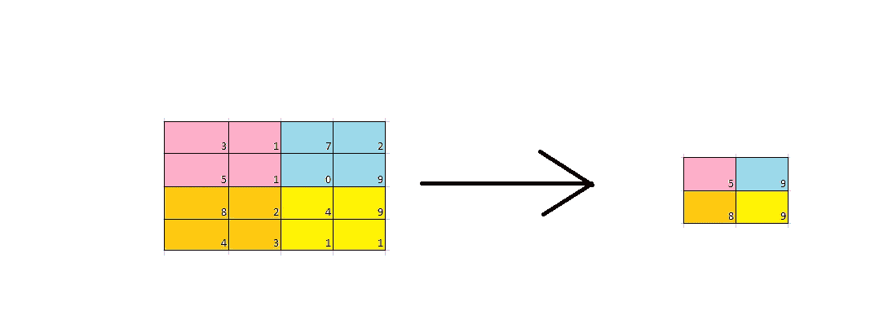

# 用神经网络进行图像分类(二)

> 原文：<https://pub.towardsai.net/image-classification-with-neural-network-part-2-83de33afa926?source=collection_archive---------1----------------------->

## [深度学习](https://towardsai.net/p/category/machine-learning/deep-learning)

如果你错过了我之前的博客，看看这里的。我之前的博客很少涉及卷积层。

在图像上使用前馈网络的缺点之一是许多学习参数。卷积神经网络使用称为**参数共享的概念或方案。**使用它我们可以假设在单个坐标学习的权重可以用于相同深度的其他权重。所以每个深度的神经元使用相同的权重和偏差。

让我用一个例子来解释，输入图像大小是 64x64x3，过滤器是 3x3，过滤器的数量是 32。输出将是 62x62x32。

计算公式请参见[此处](/image-classification-with-neural-network-21a75cebb067)。因此，如果不使用参数共享，该层中的可学习参数的数量将是，

与每个神经元相关联的参数= 3x3x3 + 1(用于偏置)= 28 个参数。

我们有 32x62x62 = 123008 层。这样组合起来，我们有 123008 x 28 = 3444224，这对单层来说是非常高的。

现在当使用参数共享时，我们得到 28 x 32 = 896 <<<< 3 million.

In some cases, parameter sharing can be relaxed such as an object can be found only in the center or corners of the image, where we do not search for that object in the entire image and search in a particular location alone.

There are other layers that help CNN to extract data from images. Few are,

*   Pooling layer
*   Activation layer
*   Dropout layer
*   Batch Normalization layer
*   Fully Connected layer

Let's discuss one of the important layers here,

**池层:**

通常在 CNN 中，当我们在层中深入时，我们需要减少空间维度并从图像中提取信息。CNN 越深入，我们可以从图像中提取更复杂的模式。

因此，池图层有助于对制图表达进行缩减采样。像卷积层一样，池层也有固定的形状矩阵，它在输入上滑动，并根据步幅计算输出，但这些层没有任何可学习的参数。

存在各种类型的池层，但是最流行的是最大池层和平均池层。

最大池:按作者分类的图像

以下是 python 中池化层的基本实现

使用 python 中的 TensorFlow 包可以获得类似的结果

**激活层**

这用于在神经网络中引入非线性。激活功能的一些实现可以在[这里](https://mugunthanramesh.medium.com/neural-network-36e5e287ecc5)找到。

激活函数的 Tensorflow 实现是

其他层可以在以后的博客中讨论

感谢阅读！