# 用 Python 进行图像分类:CNN 与变形金刚

> 原文：<https://pub.towardsai.net/image-classification-with-python-cnn-vs-transformers-fe509cbbc2d0?source=collection_archive---------0----------------------->


## 计算机视觉&用卷积神经网络、迁移学习、ViT、TensorFlow 和 HuggingFace 进行解释

## 摘要

在这篇文章中，我将使用计算机视觉和 Python 来解释 3 种不同的图像分类策略:从头开始构建一个 *CNN* ，利用一个预先训练好的模型，并应用尖端的*Vison Transformers*(*ViT)*。


照片由[杰米街](https://unsplash.com/@jamie452?utm_source=medium&utm_medium=referral)上的 [Unsplash](https://unsplash.com?utm_source=medium&utm_medium=referral)

[**【计算机视觉(CV)**](https://en.wikipedia.org/wiki/Computer_vision) 人工智能领域研究计算机如何获得对数字图像或视频的高层次理解。CV 始于 20 世纪 60 年代的麻省理工学院，当时一名暑期学生的任务是通过将相机连接到计算机来描述图像中的物体。虽然这个项目不是很成功，但它为几十年来开发现代计算机视觉的实验奠定了基础。

CV 的主要任务是图像分类和目标检测。**图像分类**是根据特定的规则或模型对图像中的像素组进行分类和标记的过程。

本教程比较了著名的*卷积神经网络*和最先进的*T21*基于注意力的*变形金刚*，它们彻底改变了人工智能的面貌。除此之外，我还将展示如何从头开始构建一个模型，转移学习，并解释模型结果。

我将展示一些有用的 Python 代码，这些代码可以很容易地应用于其他类似的情况(只需复制、粘贴、运行)，并通过注释遍历每一行代码，以便您可以复制这个示例(下面是完整代码的链接)。

[](https://github.com/mdipietro09/DataScience_ArtificialIntelligence_Utils/blob/master/computer_vision/example_img_classification.ipynb) [## data science _ artificial intelligence _ Utils/example _ img _ classification . ipynb at master…

### 数据科学项目和人工智能用例的示例…

github.com](https://github.com/mdipietro09/DataScience_ArtificialIntelligence_Utils/blob/master/computer_vision/example_img_classification.ipynb) 

我将使用“**犬种**”**数据集，其中为您提供了几幅不同犬种的图片(链接如下)。**

**[](https://www.kaggle.com/competitions/dog-breed-identification/overview) [## 犬种识别

### 确定图像中狗的品种

www.kaggle.com](https://www.kaggle.com/competitions/dog-breed-identification/overview) 

特别是，我将经历:

*   设置:导入包、数据分析、预处理
*   用*张量流、*评估&可解释性、数据扩充从零开始构建 CNN
*   CNN 迁移学习与*张量流，*评估&可解释性
*   使用预先训练的 *ViT* 和*变压器*** 

## **设置**

**首先，我需要导入以下库:**

```
***## for data*** import **os**
import **pandas** as pd
import **numpy** as np
from **tqdm**.notebook  import tqdm

***## for plotting*** import **matplotlib**.pyplot as plt
import **seaborn** as sns
import **plotly**.express as px

***## for metrics*** from **sklearn** import metrics

***## for cnn*** from **tensorflow**.keras import models, layers, callbacks ***#(2.6.0)***

***## for explainer*** from **lime** import lime_image
from **skimage** import segmentation

***## for vit*** import **transformers** ***#(4.18.0)***
```

**当处理图像时，有两个主要的 Python 包:[](https://pillow.readthedocs.io/en/stable/)**和 [*OpenCV*](https://github.com/opencv/opencv-python) 。它们都执行相同的任务，但后者要快一点，因此我倾向于使用***【OpenCV】****【cv2】*。****

```
*****## for images***
import **cv2****
```

****为了读取数据，应该将图像保存在本地，并加载将图片 id 与其标签进行映射的数据帧。****

```
****## for this tutorial I will use a subset of labels**
labels = ["scottish_deerhound", "maltese_dog", "afghan_hound", "entlebucher", "bernese_mountain_dog"]

dtf = pd.read_csv("dogs_labels.csv").rename(columns={"breed":"label"})dtf = dtf[dtf["label"].isin(labels)].sort_values("id").reset_index(drop=True)

dtf["y"] = dtf["label"].factorize(sort=True)[0]dic_y_mapping = dict( dtf[['y','label']].drop_duplicates().sort_values('y').values )print(dic_y_mapping)
dtf**
```

****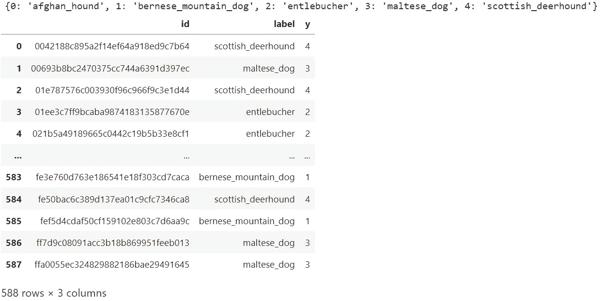****

****作者图片****

****对于计算机来说，图像只是一个像素矩阵，每个像素是一个代表 RGB 颜色组合的点。换句话说，彩色图像是一个 3D 矩阵，其值在 0 到 255 之间，其中值 0 表示黑色，值 255 表示白色。****

********

****作者图片****

****我将写下两个有用的函数来加载和绘制这些 3D 数组(plot 函数可以应用于单个图像，也可以应用于多个图片)。****

****让我们在一张图片上尝试一下:****

```
**img = **load_img**(file="data_dogs/0042188c895a2f14ef64a918ed9c7b64.jpg")
**plot_imgs**(img, "shape: "+str(img.shape))**
```

****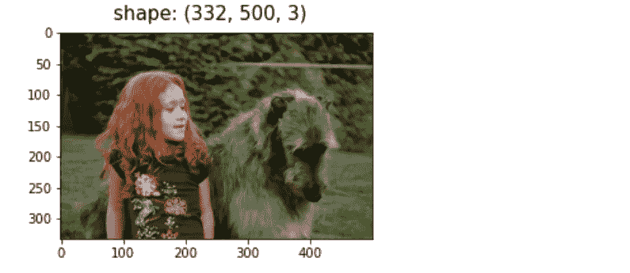****

****因此，如果我们想分解这张图片的 RGB 通道，我们可以这样做:****

```
**lst = []
for i in range(3):
    tmp = np.zeros(img.shape, dtype='uint8')
    tmp[:,:,i] = img[:,:,i]
    lst.append(tmp)

**plot_imgs**(lst, ["r","g","b"])**
```

****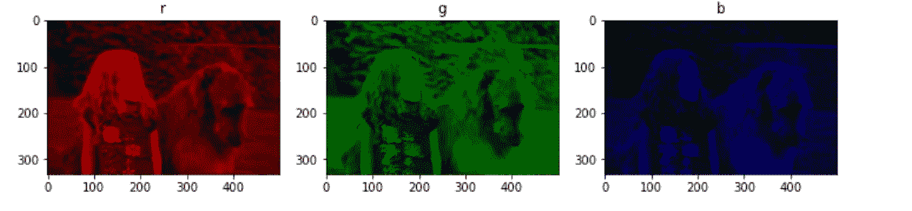****

****作者图片****

****现在让我们加载整个数据集:****

```
*****## load all***
dirpath = "folder name here"
ext = ['.png','.jpg','.jpeg','.JPG']

lst_imgs = []
errors = 0
for file in **tqdm**(sorted(**os**.listdir(dirpath))):
    try:
        if file.endswith(tuple(ext)):
            img = load_img(file=**os**.path.join(dirpath, file), 
                           ext=ext)
            lst_imgs.append(img)
    except Exception as e:
        print("failed on:", file, "| error:", e)
        errors += 1
        lst_imgs.append(np.nan)
        pass

dtf["img"] = lst_imgs
dtf = dtf[["id","img","label","y"]]print("check:", len(lst_imgs), "=", len(dtf), " |  Nas:", errors, "=", dtf["img"].isna().sum())
dtf.head()**
```

****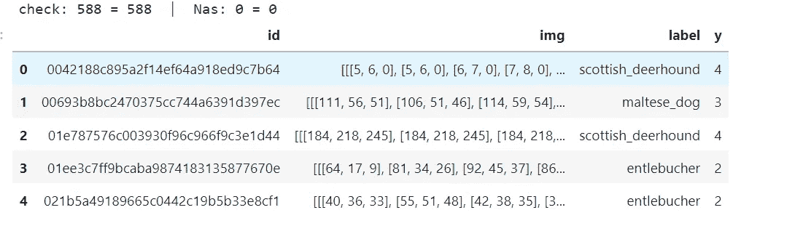****

****作者图片****

```
****plot_imgs**(dtf["img"].head(), dtf["label"].head())**
```

****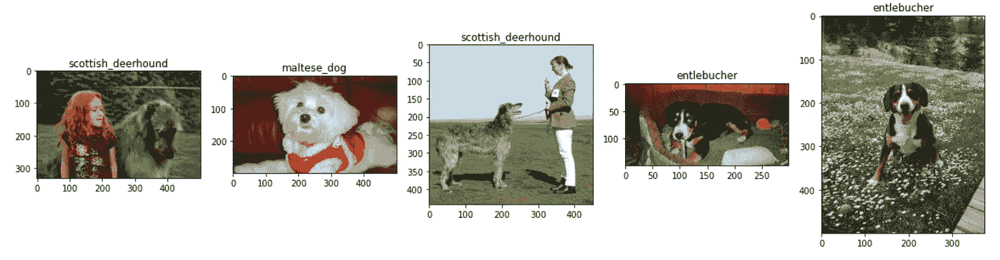****

****作者图片****

****在开始研究这些模型之前，有一些**数据分析**要做。具体来说，我将回答 3 个问题:****

****1.数据集平衡吗？似乎是这样，不过它很小。****

```
**dtf["y"].value_counts().plot(kind="barh", title="Y", figsize=(5,3)).grid(axis='x')
plt.show()**
```

****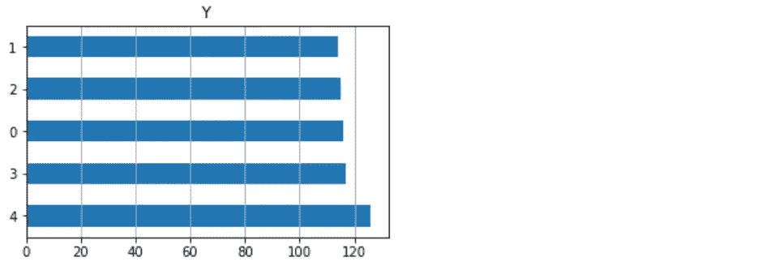****

****作者图片****

****2.既然所有的图像都必须有相同的形状，那么选择什么样的尺寸才是合适的呢？通常，我会选择最常用的形状，并根据它来调整大小。****

```
**width = [img.shape[0] for img in dtf["img"]]
height = [img.shape[1] for img in dtf["img"]]fig, ax = plt.subplots(nrows=1, ncols=2, figsize=(15,5))

***## all***
ax[0].scatter(x=width, y=height, color="black")
ax[0].set(xlabel='width', ylabel="height", title="Size distribution")
ax[0].grid()

***## zoom***
ax[1].scatter(x=width, y=height, color="black")
ax[1].set(xlabel='width', ylabel="height", xlim=[100,700], ylim=[100,700], title="Zoom")
ax[1].grid()

plt.show()**
```

****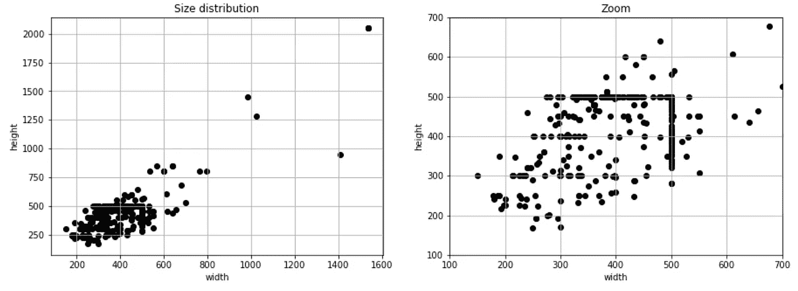****

****作者图片****

```
*****## resize***
img_size = (500,500)  ***#<-- 500x500***dtf["img"] = [cv2.resize(img, img_size) for img in dtf["img"]]plot_imgs(dtf["img"].head(), dtf["y"].head())**
```

****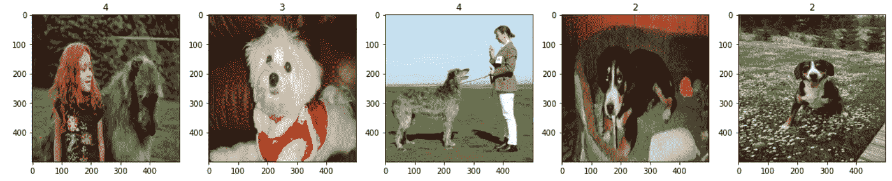****

****作者图片****

****3.我应该保留颜色还是转换黑白图像(2D 阵列而不是 3D)？一般来说，如果机器能够处理训练，我会说保留颜色。无论如何，如果有人想检查颜色和类别之间是否存在相关性(即所有 1 都系统地比 0 暗)，我建议从每个图像中提取主色，并绘制 RGB 分布。因此，如果有一个模式，图像数据点将出现在集群中。****

```
*****## try one***
i = 0

rgb = dtf["img"][i].copy()
unique, counts = np.unique(rgb.reshape(-1,3), axis=0, return_counts=True)
rgb[:,:,0], rgb[:,:,1], rgb[:,:,2] = unique[np.argmax(counts)]plot_imgs([dtf["img"][i], rgb], ["image","main color"])**
```

****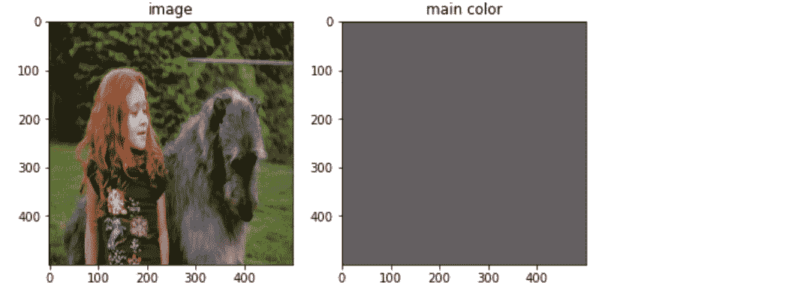****

****作者图片****

```
*****## do all***
r,g,b,y = [],[],[],[]
for img,label in tqdm(zip(dtf["img"],dtf["y"])):
    unique, counts = np.unique(img.reshape(-1,3), axis=0, 
                               return_counts=True)
    red, green, blue = unique[np.argmax(counts)]
    r.append(red)
    g.append(green)
    b.append(blue)
    y.append(label)

***## plot 3D (with plotly)***
data = pd.DataFrame({"r":r,"g":g,"b":b,"y":y})
data["y"] = data["y"].astype(str)
fig = px.scatter_3d(data, x='r', y='g', z='b', color='y',
                    labels={"r":"red","g":"green","b":"blue"})
fig.show()**
```

****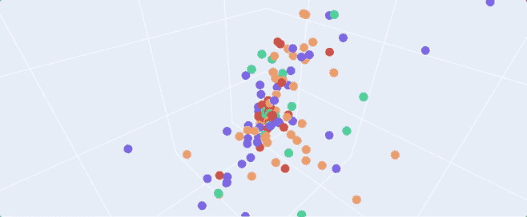****

****作者图片****

****最后，我们可以继续进行**预处理** : scale(因为当我们处理神经网络时，数据最好在 0 和 1 之间)并将其分成训练集和测试集。****

```
****## scaling**
dtf["img"] = dtf["img"]/255 **## partitioning** split = 500X_train = np.array([x for x in dtf["img"].head(split).values])
y_train = np.array([y for y in dtf["y"].head(split).values])

X_test = np.array([x for x in dtf["img"].tail(len(dtf)-split).values])
y_test = np.array([y for y in dtf["y"].tail(len(dtf)-split).values])**
```

****现在一切都准备好进入模型了。****

## ****卷积神经网络****

****[*CNN*](https://en.wikipedia.org/wiki/Convolutional_neural_network) 是一种专门用于处理像素数据的人工神经网络。它们是在 90 年代发明的，但在 2012 年得到了广泛应用，当时技术开始允许重型模型通过利用 GPU 在笔记本电脑上运行([*tensor flow*](https://www.tensorflow.org/)*于 2015 年发布)。*****

******CNN 的*解决了一个具体问题:如何从 3D 矩阵中提取特征，这是一个复杂的数据结构。主要思想是算法学习如何用一个数学公式(即均值)来概括一组像素，而不是做手工的特征工程。*****

****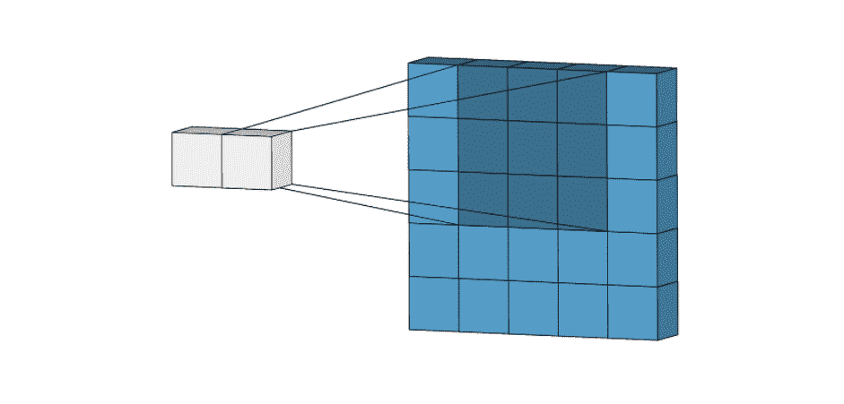****

****[来源](https://miro.medium.com/max/2340/1*Fw-ehcNBR9byHtho-Rxbtw.gif)****

****这样，维数逐渐减少，直到每个图像由单个特征向量表示。****

****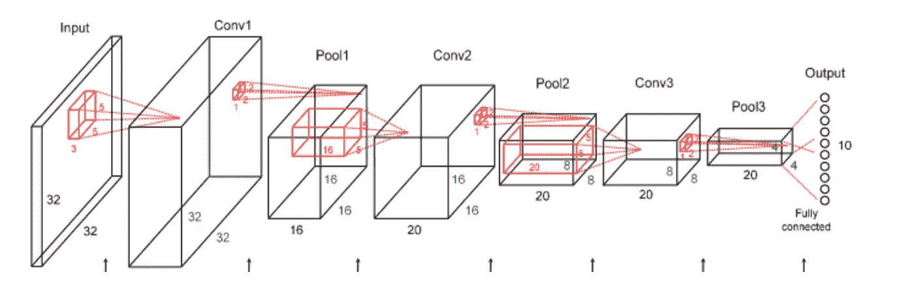****

****[来源](https://www.domsoria.com/2019/10/come-funziona-una-rete-neurale-cnn-convolutional-neural-network/)****

****我准备从零开始训练一个基本的*CNN*(2 层 [*卷积*](https://www.tensorflow.org/api_docs/python/tf/keras/layers/Conv2D) + [*池化*](https://www.tensorflow.org/api_docs/python/tf/keras/layers/MaxPool2D) )作为其他模型的基线。我将使用*tensor flow*/*Keras:*中的 [*模型*](https://www.tensorflow.org/api_docs/python/tf/keras/Model) 类****

```
*****## Input***
x_in = layers.Input(name="x_in", shape=(500,500,3))

***## Conv + MaxPool***
x_conv2d = layers.**Conv2D**(name="x_conv2d", filters=32, kernel_size=(3,3), activation="relu")(x_in)
x_maxpool = layers.**MaxPooling2D**(name='x_maxpool', pool_size=(2,2))(x_conv2d)

***## Conv + MaxPool***
x_conv2d2 = layers.**Conv2D**(name="x_conv2d2", filters=32, kernel_size=(3,3), activation="relu")(x_maxpool)
x_maxpool2 = layers.**MaxPooling2D**(name='x_maxpool2', pool_size=(2,2))(x_conv2d2)

***## Flat + Dense***
flat = layers.**Flatten**(name="flat")(x_maxpool2)
dense = layers.**Dense**(name="dense", units=128, activation='relu')(flat)

***## Output***
y_out = layers.**Dense**(name="y_out", units=n_classes, activation="softmax")(dense) ***#if binary -> 1 neuron & sigmoid***

***## Compile***
model = models.**Model**(inputs=x_in, outputs=y_out, name="CNN")
model.compile(loss="sparse_categorical_crossentropy", optimizer="adam", metrics=["accuracy"]) ***#if binary -> binary_crossentropy loss***model.summary()**
```

****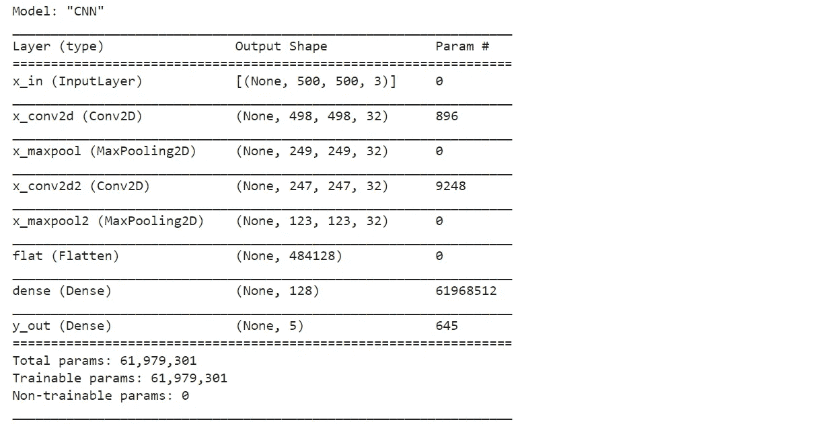****

****作者图片****

****如果您想要检查图像在每一层中经历了什么样的变换，您可以像这样将其可视化(考虑到这些层仍然是随机的，因为模型还没有被训练):****

```
*****## check layers***
x = X_train[0]
convx = model.layers[1](x)
maxpx = model.layers[2](convx)
convx2 = model.layers[3](maxpx)
maxpx2 = model.layers[4](convx2)

print("shape:", maxpx2.shape[1:])

plot_imgs([x[0], convx[0][:,:,24:27], maxpx[0][:,:,22:25], 
          convx2[0][:,:,10:13], maxpx2[0][:,:,13:16]], 
          ["input","conv2d","maxpool","2nd conv2d","2nd maxpool"])**
```

****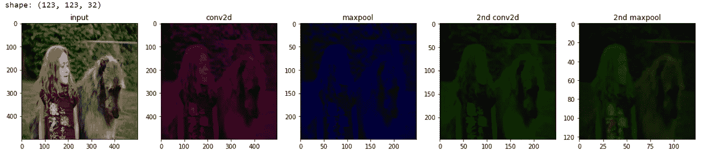****

****作者图片****

****我们可以**训练模型**，并在实际测试集上测试之前，检查用于验证的训练集子集的性能。您可以使用以下功能来可视化培训:****

```
*****## Train***
training = model.fit(x=X_train, y=y_train, 
                     epochs=100, batch_size=64, shuffle=True, 
                     verbose=0, validation_split=0.2,
                     callbacks=[callbacks.EarlyStopping(monitor='val_loss', mode='min', verbose=1, patience=3)])model = training.model
**utils_plot_training**(training)**
```

****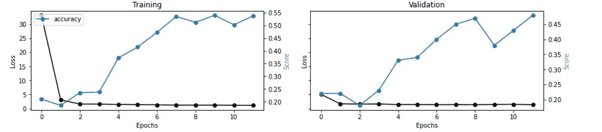****

****作者图片****

****请注意，我在回调中使用了 [*提前停止*](https://www.tensorflow.org/api_docs/python/tf/keras/callbacks/EarlyStopping) 工具，当受监控的指标(即验证损失)停止改善时，该工具将终止培训。****

****让我们**测试**这个模型:****

```
*****## Test***
predicted_prob = model.predict(X_test)
predicted = [np.argmax(pred) for pred in predicted_prob]**
```

****为了**评估**CNN 的表现，我将使用以下指标:****

*   *****准确性*:模型预测正确的比例。****
*   *****混淆矩阵*:一个汇总表，按类别细分了正确和错误预测的数量。****
*   *****ROC* :图示在各种阈值设置下的真阳性率对假阳性率的曲线图。曲线下的面积( *AUC* )表示分类器将随机选择的阳性观察值排序高于随机选择的阴性观察值的概率。****
*   *****精度*:相关实例在检索到的实例中所占的比例。****
*   *****Recall:* 实际检索到的相关实例总数的一部分。****

```
**evaluate_multi_classif(y_test, predicted, predicted_prob, figsize=(15,5))**
```

****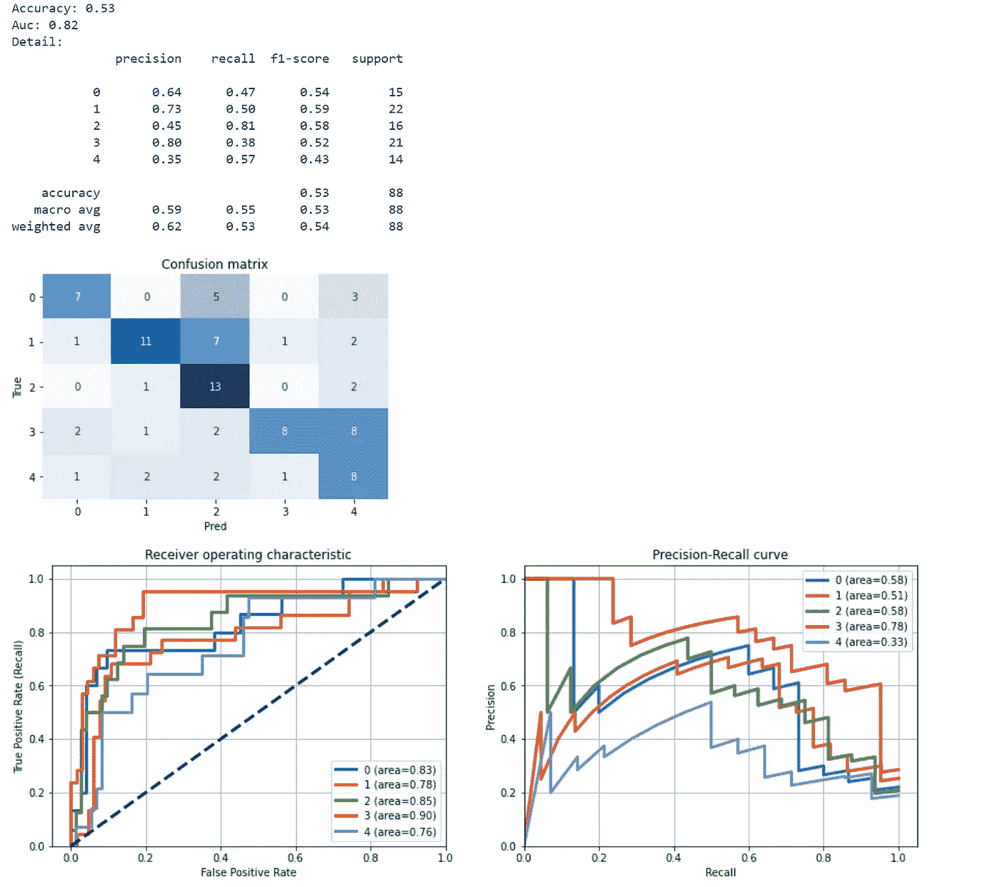****

****作者图片****

****不是很好，它有很多情况，但是也有很多错误，特别是对于类 3 和类 4。在这种情况下，最好理解模型为什么用某个标签对图像进行分类，并评估预测的**可解释性**。 [*石灰*包](https://github.com/marcotcr/lime)可以帮助我们建立一个解释器。为了举例说明，我将从测试集中随机观察，看看模型预测了什么，为什么。****

```
*****## img instance*** i = 10
img_instance = X_test[i]***## explain*** explainer = **lime_image**.LimeImageExplainer()
explained = explainer.explain_instance(img_instance, model.predict, num_samples=1000)***## visualize*** fig, ax = plt.subplots(nrows=1, ncols=2, figsize=(10,5))
ax[0].imshow(img_instance)
temp, mask = explained.get_image_and_mask(explained.top_labels[0], positive_only=False, hide_rest=False)
ax[1].imshow(segmentation.mark_boundaries(temp/2+0.5, mask))
plt.show()**
```

****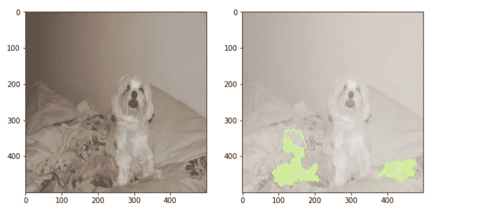****

****作者图片****

****正如我们所见，该模型没有使用正确的特征(即狗的像素)，因此它变得混乱，主要原因是数据集对于计算机视觉用例来说不够大。****

****有两种方法可以解决这个问题:数据扩充和迁移学习。 [**数据扩充**](https://en.wikipedia.org/wiki/Data_augmentation) 是一种通过添加对已有图像稍加修改的副本来增加数据量的技术。它充当正则化器，有助于在训练机器学习模型时减少过拟合。使用 *TensorFlow:* 可以轻松设置数据扩充****

```
**data_augmentation = models.Sequential(name="data_augmentation", layers=[
    layers.**RandomFlip**("horizontal_and_vertical"),
    layers.**RandomRotation**(factor=0.2),
    layers.**RandomZoom**(height_factor=0.2, width_factor=0.2)
])***## try one***
plot_imgs([X_train[0], **data_augmentation**(X_train[0])], ["original","augmented"])**
```

****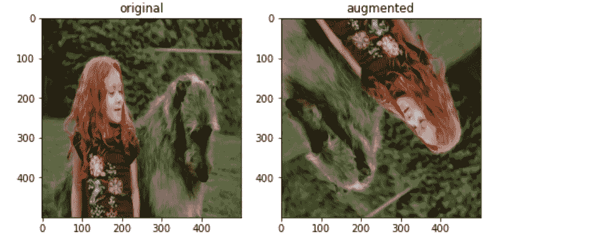****

****作者图片****

****数据扩充可在训练前应用于数据集，或作为图层添加到模型中，如下所示:****

```
***## Input*
x_in = layers.Input(name="x_in", shape=(500,500,3))***## Data Augmentation*
*x_augm = data_augmentation(x_in)****## Conv + MaxPool*
x_conv2d = layers.Conv2D(name="x_conv2d", filters=32, kernel_size=(3,3), activation="relu")(***x_augm***)
x_maxpool = layers.MaxPooling2D(name='x_maxpool', pool_size=(2,2))(x_conv2d)

*## Conv + MaxPool*
x_conv2d2 = layers.Conv2D(name="x_conv2d2", filters=32, kernel_size=(3,3), activation="relu")(x_maxpool)
x_maxpool2 = layers.MaxPooling2D(name='x_maxpool2', pool_size=(2,2))(x_conv2d2)

*## Flat + Dense*
flat = layers.Flatten(name="flat")(x_maxpool2)
dense = layers.Dense(name="dense", units=128, activation='relu')(flat)

*## Output*
y_out = layers.Dense(name="y_out", units=n_classes, activation="softmax")(dense)*## Compile*
model = models.Model(inputs=x_in, outputs=y_out, name="CNN")
model.compile(loss="sparse_categorical_crossentropy", optimizer="adam", metrics=["accuracy"])**
```

****请注意，将它作为模型中的一个层不会增加观察的数量，它只是在每个时期随机修改图像以减少过度拟合。****

****或者，人们可以使用迁移学习。****

## ****迁移学习****

****简而言之，[迁移学习](https://en.wikipedia.org/wiki/Transfer_learning)意味着采用一个已经在大型数据集上进行了预训练的模型，并使其适应您的用例。例如，在这里，我将选择一个已经可以识别狗的模型，并根据狗的品种(我的标签)对其进行微调。显然，数据集越相似，迁移学习就越有效……用一个在汽车上训练过的模型对动物进行分类是行不通的。****

****我将使用[***vgg 16***](https://arxiv.org/abs/1409.1556)*一个 16 层的深度 *CNN* 对来自 [*ImageNet* 数据库](https://www.image-net.org/)的 100 多万张图像进行训练，以识别成千上万的物体和动物。所以计划是这样的:加载预训练的模型，它不会被重新训练，没有最终层，并用一些新的最终层替换它的头部，这些最终层将学习如何预测我的目标。*****

****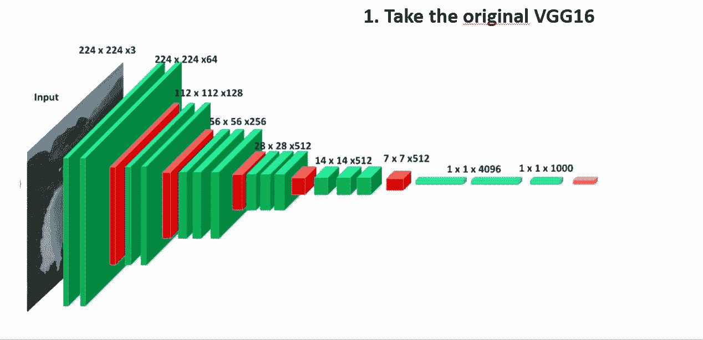****

****作者图片****

****对于这个小操作，我将使用 [*序列*](https://www.tensorflow.org/api_docs/python/tf/keras/Sequential) 类，因为它可以自动处理张量形状的差异，从而简化分离模型的合并。****

```
**from **tensorflow.keras.applications** import **vgg16*****## Load pre-trained*** base = vgg16.VGG16(weights="imagenet", include_top=False, 
                   input_shape=(500,500,3))
base.trainable = False***## Add new head***model = models.Sequential(name="TransferLearning", layers=[
    base,
    layers.Flatten(name="flat"),
    layers.Dense(name="dense", units=128, activation='relu'),
    layers.Dense(name="y_out", units=n_classes, activation="softmax")
])

model.compile(loss="sparse_categorical_crossentropy", optimizer="adam", metrics=["accuracy"])
model.summary()**
```

****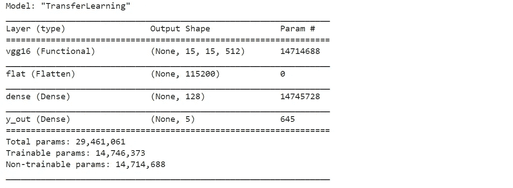****

****作者图片****

****通过使用相同的代码进行训练、测试和评估，我们这次得到了更好的结果(*精确度*为 0.7，详情请见笔记本)。此外，感谢 *lime* 讲解器，我们可以看到这个模型知道它在做什么:****

****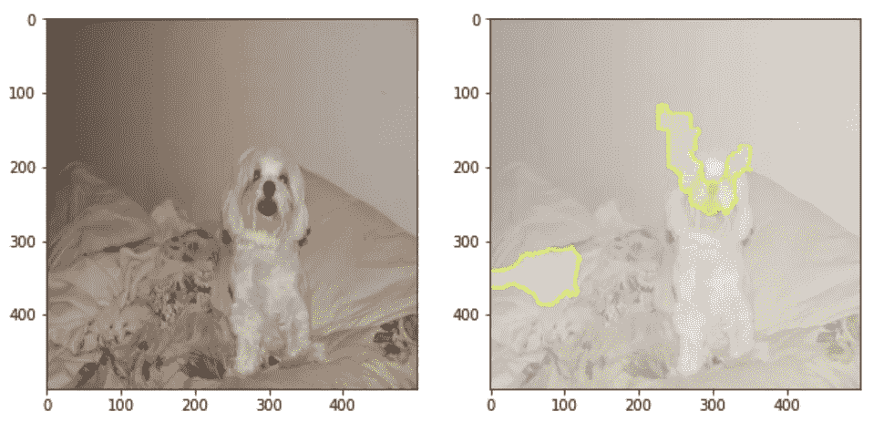****

****作者图片****

## ****变形金刚(电影名)****

****[*变形金刚*](https://en.wikipedia.org/wiki/Transformer_(machine_learning_model)) 是 Google 的论文 [*提出的一种新的建模技术*](https://arxiv.org/abs/1706.03762)*【2017】*，其中论证了经典的深度神经网络完全可以被[注意力机制](https://en.wikipedia.org/wiki/Attention_(machine_learning))所取代，甚至获得更好的性能。虽然它们已经迅速接管了 NLP 领域，但是对 CV 的应用仍然有限。******

*****2020 年，提出了 [*视觉转换器* ( *ViT* )](https://github.com/google-research/vision_transformer) ，这是一种将文字嵌入应用于图像的模型，而不是像 *CNN* 那样使用像素阵列。基本上，输入图像被分解成固定大小的小块(或扁平的像素组)，就像一个文本序列，然后每个小块被嵌入并传递给关注层(编码器)。这种架构允许模型学习局部特征以及重建图像的完整结构。*****

****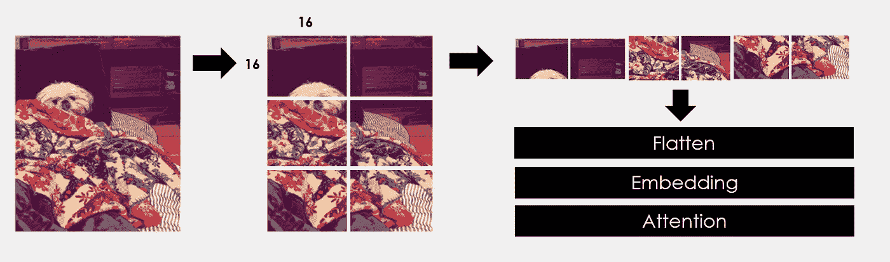****

****作者图片****

****这些模型的主库是 [*变形金刚*](https://huggingface.co/transformers/) by [拥抱脸](https://huggingface.co/):****

```
*****## Load model*** model_name = "**google/vit-base-patch16-224-in21k**"

prep = transformers.AutoFeatureExtractor.from_pretrained(model_name)
vit = transformers.TFAutoModel.from_pretrained(model_name)**
```

****通常，每个变形金刚模型都有自己的预处理器。事实上，如果您打印 *prep* 对象，您会看到 *ViT* 需要一些规范化和调整大小:****

****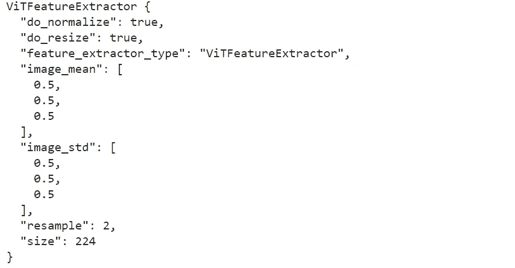****

****作者图片****

****让我们这样做:****

```
*****# Preprocess*** X_train_vit = np.array([prep(img)["pixel_values"][0] for img in X_train])
X_test_vit = np.array([prep(img)["pixel_values"][0] for img in X_test])

print(X_train_vit[0].shape)**
```

****新的形状是 *(3，224，224)* 。这意味着 RGB 通道是第一维度，图像需要为 *224x224。*****

```
*****# Model***
x_in = layers.Input(name="x_in", shape=(3,224,224))vit_out = vit(x_in)[0][:,0,:]y_out = layers.Dense(name="y_out", units=n_classes, 
                     activation="softmax")(vit_out)

model = models.Model(inputs=x_in, outputs=y_out, name="ViT")model.compile(loss="sparse_categorical_crossentropy", 
              optimizer="adam", metrics=["accuracy"])model.summary()**
```

****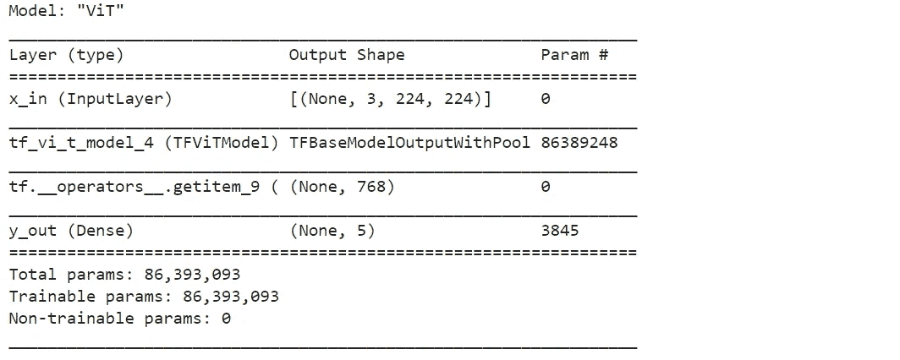****

****作者图片****

****您可以使用与之前相同的代码来训练、测试和评估模型。不幸的是，对于 *ViT* 要求的输入形状，不可能使用 *lime* 解释器。****

## ****结论****

****这篇文章是一个教程，演示如何应用不同的计算机视觉模型进行图像分类。我比较了 3 种方法: *CNN* 从头开始，从一个预先训练好的 *CNN (VGG16)* 迁移学习，以及图像的前沿变形金刚( *ViT* )。我经历了数据分析、预处理、模型训练、数据扩充、评估和可解释性。****

****我希望你喜欢它！如有问题和反馈，或者只是分享您感兴趣的项目，请随时联系我。****

> ****👉[我们来连线](https://linktr.ee/maurodp)👈****

> ****本文是 Python 系列 **CV 的一部分，参见:******

****[](https://towardsdatascience.com/how-to-detect-objects-with-your-webcam-82693c47bd8) [## 用 Python 和 YOLO 进行对象检测

### 使用网络摄像头的计算机视觉

towardsdatascience.com](https://towardsdatascience.com/how-to-detect-objects-with-your-webcam-82693c47bd8) [](https://towardsdatascience.com/document-parsing-with-python-ocr-75543448e581) [## 使用 Python 和 OCR 进行文档解析

### 使用计算机视觉从任何类型的文档中检测和提取文本、图形、表格

towardsdatascience.com](https://towardsdatascience.com/document-parsing-with-python-ocr-75543448e581)****