# 基于深度学习的图像去噪

> 原文：<https://pub.towardsai.net/image-de-noising-using-deep-learning-1a8334c81f06?source=collection_archive---------0----------------------->

## [计算机视觉](https://towardsai.net/p/category/computer-vision)，[深度学习](https://towardsai.net/p/category/machine-learning/deep-learning)

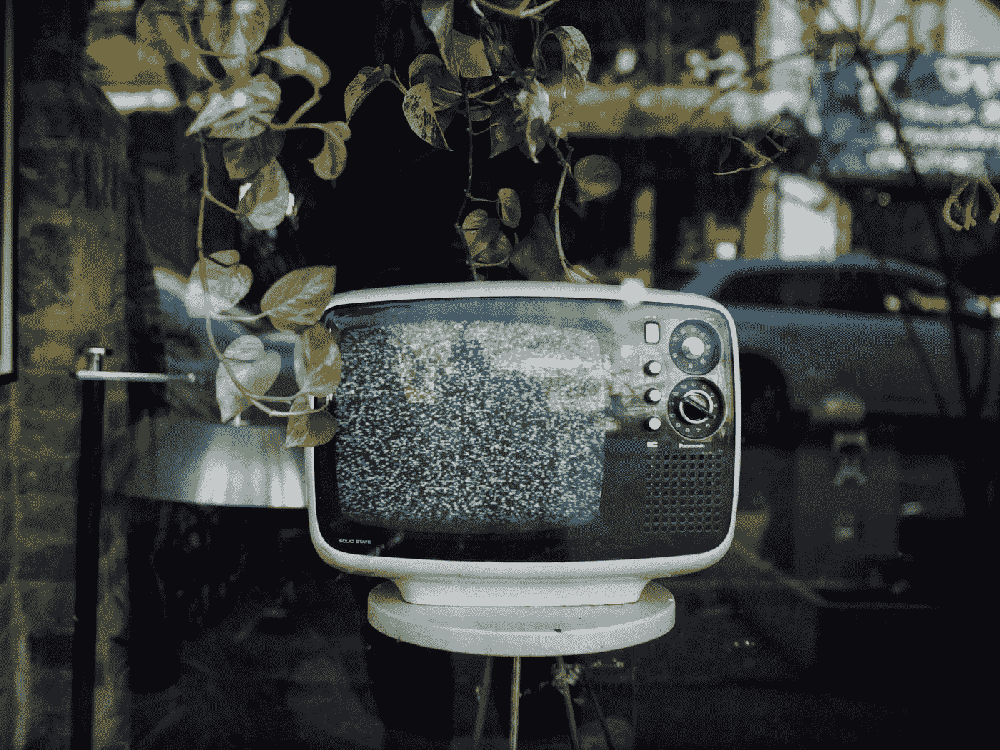

照片由[帕特里克·托马索](https://unsplash.com/@impatrickt?utm_source=medium&utm_medium=referral)在 [Unsplash](https://unsplash.com?utm_source=medium&utm_medium=referral) 上拍摄

去除图像噪声是一个经典问题，研究人员几十年来一直试图解决这个问题。在早期，研究人员使用*过滤器*来减少图像中的噪音。它们过去对于具有合理噪声水平的图像工作得相当好。但是，应用这些滤镜会使图像变得模糊。如果图像噪声太大，那么最终的图像会非常模糊，图像中的大部分关键细节都会丢失。

一定有更好的方法来解决这个问题。因此，我实现了几个深度学习架构，远远超过了传统的去噪过滤器。在这篇博客中，我将把我的方法作为一个案例研究一步一步地解释，从问题公式化开始，到实现最先进的深度学习模型，然后最终看到结果。

# 内容摘要

1.  什么是图像中的噪声？
2.  问题定式化
3.  机器学习问题公式
4.  数据来源
5.  探索性数据分析
6.  传统图像去噪滤波器综述
7.  图像去噪的深度学习模型
8.  结果比较
9.  部署
10.  未来工作和改进范围
11.  参考

# 1.什么是图像中的噪声？

图像噪声是捕获的图像中亮度或颜色信息的随机变化。它是由外部源引起的图像信号的退化。数学上，图像中的噪声可以表示为:

> ***A(x，y) = B(x，y) + H(x，y)***

在哪里，

A(x，y)=噪声图像的函数；
B(x，y)=原图像的函数；
H(x，y)=噪声的函数；

要了解更多关于噪音的知识，请查看这个博客。

# 2.问题定式化

传统的图像去噪算法总是假设噪声是均匀高斯分布的。然而，实际上，真实图像上的噪声可能要复杂得多。这种真实图像上的噪声称为 ***真实噪声*** 或 ***盲噪声。传统的滤波器不能很好地处理有这种噪声的图像。***

所以，问题的表述变成了，

> **如何对含有盲噪的图像去噪？**

## 目标和制约因素

*   目标是对含有盲噪声的彩色图像进行去噪
*   没有延迟限制，因为我想尽可能接近真实地去噪图像，即使这需要合理的时间

*盲去噪*这个术语指的是去噪时，去噪所用的基是从有噪样本本身学习来的。换句话说，无论我们构建什么样的深度学习架构，都应该固有地学习图像中的噪声分布，并对其进行降噪。所以和往常一样，这完全取决于我们提供给深度学习模型的数据类型。

# 3.机器学习问题公式

首先，让我们考虑一下 RGB 图像的格式。

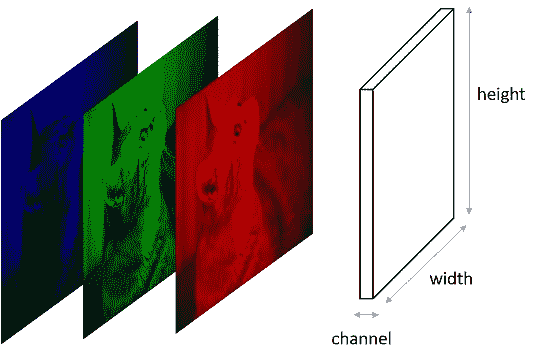

图像的 3 个颜色通道

任何 RGB 图像的每个像素都有三个颜色通道——红色、绿色和蓝色。

现在，每种颜色都由一个 8 位数字表示，范围从 0 到 255。因此，任何图像都可以用三维矩阵来表示。

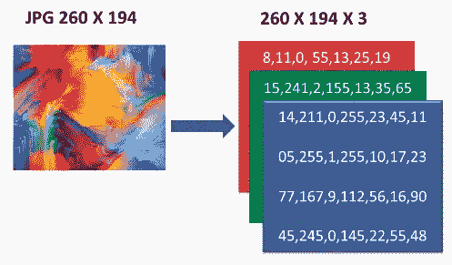

用 8 位数字填充的图像的 3 个颜色通道

现在考虑噪声图像的相同情况。

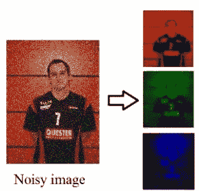

带有 3 个颜色通道的噪声图像

我们在前面的章节中看到，噪声是像素的随机变化。换句话说，图像中 3 个通道的一些像素数值已损坏。为了将图像恢复到其原始形式，我们需要校正那些损坏的像素值。

## 机器学习问题的类型

*   我们可以将此视为一个**监督学习回归问题**，在这里我们预测被破坏像素的真实值【数量在 0-255 的范围内】。

## 损失函数和性能度量

*   我将使用的损失是 [**MSE**](https://en.wikipedia.org/wiki/Mean_squared_error) (均方误差)。分数越低越好。

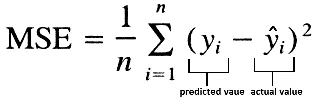

MSE 公式

*   对于性能评估，我将使用两个指标，
    [**【PSNR】**](https://en.wikipedia.org/wiki/Peak_signal-to-noise_ratio)**(**【峰值信噪比】[**【SSIM】**](https://en.wikipedia.org/wiki/Structural_similarity)**【结构相似性指数度量】
    对于两者，分数越高越好。**

# **4.数据来源**

**由于这是一个监督学习问题，我们需要一对噪声图像( *x* )和地面真实图像( *y* )。**

**我从三个来源收集了数据。**

1.  **[SIDD](https://www.eecs.yorku.ca/~kamel/sidd/dataset.php)——包含来自智能手机摄像头的 160 对【嘈杂背景真相】图像**
2.  **雷诺阿(RENOIR)——包含 80 对来自智能手机摄像头的[嘈杂——真实]图像**
3.  **[NIND](https://commons.wikimedia.org/wiki/Natural_Image_Noise_Dataset#Tools)——包含 62 对来自富士 X-T1 DSLR 相机的【嘈杂——地面真相】图像**

# **5.探索性数据分析**

## **元数据的分析**

**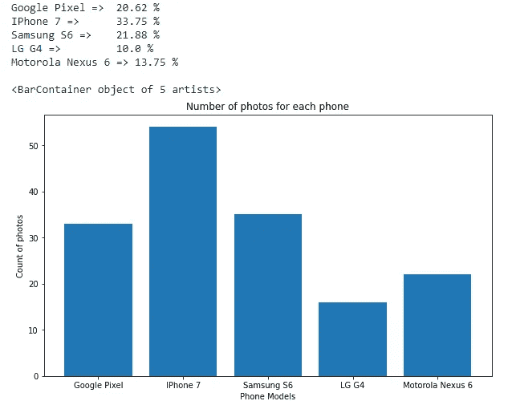**

**每部智能手机中的照片数量**

**我们可以看到大多数照片都是在 iPhone 7 上被点击的，其次是三星 S6 和谷歌 Pixel。LG G4 的照片数量最少。**

**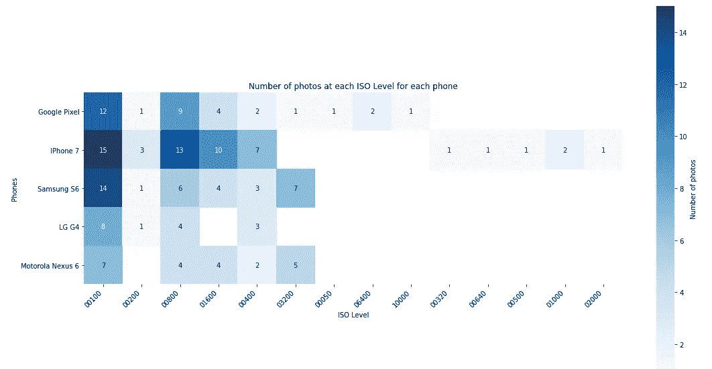**

**每部智能手机图像的 ISO 级别**

**数据集中总共使用了 14 种独特的 ISO 级别设置。大多数照片是在低 ISO 设置下点击的。最常用的 ISO 设置是 100 和 800，其次是 1600、400 和 3200。曝光越高，图像越亮，反之亦然。**

****

**每部智能手机图像的快门速度**

**大部分照片是以 100 快门速度点击，其次是 400 和 800。快门速度越高，图像越暗，反之亦然。**

**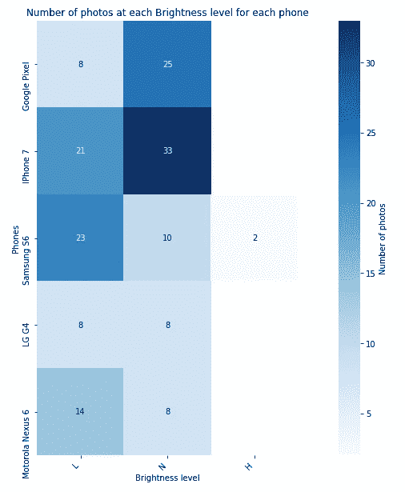**

**每部智能手机图像的亮度级别**

**大多数照片是在正常亮度模式下点击的，其次是低亮度。三星 S6 上只有 2 张照片是高亮度点击的。**

****

**每部智能手机的分辨率**

**我们可以看到每部手机都有自己的图像分辨率。每部手机都以相同的分辨率拍摄照片。**

## **图像数据的分析**

**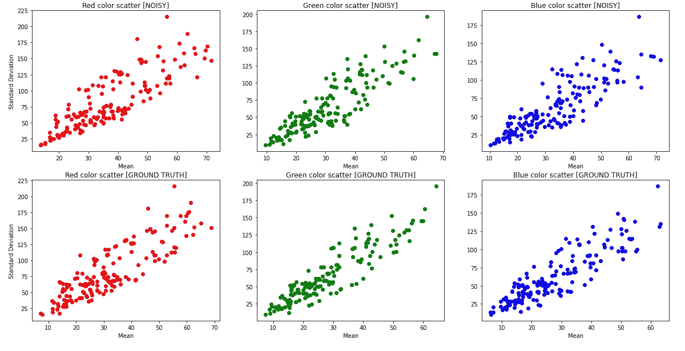**

**三个通道所有图像的平均值和标准偏差**

**可以看出，大多数平均像素值处于较低到中等的值(较暗到中等亮度的图像)。只有少数是很高价值的(亮图像)。你还可以看到，与地面真实图像相比，噪声图像中的一些均值有所不同。像素值越高，差异越明显。**

**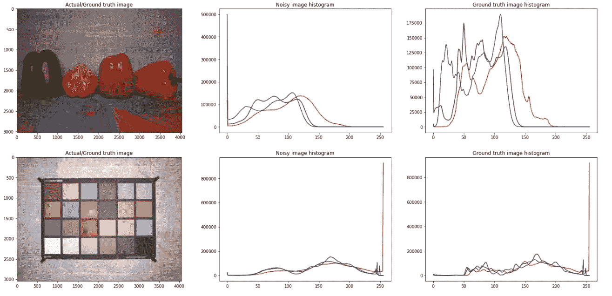**

**可以观察到，与原始图像相比，噪声图像具有平滑的像素强度分布。这样做的原因是，每当图像中有噪声时，相机就无法捕获这些像素的颜色信息(由于各种原因)，因此，为了填充这些像素中的“无颜色”，相机软件通常会用一些随机值进行填充。由于这些随机值(噪声),像素值变得平滑。**

# **6.传统图像去噪滤波器综述**

**传统上，研究人员想出了*滤波器*来对图像降噪。大多数过滤器是针对图像的噪声类型的。有几种类型的噪声，如高斯噪声、泊松噪声、斑点噪声、椒盐噪声等。每种类型的噪音都有特定的过滤器。因此，使用传统滤波器对图像去噪的第一步是识别图像中存在的噪声类型。识别之后，我们可以继续应用特定的过滤器。为了识别噪音的类型，有一些数学公式可以帮助我们猜测噪音的类型。或者领域专家可以通过查看图像来决定。还有一些过滤器可以处理任何类型的噪声。**

**有大量的过滤器可用于图像去噪。各有利弊。在这里，我将讨论非局部均值(NLM)算法，它被认为是非常好的去噪图像。**

## ****非本地指****

**首先，让我给你看一下 NLM 的公式，**

**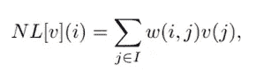**

**NLM 公式**

**该算法将像素的估计值计算为图像中所有像素的加权平均值，但权重家族取决于像素 *i* 和*j*之间的相似性。换句话说，它查看图像的一个斑块，然后识别整个图像中的其他相似斑块，并对它们进行加权平均。为了理解这一点，考虑下面的图像，**

**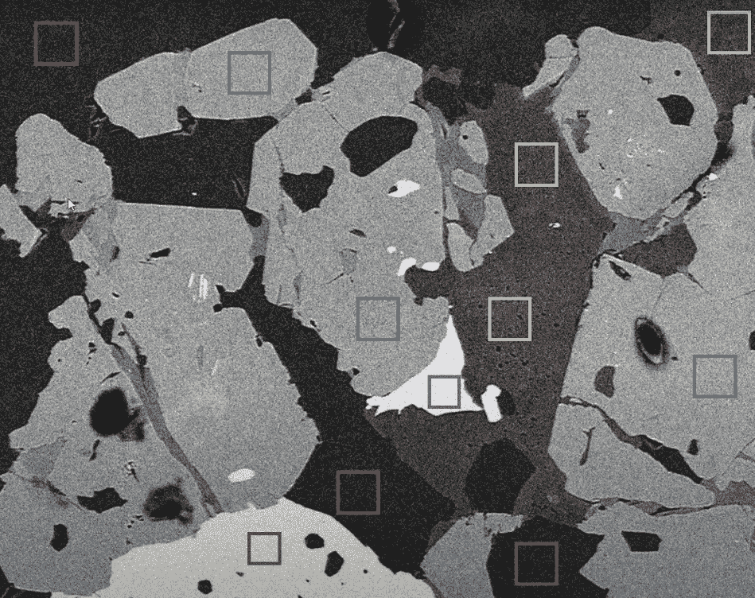**

**这里，相似的补丁用相同颜色的方框标记。所以现在，它会将相似块的像素加权平均作为目标像素的估计值。该算法将面片大小和面片距离作为输入。**

**考虑下面的灰度图像，它已经使用 NLM 滤波器去噪。**

**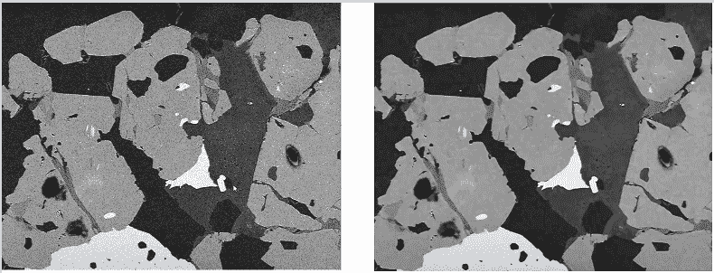**

**左侧—噪声图像；右侧—使用 NLM 滤波器去除图像噪声**

**你可以看到 NLM 在图像去噪方面做得相当不错。如果你仔细看，你会注意到去噪后的图像有点模糊。这是因为*的意思是*。应用于任何数据的平均值将使这些值变得平滑。**

**然而，当噪声水平太高时，NLM 不能提供好的结果。考虑下面这张使用 NLM 滤波器去噪的图像。**

**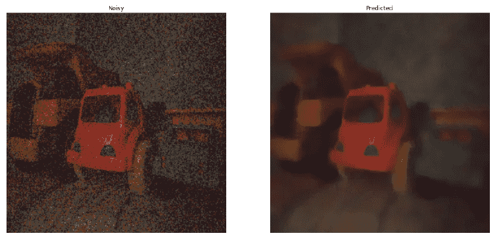**

**利用 NLM 对图像去噪**

**你可以清楚地看到，去噪后，图像过于模糊，大部分关键细节都丢失在其中。例如，观察蓝色卡车上的橙色前灯。**

# **7.图像去噪的深度学习模型**

**随着深度学习技术的出现，现在可以从图像中去除盲噪声，使得结果非常接近地面真实图像，而细节损失最小。**

**我已经实现了三个深度学习架构，**

1.  **[红网](https://arxiv.org/pdf/1606.08921.pdf)**
2.  **[美国有线电视新闻网](https://arxiv.org/pdf/1805.07071.pdf)**
3.  **[PRIDNet](https://arxiv.org/pdf/1908.00273.pdf)**

## **REDNet —残差编码器-解码器网络**

**这是一个基于 CNN 的[自动编码器](https://en.wikipedia.org/wiki/Autoencoder)架构，具有跳跃连接。该架构如下所示，**

**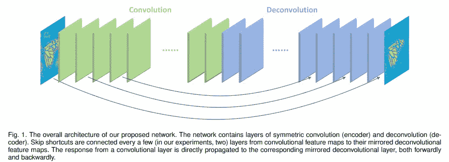**

**REDNet 架构**

**这里，我对编码器使用了 5 层卷积，对解码器使用了 5 层去卷积。这是一个非常简单的架构，我用它作为基线。**

**REDNet 的代码**

**我已经在我的 Github repo 上分享了我的 REDNet 的完整代码。**

****结果****

**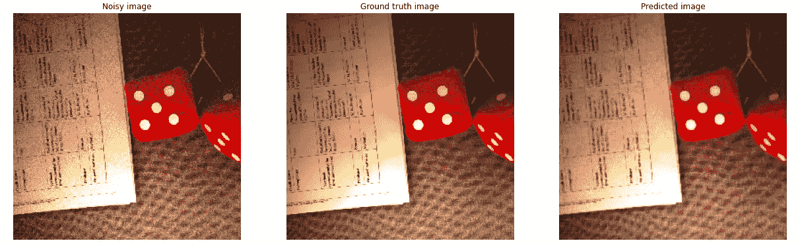**

**REDNet 结果**

**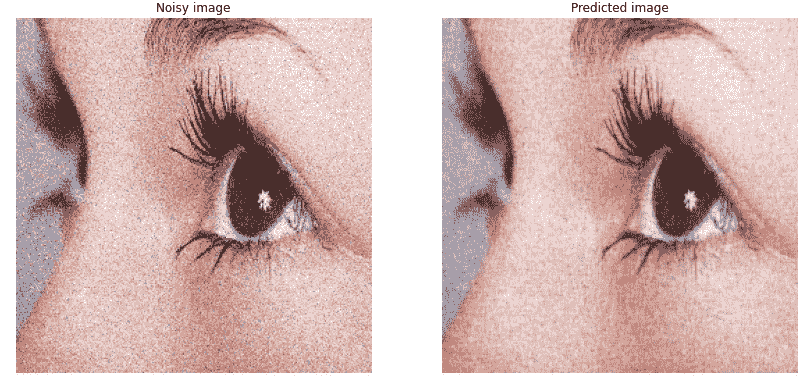**

**REDNet 结果**

**可以看到，这种架构在图像去噪方面表现相当不错。你肯定可以看到噪声有所减少，图像正在努力适应图像中受损像素的原始颜色。**

**这种架构的 PSNR 得分为 30.5713，SSIM 得分为 0.7932。**

## **多级小波 CNN**

**这是一个基于小波的深度学习架构。它的架构与一个 [U-Net](https://arxiv.org/pdf/1505.04597.pdf) 架构有着惊人的相似。MWCNN 唯一的区别是，与 U-Net 中的下采样和上采样不同，这里我们使用 DWT(离散小波变换)和 IWT(小波逆变换)。DWT 和 IWT 是如何工作的超出了本博客的范围。然而，我已经附上了一些参考资料，你可以从中学习。**

**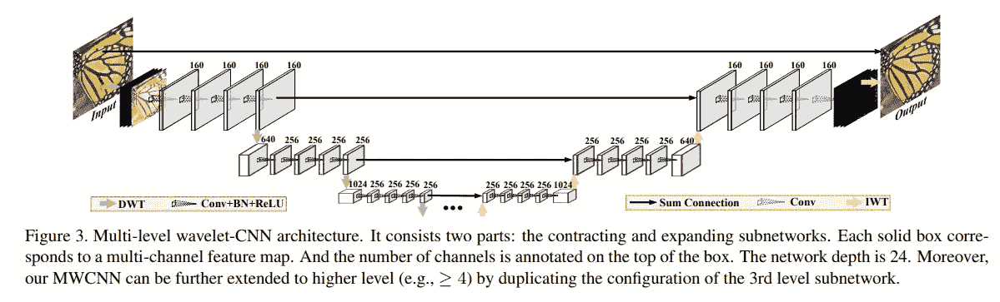**

**MWCNN 架构**

**在这里，我将这个架构扩展到了 4 个层次。所以我的网络深度变成了 32。代码有点长，我在 Keras 中使用了自定义层。你可以在我的 Github repo 上查看我的 MWCNN 的[完整代码。](https://github.com/chintan1995/Image-Denoising-using-Deep-Learning/blob/main/Models/MWCNN_256x256.ipynb)**

****结果****

**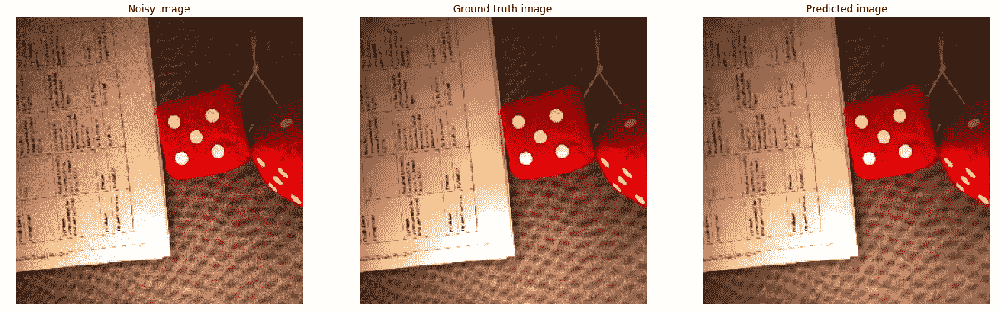**

**MWCNN 结果**

**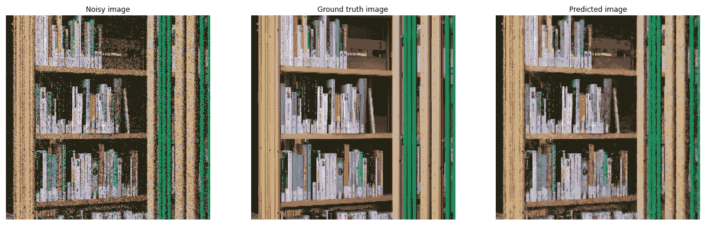**

**MWCNN 结果**

**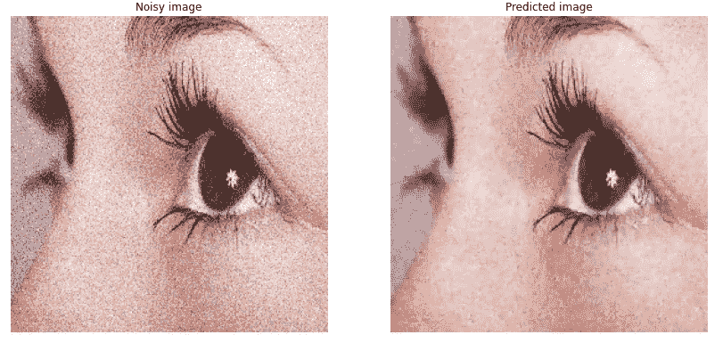**

**MWCNN 结果**

**我们可以看到，与 REDNet 相比，这种架构工作得更好，图像更清晰。**

**该架构的 PSNR 得分为 32.5221，SSIM 得分为 0.8397。**

## **prid net——金字塔实像去噪网络**

**这是一个用于盲去噪的最先进的深度学习架构。这种架构不像我们在之前的两个网络中看到的那样简单。PRIDNet 有几个模块，分为三个主要部分。**

**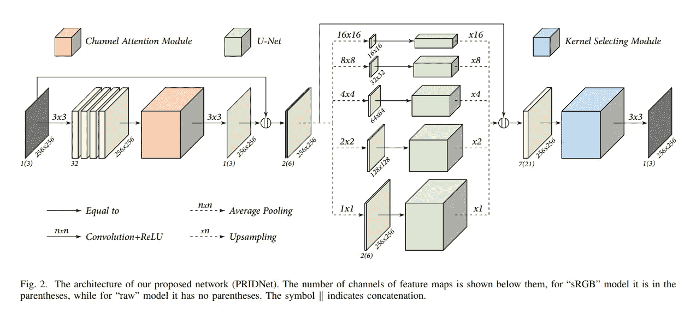**

**PRIDNet 架构[完整]**

**乍一看，这似乎有点让人不知所措。但是让我把它分成几部分。相信我，这很容易理解。**

****频道关注模块****

**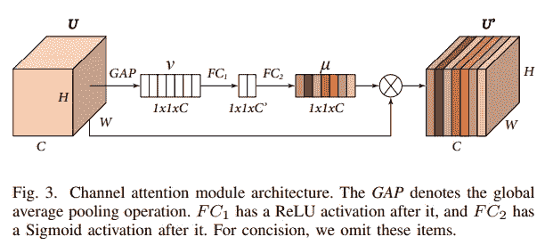**

**频道注意模块**

**频道关注模块负责**关注机制。**这里，注意力机制是这样实现的，它将注意力放在输入 *U* 的每个通道上。现在，这个“*注意力”*可以被认为是权重。因此每个通道将有一个权重。结果，注意力权重将是大小为 *C* 【频道数】的向量。这个向量将被乘以输入 *U* 。因为我们想要"*学习*"注意力，我们需要这个向量是可训练的。PRIDNet 实现的过程是，首先我们对输入进行全局平均汇集，然后从两个完全连接的层传递，结果应该是一个包含通道数的向量。这些是注意力权重μ。**

****多尺度特征提取模块/金字塔模块****

**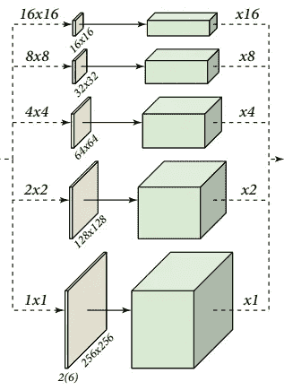**

**金字塔模块**

**这是整个架构的核心。这里，首先，我们将应用给定内核大小的平均池。这将对图像进行下采样。然后我们将对其应用 U-Net 架构。我选择了 5 级深 U 网。最后，我们将使用与平均池中相同的大小进行向上采样。因此，这将把图像恢复到与输入(该模块的输入)相同的大小。**

**我们将用不同的内核大小做 5 次，最后我们将连接结果。**

****内核选择模块****

**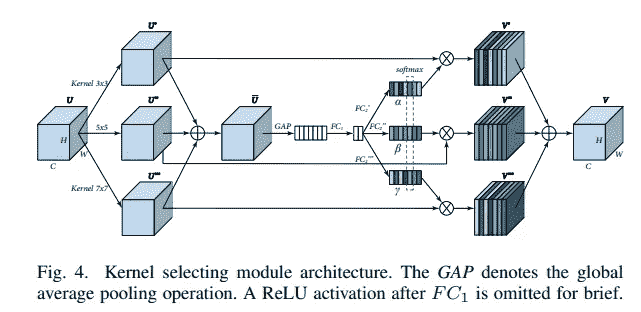**

**内核选择模块**

**这个模块的灵感来自于一篇介绍了选择性内核网络的研究论文。该研究论文很好地阐述了这一网络背后的想法，如下所示:**

> **在标准卷积神经网络(CNN)中，每层人工神经元的感受野被设计为共享相同的大小。众所周知，视觉皮层神经元的感受野大小受到刺激的调制，这在构建细胞神经网络时很少被考虑。**
> 
> **设计了一种称为选择性核(SK)单元的构建块，其中具有不同核大小的多个分支使用 softmax 注意力进行融合，该注意力由这些分支中的信息引导。对这些分支的不同关注产生了融合层中神经元的不同大小的有效感受野。**

**该模块与频道关注模块非常相似。根据 PRIDNet 论文，大小为 *C* 的合成向量α、β、γ分别表示对 U’、U”和 U”’的软注意。**

**下面是整个 PRIDNet 体系结构的鸟瞰图，**

**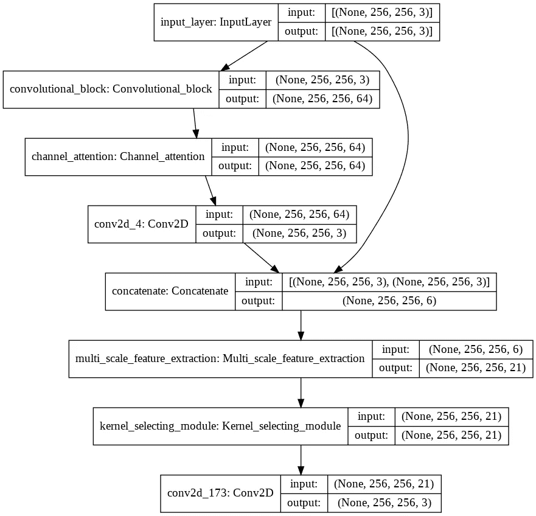**

**PRIDNet 架构；鸟瞰图**

**我已经在我的 Github repo 上分享了 PRIDNet 的全部代码。**

****结果****

**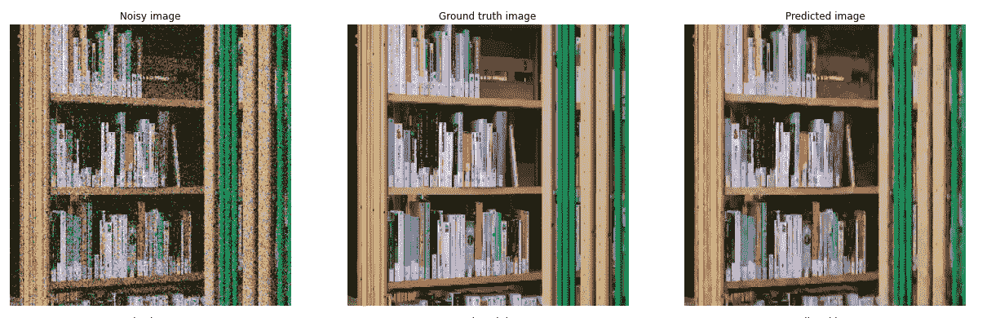**

**PRIDNet 结果**

**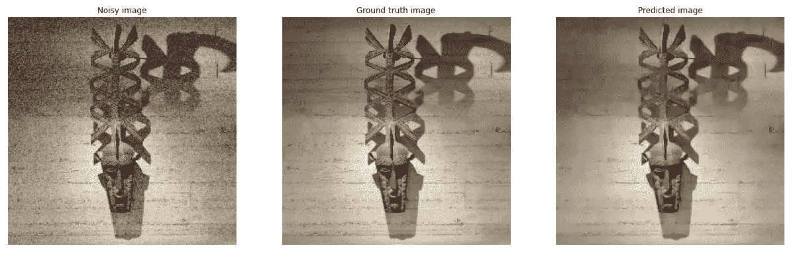**

**PRIDNet 结果**

**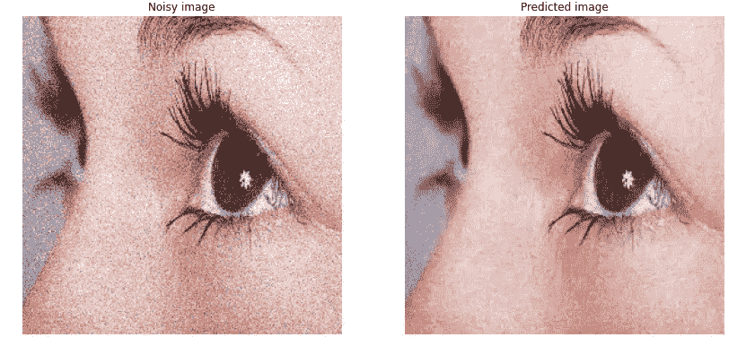**

**PRIDNet 结果**

**您可以看到，与之前讨论的架构相比，这种架构提供了最好的结果。在上面眼睛的特写图像中，**注意去噪图像中眼球的细节层次**！**

**另外，请查看上面的库图像。我在下面截取了一部分，**

**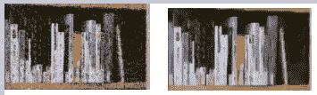**

**裁剪过的图书馆书籍。左侧-噪声图像；右侧—去噪图像**

**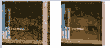**

**裁剪过的图书馆家具。左侧-噪声图像；右侧—去噪图像**

**注意噪声图像中的黑色书籍[裁剪的图书馆书籍]。它们与周围的棕色家具几乎无法区分。好像都是黑的。然而，我们的模型能够以这样一种方式去噪，即它至少可以区分书籍和周围的家具。第二张图片[裁剪过的图书馆家具]也是如此。在其嘈杂的形象，你可以看到家具已经非常黑暗，它似乎几乎是黑色的顶部。然而，我们的模型能够理解棕色并相应地去噪。这有多神奇！**

**该架构的 PSNR 得分为 33.3105，SSIM 得分为 0.8534。**

# **8.结果比较**

**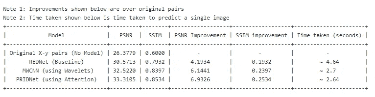**

**比较所有架构的结果**

**我们可以清楚地看到，PRIDNet 是性能最好的架构，对单幅图像进行降噪所需的时间最少。**

**现在让我们比较 NLM 滤波和 PRIDNet 的结果。**

**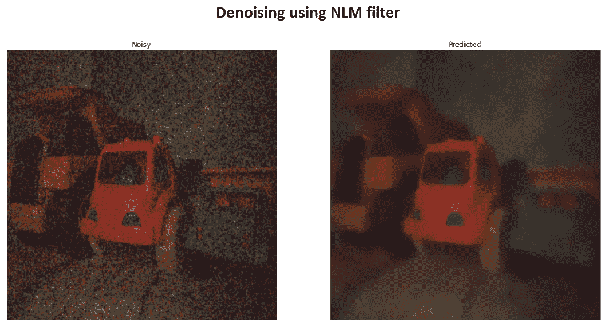**

**NLM 滤波去噪**

**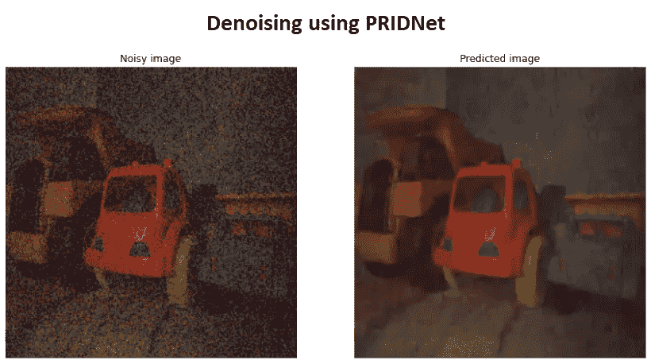**

**使用 PRIDNet 去噪**

**要比较的关键区域，**

*   **黄色卡车的车顶区域**
*   **橙色卡车的座位**
*   **蓝色卡车上的橙色前灯**
*   **蓝色卡车的车顶(观察阴影)**
*   **地板中间的两条细条纹**
*   **这个清单可以一直列下去！**

# **9.部署**

**我已经使用 Streamlit 创建了一个 Web 应用程序并部署了它。到目前为止，我已经将它部署在 localhost 上，因为我的模型太大，无法上传到免费的云资源(如 Heroku、GCP 应用引擎、AWS EC2、Azure Web app 等)的内存中。然而，我正在寻找解决办法。敬请关注这里的任何更新！**

**同时，看看我的网络应用的视频演示，**

# **10.未来工作和改进范围**

**图像去噪是一个活跃的研究领域，并且不时有令人惊讶的架构被开发来对图像去噪。最近，研究人员正在使用 **GANs** 对图像进行去噪，这已经被证明可以给出一些惊人的结果。一个好的 GAN 架构肯定会进一步改善去噪性能。**

# **11.参考**

*   **[https://medium . com/image-vision/noise-in-digital-image-processing-55357 C9 fab 71](https://medium.com/image-vision/noise-in-digital-image-processing-55357c9fab71)(什么是噪点？)**
*   **https://www.youtube.com/watch?v=Va4Rwoy1v88&ab _ channel = digitals reeni(非本地手段)**
*   **【https://www.eecs.yorku.ca/~kamel/sidd/dataset.php (SIDD 数据集)**
*   **[http://adrianbarburesearch . blogspot . com/p/RENOIR-dataset . html](http://adrianbarburesearch.blogspot.com/p/renoir-dataset.html)(RENOIR 数据集)**
*   **[https://commons . wikimedia . org/wiki/Natural _ Image _ Noise _ Dataset # Tools](https://commons.wikimedia.org/wiki/Natural_Image_Noise_Dataset#Tools)(NIND 数据集)**
*   **[https://arxiv.org/pdf/1606.08921.pdf](https://arxiv.org/pdf/1606.08921.pdf)(红网)**
*   **[https://arxiv.org/pdf/1805.07071.pdf](https://arxiv.org/pdf/1805.07071.pdf)**
*   **https://arxiv.org/pdf/1908.00273.pdf**
*   **[https://arxiv.org/pdf/1505.04597.pdf](https://arxiv.org/pdf/1505.04597.pdf)**
*   **[https://arxiv.org/pdf/1903.06586.pdf](https://arxiv.org/pdf/1903.06586.pdf)(选择性内核网络)**
*   **[https://www.eecis.udel.edu/~amer/CISC651/IEEEwavelet.pdf](https://www.eecis.udel.edu/~amer/CISC651/IEEEwavelet.pdf)(小波)**
*   **https://towards data science . com/what-is wavelet-and-how-we-use-it for-data-science-d 19427699 cef(小波)**
*   **[http://gwyddion . net/documentation/user-guide-en/Wavelet-transform . html](http://gwyddion.net/documentation/user-guide-en/wavelet-transform.html)(小波变换)**

** [## chintan 1995/使用深度学习的图像去噪

### 在这篇报告中，我实现了三种不同的深度学习架构用于图像去噪…

github.com](https://github.com/chintan1995/Image-Denoising-using-Deep-Learning)  [## 钦坦戴夫-塔塔咨询服务| LinkedIn

### 精通 Python 编程语言、自然语言处理、数据科学和机器学习。强…

www.linkedin.com](https://www.linkedin.com/in/chintan-dave95/)**