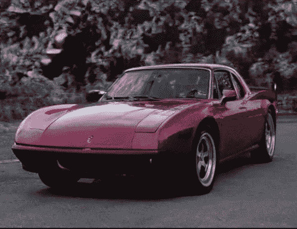
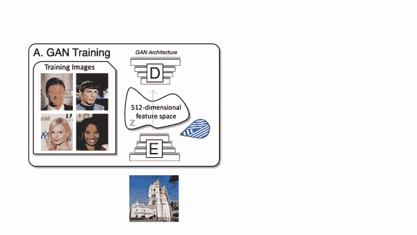
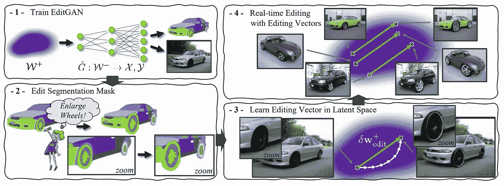
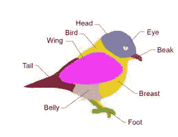

# 从草图编辑图像:EditGAN

> 原文：<https://pub.towardsai.net/image-editing-from-sketches-editgan-4cacca609e2d?source=collection_archive---------0----------------------->

## [计算机视觉](https://towardsai.net/p/category/computer-vision)

## 控制快速草稿中的任何功能，它将只编辑你想要的，保持图像的其余部分不变！SOTA 图像编辑草图模型由英伟达，麻省理工学院，UofT。

> 原载于 [louisbouchard.ai](https://www.louisbouchard.ai/editgan/) ，前两天在[我的博客](https://www.louisbouchard.ai/editgan/)上看到的！

## 看视频！

你曾经梦想过能够用快速的草图或建议来编辑图片的任何部分吗？改变特定的特征，比如眼睛、眉毛，甚至是你汽车的轮子？嗯，这不仅是可能的，但它从来没有比现在更容易与这种新模式称为 EditGAN，结果真的令人印象深刻！你基本上可以非常快速地改进或模仿任何图片。事实上，你可以从快速草稿中控制你想要的任何功能，它只会编辑修改，保持图像的其余部分不变。像 GANs 这样的图像合成和图像编辑人工智能模型一直在寻求控制，并且获得控制极具挑战性。

EditGAN 的结果示例。图片由[凌等人提供，2021，EditGAN](https://nv-tlabs.github.io/editGAN/) 。

正如我们所说的，NVIDIA、多伦多大学和麻省理工学院的这篇出色的新论文允许您编辑任何图片，并对草图输入的特定功能进行卓越的控制。通常，控制特定要素需要庞大的数据集和专家来了解要在模型中更改哪些要素，以便在只更改所需要素的情况下获得所需的输出图像。相反，EditGAN 只通过少数几个带标签的示例来学习如何将分割与图像匹配，从而允许您使用分割，或者换句话说，使用快速草图来编辑图像。它保留了完整的图像质量，同时提供了前所未有的细节和自由度。这是一个巨大的进步，但更酷的是他们是如何实现的，所以让我们更深入地了解他们的方法！

首先，该模型使用 StyleGAN2 来生成图像，这是发表时可用的最佳图像生成模型，在研究中被广泛使用。如果你想了解更多，我不会深入这个模型的细节，因为我已经在关于不同应用的许多文章中讨论过了。相反，我将假设您对 StyleGAN2 的功能有一个基本的了解:获取一个图像，将其编码到一个压缩的子空间中，并使用一种称为生成器的模型将这个编码的子空间转换成另一个图像。这也可以使用直接编码的信息而不是编码图像来获得该信息。这里重要的是发电机。

GAN 网络的发生器如何工作。

正如我所说的，它将从一个子空间获取信息，这个子空间通常被称为潜在空间，在这个空间中，我们有很多关于我们图像及其特征的信息，但这个空间是多维的，我们很难将它可视化。挑战在于识别该子空间的哪个部分负责重建图像中的哪个特征。这就是 EditGAN 发挥作用的地方，它不仅告诉您子空间的哪个部分做什么，还允许您使用另一个输入来自动编辑它们:一个您可以轻松绘制的草图。事实上，它会对你的图像进行编码，或者简单地采用特定的潜在代码，生成图片的分割图和图片本身。这意味着分割和图像都在相同的子空间中，通过训练一个模型来做到这一点，并且它允许只控制期望的特征，而不需要你做任何其他事情，因为你只需要改变分割图像，其他的将跟随。训练将只针对这种新的分割生成，而 StyleGAN 生成器将对原始图像保持固定。这将允许模型理解并将分割链接到生成器重建图像所需的相同子空间。然后，如果训练正确，您可以简单地编辑这个分割，它会相应地改变图像！

编辑概述(1)和流程(2，3，4)。图片由[凌等人提供，2021，编辑](https://nv-tlabs.github.io/editGAN/)。

EditGAN 基本上会把你图像的每个像素分配到一个特定的类，比如头、耳朵、眼睛等。，并使用覆盖潜在空间内其他类别的像素的掩模来独立控制这些类别。

鸟类分割图。图片由[凌等人提供，2021，编辑](https://nv-tlabs.github.io/editGAN/)。

因此，每个像素都有自己的标签，EditGAN 将决定编辑哪个标签，而不是直接在潜在空间中编辑哪个像素，并重建图像，只修改编辑区域。瞧！通过将生成的图像与分割图连接，EditGAN 允许您随意编辑该图，并将这些修改应用到图像，从而创建一个新版本！

当然，在用这些例子训练之后，它对看不见的图像起作用。像所有的 GANs 一样，结果受限于它被训练的图像类型，所以如果你用汽车训练它，你不能把它用在猫的图像上。尽管如此，这仍然令人印象深刻，我喜欢研究人员试图提供直观地玩 GANs 的方法，比如使用草图而不是参数。代码目前还不可用，但很快就会可用，我很高兴能尝试一下！这只是对这个令人惊叹的新模型的概述，我强烈邀请您阅读他们的论文以获得更深入的技术理解。
让我知道你的想法，我希望你喜欢这篇文章，就像我喜欢了解这种新模式一样！观看视频了解更多结果！

再次感谢[重量&偏见](https://wandb.ai/site)赞助视频和文章，感谢你还在阅读！下周见，一个非常特别和令人兴奋的关于我喜欢的主题的视频！

如果你喜欢我的工作，并想了解人工智能的最新动态，你绝对应该关注我的其他社交媒体账户( [LinkedIn](https://www.linkedin.com/in/whats-ai/) ， [Twitter](https://twitter.com/Whats_AI) )，并订阅我的每周人工智能 [**简讯**](http://eepurl.com/huGLT5) ！

## 支持我:

*   支持我的最好方式是成为这个网站的成员，或者如果你喜欢视频格式，在 **YouTube** 上订阅我的频道。
*   跟我来这里上 [**中**](https://whats-ai.medium.com/)
*   想进入 AI 或者提升技能，[看这个](https://www.louisbouchard.ai/learnai/)！

## 参考

*   Ling，h .，Kreis，k .，Li，d .，Kim，S.W .，Torralba，a .和 Fidler，s .，2021 年 5 月。EditGAN:高精度语义图像编辑。在第三十五届神经信息处理系统会议上。
*   代码和交互工具(即将推出):[https://nv-tlabs.github.io/editGAN/](https://nv-tlabs.github.io/editGAN/)