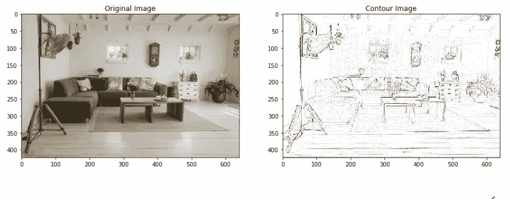
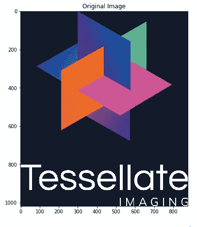
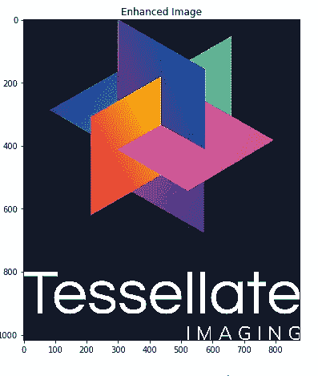
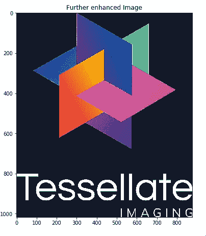
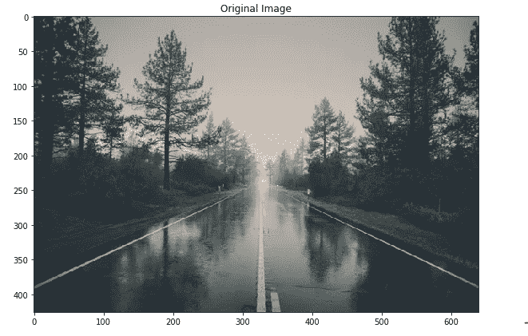
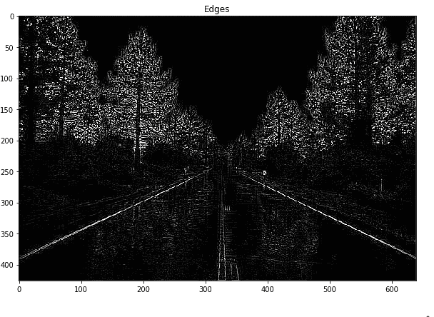
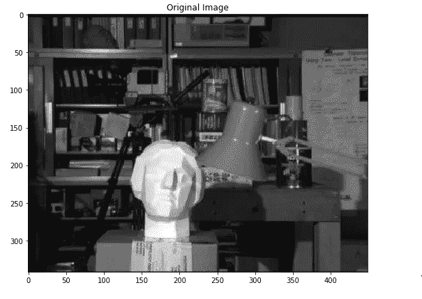
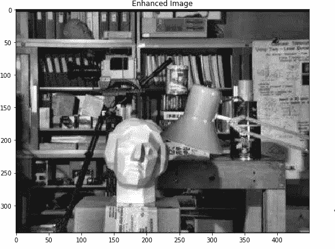

# 图像增强

> 原文：<https://pub.towardsai.net/image-enhancement-c784185192c4?source=collection_archive---------2----------------------->

## 使用 Monk，低代码深度学习工具和计算机视觉的统一包装器，使计算机视觉变得简单。

# 目录

1.  **图像增强**
2.  **枕头特殊功能**
3.  **OpenCV CLAHE**

# **图像增强**

> 增强的需要

*   提高信息的可解释性或感知性。
*   为其他自动图像处理技术提供更好的输入。

> 图像增强技术可以分为两大类

*   直接在像素上操作的空间域方法。
*   频域方法，对图像进行傅立叶变换。

# **枕头特殊功能**

> *轮廓检测*

> *细节边缘增强*

> 边缘检测

# **OpenCV CLAHE**

对比度受限的自适应直方图均衡化

你可以在 Github 上找到完整的 jupyter 笔记本。

如果你有任何问题，你可以联系[阿布舍克](https://www.linkedin.com/in/abhishek-kumar-annamraju/)和[阿卡什](https://www.linkedin.com/in/akashdeepsingh01/)。请随意联系他们。

我对计算机视觉和深度学习充满热情。我是 [Monk](https://github.com/Tessellate-Imaging/Monk_Object_Detection) Libraries 的开源贡献者。

你也可以在以下网址看到我的其他作品:

 [## 阿库拉·赫曼思·库马尔培养基

### 阅读阿库拉·赫曼思·库马尔在媒介上的作品。计算机视觉爱好者。每天，阿库拉·赫曼思·库马尔和…

medium.com](https://medium.com/@akulahemanth)