# 图像强度处理

> 原文：<https://pub.towardsai.net/image-intensity-manipulation-27c126a72d06?source=collection_archive---------2----------------------->

## [计算机视觉](https://towardsai.net/p/category/computer-vision)


照片由[乔纳森·鲍尔斯](https://unsplash.com/@jbowersphotography?utm_source=unsplash&utm_medium=referral&utm_content=creditCopyText)在 [Unsplash](https://unsplash.com/s/photos/dark-image?utm_source=unsplash&utm_medium=referral&utm_content=creditCopyText) 上拍摄

# 什么算强度操纵

*   任何通道中像素值的显式更改。
*   对图像的数学运算。
*   亮度变化。
*   对比度变化。
*   伽玛操控。
*   直方图均衡
*   高级操作-过滤、增强等。

> 使用 OpenCV 加载图像

```
import numpy as np
import cv2
from matplotlib import pyplot as plt
img = cv2.imread(folder_path + "imgs/chapter3/man.jpg", 0);
plt.imshow(img, cmap = "gray");
plt.show()
```

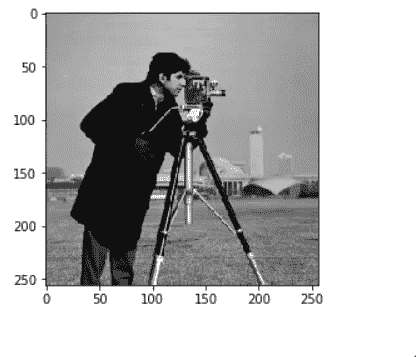

> 使用 Opencv 向输入图像添加常数值

```
img = cv2.imread(folder_path + "imgs/chapter3/man.jpg", 0);##########################FOCUS############################
img = cv2.add(img, 120);
###########################################################plt.imshow(img, cmap = "gray");
plt.show()
```

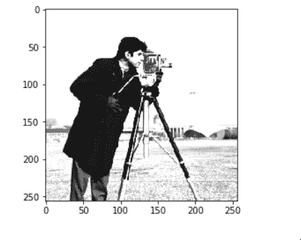

> 使用 Opencv 从输入图像中减去一个常数值

```
img = cv2.imread(folder_path + "imgs/chapter3/man.jpg", 0);##########################FOCUS############################
img = cv2.subtract(img, 120);
####################################################################plt.imshow(img, cmap = "gray");
plt.show()
```

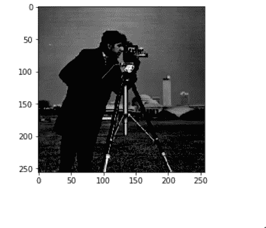

# 从图像中平均减去

> 方法 1

*   将图像分割成通道。
*   对于每个通道，计算其平均值。
*   从该通道的每个像素中减去该平均值

> 方法 2(用于深度学习)

*   将所有图像拆分到各自的通道中

> 对于所有图像的每个通道。

*   找出每个图像通道的含义。
*   求所有计算平均值的平均值。

> 应用程序

*   批处理规范化的一部分。

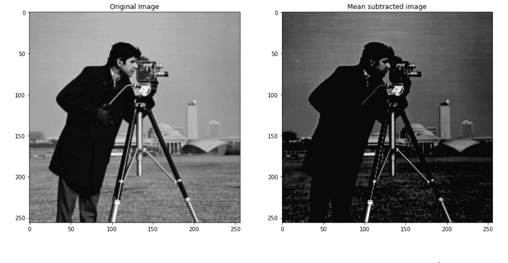

# 负面形象

> 灰度负片

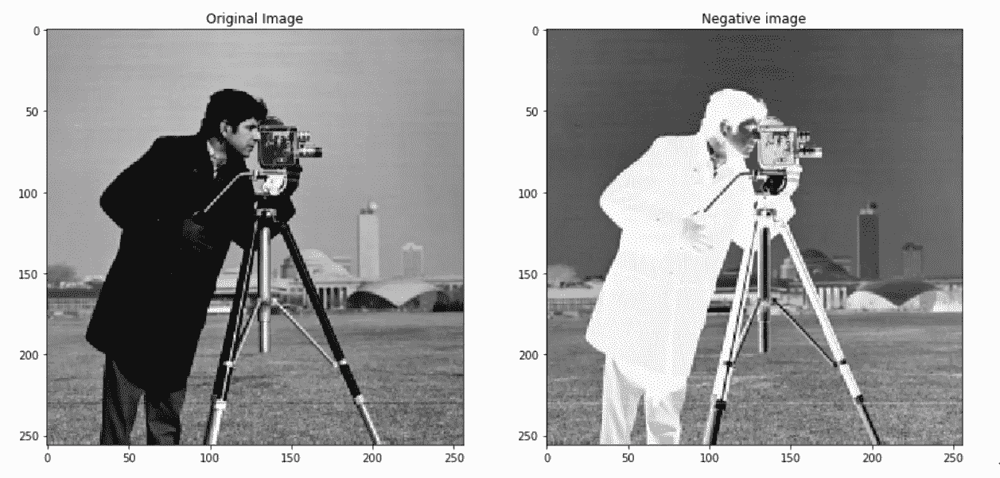

> RGB 图像的负片

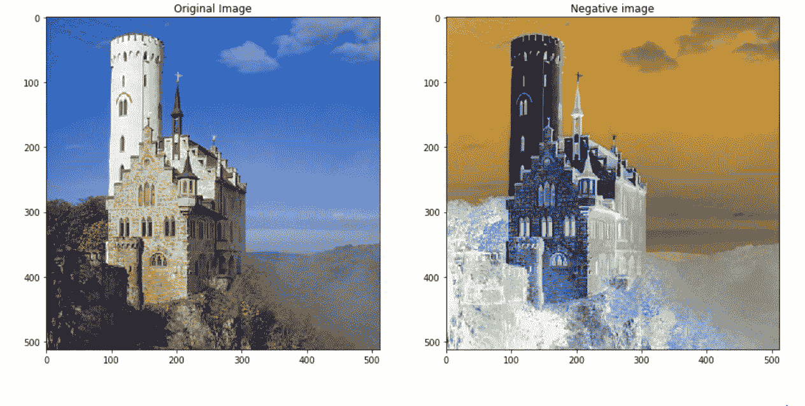

# 添加两幅图像

> 直接添加

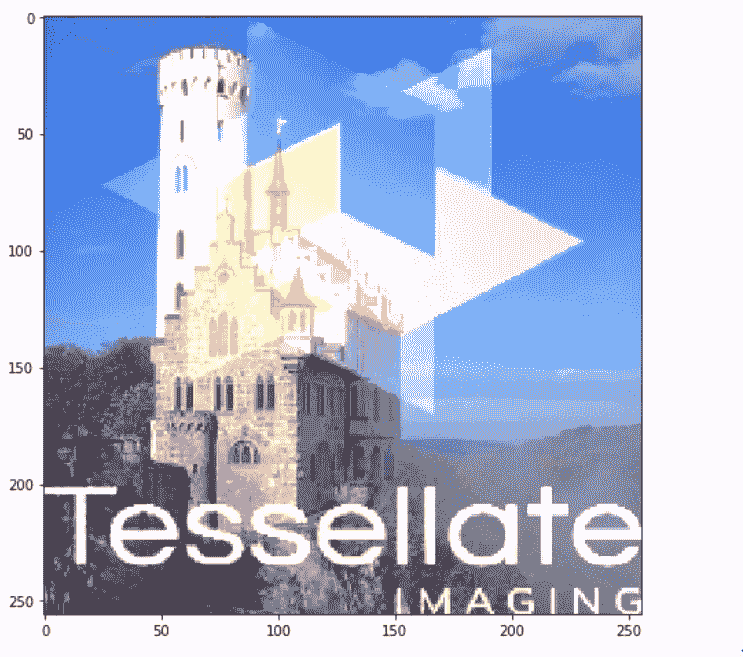

> 加权加法

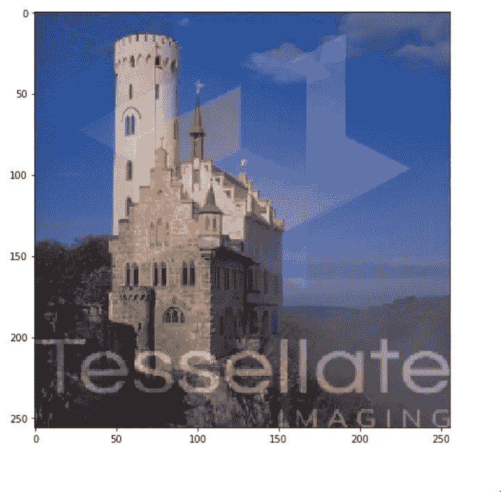

# 减去两幅图像

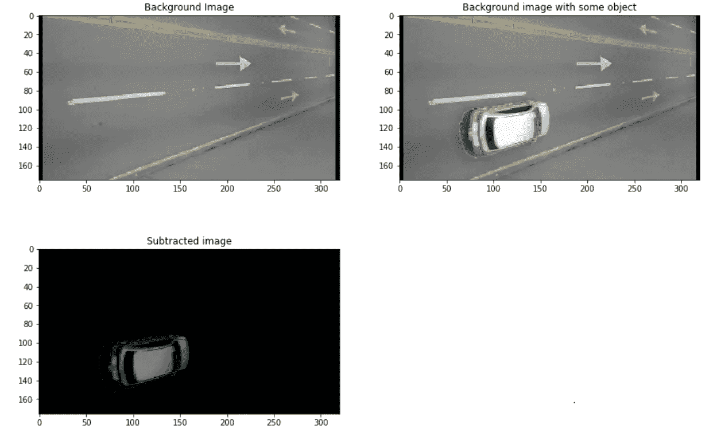

# 聪明

*   发出或反射光的性质或状态。
*   亮度是一个相对的术语。这取决于你的视觉感知。
*   亮度可以定义为一个光源相对于我们与之比较的光源所输出的能量。

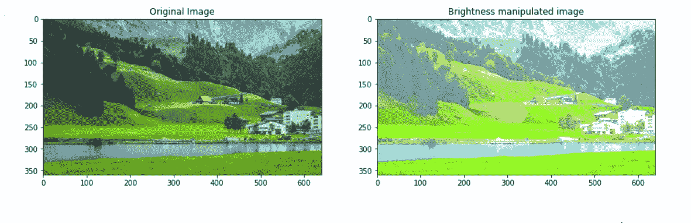

# 对比

*   对比度是使对象(或其在图像或显示器中的表示)可区分的亮度或颜色的差异。
*   可视化为图像中最大和最小像素强度之间的差异。
*   对比度是由同一视野内物体的颜色和亮度差异决定的。

> 操纵图像中的对比度

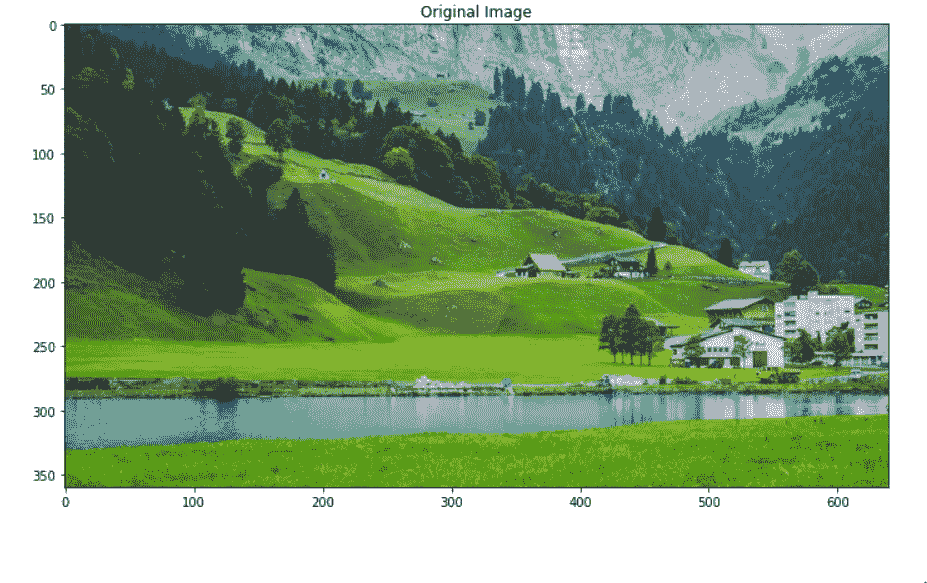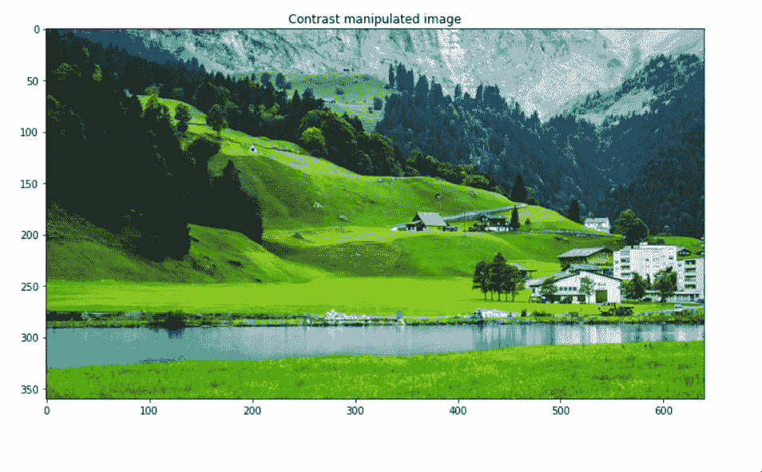

# 微克

*   伽马校正，或通常简称为伽马，是用于编码和解码亮度的非线性操作。
*   所有彩色和灰度数字图像文件都包含伽玛数据。
*   Gamma 是关于数字敏感度和人眼敏感度之间的转换，一方面提供了许多优势，但另一方面增加了复杂性。
*   伽玛优化了中间色调的对比度和亮度。

> 使用 Opencv 操作 gamma

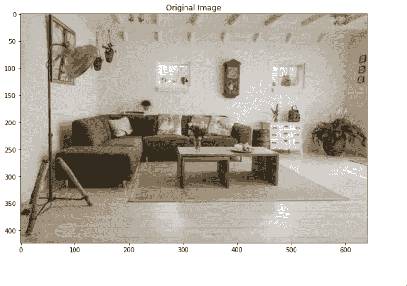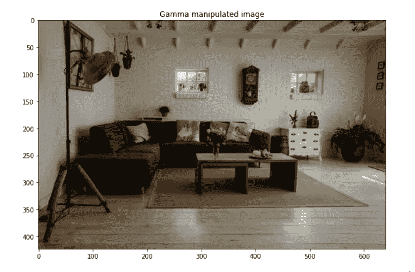

# 直方图均衡

> 柱状图

*   直方图是一种图表。显示任何事物频率的图表。
*   图像像素直方图表示具有特定强度值的像素的频率。

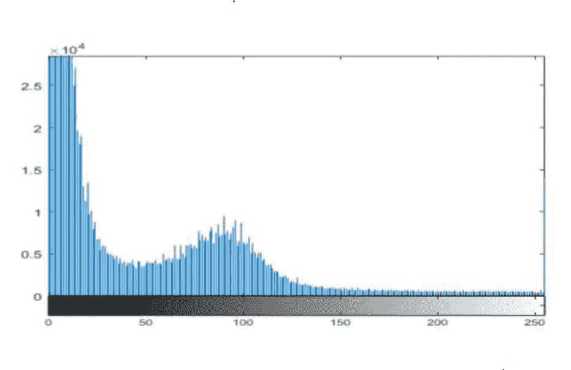

> 直方图均衡

*   直方图均衡化用于增强对比度。
*   这种方法增加了图像的整体对比度。

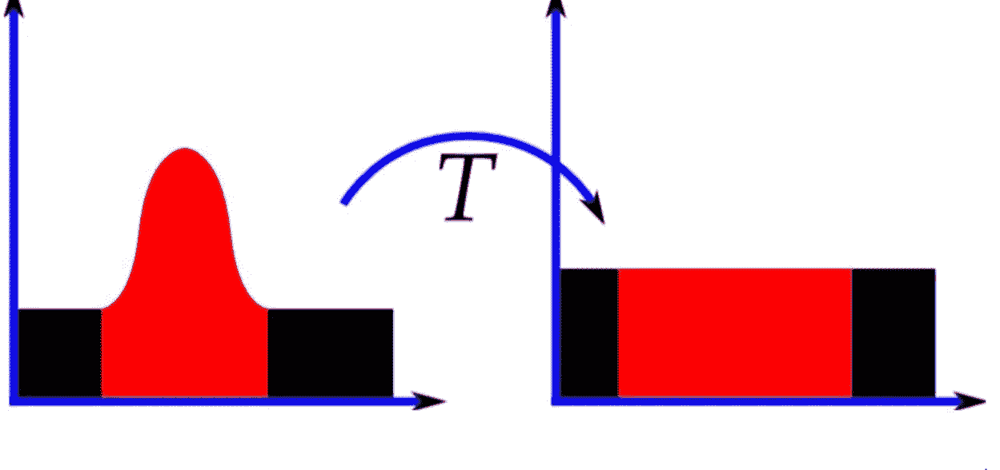

> 使用 Numpy 的直方图可视化

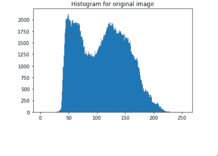

> 使用 OpenCV 进行直方图均衡

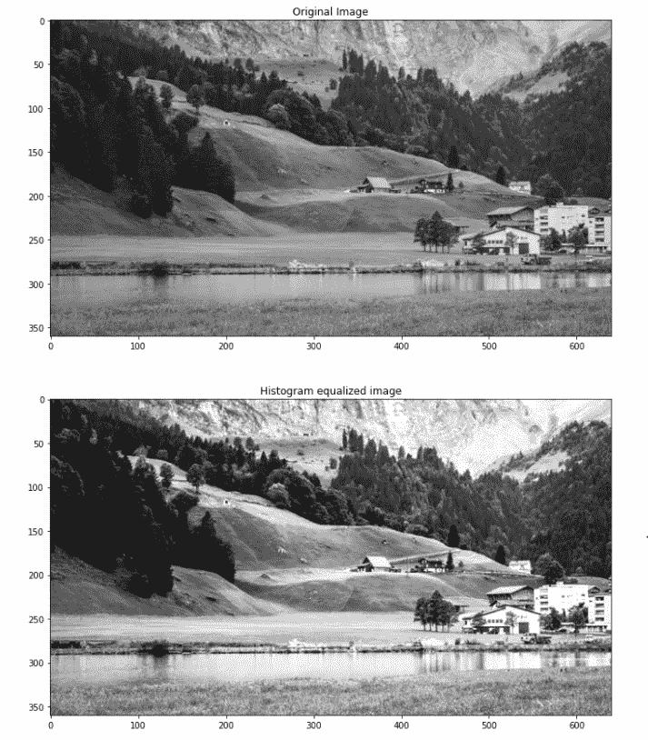

你可以在这里找到完整的 jupyter 笔记本。

如果你有任何问题，你可以联系[阿布舍克](https://www.linkedin.com/in/abhishek-kumar-annamraju/)。请随意联系他。

我对计算机视觉和深度学习充满热情。我是[和尚](https://github.com/Tessellate-Imaging/Monk_Object_Detection)图书馆的开源贡献者。

你也可以在以下网址看到我的其他作品:

[](https://medium.com/@akulahemanth) [## 阿库拉·赫曼思·库马尔培养基

### 约翰·沃尔夫冈的《色彩理论》一书中的色彩模型。证明为什么 RYB 被认为是主要的…

medium.com](https://medium.com/@akulahemanth)