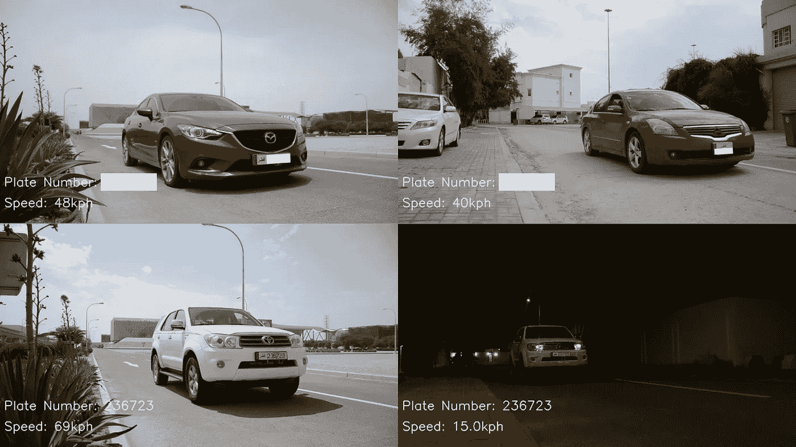
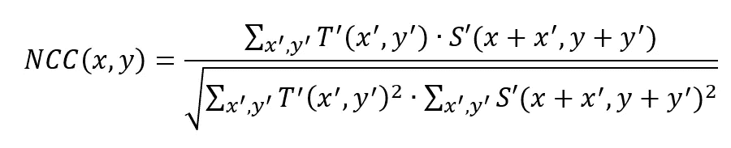
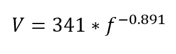
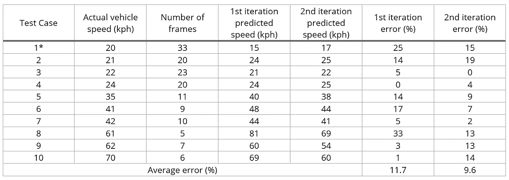
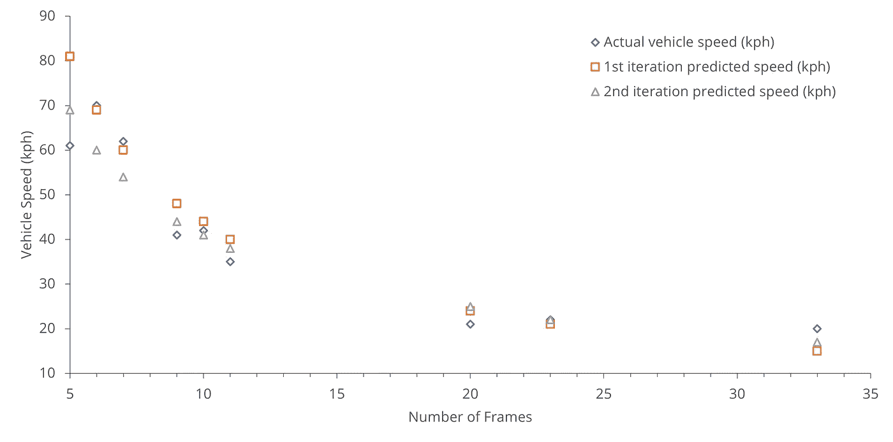

# 基于图像处理的车牌检测和测速雷达

> 原文：<https://pub.towardsai.net/image-processing-based-vehicle-number-plate-detection-and-speeding-radar-aa375952d0f6?source=collection_archive---------3----------------------->

## [计算机视觉](https://towardsai.net/p/category/computer-vision)

## 利用计算机视觉开发廉价的 DIY 超速和交通雷达



*作者图片*

# 介绍

该工具的作用是实现一个基于图像处理的交通雷达，它可以检测车辆牌照，并随后测量瞬时车速。选择这种计算摄影/图像处理的应用，是为了开发一种开源的、具有成本效益的替代方案来替代当前的超速雷达系统，这种系统的单价可高达 6500 美元[【1】](#_edn1)。作为一种开源技术，这将使地方当局、市政当局或任何个人能够利用现成的设备和装置实现他们自己的低成本(1700 美元)和方便的交通监控系统。

为了实现这个应用程序，选择了一组容易访问且相对便宜的项目和程序。即，具有 60 fps、1080p 分辨率、1/120 秒曝光时间和激活的闪光灯的 iPhone 相机用于夜间监控，而具有 24 fps、1080p 分辨率和 1/60 秒曝光时间的尼康 D7000 相机用于白天监控。两台摄像机都安装了一个可调节的三脚架，三脚架紧靠路边，倾角为 0°，与道路的水平夹角约为 20°，离地高度约为 2 英尺。从早上到晚上，在不同的环境照明条件下，使用 3 种不同尺寸和速度范围从 20 公里/小时到 70 公里/小时的不同车辆对总共 10 个测试案例进行了实验。测试矩阵如图 1 所示。随后，使用几个 Python 脚本对记录的连续镜头进行处理，以检测和报告车牌和车速；这个步骤的详细描述可以在前面的章节中找到。

# **实现**

一旦镜头被拍摄，它将被用 Python 3.7 编写的几个脚本处理。这些脚本利用了几个开源 Python 工具包，即 cv2、NumPy 和 matplotlib。这些工具包用于处理镜头，创建模板图像，比较像素和处理输出图像，除此之外，所有其他算法都是原始的。实施情况可总结如下:

```
**1\. Extract_frames.py:** fragment footage into individual frames**2\. Resize_numbers.py:** create templates of numbers 0–9 with varying
   sizes and lighting conditions (executed only once)**3\. Main.py** a. Determine ambient lighting conditions (day/night)
   b. Compare each template (numbers of varying sizes and light) to
      each patch within each extracted frame using the normalized
      correlation coefficient algorithm
      *i.   If the similarity score exceeds a certain threshold, 
           record the number and location
      ii.  If distance between the locations of numbers exceed a 
           certain threshold, disregard any new numbers (false 
           number rejection)
      iii. Append detected digits in order of appearance along
           x-axis
      iv.  If the length of the detected number equals six digits,
           register the digits as the number plate
   c. Count the number of frames where at least 1 digit is detected;
      use the speed measurement model to determine the vehicle speed
      based on the total number of frames with the detected plate
      numbers
   d. Display and save the image of the vehicle with the detected
      number plate and speed***4\. Record_video.py:** optionally you may choose to recreate a video
   of the plate detection and speed measurement process using the
   output images from main.py.
```

如步骤 3b 中所述，用于将模板图像与源图像进行比较以进行匹配的技术是下面所示的归一化相关系数等式，其中 NCC 是相似性得分，T 是模板图像，S 是源图像，x 和 y 是源图像中的坐标，x’和 y’在模板图像中是坐标。



归一化相关系数函数。

使用归一化相关系数的好处在于，当模板和源图像中的像素都具有较亮(+ve +ve)或较暗(-ve -ve)的强度时，由于点积，结果将是指示匹配的大正值。然而，如果一个图像具有亮强度，而另一个图像具有暗强度(+ve -ve)，则结果将是指示不匹配的大负值。这种比较两幅图像的相关性或卷积的过程使得这种技术对绝对差异和环境照明条件相对不敏感。

如步骤 3c 中详细描述的，在第二次迭代中使用以下速度测量模型(幂回归)来确定速度，其中 V 是车辆速度，f 是具有检测到的车牌号码的帧数。速度测量技术在其开始和实现时简单而新颖，不使用任何开源输入。



车速功能。

# 结果

图 1 中的测试矩阵显示了每个测试用例及其结果。请注意，帧数对应于脚本能够检测到镜头中任何和所有数字的帧数。测试案例被分成训练测试数据集，并用于迭代训练更精确的车辆速度测量模型。分别给出了第一次和第二次迭代的结果。



*测试矩阵，包含第一次和第二次车速测量迭代的结果。*

测试案例 1 是唯一一个在夜间极端恶劣的环境照明条件下进行的实验。在这种情况下，iPhone 相机以 60 fps 和 1/120 秒的曝光时间使用；同样，不同组的模板图像被用于模板匹配，并且不同的速度测量模型被用于确定车辆速度。在第二次迭代速度测量中很明显，平均误差下降到 10%以下(9.6%)，因此，这可以被视为一个成功的结果，因为超速违规的行业标准提供了 10%的误差幅度[【2】](#_edn1)。然而，应该强调的是，这些结果主要是以 24 fps 进行的，而更高的帧速率可能会提供更高的精度。关于车牌检测，所有 10 个测试案例均读取无误(结果样本见图 3)，相当于总体错误率为 0%。因此，这证明了这种基于图像处理的技术作为传统测速雷达的有效且廉价的替代方案的潜力。

# 挑战和创新

这项技术带来的主要挑战是环境照明条件的问题。很明显，基于与模板图像的比较，由于白天、夜晚和云层覆盖而变化的光照水平会对源图像中的数字检测产生显著影响。这可以通过使用归一化相关系数算法来减轻，该算法具有用于每个数字匹配的变化的阈值和模板。因此，最终的实现受绝对光照条件的影响要小得多。此外，由于夜间需要较长的拍摄曝光时间，帧具有较低的时间分辨率，这对检测产生不利影响；这可以通过使用带闪光灯的相机、更高的帧速率和更短的曝光时间来解决，详见方法部分。这里的创新之处在于开发了剔除假车牌的算法(详见步骤 3b ii)和车速测量算法(详见步骤 3d)。这两种独创的技术使图像处理能够相当可靠地检测和测量车牌和车速，类似于超速雷达，尽管成本只是其一小部分。



*车速(实际和预测)与带有检测车牌的帧数的图表(见步骤 3c)。*

# **号牌和测速视频**

以 24 fps 输出视频。

以 12 fps 的速度输出视频。

## 使用 Streamlit 开发 Web 应用程序:

[](https://www.amazon.com/Web-Application-Development-Streamlit-Applications/dp/1484281101?&linkCode=ll1&tag=mkhorasani09-20&linkId=a0cb2bc17df598006fd9029c58792a6b&language=en_US&ref_=as_li_ss_tl) [## 使用 Streamlit 开发 Web 应用程序:开发和部署安全且可伸缩的 Web 应用程序…

### 使用 Streamlit 开发 Web 应用程序:使用……开发安全且可扩展的 Web 应用程序并将其部署到云中

www.amazon.com](https://www.amazon.com/Web-Application-Development-Streamlit-Applications/dp/1484281101?&linkCode=ll1&tag=mkhorasani09-20&linkId=a0cb2bc17df598006fd9029c58792a6b&language=en_US&ref_=as_li_ss_tl) 

## 使用 Python 实现数据可视化:

[](https://www.coursera.org/learn/python-for-data-visualization?irclickid=xgMQ4KWb%3AxyIWO7Uo7Vva0OcUkGQgW2aEwvr1c0&irgwc=1&utm_medium=partners&utm_source=impact&utm_campaign=3308031&utm_content=b2c) [## 用 Python 实现数据可视化

### “一图胜千言”。我们都熟悉这个表达。它尤其适用于试图…

www.coursera.org](https://www.coursera.org/learn/python-for-data-visualization?irclickid=xgMQ4KWb%3AxyIWO7Uo7Vva0OcUkGQgW2aEwvr1c0&irgwc=1&utm_medium=partners&utm_source=impact&utm_campaign=3308031&utm_content=b2c) 

## 面向所有人的 Python 专业化:

[](https://www.coursera.org/specializations/python?irclickid=xgMQ4KWb%3AxyIWO7Uo7Vva0OcUkGQgW16Ewvr1c0&irgwc=1&utm_medium=partners&utm_source=impact&utm_campaign=3308031&utm_content=b2c) [## 面向所有人的 Python

### 学习用 Python 编程和分析数据。开发收集、清理、分析和可视化数据的程序…

www.coursera.org](https://www.coursera.org/specializations/python?irclickid=xgMQ4KWb%3AxyIWO7Uo7Vva0OcUkGQgW16Ewvr1c0&irgwc=1&utm_medium=partners&utm_source=impact&utm_campaign=3308031&utm_content=b2c) 

## GitHub 资源库:

[](https://github.com/mkhorasani/Image_Processing_Based_Speeding_Radar) [## mkhorasani/图像处理基础超速雷达

### 这个项目的范围是实现一个基于图像处理的交通雷达，检测车辆号码…

github.com](https://github.com/mkhorasani/Image_Processing_Based_Speeding_Radar) 

# 参考

【2】[【https://www.clm.co.uk/blog/new-tougher-speeding-fines/】](https://www.clm.co.uk/blog/new-tougher-speeding-fines/)

# 新到中？你可以在这里订阅和解锁无限文章[。](https://khorasani.medium.com/membership)