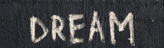
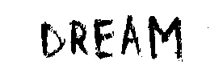
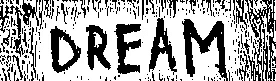
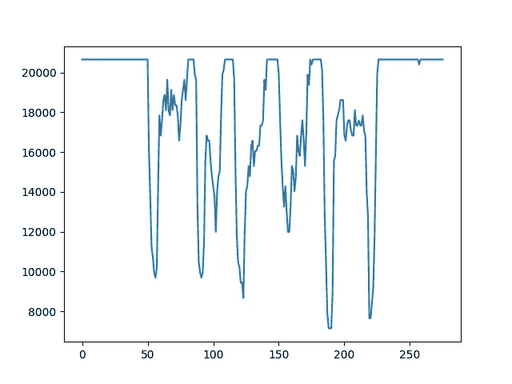
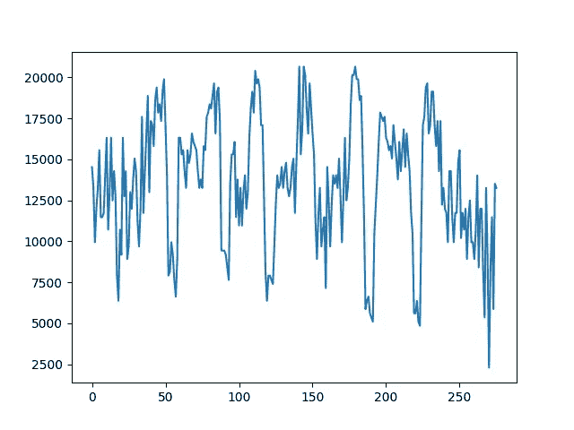

# OpenCV 中的图像处理基础知识

> 原文：<https://pub.towardsai.net/image-processing-basics-through-opencv-e9cbc6130821?source=collection_archive---------2----------------------->

## [计算机视觉](https://towardsai.net/p/category/computer-vision)

## 通过阈值处理(直方图投影)和过滤等主题对 Python 的基本介绍


由[沙哈达特拉赫曼](https://unsplash.com/@hishahadat?utm_source=medium&utm_medium=referral)在 [Unsplash](https://unsplash.com/?utm_source=medium&utm_medium=referral) 上拍摄的照片

# **图像处理**

> *在计算机科学中，* ***数字图像处理*** *是利用数字计算机通过某种算法对数字图像进行处理。【*[*1*](https://en.wikipedia.org/wiki/Digital_image_processing)*】*

一幅图像被作为输入，一组算法在其上运行，根据应用程序的使用得到一定的结果。为什么受欢迎？

答案在于，从网络安全到医学图像分析，几乎在生活的每一个方面都使用图像处理，并且图像处理正被迅速应用于所有领域。因此，这是一项非常需要掌握的技能。

虽然图像处理应该用快速语言如 C++来完成，但为了理解和简洁起见，我将在本教程中使用 [Python](https://www.python.org/) 。

# OpenCV

> *OpenCV 是一个主要针对实时计算机视觉的编程函数库。最初由英特尔开发，后来由 Willow Garage 和 Itseez 支持。该库是跨平台的，在开源 BSD 许可下可以免费使用。【*[*2*](https://en.wikipedia.org/wiki/OpenCV)*】*

这是一个非常酷的库，它使得通过一个黑盒应用图像处理算法变得非常容易(尽管我非常鼓励你了解每个算法背后的基本原理，这有助于应用算法)。

我相信通过这样做的学习，我们将直接从一个任务开始，找到图像的垂直直方图投影。

# 阈值处理

让我们从我在 Unsplash 上找到的这张图片开始。



兰迪·塔兰皮在 [Unsplash](https://unsplash.com/photos/U2eUlPEKIgU) 上拍摄的照片

我们都做梦，对吧？

这张图片包含了什么？

让我们来了解一下！

```
# Requiring minimum libraries for our usefrom PIL import Image
import numpy as np
image = Image.open( img_path ).convert('L') #define the img_path
image = np.array(image) # storing the image as an 3d array
print( image.shape ) # (81, 276, 3)
print( np.unique( image)) # ([ 0 ... 255 ])
# np.unique returns all the unique elements in an array
```

所以图像基本上是一个 3D 数组，元素范围从 0 到 255。

然而，这无助于识别图像中感兴趣的边缘或区域。

所以我们会遵循一种叫做[二值化的方法。](https://en.wikipedia.org/wiki/Binary_image)

让我们通过简单的阈值处理将它转换成二值图像。

```
import cv2
_,thresh1 = cv2.threshold(img,127,255,cv2.THRESH_BINARY)
# we are converting the image into 255 and 0  
# according to pixel value > 127 -> 255 else 0
print (np.unique( thresh1 )) # [ 0 , 255 ]
Image.fromarray(thresh1).show()
```



二值化图像

更多的功能可读性哈！然而，这种二进制化在光照不恒定的情况下不起作用，这不是这个图像的情况。

我们考虑一种更强大的阈值处理技术，**自适应阈值处理**，它根据固定大小的相邻块对图像进行阈值处理。

```
thresh2 = cv2.adaptiveThreshold(img,255,cv2.ADAPTIVE_THRESH_GAUSSIAN_C,\
            cv2.THRESH_BINARY,61,2)
# we are converting the image into 255 and 0  
# according to neighbouring blocks of size 11 and fixed constant 
#c =2
print (np.unique( thresh2 )) # [ 0 , 255 ]
Image.fromarray(thresh1).show()
```



自适应阈值

所以你可以看到它更侧重于文本部分，因为它是基于相邻像素的计算。

让我们检查一下两幅图像的**垂直投影**。

**垂直投影**只不过是图像每一行中所有元素的列方向总和。

```
# code for vertical projection
import matplotlib.pyplot as plt 
img_col_sums = np.sum( thresh , axis =0 ) 
plt.plot( img_col_sums )
plt.show()
## pretty easy huh , try writing it in C++ 🤓
```

好了，表演时间到了。

对于第一幅图像:



阈值 1

对于第二幅图像:



阈值 2(自适应)

**推论:**

感兴趣的区域在第二幅图像中更加明显，您可以从阵列中轻松地获得峰值**。一个简单的数组中值就能证明我的观点。**

**应用:**

*   这在 OCR 中有应用，并用于分割文本中的字符以供进一步识别。

# 滤像

滤镜在图像处理中用于锐化和模糊图像。

让我们再从一张图片开始，


本·科尔德在 [Unsplash](https://unsplash.com/?utm_source=medium&utm_medium=referral) 上拍摄的照片

过滤可以通过两种方式实现:

*   用滤波器进行图像卷积。
*   在频域中掩蔽频率区域。

**身份过滤**

```
from PIL import Image
import numpy as np
import cv2image = Image.open( img_path )
#define the image path image = np.array(image) # converting the image into an arraykernel = np.zeros((3,3))
kernel[1,1] = 1
dst = cv2.filter2D( image , -1 , kernel )
```

这产生了相同的图像。

**均匀模糊**

```
kernel = np.ones((3,3))* (1 /10.3 ) 
dst = cv2.filter2D( image ,-1 ,kernel ) 
Image.fromarray(dst).show()
```


均匀模糊

这是一个用于平均或模糊图像的**低通滤波器**的例子。

**拉普拉斯边缘检测**

```
kernel = np.zeros((3,3))
kernel[1,1] = 4
for p in [ [0,1] , [1,0]]:
   kernel[ p[0],p[1]] =-1
   kernel[ p[0]+1 ,p[1] +1] =-1
'''
0 -1 0
-1 4 -1
0 -1 0'''
```


拉普拉斯边缘检测

很酷不是吗？这是用于提取图像的高级特征的高通滤波器的例子。[ [4](https://opencv-python-tutroals.readthedocs.io/en/latest/py_tutorials/py_imgproc/py_transforms/py_fourier_transform/py_fourier_transform.html#why-laplacian-is-a-high-pass-filter)

制作一些新的过滤器，并在一些图像上试用，以了解这些过滤器实际上是如何工作的。

希望我已经很好地介绍了图像处理。如果你感到兴奋，就为它鼓掌。

# 参考

[1]:数字图像处理百科，[https://en.wikipedia.org/wiki/Digital_image_processing](https://en.wikipedia.org/wiki/Digital_image_processing)

[2]:OpenCv 维基百科，【https://en.wikipedia.org/wiki/OpenCV 

[3]:默罕默德·贾韦德，*直接从游程长度压缩的文本文档中提取投影轮廓、游程直方图和熵特征，*[https://arxiv.org/pdf/1404.0627.pdf](https://arxiv.org/pdf/1404.0627.pdf)

[4]:拉普拉斯是一个高通滤波器，[https://opencv-python-tutro als . readthedocs . io/en/latest/py _ tutorials/py _ imgproc/py _ transforms/py _ Fourier _ transforms/py _ Fourier _ transform . html # why-Laplacian-is-a-high-pass-filter](https://opencv-python-tutroals.readthedocs.io/en/latest/py_tutorials/py_imgproc/py_transforms/py_fourier_transform/py_fourier_transform.html#why-laplacian-is-a-high-pass-filter)