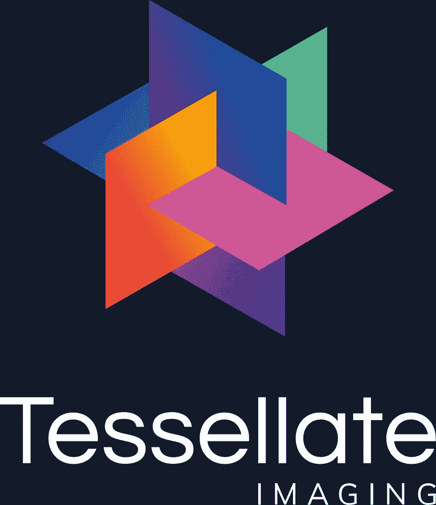
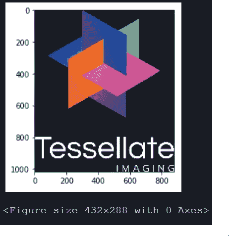
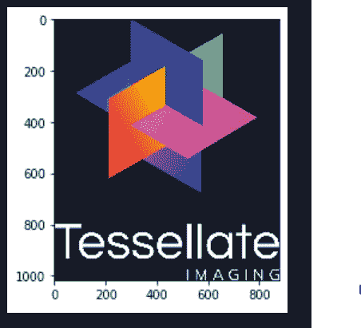
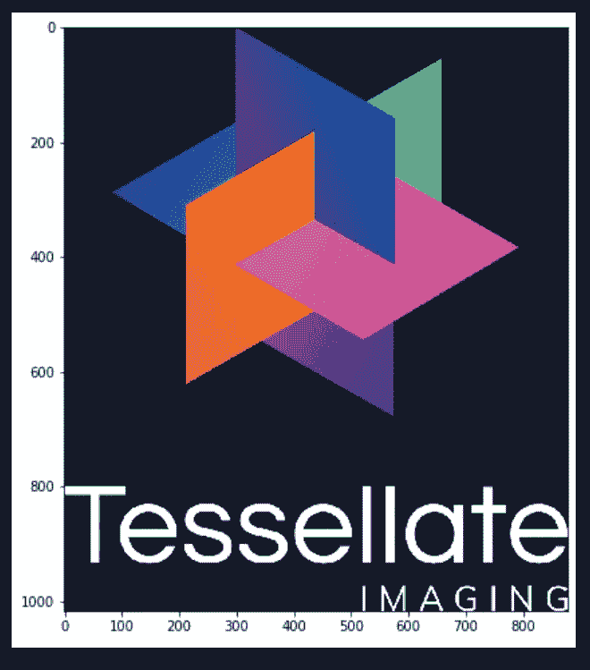

# Python 中的图像处理库

> 原文：<https://pub.towardsai.net/image-processing-libraries-in-python-b2c6a7627686?source=collection_archive---------1----------------------->

## 使用 Monk，低代码深度学习工具和计算机视觉的统一包装器，使计算机视觉变得简单。



参考:[https://www.tessellateimaging.com/](https://www.tessellateimaging.com/)

# 目录

1.  **OpenCV**
2.  **蟒蛇枕**
3.  **Scikit 图像**
4.  **转换**
5.  **测验**

# **OpenCV**

> OpenCV 是什么？

*   开源计算机视觉和机器学习软件。
*   超过 2500 种优化算法。
*   BSD 许可的产品。
*   超过 47，000 人的用户群体。
*   下载量超过 1800 万。

> 支持的图像格式

*   Windows 位图-'。bmp '，'。迪布
*   JPEG 文件-'。jpeg '，'。jpg '，'。jpe '
*   JPEG 2000 文件-“. jp2”
*   便携式网络图形-' jp2 '
*   WebP-'。'网页'
*   TIFF 文件-'。tiff '，'。' tif '

> 在 OpenCV 中加载图像

*   导入库

```
'''
1.Import OpenCV
2.cv2 class object
3.cv2 acts as a master object encompassing all the functions and global parameters used in OpenCV python
'''
import cv2
```

*   使用 cv2.imread 加载

```
'''
1.cv2.imread
2.First param - image
3.Second param - will be discussed in the next section
'''
img = cv2.imread("imgs/chapter1/tessellate.png", -1)
```

*   显示图像

```
'''
1.To display opencv image use matplotlib
2.using inline it shows otput just below the cell
'''
from matplotlib import pyplot as plt
import cv2
import numpy as npimg = cv2.imread("imgs/chapter1/tessellate.png", -1)''' 
1.OpenCV loads an image in BGR format
2.BGR format is Blue, Green and Red format
3.With the display scale is also printed
'''img2 = img[:,:,::-1] # For channel alignment
plt.imshow(img2)
plt.show()
```



*   使用 OpenCV 将图像写入光盘

```
'''
1.Saving image to disc
2.Loaded a png image and saved it back as jpeg
3.cv2.imwrite
'''cv2.imwrite("imgs/chapter1/tessellate_opencv_saved.jpg", img)
```

# **蟒蛇枕**

> 什么是 Python PIL

*   PIL 是 Python 图像库。
*   Python 编程语言的免费库。
*   支持打开，操作和保存许多不同的图像文件格式。
*   Pillow 提供了几个标准的图像处理程序。其中包括:

1.逐像素操作

2.遮蔽和透明处理。

3.图像过滤，例如模糊、轮廓、平滑或边缘查找。

4.图像增强，如锐化、调整亮度、对比度或颜色。

5.给图像添加文本等等。

> 支持的图像格式

*   百万分率
*   PNG
*   联合图像专家组
*   GIF 格式
*   争执
*   位图文件的扩展名(Bitmap)

> 在 PIL 加载图像

*   导入库

```
'''
1.Import PIL
2.PIL object
3.Image instance is responsible for loading and saving images like cv2 is for OpenCV
'''import PIL
from PIL import Image
```

*   使用图像加载图像。开放功能

```
'''
1.This is a lazy operation; this function identifies the file, but the file remains open and the
actual image data is not read from the file until you try to process the data.
2.Image.open
3.Argument - image path and name
'''img = Image.open("imgs/chapter1/tessellate.png")
```

*   显示图像

```
'''
1\. To display Pillow image using matplotlib
'''from matplotlib import pyplot as plt
plt.imshow(img)
plt.show()
```



*   使用 PIL 将图像写入光盘

```
'''
1.Notice the difference here
2.In opencv we did cv2.imwrite() whereas in PIL we didn't use Image.save.
3.We used img.save where img is an image variable not the main Image class object
'''img.save("imgs/chapter1/tessellate_pillow_saved.png")
```

# **Scikit 图像**

> 什么是 Scikit-Image？

*   图像处理算法集。
*   免费提供，不受限制。
*   旨在与 Python 数字和科学库 Numpy 和 SciPy 进行互操作。
*   包括用于分割、几何变换、色彩空间处理、分析、过滤、形态学、特征检测等的算法。

> 在 Scikit-Image 中加载图像

*   导入库

```
'''
1.Import scikit image
'''import skimage
```

*   使用 scikit.io.open 函数加载图像

```
'''
Reading image using scikit
'''img = skimage.io.imread("imgs/chapter1/tessellate.png")
```

*   显示图像

```
'''
 Display skimage data using matplotlib
'''from matplotlib import pyplot as plt
plt.figure(figsize=(8, 8))
plt.imshow(img)
plt.show()
```



*   使用 Scikit-Image 将图像写入光盘

```
'''
1.imsave
'''skimage.io.imsave("imgs/chapter1/tessellate_skimage_saved.png", img)
```

# **转换**

> 为什么要从一个库转换到另一个库？

*   并非所有算法都存在于每个库中。因此库间转换很重要。

1.  OpenCV ← → Numpy

```
'''
1.OpenCV <--> Numpy
2\. No explicit conversion required here
'''import cv2inp = cv2.imread("imgs/chapter1/img1.png", -1)
print("Input Type = {}".format(type(inp)))
```

输出

```
Input Type = <class 'NoneType'>
```

2.PIL ← → Numpy

```
'''
1.PIL <--> Numpy
'''
from PIL import Image
import numpy as npinp = Image.open("imgs/chapter1/tessellate.png")
print("Input Type = {}".format(type(inp)))
```

输出

```
Input Type = <class 'PIL.PngImagePlugin.PngImageFile'>
```

*   PIL → Numpy

```
'''
1.Conversion PIL to Numpy
2.np.asarray -> numpy take it "as" "array"
'''out = np.asarray(inp)
print("Converted Type = {}".format(type(out)))
```

输出

```
Converted Type = <class 'numpy.ndarray'>
```

*   Numpy → PIL

```
'''
1.Conversion Numpy to PIL
2.Image.fromarray -> Image take it "from" "array"
'''
re_out = Image.fromarray(np.uint8(out))
print("Re-Converted Type = {}".format(type(re_out)))
```

输出

```
Re-Converted Type = <class 'PIL.Image.Image'>
```

3.Scikit-Image ← → Numpy

```
'''
1.Scikit Image <--> Numpy
'''
import skimage
inp = skimage.io.imread("imgs/chapter1/tessellate.png")
print("Input Type = {}".format(type(inp)))
print("Scikit images are subclass of numpy ndarray")
print("All operations of numpy, scipy and opencv work on a scikit image")
```

输出

```
Input Type = <class 'imageio.core.util.Array'> 
Scikit images are subclass of numpy ndarray 
All operations of numpy, scipy and opencv work on a scikit image
```

# 恶作剧

1.  为什么 OpenCV 图像用 plt.imshow(img[:，:，::-1])显示，PIL 图像用 plt.imshow(img)显示？
2.  scikit-image 中存储所有函数的核心对象是什么？
3.  当显示 OpenCV 和 Pillow 图像时，它们看起来比 scikit 图像的显示小。找出原因？(提示:参见 scikit 和 pillow 的显示单元)
4.  在使用 cv2.imread 打开 OpenCV 时，其第二个参数的什么值读取一个彩色图像？(提示:选项— [-1，1，0，2])

请在下面的评论中分享你的答案

你可以在 Github 上找到完整的 jupyter 笔记本。

如果有任何问题，可以联系[阿布舍克](https://www.linkedin.com/in/abhishek-kumar-annamraju/)和[阿卡什](https://www.linkedin.com/in/akashdeepsingh01/)。请随意联系他们。


照片由 [Srilekha](https://www.instagram.com/_fernwehd_._/) 拍摄