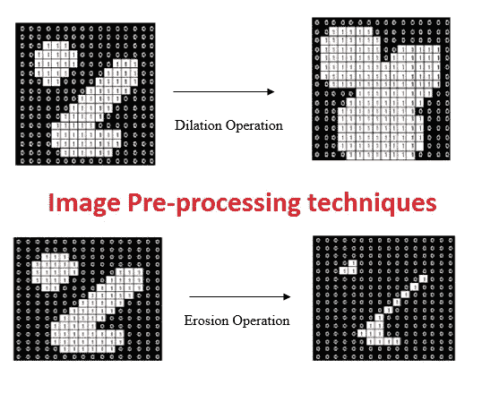
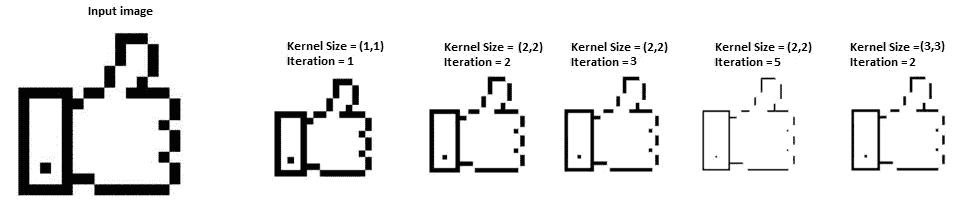
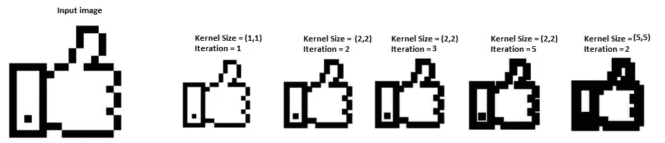
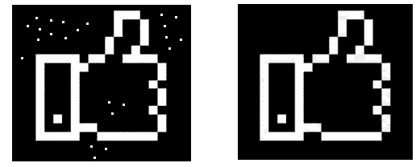
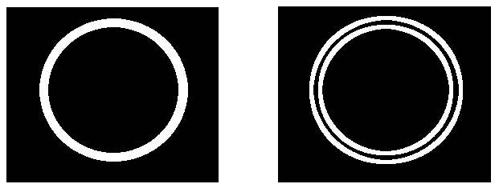

# 图像处理:用 Python 进行形态学运算

> 原文：<https://pub.towardsai.net/image-processing-morphological-operations-with-python-7e0f8d1983eb?source=collection_archive---------0----------------------->

## [深度学习](https://towardsai.net/p/category/machine-learning/deep-learning)

## 为了从图像中去除噪声



作者的照片

> ***形态学方法***

当对图像进行预处理以进行增强和性能操作(如阈值处理)时，图像可能会有一些噪声。结果，图像中存在像素信息的不适当平衡。

形态学的运算是去除主要影响图像形状和信息的噪声。形态学运算在图像分割中非常有用，可以得到无噪声的二值图像。

基本的形态学操作是腐蚀和膨胀。下面讨论这两种操作的解释:

> ***膨胀***

在膨胀操作中，如果对象是白色的，则白色像素周围的像素会增长。它增加的区域取决于对象像素的形状。膨胀过程增加了对象的像素数量，并减少了非对象的像素数量。

不同内核大小和迭代的膨胀 Python 代码

```
import numpy as np
import imutils
import cv2#reading the input image
img = cv2.imread('thumb.png') #reads the image#cv2.imwrite('Input_image.jpg',image)#Resizing the image
scale_percent = 70
width = int(img.shape[1] * scale_percent / 100)
height = int(img.shape[0] * scale_percent / 100)
dim = (width, height)

# resize the input image
image = cv2.resize(img, dim, interpolation = cv2.INTER_AREA)kernel = np.ones((1,1), dtype = "uint8")/9
dilation = cv2.dilate(image,kernel,iterations = 1)
cv2.imwrite('dilation.jpg', dilation)kernel = np.ones((2,2), dtype = "uint8")/9
dilation = cv2.dilate(image,kernel,iterations = 1)
cv2.imwrite('dilation.jpg', dilation)kernel = np.ones((2,2), dtype = "uint8")/9
dilation = cv2.dilate(image,kernel,iterations = 3)
cv2.imwrite('dilation.jpg', dilation)kernel = np.ones((2,2), dtype = "uint8")/9
dilation = cv2.dilate(image,kernel,iterations = 5)
cv2.imwrite('dilation.jpg', dilation)kernel = np.ones((3,3), dtype = "uint8")/9
dilation = cv2.dilate(image,kernel,iterations = 2)
cv2.imwrite('dilation.jpg', dilation)
```

[](/latest-programming-languages-for-ai-5252d39e1c51) [## 最新的人工智能编程语言

### 人工智能未来娱乐它的语言

pub.towardsai.net](/latest-programming-languages-for-ai-5252d39e1c51) 

> ***侵蚀***

侵蚀函数正好是膨胀功函数的逆函数。侵蚀功能使对象的尺寸变小。侵蚀过程增加了非目标像素，减少了目标像素。

不同内核大小和迭代的 Python 代码

```
import numpy as np
import imutils
import cv2#reading the input image
img = cv2.imread('thumb.png')#cv2.imwrite('Input_image.jpg',image)#Resizing the image
scale_percent = 70
width = int(img.shape[1] * scale_percent / 100)
height = int(img.shape[0] * scale_percent / 100)
dim = (width, height)

# resize the input image
image = cv2.resize(img, dim, interpolation = cv2.INTER_AREA)kernel = np.ones((1,1), dtype = "uint8")/9
erosion = cv2.erode(image, kernel, iterations = 1)
cv2.imwrite('erosion.jpg', erosion)kernel = np.ones((2,2), dtype = "uint8")/9
erosion = cv2.erode(image, kernel, iterations = 2)
cv2.imwrite('erosion.jpg', erosion)kernel = np.ones((2,2), dtype = "uint8")/9
erosion = cv2.erode(image, kernel, iterations = 3)
cv2.imwrite('erosion.jpg', erosion)kernel = np.ones((2,2), dtype = "uint8")/9
erosion = cv2.erode(image, kernel, iterations = 5)
cv2.imwrite('erosion.jpg', erosion)kernel = np.ones((5,5), dtype = "uint8")/9
erosion = cv2.erode(image, kernel, iterations = 2)
cv2.imwrite('erosion.jpg', erosion)
```

[](https://medium.com/pythoneers/opencv-count-of-objects-in-blood-image-with-python-3d82de1c83a9) [## OpenCV:使用 Python 对血液图像中的对象进行计数

### OpenCV 库的图像处理概念

medium.com](https://medium.com/pythoneers/opencv-count-of-objects-in-blood-image-with-python-3d82de1c83a9) 

> ***开场***

这种方法有助于去除图像中的噪声。该方法的作用是先腐蚀再膨胀，以保持目标像素的原始性，并去除背景中的小噪声。

Python 代码用于打开

```
import numpy as np
import imutils
import cv2#reading the input image
img = cv2.imread('11.png')kernel = np.ones((5,5), dtype = "uint8")/9
opening = cv2.morphologyEx(img, cv2.MORPH_OPEN, kernel)
cv2.imwrite('opening.jpg', opening)
```



> ***关闭***

这种方法有助于去除图像中的噪声。该方法的工作原理是先进行膨胀，然后进行腐蚀，以保持目标像素的原始性，并去除拇指内部的小噪声。

关闭的 Python 代码

```
import numpy as np
import imutils
import cv2#reading the input image
img = cv2.imread('thumb.png')kernel = np.ones((9,9), dtype = "uint8")/9
closing = cv2.morphologyEx(img, cv2.MORPH_CLOSE, kernel)
cv2.imwrite('closing.jpg', closing)
```


> ***形态渐变***

这种方法不同于膨胀技术和腐蚀技术。

形态学梯度的 Python 代码

```
import numpy as np
import imutils
import cv2#reading the input image
img = cv2.imread('g1.png')kernel = np.ones((6,6), dtype = "uint8")/9
gradient = cv2.morphologyEx(img, cv2.MORPH_GRADIENT, kernel)
cv2.imwrite('gradient.jpg', gradient)
```



> ***结论***

这些操作是处理二值图像的一种非常简单的方法，也是图像处理应用程序中预处理的一部分。

我希望你喜欢这篇文章。通过我的 [LinkedIn](https://www.linkedin.com/in/data-scientist-95040a1ab/) 和 [twitter](https://twitter.com/amitprius) 联系我。

# 推荐文章

[1。NLP —零到英雄用 Python](https://medium.com/towards-artificial-intelligence/nlp-zero-to-hero-with-python-2df6fcebff6e?sk=2231d868766e96b13d1e9d7db6064df1)
2。 [NumPy:图像上的线性代数](/numpy-linear-algebra-on-images-ed3180978cdb?source=friends_link&sk=d9afa4a1206971f9b1f64862f6291ac0)
3。[Python 中的异常处理概念](/exception-handling-concepts-in-python-4d5116decac3?source=friends_link&sk=a0ed49d9fdeaa67925eac34ecb55ea30)
4。[用 Python 进行主成分分析降维](/principal-component-analysis-in-dimensionality-reduction-with-python-1a613006d531?source=friends_link&sk=3ed0671fdc04ba395dd36478bcea8a55)
5。[用 Python 全面讲解 K-means 聚类](https://medium.com/towards-artificial-intelligence/fully-explained-k-means-clustering-with-python-e7caa573176a?source=friends_link&sk=9c5c613ceb10f2d203712634f3b6fb28)
6。[用 Python 充分解释了线性回归](https://medium.com/towards-artificial-intelligence/fully-explained-linear-regression-with-python-fe2b313f32f3?source=friends_link&sk=53c91a2a51347ec2d93f8222c0e06402)
7。[用 Python](https://medium.com/towards-artificial-intelligence/fully-explained-logistic-regression-with-python-f4a16413ddcd?source=friends_link&sk=528181f15a44e48ea38fdd9579241a78)
充分解释了 Logistic 回归 8。[concat()、merge()和 join()与 Python](/differences-between-concat-merge-and-join-with-python-1a6541abc08d?source=friends_link&sk=3b37b694fb90db16275059ea752fc16a)
9 的区别。[与 Python 的数据角力—第一部分](/data-wrangling-with-python-part-1-969e3cc81d69?source=friends_link&sk=9c3649cf20f31a5c9ead51c50c89ba0b)
10。[机器学习中的混淆矩阵](https://medium.com/analytics-vidhya/confusion-matrix-in-machine-learning-91b6e2b3f9af?source=friends_link&sk=11c6531da0bab7b504d518d02746d4cc)