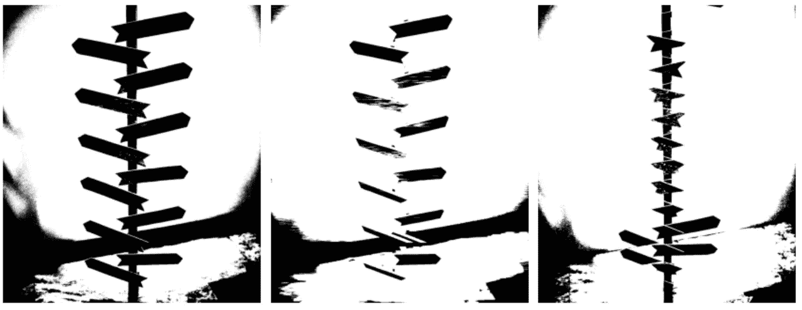
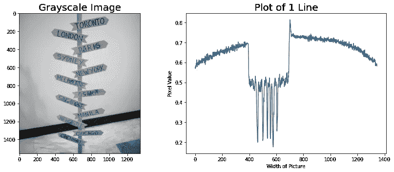
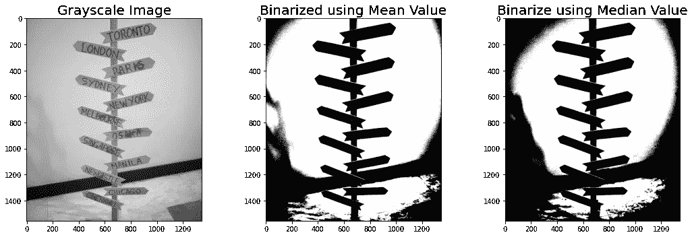
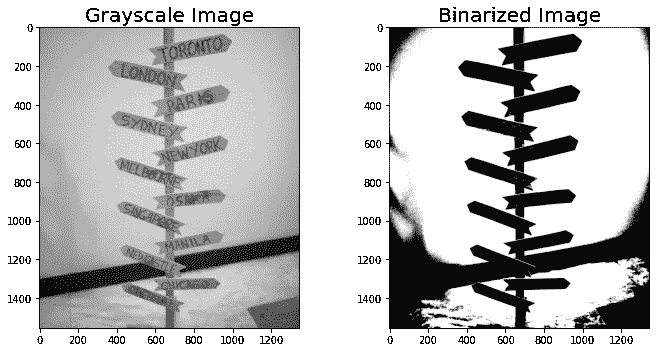
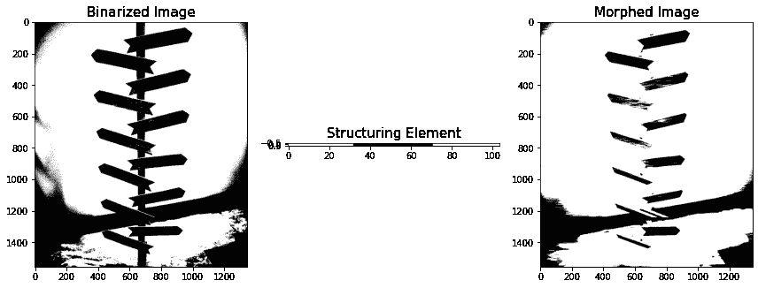
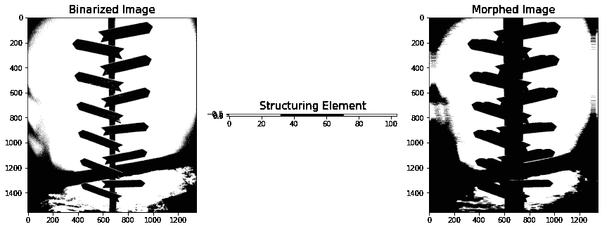
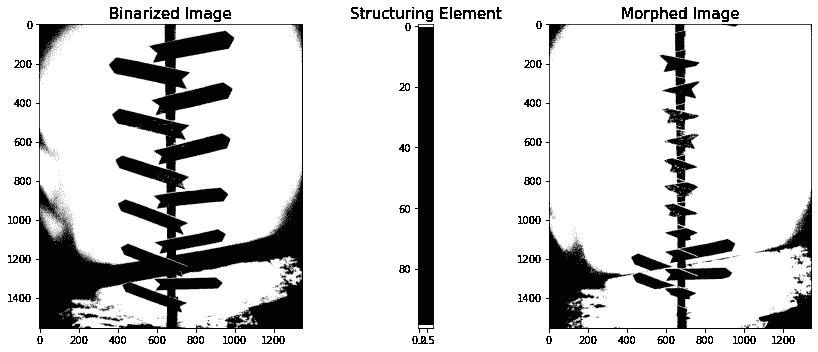
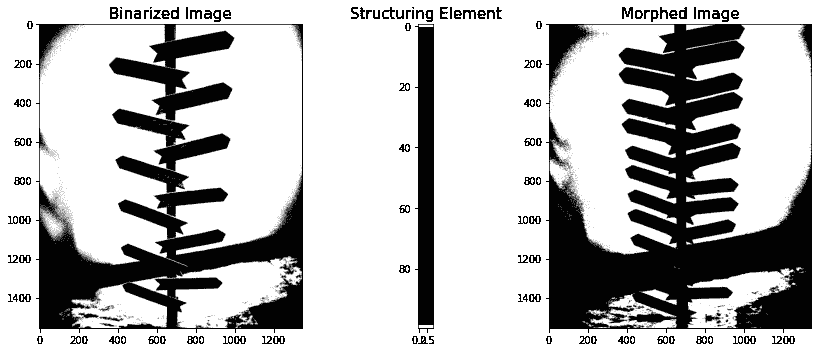

# 使用形态学运算的图像处理

> 原文：<https://pub.towardsai.net/image-processing-using-morphological-operations-f37bf13f26dc?source=collection_archive---------4----------------------->

## [计算机视觉](https://towardsai.net/p/category/computer-vision)，[编程](https://towardsai.net/p/category/programming)

## 变形时间！



(图片由作者提供)

最基本的图像处理技术之一是所谓的形态学运算。

顾名思义，我们使用形态学操作来清理和校正图像。通常，形态学操作是在将图像卷积到特定的核或空间滤波器之后进行的。由于空间滤波的结果是显示不同衰减特征的图像，我们希望它们在整体上是正确的。

有时，过滤后的图像会出现断线，或者可能连接了其他应该连接的要素。这就是我们使用变形的地方。我们再次使用一种结构化元素，并将其与滤波后的图像进行匹配，以便它可以将一个像素与其相邻像素相关联。形态学操作的结果是对于特定问题的应用更精确和更正确的图像。

为了更好地理解这个概念，让我们快速地看一下代码！

让我们从我们的空间过滤器文章中载入一个示例:

```
import numpy as np
from skimage.io import imshow, imread
from skimage.color import rgb2gray
import matplotlib.pyplot as pltsample = imread('stand.png')
imshow(sample);sample_g = rgb2gray(sample)
fig, ax = plt.subplots(1,2,figsize=(10,15))
ax[0].imshow(sample)
ax[1].imshow(sample_g,cmap='gray')
ax[0].set_title('Colored Image',fontsize=20)
ax[1].set_title('Grayscale Image',fontsize=20)
plt.show()
```


图 1:样本图像(作者提供的图像)

要对图像使用不同的形态学操作，首先要对图像进行二值化。

为了对图像进行二值化，我们可以检查一个样本像素行值，并确定一个特定的阈值，我们将在该阈值处设置像素值是 0 还是 1。像素值的样本检查如下:

```
# showing the range of value for a specific y columns
fig, ax = plt.subplots(1,2,figsize=(15,5))ax[0].set_title('Grayscale Image',fontsize=20)
ax[0].imshow(sample_g,cmap='gray')ax[1].plot(sample_g[500])
ax[1].set_ylabel('Pixel Value')
ax[1].set_xlabel('Width of Picture')
ax[1].set_title('Plot of 1 Line',fontsize=20)
plt.tight_layout()
plt.show()
```



图 2:样本像素值(图片由作者提供)

我们可以看到，样本像素绘图线显示大多数像素值高于 0.55，而有像素值明显处于较低的强度。

我们还可以使用整个图像的平均像素值以及像素值的中值。样本和结果如下:

```
from scipy import stats
print('Mean Value of Pixels', sample_g.mean())
print('Median Value of Pixels', np.median(sample_g))
```

像素平均值 0.5642273922521608

像素的中值为 0.61101960784313765

```
med = sample_g.mean()
mea = np.median(sample_g)med1 = sample_g > med
mea1 = sample_g > meafig, ax = plt.subplots(1,3,figsize=(15,5))ax[0].set_title('Grayscale Image',fontsize=20)
ax[0].imshow(sample_g,cmap='gray')
ax[1].imshow(med1,cmap='gray')
ax[1].set_title('Binarized using Mean Value',fontsize=20)
ax[2].imshow(mea1,cmap='gray')
ax[2].set_title('Binarize using Median Value',fontsize=20)
plt.tight_layout()
plt.show()
```



图 3:二值化图像(作者提供的图像)

我们可以看到使用平均值和中值的区别。似乎平均值比中间值更清晰、更明显。

现在，让我们首先将阈值设置为 0.55，并使用该值作为阈值

```
sample_b = sample_g > 0.55fig, ax = plt.subplots(1,2,figsize=(10,5))ax[0].set_title('Grayscale Image',fontsize=20)
ax[0].imshow(sample_g,cmap='gray')
ax[1].imshow(sample_b,cmap='gray')
ax[1].set_title('Binarized Image',fontsize=20)
plt.tight_layout()
plt.show()
```



图 4:使用阈值的二值化图像(图片由作者提供)

现在我们有了一个二值化的图像，我们现在可以执行形态学操作。

在图像处理中广泛使用两种主要的变形操作，它们是:

1.  扩张
2.  侵蚀

每一种对图像都有自己的影响。

## 扩张

在某种意义上，膨胀是图像的最亮像素值被放大或变得更大，而最暗像素值被最小化的操作。

使图像更小化更容易形象化。

让我们看一些例子:

```
from skimage.morphology import erosion, dilation,opening,closing
selem_ver = np.array([[1,1,1,1,1,1,1,1,1,1,1,1,1,1,1,1,1,1,1,1,1,1,1,1,1,1,1,1,1,1,1,1,
                       0,0,0,0,0,0,0,0,0,0,0,0,0,0,0,0,0,0,0,0,0,0,0,0,0,0,0,0,0,0,0,0,0,0,0,0,0,0,0,
                      1,1,1,1,1,1,1,1,1,1,1,1,1,1,1,1,1,1,1,1,1,1,1,1,1,1,1,1,1,1,1,1,1]])sample_ver = dilation(sample_b,selem_hor)fig, ax = plt.subplots(1,3,figsize=(12,5))
ax[0].set_title('Binarized Image',fontsize=15)
ax[0].imshow(sample_b,cmap='gray')
ax[1].imshow(selem_ver,cmap='gray')
ax[1].set_title('Structuring Element',fontsize=15)
ax[2].imshow(sample_ver,cmap='gray')
ax[2].set_title('Morphed Image',fontsize=15)
plt.tight_layout()
plt.show()
```



图 5:使用垂直元素的变形图像(作者图片)

Scikit 库有很棒的膨胀和腐蚀功能，在这里我们可以输入二值化图像和我们选择的结构元素。

我们使用了一个垂直元素，并将其提供给函数，让图像在结构化元素上变形。从结果中，我们可以看到，我们能够提取图像的垂直特征，特别是描绘看台的垂直线。

## 腐蚀

腐蚀与膨胀正好相反，在腐蚀中，我们让图像变大，让较暗的像素值比亮的像素值大得多。

```
from skimage.morphology import erosion, dilation,opening,closing
selem_ver = np.array([[1,1,1,1,1,1,1,1,1,1,1,1,1,1,1,1,1,1,1,1,1,1,1,1,1,1,1,1,1,1,1,1,
                       0,0,0,0,0,0,0,0,0,0,0,0,0,0,0,0,0,0,0,0,0,0,0,0,0,0,0,0,0,0,0,0,0,0,0,0,0,0,0,
                      1,1,1,1,1,1,1,1,1,1,1,1,1,1,1,1,1,1,1,1,1,1,1,1,1,1,1,1,1,1,1,1,1]])sample_ver = erosion(sample_b,selem_hor)fig, ax = plt.subplots(1,3,figsize=(12,5))
ax[0].set_title('Binarized Image',fontsize=15)
ax[0].imshow(sample_b,cmap='gray')
ax[1].imshow(selem_ver,cmap='gray')
ax[1].set_title('Structuring Element',fontsize=15)
ax[2].imshow(sample_ver,cmap='gray')
ax[2].set_title('Morphed Image',fontsize=15)
plt.tight_layout()
plt.show()
```



图 6:侵蚀的图像(作者提供的图像)

正如我们在腐蚀图像的结果上看到的，整个图像被放大了，尤其是中间的支架。值得注意的是，支架变大了，实际上，真正发生的是像素变大了，还覆盖了其他像素。

让我们尝试使用不同的结构元素！

这次是水平元素。

```
selem_hor = np.zeros((100,5))
selem_hor[0:1]=1
selem_hor[-1:]=1
selem_horsample_hor = dilation(sample_b,selem_hor)
```



图 7:使用水平元素的放大图像(作者提供的图像)

通过使用水平元素，我们可以去掉图像中的水平木板，而不去掉图像的垂直特征。

```
selem_hor = np.zeros((100,5))
selem_hor[0:1]=1
selem_hor[-1:]=1
selem_horsample_hor = erosion(sample_b,selem_hor)
```



图 8:使用水平元素的侵蚀图像(作者提供的图像)

腐蚀图像如预期的那样在水平轴方向上尺寸增大。但是可以注意到，与原始图像相比，图像中的木板倍增。

# 摘要

我们能够讨论两种不同的形态学操作，即膨胀和腐蚀。这两种操作广泛用于图像处理，并根据用户的需要用于校正和完成图像。还可以注意到，当清除非常嘈杂的数据时，形态学操作是有用的，并且在衰减图像中的某些特征时也是有用的。

敬请关注接下来的文章！