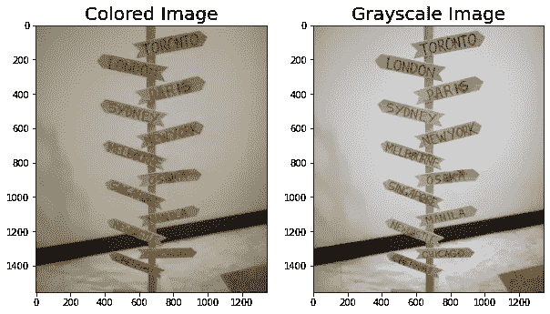
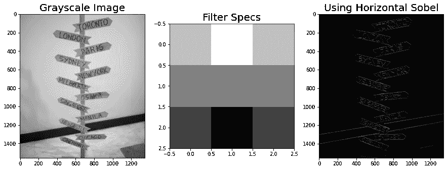
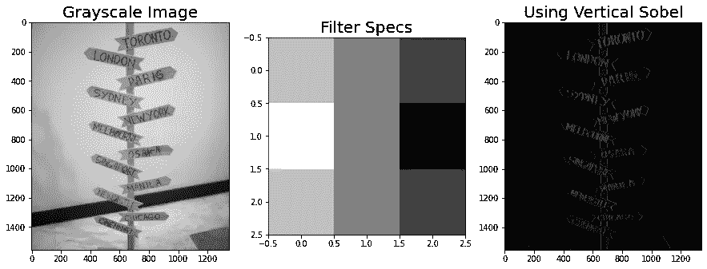
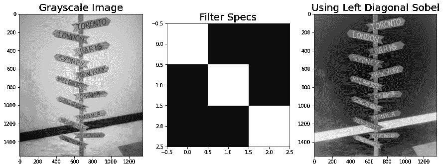
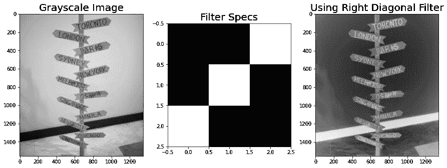
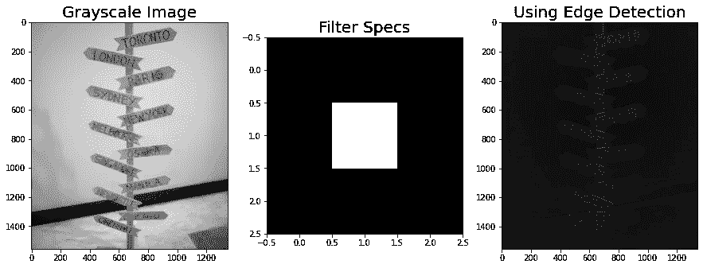
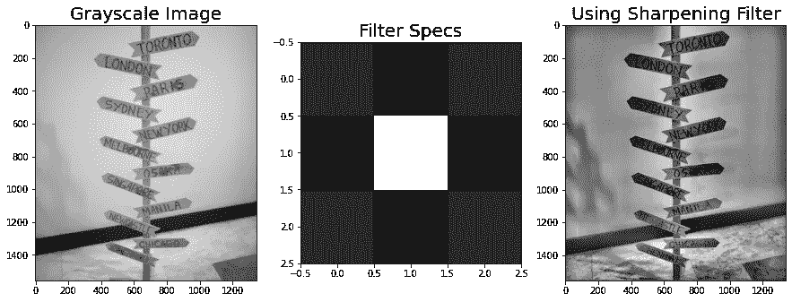
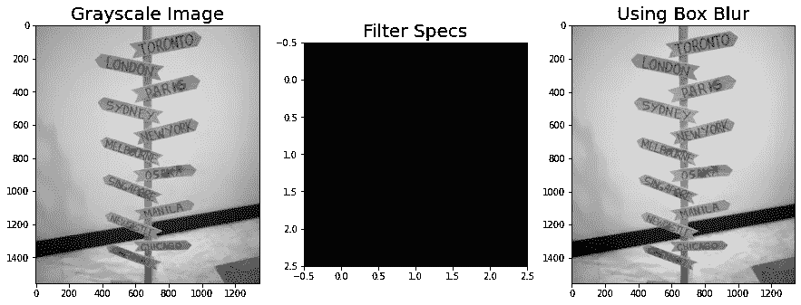
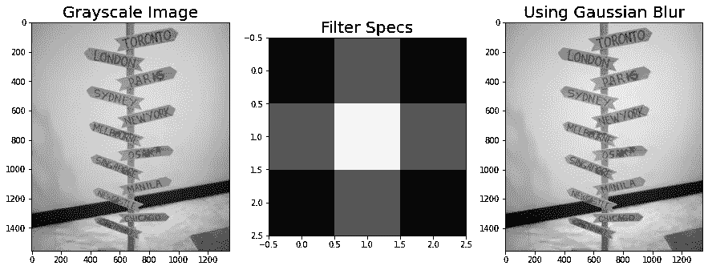

# 使用空间滤波器的图像处理

> 原文：<https://pub.towardsai.net/image-processing-using-spatial-filters-8711e6b8b5ca?source=collection_archive---------3----------------------->

## [计算机视觉](https://towardsai.net/p/category/computer-vision)，[编程](https://towardsai.net/p/category/programming)

## 给予空间...

图像处理的奇迹之一是能够看到每张图像的像素值，并对其执行不同的数学运算。

由于图像已经是一个数组或矩阵，那么我们已经可以执行不同的操作，如乘、加、减和除。

图像处理中最常用的操作之一是卷积，它主要用于对图像进行滤波。

该过程通常源于将图像阵列卷积成用户定义的阵列或矩阵。

这个用户定义的矩阵被称为核，并且通常根据它们所具有的值(尤其是符号方向)而具有不同的效果，

对于本文，我们将尝试不同的空间核，它们可以卷积成一个特定的图像。

让我们加载我们的样本图像！

```
import numpy as np
from skimage.io import imshow, imread
import matplotlib.pyplot as pltmple = imread('stand.png')
imshow(sample); 
```



(图片由作者提供)

使用不同的过滤器:

**横索贝尔**

```
import matplotlib.pyplot as plt
from scipy.signal import convolve2d
import numpy as npsample_g = rgb2gray(sample)
#defining the kernels/filter
# Horizontal Sobel Filter
kernel1 = np.array([[1, 2, 1],
                    [0, 0, 0],
                    [-1, -2, -1]])conv1 = convolve2d(sample_g, kernel1, 'valid')
fig, ax = plt.subplots(1,3,figsize=(15,10))
ax[0].imshow(sample_g,cmap='gray')
ax[1].imshow(kernel1,cmap='gray')
ax[2].imshow(abs(conv1),cmap='gray')ax[0].set_title('Grayscale Image',fontsize=20)
ax[1].set_title('Filter Specs',fontsize=20)
ax[2].set_title('Using Horizontal Sobel',fontsize=20)
plt.show()
```

将一个单独的数组卷积到另一个数组的一般步骤是使图像在灰度维度上。我们可以使用 **scipy** 库中的一个可用函数来卷积一个特定的图像。以下其他过滤器的代码遵循一些原则，唯一改变的是数组整数的值，这可以通过过滤器规格图来描述。



(图片由作者提供)

结果表明，水平 Sobel 滤波器能够衰减图像中的水平特征和水平线。

**使用垂直索贝尔**



(图片由作者提供)

实验的垂直 Sobel 能够衰减图像的垂直特征，对于这个例子，如果我们将其与水平 Sobel 增强的结果进行比较，我们可以更清楚地看到看台的垂直线。

**使用左对角线滤镜**



(图片由作者提供)

在某种意义上，对角线滤波器与垂直和水平 Sobel 滤波器相同，但更多地衰减了图像的对角线特征。

**使用右对角线滤镜**



(图片由作者提供)

我们还尝试对左对角矩阵(即右对角矩阵)求逆，并发现了一个有趣的现象，结果显示使用左或右对角滤波器没有区别。

**使用边缘检测滤波器**



(图片由作者提供)

顾名思义，边缘检测过滤器是一个可以衰减图像边缘的阵列，从结果来看，我们能够清楚地显示木制支架的边缘。

**使用锐化滤镜**



(图片由作者提供)

锐化总是在许多照片编辑中使用，其背后的数学是将图像卷积到预定义的数组中，在该数组中，我们可以通过将负值放入交叉段来衰减中心。

**使用方框模糊滤镜**



(图片由作者提供)

模糊是细分已定义数组的像素值的行为。从结果来看，我们可能认为图像没有模糊，但实际上，模糊了一小部分。

**使用高斯模糊滤镜**



(图片由作者提供)

高斯模糊滤镜的工作方式与方框模糊相同，但模糊效果更好

# 摘要

总之，我们能够显示不同的空间过滤器，我们可以使用的图像。通常这些过滤器已经内置在许多照片编辑软件中，但其背后的理论是，所有的过滤器都源于基本的线性代数函数。

敬请期待下一篇文章！