# 用 Scikit-image 实现旋转 iPhone 的图像分割

> 原文：<https://pub.towardsai.net/image-segmentation-of-rotating-iphone-with-scikit-image-3e27e5fad7a8?source=collection_archive---------4----------------------->

现代设备充满了不同的传感器:前后摄像头、加速度计、陀螺仪、磁力计、GPS 等。智能使用这些设备可以实现大量有趣的应用，如指南针、位置检测和游戏。

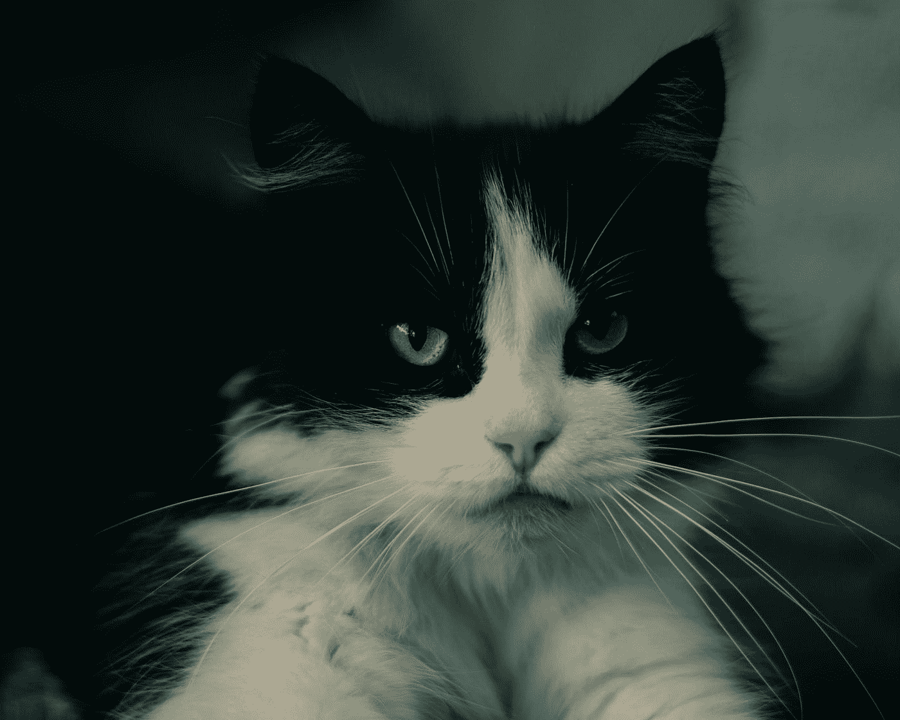

尼基塔·维诺格拉多夫在 [Unsplash](https://unsplash.com?utm_source=medium&utm_medium=referral) 上拍摄的照片。试着把这只猫从背景中分割出来:)

其中一个应用是检测 iPhone 在太空中的方位，这可以通过加速度计和陀螺仪的数据来完成。在[之前的博文](https://towardsdatascience.com/sensor-fusion-explained-with-rotating-iphone-fecbcd0df144)中，我写了利用 iPhone 的两个传感器:陀螺仪和加速度计的数据来检测 iPhone 绕一个轴的方向。iPhone 方位的重建与视频进行了对比。使用传感器重建的方向结果与视频中描述的方向定性匹配良好:

*作者图片*

在这篇博文中，我介绍了利用图像分割从视频中提取 iPhone 倾斜角度的方法。然后，我展示了两种测量方法之间的误差比较。让我引导你通过。

## 视频准备

在开始分段之前，需要做一些准备工作。我的视频是用 iPhone 录制的，帧率是可变的。为了使视频时钟与传感器时钟同步，恒定的帧速率是优选的。因此，第一步是将视频转换为恒定的帧速率。下一步是将视频分割成图像，每一帧对应一个 jpeg 图像。整个图像数据集可以在[这里](https://rotatingiphone.s3.eu-central-1.amazonaws.com/video_red.zip)找到。

## 基于 Mask-R-CNN 的深度学习方法

当我们谈论图像的分割时，尝试一些很酷的深度学习算法并希望它能起作用是一种很大的诱惑。循着这种诱惑，我尝试了预先训练好的 Mask-RCNN。幸运的是，手机是最初模型被训练的课程之一。第一个结果相当令人印象深刻，如下图所示:

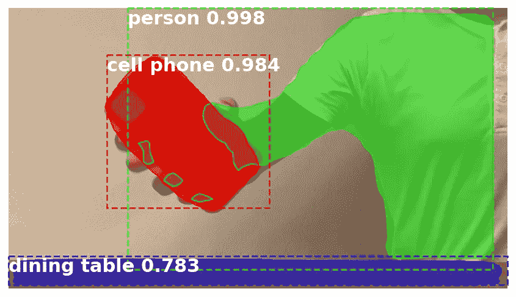

*作者图片*

然而，经过更仔细的调查，似乎 iPhone 的一些图像被错误地识别了(见下图):

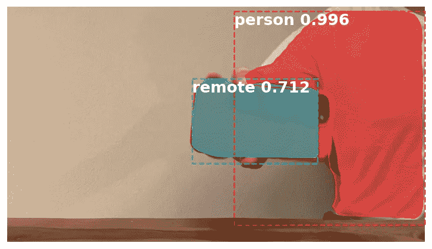

*作者图片*

就像许多现实生活中的数据科学项目一样，深度学习模型的结果出人意料地好，但并没有完全达到预期。至少不是对整个数据集。克服这一挑战的一个选择是标记数据并微调原始模型。然而，鉴于这是一部几乎白色背景的红色 iPhone，应该有一些更简单的方法。让我们看看它们。

**使用 RGB 图像的经典 CV 方法**

为了分割图像，我们首先尝试使用图像的三通道 RGB 表示，即红色、绿色和蓝色。红色对应于第一个非常高的数字，而第二个和第三个数字应该很低，有点像(255，0，0)。在这种情况下，我们可以选择所有红色像素，并希望它是 iPhone。为了捕捉更多的红色阴影，我试图过滤掉第一个通道(红色)的颜色值大于 130 的所有像素。对于第二和第三通道，我过滤低于 60 的像素。这是代码。

这种方法产生了相当好的结果:

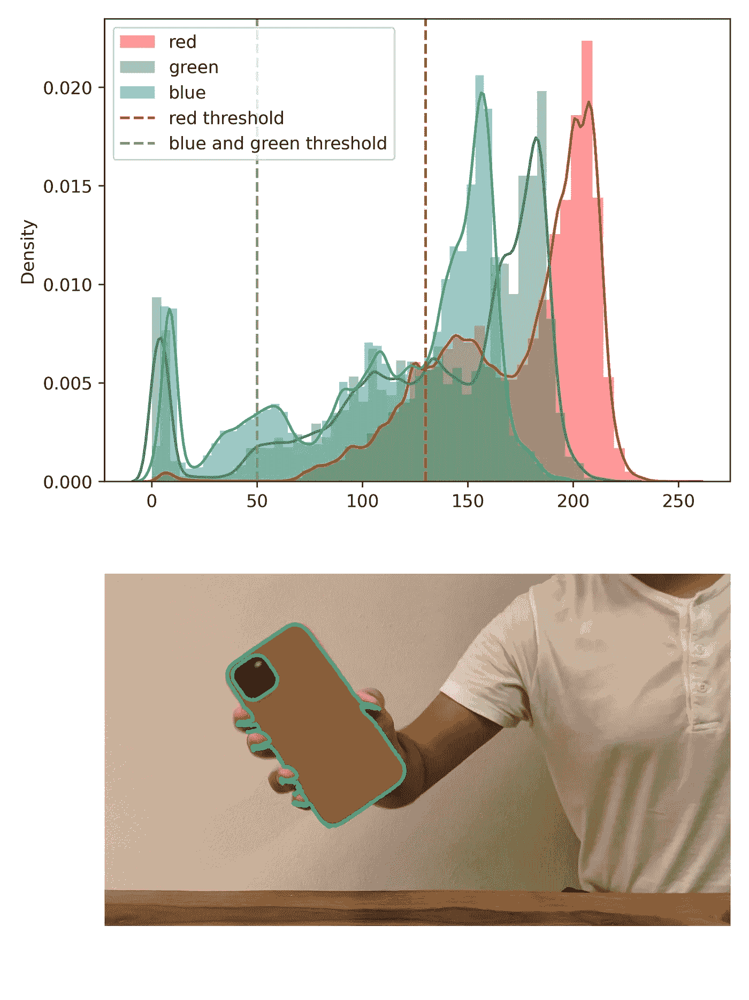

*作者图片*

iPhone 上还有一个摄像头“洞”，是黑色的，因此没有分段。我们可以用 scikit-image 工具来填补这个漏洞:

人们必须设置要填充的洞的面积和要过滤掉的小物体。我选择 40000 作为面积。现在，细分确实包括了 iPhone 的摄像头:

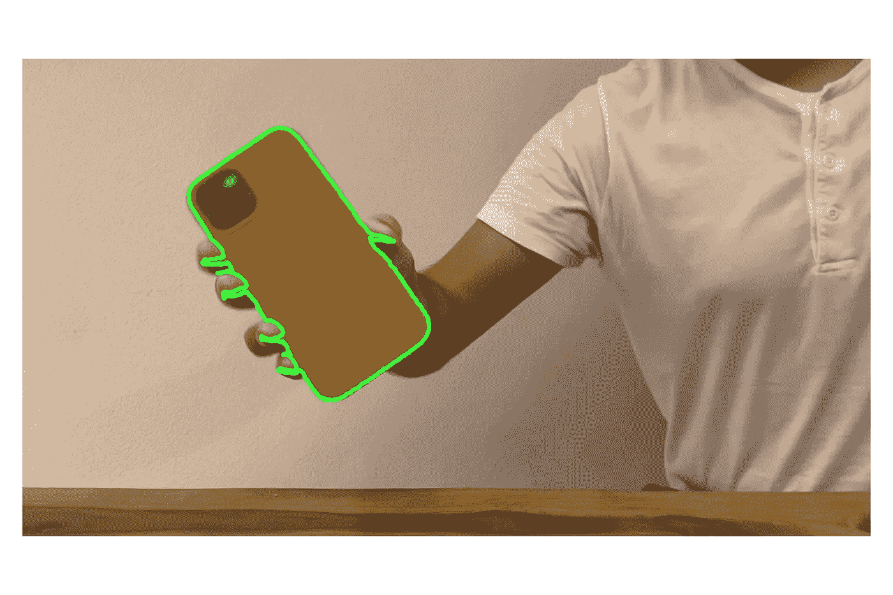

*作者图片*

因此，基于 RGB 表示的红色的分割在一幅图像上工作良好。然而，在对所有图像运行这种基于阈值的算法后，我发现有一些分割不准确:

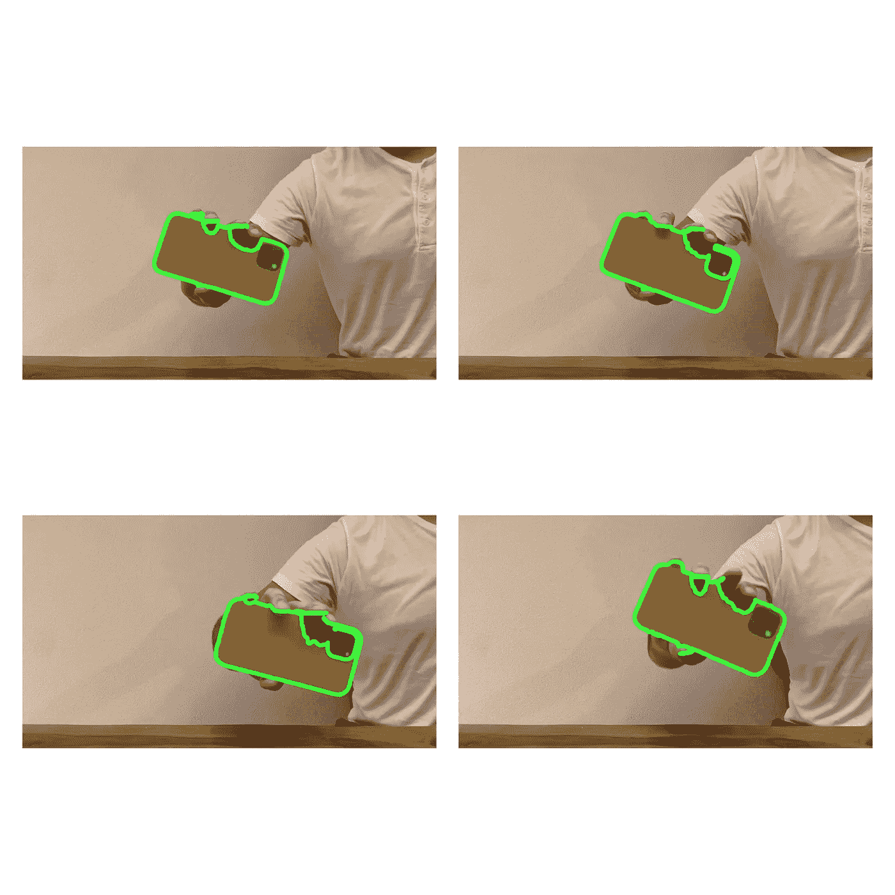

*作者图片*

这些不准确性可以通过操纵红色、绿色和蓝色的阈值来解决。但是，如果我们放松参数，蒙版开始捕捉棕色:

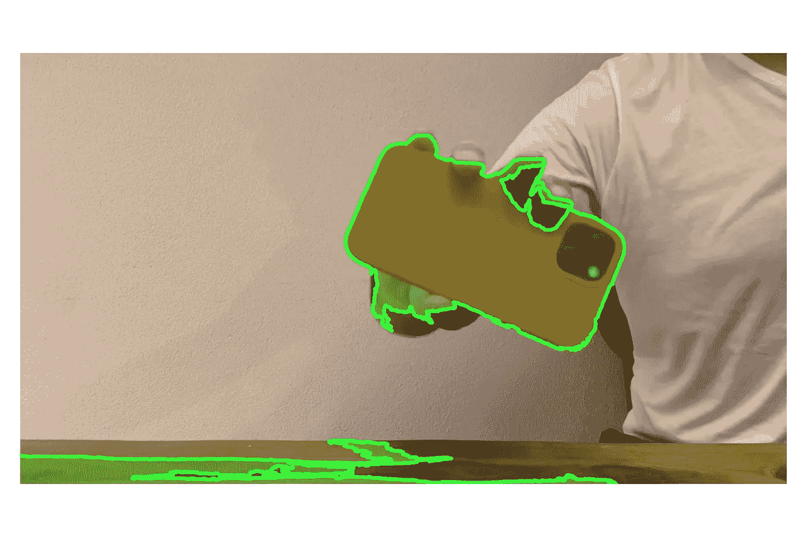

*作者图片*

仍然可以在 RGB 中使用阈值。但是，至少有三个参数需要优化(红色、绿色和蓝色的阈值)。更简单的方法是将其减少到只有一个可调参数。为此，我们可以考虑用不同的颜色表示 iPhone 图像。

**使用 HED 图像的经典 CV 方法**

在 scikit-image 库中，有几种从 RGB 到不同颜色表示的转换。我在处理旋转的 iPhones 图片时遇到的一个挑战是如何区分暗红色和棕色。这种颜色分离在苏木精-曙红-DAB (HED)颜色空间中得到了很好的解决，其中苏木精为深蓝色-紫色，曙红为粉红色，DAB 为棕色。红色 iPhone 通过这种颜色表示的曙红通道可以很好地检测到，这解决了将其与棕色混淆的问题，因为棕色显示为 DAB。在 HED 表示中，我们在曙红通道中只有一个阈值需要调整。基于曙红通道和阈值 0.05，对 RGB 具有挑战性的图像的遮罩被正确捕获。

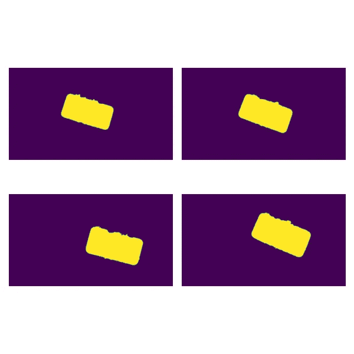

*作者图片*

Scikit-image 还提供了测量分割区域属性的工具。在其他属性中，可以测量 iPhone 的方向:

完整的分割算法将导致:

定性比较将导致:

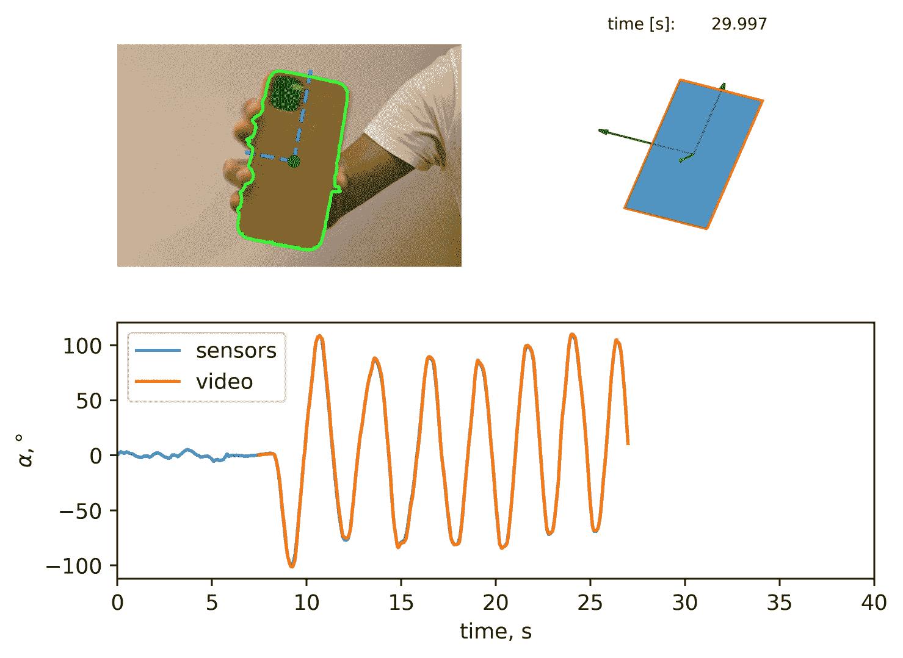

*作者图片*

**定量比较**

现在可以将从分割中得到的倾斜角与从传感器数据中得到的倾斜角进行比较。它给出了一个很好的匹配:

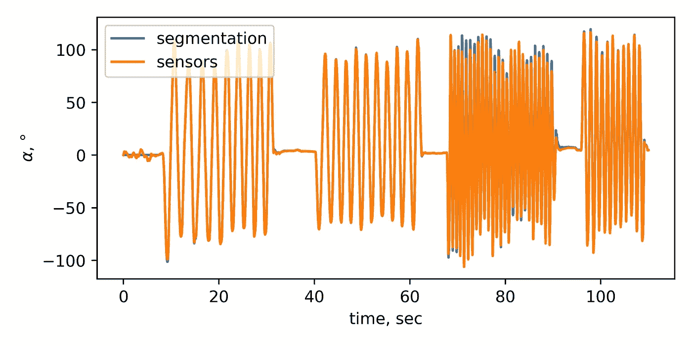

*作者图片*

传感器和视频插值之间的绝对误差为:

*作者图片*

我们可以看到，旋转越快，两种方法之间的误差越大。这也可以在前面 0.5 秒的旋转速度的滚动平均值对误差的曲线图上看到:

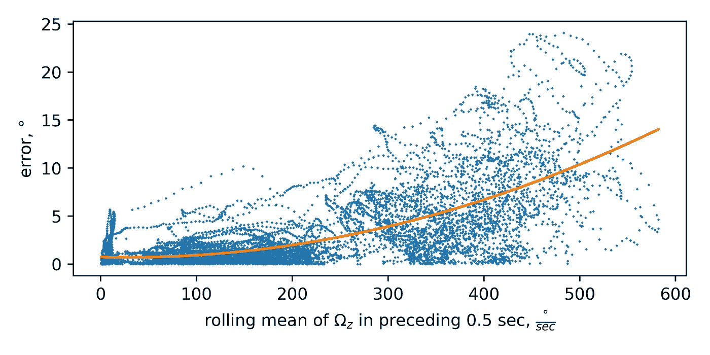

*作者图片*

附注:我要感谢我的妻子卡佳和弗拉季斯拉夫·罗索夫对邮报的帮助。