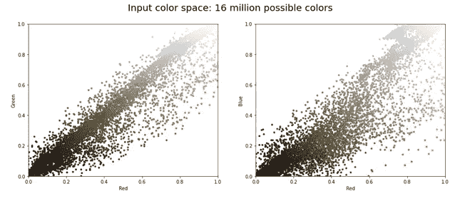
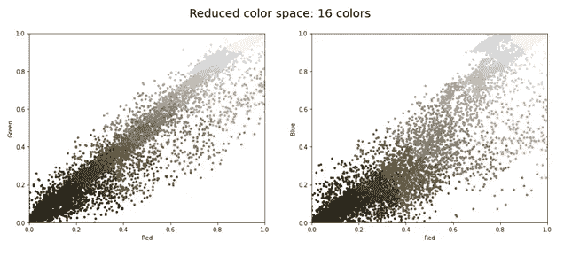
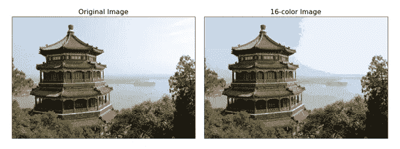
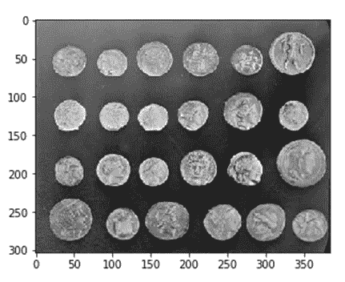
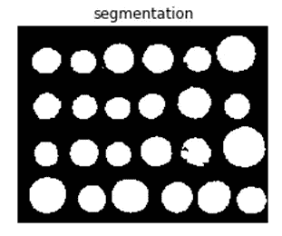

# 基于 K-means 的图像分割和基于 Python 的分水岭算法

> 原文：<https://pub.towardsai.net/image-segmentation-with-k-means-and-watershed-algorithm-with-python-5a051287ec07?source=collection_archive---------0----------------------->

## [人工智能](https://towardsai.net/p/category/artificial-intelligence)

## 图像处理中的对象分割


照片由[达留什·桑科夫斯基](https://unsplash.com/@dariuszsankowski?utm_source=medium&utm_medium=referral)在 [Unsplash](https://unsplash.com?utm_source=medium&utm_medium=referral) 上拍摄

## **图像分割**

在图像处理和计算机视觉领域，图像分割是将图像分割成多个片段(也称为图像对象)的过程。分割图像的主要目标是在单独分析分割的片段后提取有意义的信息，如定位对象和创建图像的边界。

由于图像是一组像素，在图像分割中，具有相似属性/特性的像素被分组以形成段，然后人们可以根据需要执行操作。

## **应用**

1.  没有涉及分割概念的物体检测，自动驾驶是不可能的。
2.  用于医疗保健行业，有助于相应地分割癌细胞和肿瘤以及其他疾病的严重程度。
3.  解决商业问题。

## **聚类算法**

聚类算法是无监督的机器学习算法，这意味着没有可用的标记数据。

换句话说，我们可以说我们没有预定义的一组特性、类或组。聚类算法帮助我们从数据/图像中获取隐藏的信息，比如我们的数据具有什么样的结构、聚类和分组。

聚类算法帮助我们将图像分割成具有相似属性的像素簇或组。基于这些聚类属性，数据元素/点被分成聚类，使得同一个聚类中的元素与其他聚类元素相比彼此更相似。

聚类算法如 k-means、改进的 k-means、模糊 c-means 和改进的模糊 c-means 算法正被广泛应用于聚类中。

> ***K-means 聚类***

K-means 聚类是最常用的聚类算法。在 k-means 聚类中， **k** 表示聚类的个数。

## **K-means 聚类工作步骤**

1.  你想要找到多少个集群，用 k 表示。
2.  将数据点随机分配给 k 个聚类中的任何一个。
3.  找出集群的中心。
4.  找出数据点与每个聚类中心的距离，即计算欧几里德距离。
5.  根据每个数据点离聚类的距离，再次将数据点分配给最近的聚类。
6.  再次找出新的聚类中心。
7.  重复步骤 4、5 和 6，直到数据点不改变聚类或达到指定的数目。

## **聚类的应用**

*   在市场调查中
*   数据分析
*   模式识别

## **聚类代码**

```
from skimage.io import imread
from skimage.color import rgb2grayimport numpy as np
import matplotlib.pyplot as plt%matplotlib inlinefrom scipy import ndimage
from sklearn.datasets import load_sample_imagechina = load_sample_image(“china.jpg”)ax = plt.axes(xticks=[], yticks=[])
ax.imshow(china);
```

#图像存储在一个 3d 数组中，其大小为高度、宽度、RGB，并包含从 0 到 255 的整数形式的 RGB 成分:

```
china.shape#output:
(427, 640, 3)
```


作者图片

#查看这组像素的一种方法是将其视为三维颜色空间中的点云。我们将数据整形为[n_samples x n_features]，并重新调整颜色，使其介于 0 和 1 之间。

```
data = (china )/ 255.0data = data.reshape(427 * 640, 3)data.shape#output:
(273280, 3)
```

#我们可以在这个颜色空间中可视化这些像素，使用 10，000 个像素的子集来提高效率:

```
def plot_pixels(data, title, colors=None, N=10000):
    if colors is None:
    colors = data

    # choose a random subset
    rng = np.random.RandomState(0)
    i = rng.permutation(data.shape[0])[:N] colors = colors[i]
    R, G, B = data[i].T fig, ax = plt.subplots(1, 2, figsize=(16, 6)) ax[0].scatter(R, G, color=colors, marker=’.’)
    ax[0].set(xlabel=’Red’,ylabel=’Green’,xlim=(0, 1),ylim=(0, 1))
    ax[1].scatter(R, B, color=colors, marker=’.’)
    ax[1].set(xlabel=’Red’, ylabel=’Blue’, xlim=(0, 1), ylim=(0, 1)) fig.suptitle(title, size=20);plot_pixels(data, title=’Input color space: 16 million possible colors’)
```



作者图片

#现在，我们将这 1600 万种颜色减少到只有 16 种颜色，使用跨像素空间的 k-means 聚类，因为我们正在处理一个非常大的数据集，并使用小批量 k-means，当对数据子集进行操作时，它比标准 k-means 给出更快的结果。

```
import warnings; warnings.simplefilter(‘ignore’) # Fix NumPy issues.from sklearn.cluster import MiniBatchKMeanskmeans = MiniBatchKMeans(16)kmeans.fit(data)new_colors = kmeans.cluster_centers_[kmeans.predict(data)]plot_pixels(data, colors=new_colors,title=”Reduced color space: 16
                                                           colors”)
```



作者图片

#我们在这一步的结果是原始像素的重新着色，其中每个像素被分配了其最近的聚类中心的颜色。在图像空间中绘制这些新颜色向我们展示了这样的效果:

```
china_recolored = new_colors.reshape(china.shape)fig, ax = plt.subplots(1, 2, figsize=(16, 6),
                         subplot_kw=dict(xticks=[], yticks=[]))fig.subplots_adjust(wspace=0.05)ax[0].imshow(china)
ax[0].set_title(‘Original Image’, size=16)
ax[1].imshow(china_recolored)
ax[1].set_title(‘16-color Image’, size=16);
```



作者图片

#最右边的图像丢失了一点点细节，但整体图像仍然很容易辨认。右侧图像实现了大约一百万的压缩因子，虽然这是 k-means 的一个有趣的应用，但肯定有更好的方法来压缩图像中的信息。但是我们的例子显示了用 k-means 这样的无监督技术跳出框框思考。

[](/pre-processing-techniques-in-image-processing-with-python-81e5c8babf09) [## Python 图像处理中的预处理技术

### OpenCV 下的图像处理技术

pub.towardsai.net](/pre-processing-techniques-in-image-processing-with-python-81e5c8babf09) [](/part-ii-pre-processing-techniques-in-image-processing-with-python-17fb628453ff) [## 第二部分 Python 图像处理中的预处理技术

### OpenCV 下的图像处理技术

pub.towardsai.net](/part-ii-pre-processing-techniques-in-image-processing-with-python-17fb628453ff) 

> ***分水岭分割***

分水岭是用于分割的主要算法，用于分离图像中相似/不同的对象。它从用户定义的标记开始，分水岭算法将像素值视为局部地形或高程。

图像处理中的分水岭是在灰度图像上定义的变换。在地形的帮助下，它处理代表其高度的每个点的亮度，并找到沿山脊顶部延伸的线条。

## **一些应用分水岭分割**

*   机器学习视觉。
*   交通控制系统
*   基于内容的图像检索。
*   目标检测
*   医学成像
*   识别任务

## **分水岭分割的工作是一个两步过程**

*   首先找出标记，然后用分割准则分割区域。
*   执行标记控制的分水岭

## **代码**

#在这段代码的帮助下，我们将能够看到如何从背景中分割对象。我们使用硬币的图像，它显示了来自 skimage.data 的许多硬币轮廓和较暗的背景。

```
import numpy as np
import matplotlib.pyplot as pltfrom skimage import datacoins = data.coins()
hist = np.histogram(coins, bins=np.arange(0, 256))
fig, (ax1) = plt.subplots()
ax1.imshow(coins, cmap=plt.cm.gray, interpolation=’nearest’)
```



图像[来源](https://scikit-image.org/docs/0.12.x/auto_examples/xx_applications/plot_coins_segmentation.html)

#现在，我们可以借助灰度值直方图的极端部分找到背景和硬币的标记。

```
markers = np.zeros_like(coins)
markers[coins < 30] = 1
markers[coins > 150] = 2fig, ax = plt.subplots(figsize=(4, 3))
ax.imshow(markers, cmap=plt.cm.gray, interpolation=’nearest’)
ax.axis(‘off’)
ax.set_title(‘markers’)
```

在这里的代码中，我们使用 np **。**返回给定类型和形状的新数组的零，

```
#filled with zerosText(0.5, 1.0, ‘markers’)
```


图片[来源](https://scikit-image.org/docs/0.12.x/auto_examples/xx_applications/plot_coins_segmentation.html)

在这一步，我们使用分水岭变换来填充高程图的区域。

```
segmentation = morphology.watershed(elevation_map, markers)fig, ax = plt.subplots(figsize=(4, 3))
ax.imshow(segmentation, cmap=plt.cm.gray, interpolation=’nearest’)
ax.axis(‘off’)
ax.set_title(‘segmentation’)
```

这里我们使用形态学，这是一种基于图像形状处理图像的图像处理操作。这些操作将结构化元素应用于输入图像，并且生成相同大小的输出图像。



图像[来源](https://scikit-image.org/docs/0.12.x/auto_examples/xx_applications/plot_coins_segmentation.html)

```
from skimage.color import label2rgbsegmentation = ndi.binary_fill_holes(segmentation — 1)
labeled_coins, _ = ndi.label(segmentation)image_label_overlay = label2rgb(labeled_coins, image=coins)fig, (ax1, ax2) = plt.subplots(1, 2, figsize=(6, 3), sharex=True, sharey=True)ax1.imshow(coins, cmap=plt.cm.gray, interpolation=’nearest’)
ax1.contour(segmentation, [0.5], linewidths=1.2, colors=’y’)
ax1.axis(‘off’)
ax1.set_adjustable(‘box’)
ax2.imshow(image_label_overlay, interpolation=’nearest’)
ax2.axis(‘off’)
ax2.set_adjustable(‘box’)
fig.subplots_adjust(**margins)
plt.show()
```


图片[来源](https://scikit-image.org/docs/0.12.x/auto_examples/xx_applications/plot_coins_segmentation.html)

## **结论**

本文介绍了两种重要的分割技术，基于聚类的分割技术和基于分水岭的分割技术。

我希望你喜欢这篇文章。

我希望你喜欢这篇文章。通过我的 [LinkedIn](https://www.linkedin.com/in/data-scientist-95040a1ab/) 和 [twitter](https://twitter.com/amitprius) 联系我。

## 推荐文章

*   [NLP —用 Python 从零到英雄](https://medium.com/towards-artificial-intelligence/nlp-zero-to-hero-with-python-2df6fcebff6e?sk=2231d868766e96b13d1e9d7db6064df1)
*   [Python 数据结构数据类型和对象](https://medium.com/towards-artificial-intelligence/python-data-structures-data-types-and-objects-244d0a86c3cf?sk=42f4b462499f3fc3a160b21e2c94dba6)
*   [Python 中的异常处理概念](/exception-handling-concepts-in-python-4d5116decac3?source=friends_link&sk=a0ed49d9fdeaa67925eac34ecb55ea30)
*   [为什么 LSTM 在深度学习方面比 RNN 更有用？](/deep-learning-88e218b74a14?source=friends_link&sk=540bf9088d31859d50dbddab7524ba35)
*   [神经网络:递归神经网络的兴起](/neural-networks-the-rise-of-recurrent-neural-networks-df740252da88?source=friends_link&sk=6844935e3de14e478ce00f0b22e419eb)
*   [用 Python 全面讲解线性回归](https://medium.com/towards-artificial-intelligence/fully-explained-linear-regression-with-python-fe2b313f32f3?source=friends_link&sk=53c91a2a51347ec2d93f8222c0e06402)
*   [用 Python 全面讲解逻辑回归](https://medium.com/towards-artificial-intelligence/fully-explained-logistic-regression-with-python-f4a16413ddcd?source=friends_link&sk=528181f15a44e48ea38fdd9579241a78)
*   [Python 中 concat()、merge()和 join()的区别](/differences-between-concat-merge-and-join-with-python-1a6541abc08d?source=friends_link&sk=3b37b694fb90db16275059ea752fc16a)
*   [与 Python 的数据争论—第 1 部分](/data-wrangling-with-python-part-1-969e3cc81d69?source=friends_link&sk=9c3649cf20f31a5c9ead51c50c89ba0b)
*   [机器学习中的混淆矩阵](https://medium.com/analytics-vidhya/confusion-matrix-in-machine-learning-91b6e2b3f9af?source=friends_link&sk=11c6531da0bab7b504d518d02746d4cc)