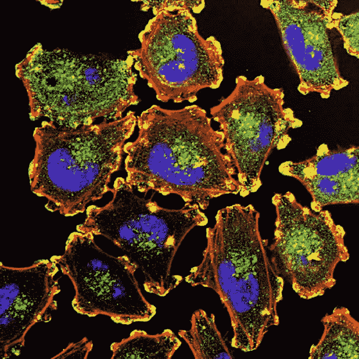
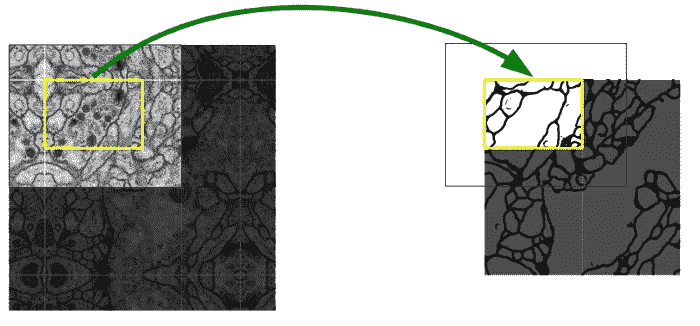
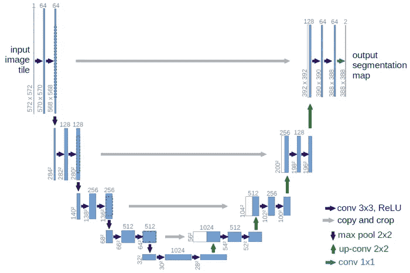
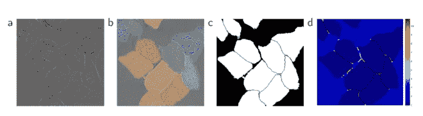
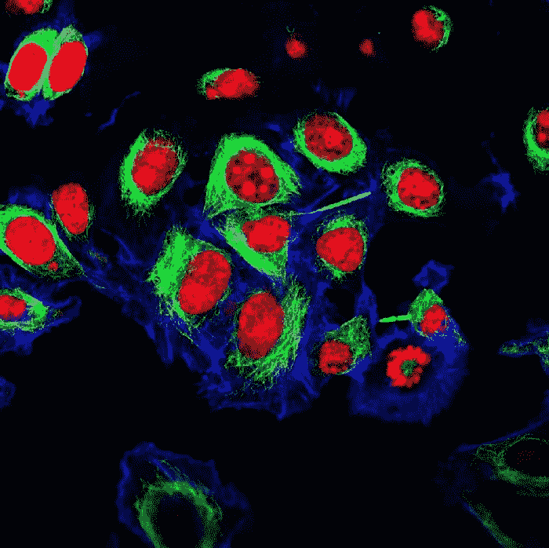

# 基于 U-网的图像分割

> 原文：<https://pub.towardsai.net/image-segmentation-with-u-net-da8cc1cbeaeb?source=collection_archive---------3----------------------->

循序渐进的深度学习..

图一。国家癌症研究所在 Unsplash 上拍摄的照片

当谈到计算机视觉的深度学习方法时，毫无疑问，卷积神经网络和预训练的卷积神经网络最先出现。卷积神经网络是一种处理视觉数据的人工神经网络。 ***CNN(卷积神经网络)*** 将图像的高度、宽度和图像通道作为输入馈入神经网络。我在这篇文章中提到 CNN 网络的最大原因是 U-Net 网络中要使用的层来自 CNN 网络中已有的层。

📺你可以[访问我为 Mask R-CNN 创建的 YouTube 内容](https://www.youtube.com/watch?v=9ZNtavU1asE&t=1043s)，Mask R-CNN 是一种从 CNN 神经网络衍生出来的特殊类型的人工神经网络。

*   Mask R-CNN 是一种用于图像分割的神经网络。正如我在视频中的内容中提到的，分割过程是通过从图像中的背景中减去前景对象来找到的。这样，通过将对象从背景中分离来分配类别标签。

🗺我将在整篇文章中谈论和讨论的️The 学术论文将是[***“u-net:用于生物医学图像分割的卷积网络”***](https://arxiv.org/pdf/1505.04597.pdf) 。

*   U-Net 是一个致力于图像分割的骨干网络。它主要是在生物医学图像上进行研究，但它也是一个与其他图像数据一起工作的可能网络。

🎢如果你想了解卷积神经网络的基础知识，你可以阅读我的名为 [***用 RCNN 进行物体识别的文章，YOLO-OpenCV***](https://medium.com/operations-management-t%C3%BCrkiye/rcnn-yolo-opencv-ile-nesne-tan%C4%B1ma-fa3856e69fb3)***。***

💡你可以在这里访问 U-Net 网络的源代码和模型的集体档案。

卷积网络的典型应用是在分类任务中，其中图像的输出是单个类别标签。但是在很多视觉任务中，尤其是生物医学图像处理中，期望的输出必须包含定位， ***即必须给每个像素分配一个类标签。*** 还有，成千上万的训练图像在生物医学任务中往往是无法访问的。

因此， [**Ciresan 等人**](https://www.semanticscholar.org/paper/Deep-Neural-Networks-Segment-Neuronal-Membranes-in-Ciresan-Giusti/09193e19b59fc8f05bee9d6efbfb1607ca5b6501) 在浮动窗口设置中训练网络，通过提供像素周围的局部补丁作为输入来预测每个像素的类别标签。

🌿根据文章中的信息，提到了 Ciresan 等人的两个缺点:

1.  类别标签估计相当慢且麻烦。
2.  本地化、正确性和上下文使用之间存在权衡。较大的补丁需要更多层的最大池，这降低了定位精度，而较小的补丁只允许网络看到非常少的上下文。

图二。随机大图像无缝分割的重叠平铺策略

图 2 中的图像显示了 [EM](http://www.sci.utah.edu/~tolga/ResearchWebPages/em-segmentation.html) 图像堆栈中神经元结构的分割。黄色区域中的分割估计需要蓝色区域中的图像数据作为输入。缺失的输入数据通过反射来估计。

🔬**注:** EM 是取英文单词 ***【电子显微镜】*** 的首字母创造的。**电子显微镜(EM)** 图像中单个神经元细胞的精确分割对于定量连通性研究至关重要。神经组织的电子显微镜图像由于其特性通常难以分割。

🔜当作为网络操作的结果到达最后一层时，在输出中有一个 512*512 掩码表示要学习的掩码。sigmoid 激活函数确保掩模像素在[0，1]的范围内。

**网络架构**

图 3。U-Net 分段流架构

✅You 可以在图 3 中看到 U-net 架构。从图中可以看出，当架构中的各层走到一起时，它会让人联想到字母 U，因此得名。每个蓝框对应一个多通道特征图。盒子的顶部标明了频道的数量。X-Y 尺寸显示在框的左下角。白色方框表示复制的要素地图。箭头表示不同的过程。

🛸To 谈论图 3 中的工作流，该架构由收缩路径(左)和宽路径(扩展路径-右)组成。收缩路径遵循卷积网络的典型架构。它由两个 3×3 卷积(未填充的卷积)的重复应用组成，每个卷积之后是一个整流线性单元(ReLU)和一个 2×2 最大池化过程，其中步骤 2 用于下采样。*在每个子采样步骤，特征通道的数量加倍。*

🚵扩展路径中的‍♂️Each 步骤包括特征图的上采样，随后是将特征通道的数量减半的 2×2 卷积(“上卷积”)，与从收缩路径适当剪切的特征图的合并，以及两个 3×3。由于边界像素的丢失，每个卷曲都需要剪裁。

✂️In 最后一层，1x1 卷积用于将每个 64 分量的特征向量映射到期望数量的类别。网络总共有 23 个卷积层。要实现输出分割图的无缝分块，选择输入分块大小以执行所有最大 2x2 池操作非常重要。

图 4。用 DIC 显微镜记录玻璃上的 HeLa 细胞

🔎文章中提到的另一张图片如图 4 所示。当我们看这些图像时，即使是草图，我们也知道它们是显微图像，这是由于它们的一般结构。你可以在图 5 中看到细胞的真实图像。

图 5。希拉·塞尔斯(1951 年)

🧫HeLa 是科学研究中最古老和应用最广泛的人类细胞系。这种细胞的名字来源于取自海里埃塔·拉克丝的宫颈癌细胞，她是一位 31 岁的非洲裔美国人，有五个孩子，于 1951 年 2 月 8 日，1951 年 10 月 4 日死于癌症。

🦠:我想在不偏离主题的情况下解释一下图 4 中的视觉效果 a、b、c 和 d。

4.a .细胞的原始图像
4.b .与地面实况分割重叠。
▪️不同的颜色表示不同样品的 HeLa 细胞。
4.c .生成的分割蒙版(白色:前景，黑色:背景)。
4.d. Map(热图)用逐像素的失重来强制网络学习边界像素。

🔔**在我的下一篇文章中，我将展示 U-Net 网络是如何在 Python 编程语言中运行和分段的。向感兴趣的人宣布。**

🎉更多内容可以关注我 [*GitHub*](https://github.com/BuseYaren) ， [*YouTube*](https://www.youtube.com/channel/UCzAODG3wgdKtRov8VvyXvtw) 和 [*Twitter*](https://twitter.com/BuseYarenTekin) 。

# 参考

*   U-Net:用于生物医学图像分割的卷积网络，[https://arxiv.org/pdf/1505.04597.pdf](https://arxiv.org/pdf/1505.04597.pdf)
*   实施深度学习框架——Unet，使用 Keras，[https://github.com/zhixuhao/unet](https://github.com/zhixuhao/unet)
*   Ciresan，D.C .，Gambardella，L.M .，Giusti，a .，Schmidhuber，j .:深度神经网络在电子显微镜图像中分割神经元膜。英寸:NIPS。第 2852 至 2860 页(2012 年)
*   电镜分割，[http://www . sci . Utah . edu/~ tolga/research 网页/em-segmentation.html](http://www.sci.utah.edu/~tolga/ResearchWebPages/em-segmentation.html)
*   维基百科，海拉塞尔斯，【https://www.immunology.org/hela-cells-1951 