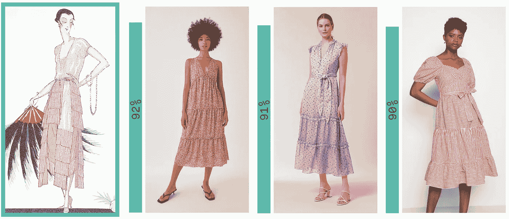
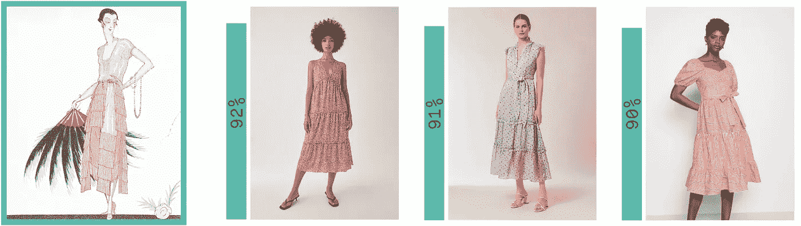
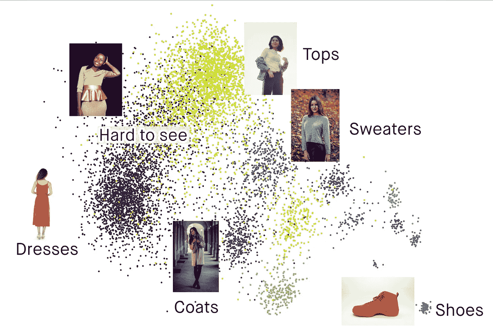
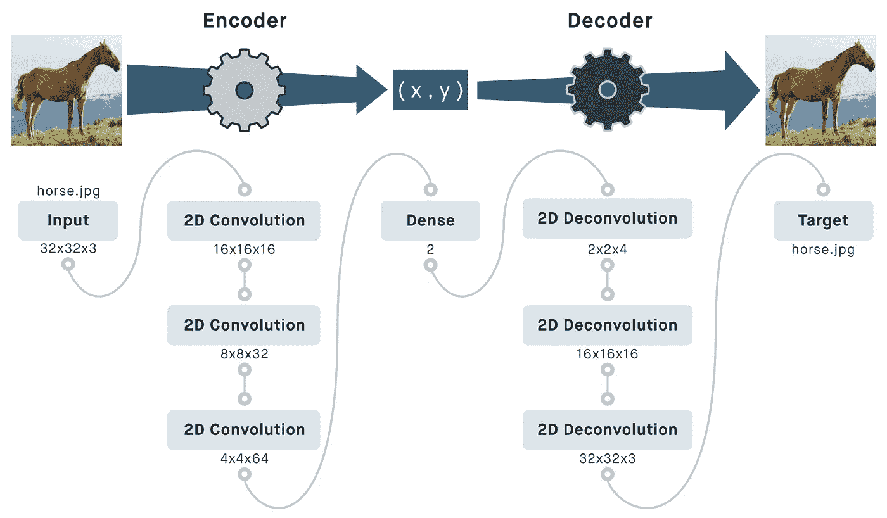
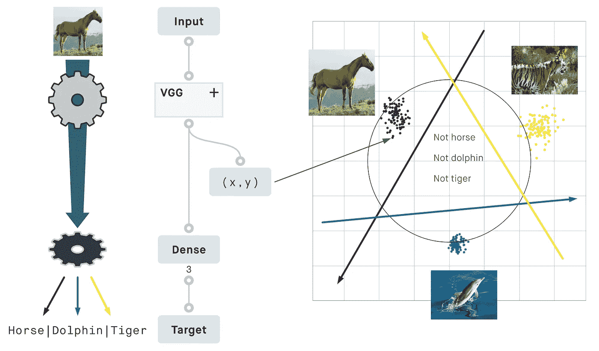
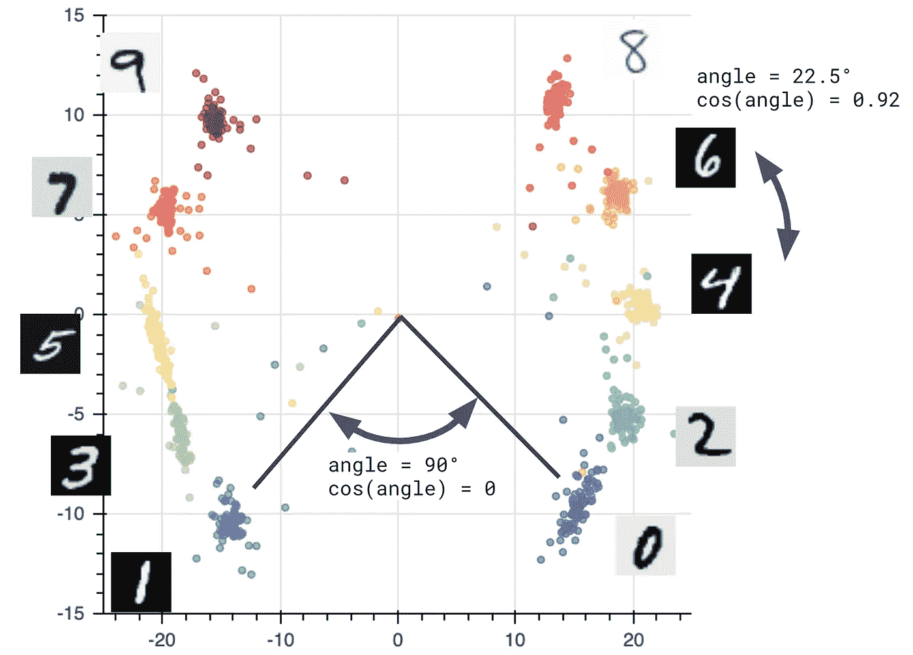
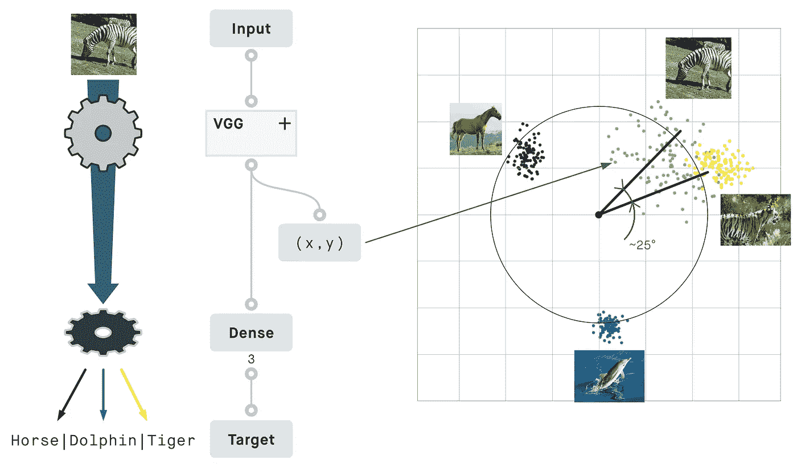

# 图像相似性与深度学习解释

> 原文：<https://pub.towardsai.net/image-similarity-with-deep-learning-explained-ba7e57e51d3?source=collection_archive---------3----------------------->

**图像相似度用深度学习找到看起来相似的产品。** | [草图](https://unsplash.com/photos/_ztjWhn51lc)在 [Unsplash](https://unsplash.com/?utm_source=medium&utm_medium=referral) 上，图片 [1](https://www.zalando.se/pullandbear-vardagsklaenning-light-brown-puc21c0j8-o11.html) 、 [2](https://www.zalando.se/ivy-and-oak-vardagsklaenning-purple-iv321c08o-j12.html) 、 [3](https://www.zalando.se/glamorous-mid-dress-vardagsklaenning-red-gl921c0mp-g11.html) 来自 [zalando.se](https://www.zalando.se) 经许可显示

## [深度学习](https://towardsai.net/p/category/machine-learning/deep-learning)

最近我做了一个 Meetup 讲座，讨论了我最喜欢的两个话题:神经网络和图像。由于我的公司正在推出一个[图片相似功能](https://peltarion.com/image-similarity)，我想我会从这次演讲中总结一些想法，并给出我对几个问题的看法:

为什么要用相似性工作？
深度学习有什么帮助？
为什么余弦相似性如此普遍？
和图像分类有什么不同？

# 什么是图像相似度？

这些图像相似吗？当然，为什么不呢？ |图像 [1](https://unsplash.com/photos/pRBNd8uuku0) 、 [2](https://unsplash.com/photos/YDcp0OLex8E) 在 [Unsplash](https://unsplash.com?utm_source=medium&utm_medium=referral) 上

根据定义，相似性是一个模糊的概念。当两个人交流时，它工作得很好，但是对于一个确定性的计算机程序来说，这不是最容易处理的事情。想想上面的两幅图像:你可以很容易地让任何人都认为他们看起来很相似(穿着皮夹克的人，沉思，面向左)，尽管有些方面明显不同(站着与坐着，海洋与街道背景，男人与女人)。

如果你的目标是评估一幅图像的特定方面，那么，尽一切手段，设计和训练一个模型来完成这个任务。然而，如果你的“相似性”标准是视觉上的，但没有很好地定义，或者如果你缺乏用于训练的精细标记数据，这就是*图像相似性与深度学习*可以给你提振的地方。

深度学习开辟了一条道路，可以一致地**量化**图像之间的相似性，甚至可以自动化定义不清的任务。

# 你能用图像相似度做什么？

**Zalando 上的着装理念和前 3 名匹配，按相似度从 a**[**efficient net B0**](https://medium.com/analytics-vidhya/image-classification-with-efficientnet-better-performance-with-computational-efficiency-f480fdb00ac6)**排列。眨眼之间对比成千上万的图像，摆脱了关键词的僵化。** | [草图](https://unsplash.com/photos/_ztjWhn51lc)在 [Unsplash](https://unsplash.com/?utm_source=medium&utm_medium=referral) 上，图片 [1](https://www.zalando.se/pullandbear-vardagsklaenning-light-brown-puc21c0j8-o11.html) 、 [2](https://www.zalando.se/ivy-and-oak-vardagsklaenning-purple-iv321c08o-j12.html) 、 [3](https://www.zalando.se/glamorous-mid-dress-vardagsklaenning-red-gl921c0mp-g11.html) 来自 [zalando.se](https://www.zalando.se) 经许可显示

可以说最明显的应用是反向搜索。不知何故，我已经足够老了，应该知道关键词统治互联网的时代，祝你好运，即使拼写不完全正确也能找到任何东西。

反向搜索让你从内容开始，并给你相关的关键字。当然，现在的搜索引擎更加灵活，你可能对寻找关键词不感兴趣，但是你仍然可以从一个例子开始，通过浏览一个又一个例子来探索。

**极端分类:** [**Google 发布数据集**](https://ai.googleblog.com/2019/05/announcing-google-landmarks-v2-improved.html) **有几十万个地标可以识别。**

深度学习相似性技术也是一些用于**地标识别**的[最佳方法](https://www.kaggle.com/c/landmark-recognition-2020/discussion/200506)的背后，如果你需要帮助记住你的度假照片是在哪里拍摄的。当你可以识别世界各地的地标时，你还不如[检查一下它对](https://medium.com/towards-artificial-intelligence/the-strengths-weaknesses-of-face2vec-facenet-612a28a17826)人脸识别的效果如何。

最后，如果你喜欢让事情井井有条，图像相似性可以应用于**数据聚类**。这使你可以利用显式信息的组合，如衣服的类型，以及通过深度学习模型隐式学习的视觉特征。

**对来自在线零售店的商品进行聚类，按类别进行着色。像鞋子这样的类别在视觉上是独一无二的，而其他类别则更加多样化，可能会在视觉上与它们的邻居重叠。** |图像 [1](https://unsplash.com/photos/dPCx8JOIGuk) ， [2](https://unsplash.com/photos/2lQ9lvIAxWY) ， [3](https://unsplash.com/photos/_fOL6ebfECQ) ， [4](https://unsplash.com/photos/8hAsLeE6Fbo) ， [5](https://unsplash.com/photos/BAoncvnAl8I) ， [6](https://unsplash.com/photos/SCIJBrxWn_g) 上[下](https://unsplash.com/?utm_source=medium&utm_medium=referral)

# 图像相似性是如何工作的？

相似性是一个模糊的概念，这一点我怎么强调都不为过。如果我们想取得任何进展而不把它固定在一个特定的定义上，我们必须抽象地思考一会儿。

比方说，对于任何数据项，特别是这里的图像，我们希望该数据的表示易于与其他项进行比较。如果这个表示很小，**在成千上万的条目中搜索将会很快**(如果仅仅是因为从磁盘加载的数据较少)。这本质上与为你的数据创建一个[散列表](https://en.wikipedia.org/wiki/Hash_table)的想法是一样的，在[相似性搜索的深度散列](https://medium.com/towards-artificial-intelligence/deep-hashing-for-similarity-search-9273aac054db)中有更详细的描述。

然而，与典型的散列函数不同，压缩的表示应该是可比较的，以直接指示它们对应的项目之间的相似程度。既然我们还没有定义相似的含义，让我们从数据表示应该**保存信息**的想法开始。如果有办法从数据的表示中重建数据，这是可以保证的。

因此，我们正在寻找一种有意义地压缩数据的方法。
这就是**深度神经网络派上用场的地方**。特别是，autoencoder 结构检查了许多有用的框:

*   通过重构输入来保留信息
*   可以处理各种类型的数据
*   固定大小的压缩表示
*   或多或少连续的输入函数
*   可进行噪声鲁棒性训练
*   针对“相似”的特定含义进行微调

**自动编码器结构:数据被编码器网络压缩到固定大小，然而信息被保留，因为输入可以被解码器网络恢复。**

事实上，自动编码器(或多或少)是其输入的连续函数，并且它们可以针对噪声鲁棒性进行训练，这对于相似性应用来说是个好消息。这意味着看起来相同的输入应该具有几乎相同的压缩表示。

然而，可以争论的是，如果允许解码器任意复杂，它可能表现得更像散列函数。这将使得直接比较压缩嵌入变得困难。

这就是为什么在实践中，相似性模型的基础架构更像分类器网络，而不是自动编码器。可以说，这保留了更少的信息，但它允许与余弦相似性进行比较。更不用说分类器网络比自动编码器更广泛、更容易训练。

# 为什么要用余弦相似度？

当谈到相似性时，每个人都在谈论“余弦相似性”，因为它几乎总是被用来衡量两个项目有多接近。因此，当您读到两幅图像 90%相似时，很可能意味着它们的压缩表示的余弦相似度等于 0.90，或者等效地，它们相差 25 度。

在处理深度神经网络时，引入三角学可能看起来没有必要，但它来自网络计算的方式，相当自然。为了理解为什么，让我们来看一个简单的分类器网络。

**一个分类网络。像 VGG 这样的 CNN 充当编码器，将图像压缩成坐标。单个密集图层通过计算坐标与类别线的距离来对坐标进行分类。**

这里有一个分类器，我在属性为 2 的[动物的 3 个类上训练过。编码器完成图像处理的大部分工作，并将输入压缩到 N 维空间的坐标中(这里 N=2)。](https://cvml.ist.ac.at/AwA2/)

然而,“解码器”被简化为一个层，并且可以仅仅充当分类器，而不是重建整个输入图像。要决定来自编码器的点是否属于给定的类别，它只能做一件非常简单的事情:在 N 维空间中画一条线(或平面)。如果一个点在这条线的右边，它就属于这个范畴。如果点在错误的一边，从这条线上看就不属于范畴。

计算坐标的编码器和画线的分类器被一起训练，以便来自已知类别的每个图像都可以被正确分类。随着我们增加已知类别的数量(特别是如果类别是互斥的)，我们可以看到由编码器创建的点将自己组织成围绕一个圆分布的簇。

因此，两点之间的角度成为比较它们的自然方式。**余弦相似度**，将 0 到 180°之间的角度映射到 1 到-1 之间的一个很好的值，提供了一个直观的相似性度量。

# 图像相似度和分类有什么不同？

诚然，图像相似性与图像分类密切相关，如果仅仅是因为它使用与处理主力相同的分类器网络。然而，有几点使图像相似性成为它自己的事情。

## 图像相似性考虑多个维度

在图像分类问题中，我们只关心判断一幅图像是否属于一个(或可能几个)离散类别，这意味着从最终输出中丢弃了许多信息。

通过在最终分类层之前使用数据的表示，可以使用数据的更多方面。

在下面的例子中，我对[良好的旧 MNIST 数据集](https://youtu.be/oKzNUGz21JM)进行了扭曲。我训练了一个网络来识别手写数字，当然足够多的点根据它们的类别聚集在一起——0 到 9 之间的数字。然而，我还定义了网络需要学习的另外两个维度:

*   奇偶性:一个数字是偶数还是奇数
*   数字的大小

可以明确地训练网络来识别图像上的数字、数字奇偶性和数字大小。余弦相似性通过同时考虑所有这些维度来度量两幅图像之间的相似性。

两个图像之间的余弦相似性组合了所有这些维度，并返回单个值，该值对于相同的数位最小，对于相同奇偶性的连续数位稍大，而对于不同奇偶性的数位最大。

## 维度可以隐式学习

如果你训练了一个分类器网络来识别海豚、老虎和马，这些动物就是训练领域，你不应该指望对其他任何东西进行分类。根据下面的图像，我之前训练的网络会将大多数斑马的图像分类为老虎，这简直是*错了*。

**这个网络计算出没有经过训练识别的斑马看起来介于马和老虎之间。或许是由于条纹的缘故，一般斑马被看做 cos(25 ) = 0.90 类似老虎。**

余弦相似性将隐式学习的许多维度(假定在这里，条纹图案和腿或草的存在)组合成一个流动的数值。结果，你从同一个网络中得到斑马看起来像介于马和老虎之间的东西，即使你没有明确地训练来识别斑马的类别。

这个特殊的网络可能会发现斑马比你想象的更像老虎的*，但是谢天谢地，这个网络使用了可以调整的确定性运算。*

## *可以不同地训练图像相似性*

*如果你愿意让网络完全自己学习隐含维度，你可能甚至不需要任何标记类别来训练。*

*使用仅指示两幅图像是否相似的标签，由于[对比损失](https://towardsdatascience.com/contrasting-contrastive-loss-functions-3c13ca5f055e)，可以训练网络。如果您知道数据集中每对图像之间的相似性关系，或者只知道其中一些图像对之间的相似性关系，那么这种方法是可行的。*

*这种损失函数与传统上用于训练分类网络的[损失函数](https://peltarion.com/knowledge-center/documentation/modeling-view/build-an-ai-model/loss-functions)非常不同。事实上，它们的目的不是将输入图像推向一个固定的类别，而是推向另一个已知相似的图像。*

# *更进一步*

***教程:***

*   *[py torch 中的图像相似性搜索](https://medium.com/pytorch/image-similarity-search-in-pytorch-1a744cf3469)*
*   *[寻找相似的水果图片](https://peltarion.com/knowledge-center/documentation/tutorials/find-similar-images-of-fruits)*

***Meetup talk:** [图像相似度与深度学习](https://youtu.be/7L2ql9YLJBY?t=45) —数字 Meetup 与 Solita&Romain furtzynski/pelta rion*

***文学:***

*   *视觉表征对比学习的简单框架，陈婷等，2020*
*   *[数字病理学的自我监督相似性学习](https://arxiv.org/abs/1905.08139)，Jacob Gildenblat，Eldad Klaiman，2020*
*   *[用域外样本支持大规模图像识别](https://arxiv.org/abs/2010.01650)，Christof Henkel，Philipp Singer，2020*
*   *[深度人脸识别:一项调查](https://arxiv.org/abs/1804.06655)，，，邓，2020*
*   *[通过非参数实例级判别的无监督特征学习](https://arxiv.org/abs/1805.01978)，吴之荣等，2018*