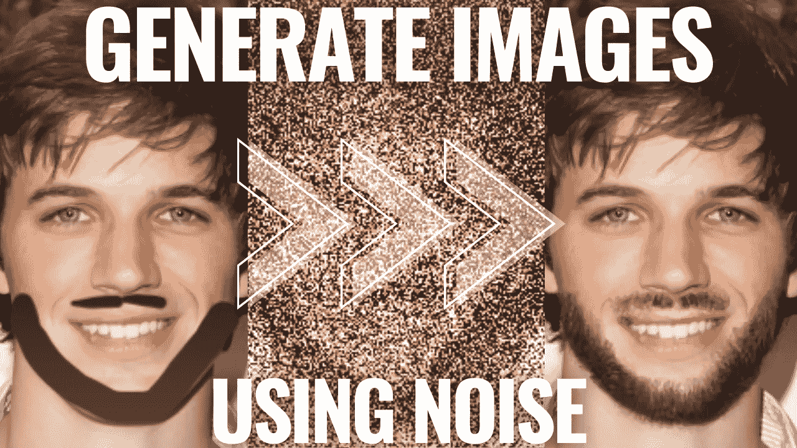
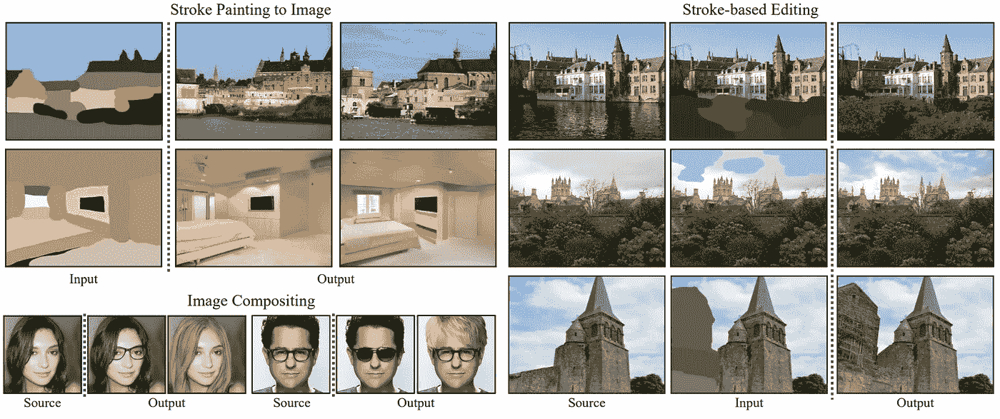
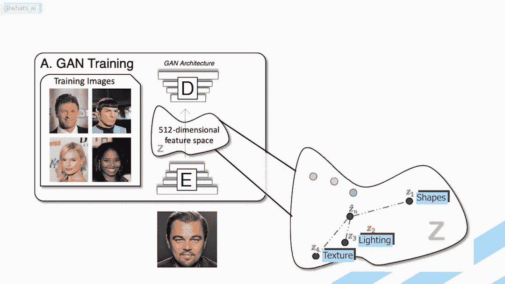
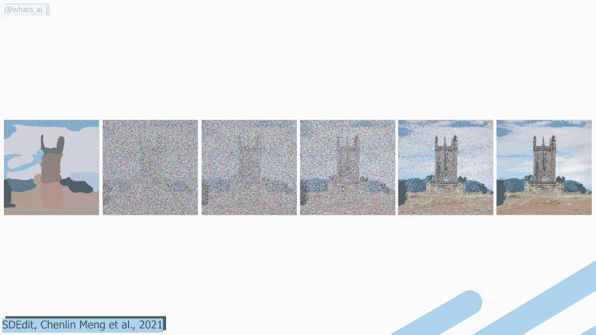
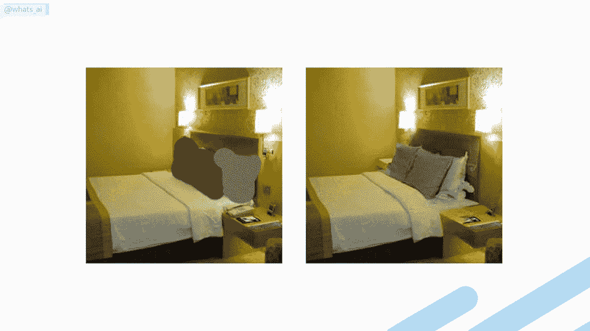
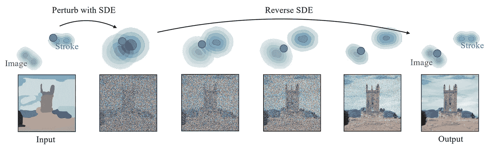
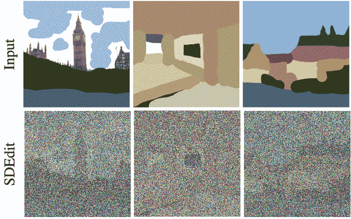

# 手绘彩色笔画的图像合成和编辑。不再需要繁琐的训练！

> 原文：<https://pub.towardsai.net/image-synthesis-and-editing-from-hand-drawn-color-strokes-sdedit-8da8592182cb?source=collection_archive---------2----------------------->

## [人工智能](https://towardsai.net/p/category/artificial-intelligence)

## 告别复杂的 GAN 和变压器架构，实现图像生成。这种新方法可以从任何基于用户的输入生成新图像。

> 原载于 [louisbouchard.ai](https://www.louisbouchard.ai/image-synthesis-from-sketches/) ，前两天在[我的博客](https://www.louisbouchard.ai/image-synthesis-from-sketches/)上看到的！

告别复杂的 GAN 和变压器架构，实现图像生成。这种新方法通过改变来自斯坦福大学和卡耐基梅隆大学的孟等人可以从任何基于用户的输入中生成新的图像。即使像我这样没有艺术技能的人，现在也可以从快速草图中生成美丽的图像或修改。起初听起来可能很奇怪，但通过在输入中添加噪声，他们可以消除不需要的伪像，如用户编辑，同时保留图像的整体结构。所以图像现在看起来像这样，完全的噪声，但我们仍然可以看到图像和笔画的一些形状，以及特定的颜色。然后，这个新的噪声输入被发送到模型，以反转这个过程，并按照这个整体结构生成图像的新版本。这意味着它将遵循图像的整体形状和颜色，但不是如此精确，以至于它可以创建新的功能，如用看起来真实的胡子替换这张草图。

SDEdit 示例。图片来自 [SDEdit，孟等，2021](https://chenlin9.github.io/SDEdit/)

同样的，你可以像这样发送一个完整的图像草稿，给它添加噪点，它会通过模拟相反的步骤来去除噪点。这样，它将逐渐提高从任何输入中生成的符合特定数据集样式的图像的质量！这就是为什么你不再需要任何绘画技巧了！因为它从噪声中生成图像，所以在应用噪声之前，它不知道也不需要知道初始输入。这是一个很大的区别，也是一个巨大的优势。你训练一个模型从一种风格到另一种风格，这些图像对来自两个不同但相关的数据集。

GANs 生成过程。需要两个数据集:真实人脸和卡通风格

这个名为 SDEdits 的模型使用随机微分方程或 SDEs，这意味着通过注入高斯噪声，他们将任何复杂的数据分布转换为已知的先验分布。这个已知的分布在训练期间被看到，并且这是模型被训练以重建图像的基础。因此，该模型学习如何将这种高斯噪声转换成噪声更小的图像，并重复它，直到我们得到符合所需风格的图像。这种方法适用于任何类型的输入，因为如果你给它添加足够的噪声，图像将变得如此嘈杂，以至于它加入了已知的分布。

SDEdit 扰动(噪声附加)。图片来自 [SDEdit，孟等，2021](https://chenlin9.github.io/SDEdit/)

然后，该模型可以接受这个已知的输入并执行相反的步骤，根据它被训练的内容对图像进行去噪。事实上，就像 GANs 一样，我们需要一个目标数据集，也就是我们想要生成的那种数据或图像。例如，要生成真实的人脸，我们需要一个充满真实人脸的数据集。然后，我们向这些人脸图像添加噪声，并教会模型迭代地去噪。这就是这个模型的美妙之处，因为一旦它学会了如何去噪，我们就可以在添加噪声之前对图像做任何事情，比如添加笔画，因为它们混合在我们添加的噪声的预期图像分布中。通常，基于这样的笔画编辑图像对于 g an 架构来说是一项具有挑战性的任务，因为这些笔画与图像以及模型在训练期间所看到的极其不同。GAN 架构需要两个数据集来解决这个问题，一个是目标数据集，它是我们试图模仿的数据集，另一个是源数据集，它是我们试图编辑的带有笔画的图像。

具有条件变迁的数据的复杂性问题

这些被称为配对数据集，因为我们需要每个图像在两个数据集中成对出现，以训练我们的模型。我们还需要定义一个适当的损失函数来训练它，这使得图像合成过程非常昂贵和耗时。

SDEdit 扰动(噪声添加)和反向(噪声抑制)过程。图片来自 [SDEdit，孟等，2021](https://chenlin9.github.io/SDEdit/)

在我们的例子中，对于 SDEdits，我们不需要任何成对的数据，因为笔画和图像样式由于这种噪声而被合并。这使得新的噪声图像成为模型的已知数据的一部分，模型使用它来生成与训练数据集非常相似的新图像，但是考虑了新的结构。换句话说，它可以很容易地将任何编辑过的图像作为输入，足够模糊，但不会太模糊，以保持全局语义和结构细节，并对其进行降噪，以产生一个新的图像，它会神奇地将您的编辑考虑在内。而且这个模型甚至没有用笔画或者编辑例子训练过，只有原始的人脸图像！当然，在简单的用户编辑的情况下，他们精心设计了架构，只生成编辑过的部分，不重新创建整个画面。

这是非常酷的，因为它使诸如条件图像生成、基于笔划的图像合成和编辑、图像修补、着色和其他逆问题的应用能够使用单个无条件模型来解决，而无需重新训练。当然，这仍然只适用于一个生成样式，也就是它被训练的数据集。然而，它仍然是一个很大的优势，因为你只需要一个数据集，而不是多个基于 GAN 的图像修复网络的相关数据集，正如我们所讨论的。

SDEdit 示例。图片来自 [SDEdit，孟等，2021](https://chenlin9.github.io/SDEdit/)

唯一的缺点可能是生成新图像所需的时间，因为这个迭代过程比单次通过更传统的基于 GAN 的生成模型花费更多的时间。尽管如此，我宁愿等待几秒钟来获得一个图像的好结果，而不是实时模糊失败。你可以用他们公开发布的代码或者用他们网站上的演示来尝试一下，两者都在参考资料中有链接。

让我知道你认为这个模型怎么样。我很期待看到这种基于 SDE 的方法在几个月甚至更短的时间内会发生什么！如你所知，这只是这一惊人新技术的概述。我强烈邀请您阅读他们的论文，以更好地了解 SDEdit，链接如下。

感谢您的阅读！

## 观看视频，查看更多示例，并在 YouTube 上支持我

如果你喜欢我的工作，并想与人工智能保持同步，你绝对应该关注我的其他社交媒体账户( [LinkedIn](https://www.linkedin.com/in/whats-ai/) 、 [Twitter](https://twitter.com/Whats_AI) )，并订阅我的每周人工智能 [**简讯**](http://eepurl.com/huGLT5) ！

## 支持我:

*   支持我的最好方式是成为这个网站的成员，或者如果你喜欢视频格式，在 [**YouTube**](https://www.youtube.com/channel/UCUzGQrN-lyyc0BWTYoJM_Sg) 上订阅我的频道。
*   在经济上支持我在 [**地区**](https://www.patreon.com/whatsai) 的工作
*   在 [**中**](https://whats-ai.medium.com/) 跟我来

## 参考资料:

阅读全文:[https://www.louisbouchard.ai/image-synthesis-from-sketches/](https://www.louisbouchard.ai/image-synthesis-from-sketches/)
我的时事通讯(每周向你的电子邮件解释一个新的人工智能应用！):【https://www.louisbouchard.ai/newsletter/
SDEdit，孟等人，2021，[https://arxiv.org/pdf/2108.01073.pdf](https://arxiv.org/pdf/2108.01073.pdf)
项目链接:[https://chenlin9.github.io/SDEdit/](https://chenlin9.github.io/SDEdit/)
代码:[https://github.com/ermongroup/SDEdit](https://github.com/ermongroup/SDEdit)
演示:[https://colab . research . Google . com/drive/1k kls 53 pndxkqpppls 1 ik-k 1 nrqymlb 4 ao？usp =共享](https://colab.research.google.com/drive/1KkLS53PndXKQpPlS1iK-k1nRQYmlb4aO?usp=sharing)