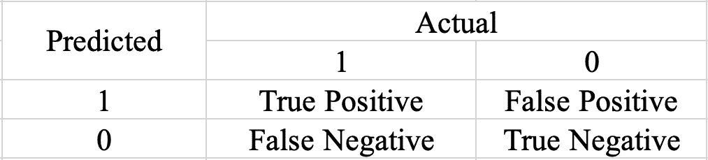
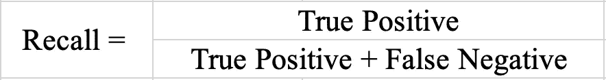
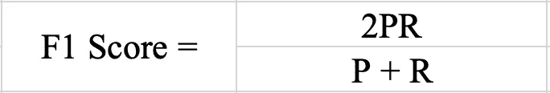

# 不平衡分类

> 原文：<https://pub.towardsai.net/imbalanced-classification-d58a1eaa3cf7?source=collection_archive---------5----------------------->

## [数据科学](https://towardsai.net/p/category/data-science)

## 什么是不平衡分类，为什么要警惕它？

由[卡斯滕·怀恩格特](https://unsplash.com/@karsten116?utm_source=medium&utm_medium=referral)在 [Unsplash](https://unsplash.com?utm_source=medium&utm_medium=referral) 上拍摄的照片

考虑到这一点，您正在对一个分类问题进行建模，以检测患者是否患有癌症。你用你的验证数据进行测试，得到了 99%的准确率，你会觉得不可思议。但这似乎好得难以置信，所以你决定再深入一点，这时你发现你的数据中只有 5%的人患有癌症。

> 所以，你的模型对没有患癌症的人有偏见，而且最有可能做出同样的预测，通常不考虑他们的医疗状况。 ***不平衡分类就是这种情况。***

# 准确性悖论

因此，如果说我们从上面的例子中学到了什么，那就是当用于分类问题时，准确性不是预测模型的可靠度量。这是因为，在分类问题中，我们通常更关心我们犯的错误，而目标类通常是我们试图关注的领域。这被称为**准确性悖论**。因此，为了克服这一点，我们求助于其他一些可靠的指标，如精确度和召回率，它们可以从混淆矩阵中计算出来。

**混淆矩阵:**

来源:图片由作者提供。

来源:图片由作者提供。

**精度**:我们预测的所有患者中；哪一部分人真的患了癌症

来源:图片由作者提供。

**回想一下**:在所有癌症患者中，我们预测有多少人会患癌症

来源:图片由作者提供。

**F1 得分:**这在比较具有不同精度和召回值的多个模型时很有用。

因此，有了高精度和高召回率的模型，你对自己的预测就更有信心了。

# 为什么会发生？

数据不平衡是我们在日常生活中常见的情况。以下陈述了出现这种情况的一些原因:

**有偏采样**:数据收集根本不是随机的。这可能是由于数据收集仅集中于狭窄的地理区域、时间范围等**。例如，**您出去进行了一项调查，以了解波士顿红袜队和扬基队中哪个棒球队拥有最多的球迷，您发现红袜队的球迷基础完全主导了记录。但这是因为地理范围狭窄导致的有偏采样。

**测量误差**:这个问题是由于数据收集时产生的误差。这些错误包括在数据输入时应用了错误的类别，或者数据受到损坏或削弱而导致不平衡。

问题域:训练数据可能不能很好地代表我们正在处理的问题。有时，这可能是因为生成数据的过程对于一个类来说可能快速而简单，但对于另一个类来说却需要更多的时间、成本或计算能力。因此，为另一个类生成数据变得相对困难。

# 真实场景:

从民用应用程序到安全和国防相关的应用程序，您都可以在数据密集型应用程序中找到这些类型的不平衡。下面是固有不平衡的问题领域的例子。

*   索赔预测
*   欺诈检测
*   贷款违约预测
*   流失预测
*   垃圾邮件检测
*   异常检测
*   离群点检测
*   入侵检测
*   转换预测

上述每种情况都有其特定的问题，因为它们的数据不平衡，我们还可以注意到，它们的少数群体也很少出现，因此很难用很少的数据来预测它们。

# 解决方案:

你总是可以认为轻微的不平衡没什么大不了的，就像两个类之间的比率为 4:6 是没问题的，但是当这个比率开始向一个特定的方向偏离时，问题就出现了。

大多数标准的最大似然算法假设类的平均分布，所以少数类没有被正确建模。不平衡分类仍然是一个需要彻底解决的问题，但同时，您可以考虑以下方法来解决这个问题:

收集更多的数据:这种做法经常被低估，但是如果你有机会收集更多的数据，你一定要考虑这样做，因为它可以给班级带来一些平衡的观点。

**重采样:**我们基本上可以重构数据，使其恢复平衡。这可以通过两种方式实现:

*   过采样:从少数类中复制实例
*   欠采样:从多数类中删除实例

**合成数据**:您可以使用算法生成合成样本，就像从少数类的实例中随机抽取属性一样。最流行的方法之一是 **SMOTE** 阐述的是综合少数过采样技术。从名称上看，这是一种过采样技术，但它不只是复制值，而是创建合成样本。但是我们需要记住，这样做可能不会保留属性之间的非线性关系。

**阈值:**我们通常根据概率阈值对我们的类进行分类，如果 P > 0.5，我们说它在类 1 中，否则它在类 0 中。我们可以考虑根据自己的方便调整概率阈值，这间接影响了我们的精度和召回率。

*   假设我们将阈值提高到 0.9，我们可以自信地告诉一小部分患者他们确实患有癌症，因此这提高了精确度
*   但反过来，如果我们将阈值降低到 0.2，我们可以考虑更多可能患有癌症的患者，我们并不完全确定，但这是一个值得考虑的风险，因此这增加了回忆。

您需要调整阈值以适应您的数据集，并找到一个好的**精度/召回权衡**以获得最佳结果。

**规则化或惩罚:**您可以为分类器添加额外的成本，因为它没有考虑少数类。这将注意力转移到了少数民族阶层，因为它增加了模型的偏见。

嗯，这只是沧海一粟，你可以尝试许多更有创意和创新的想法来消除分类不平衡的问题。请记住，您无法确定哪种方法最适合您的数据集，所以请“像科学家一样”继续尝试错误方法，找到最适合您的情况的方法。

***好玩的事实*** *:很多人把不平衡和不平衡混为一谈，但它们是相对不同的。不平衡分类指的是曾经平衡但现在不再平衡的类别，而不平衡指的是本质上不平衡的类别。*

好了，现在你对什么是不平衡分类以及它如何导致一些严重的曲解和扭曲的结果有了一个坚实的理解。你也学会了如何解决这个问题，这将有助于你建立一个更好的模型。

感谢您抽出时间阅读这篇文章。请分享你对此的想法！！下次见，再见。

和平✌️

参考资料:

兰迪·劳。《机器学习:准确性悖论》 *LinkedIn* ，[www . LinkedIn . com/pulse/machine-learning-accuracy-paradox-Randy-Lao/。](http://www.linkedin.com/pulse/machine-learning-accuracy-paradox-randy-lao/.)

布朗利，杰森。"对不平衡分类的温和介绍."*机器学习掌握*，2020 年 1 月 14 日，machinelingmastery . com/what-is-unbalanced-classification/。

布朗利，杰森。"在你的机器学习数据集中对抗不平衡类的 8 个策略."*机器学习掌握*，2020 年 8 月 15 日，machinelementmastery . com/tactics-to-combat-unbalanced-classes-in-your-Machine-Learning-dataset/。