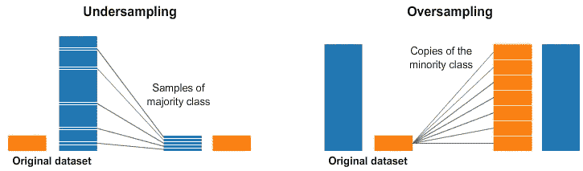
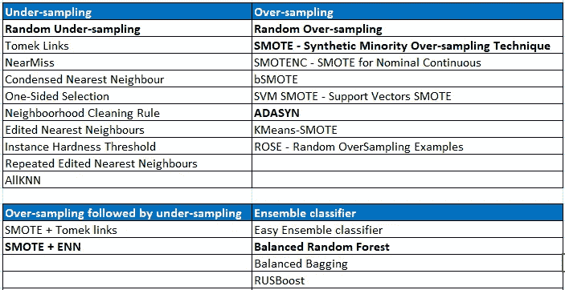
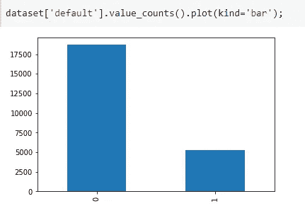
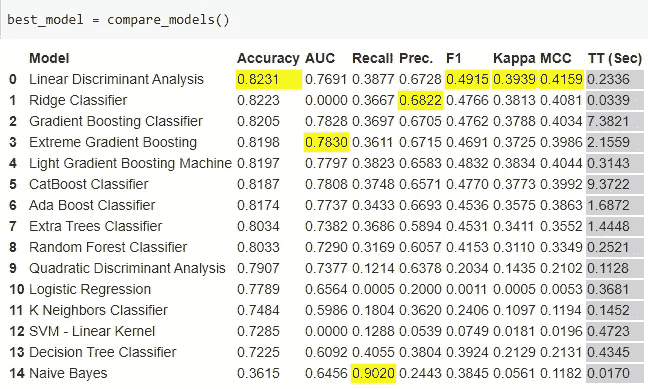
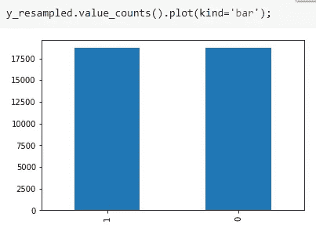
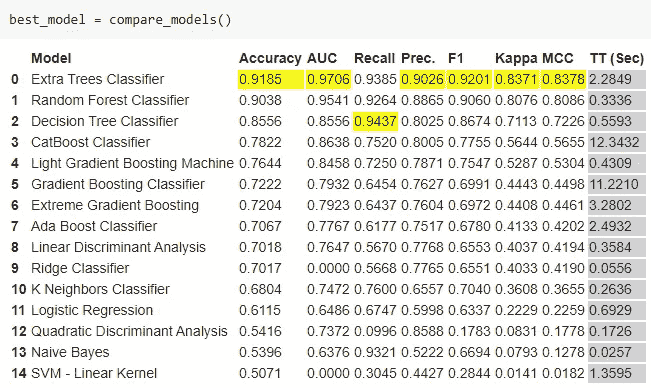
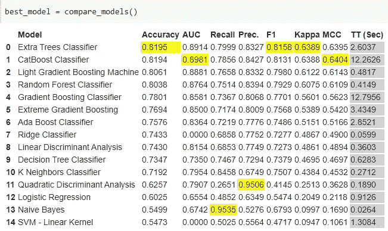
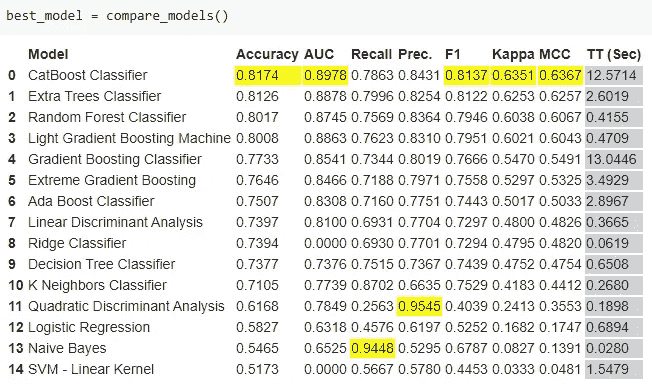
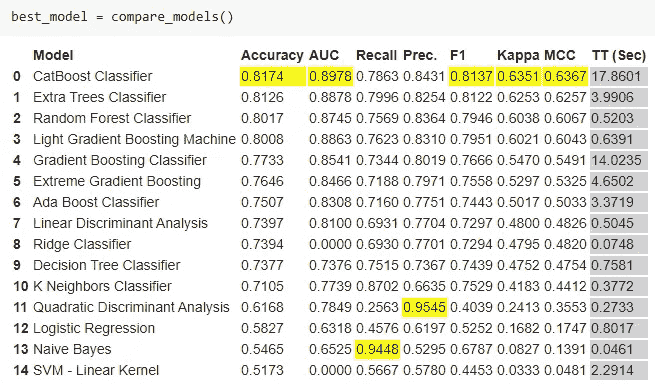
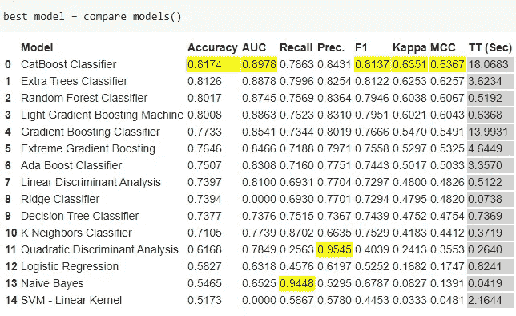

# 不平衡学习:处理不平衡的课堂问题

> 原文：<https://pub.towardsai.net/imbalanced-learn-handling-imbalanced-class-problem-40aa3cb6525b?source=collection_archive---------2----------------------->

## [数据科学](https://towardsai.net/p/category/data-science)，[机器学习](https://towardsai.net/p/category/machine-learning)

## 使用不平衡学习处理不平衡数据的实践指南



来源: [KDNuggets](https://www.kdnuggets.com/2020/01/top-tweets-jan22-28.html)

在之前的文章[这里](https://medium.com/towards-artificial-intelligence/how-to-handle-imbalanced-data-in-machine-learning-9fe1334e9dff)中，我们已经介绍了处理不平衡数据的不同方法。

在本文中，让我们试着了解如何使用`imbalanced-learn`库来处理不平衡的类问题。我们将利用`Pycaret`库和 UCI 默认的信用卡客户数据集，它也内置在 PyCaret 中。让我们开始吧。

# 不平衡学习

`Imbalanced-learn`是一个 python 包，提供了多种重采样技术来处理分类任务中经常遇到的类不平衡问题。请注意，不平衡学习与 [scikit-learn](http://scikit-learn.org/stable/) 兼容，也是 [scikit-learn-contrib](https://github.com/scikit-learn-contrib) 项目的一部分。

> PyCaret 是一个低代码库，可以用来执行复杂的机器学习任务，只需要几行代码。PyCaret 本质上是几个机器学习库和框架的 Python 包装器，比如`scikit-learn`、`XGBoost`、`Microsoft LightGBM`、`spaCy`等等。

`imbalanced-learn`实现的重采样技术可以大致分为以下 4 大类。还列出了在每种方法下实现的所有方法的列表。

*   对大多数类进行欠采样
*   对少数民族阶层进行过度采样
*   结合过采样和欠采样
*   系综平衡集



# 装置

```
!pip install -U imbalanced-learn
```

或者

```
!git clone [https://github.com/scikit-learn-contrib/imbalanced-learn.git](https://github.com/scikit-learn-contrib/imbalanced-learn.git)
%cd imbalanced-learn
!pip install .
```

# 无重采样的基线模型

我们先导入 Pycaret 和信用卡客户数据的默认值。

```
from pycaret.datasets import get_data
dataset = get_data(‘credit’)
```

正如你在下面看到的，这个信用违约数据集是不平衡的，负类(类 0)占主导地位。



不平衡的阶级分布

让我们看看没有应用任何重新采样(过采样或欠采样)技术的基线分数。

```
from pycaret.classification import *
clf = setup(data=dataset, target = ‘default’, session_id=123)
```

为简单起见，我将只查看准确性、AUC 和 F1 分数。但是，您可以根据需要查看其他指标。没有任何重采样，线性判别分析给出了最好的准确度和 F1 值。极端梯度增强给出了最好的 AUC 分数。现在，让我们应用重新采样技术并比较结果。



没有重新取样的基线分数

# 1.过采样

这有助于增加数据集中少数类示例的数量。过采样的主要优点之一是在处理过程中，多数类和少数类都不会丢失信息。容易过拟合。

## a)随机过采样

它在代表性不足的班级(少数班级)中生成新的样本。

```
X = dataset.drop([‘default’], axis=1)
y = dataset[‘default’]from imblearn.over_sampling import RandomOverSampler
ros = RandomOverSampler(random_state=123)X_resampled, y_resampled = ros.fit_resample(X, y)
```



应用随机过采样后的平衡类

```
ros_dataset = X_resampled
ros_dataset[‘default’] = y_resampledfrom pycaret.classification import *clf = setup(data=ros_dataset, target = ‘default’, session_id=123)
```

从下面的结果可以看出，在应用随机过采样技术后，分数有了很大的提高。准确性提高到 91%，AUC 提高到 97%，F1 评分也提高了。Extra Trees 分类器以几乎所有评估指标的最高分领先图表。



应用随机过采样后的评估分数

> 上面讨论的随机过采样的大部分代码适用于其余的方法。因此，接下来，我将只提供如何使用各自技术的细节以及重新采样后的结果。然而，所有方法的完整代码都在文章末尾给出。

## b) SMOTE & ADASYN

这两种方法通过插值生成新的样本。SMOTE 代表合成少数过采样技术，ADASYN 代表自适应合成(ADASYN)算法。

```
from imblearn.over_sampling import SMOTE, ADASYNX_resampled, y_resampled = SMOTE(random_state=123).fit_resample(X, y)
```

根据下面的结果，当与准确性、AUC 和 F1 得分指标进行比较时，SMOTE 和 ADASYN 的过采样在该数据集上表现不佳。然而，精确度和召回分数的表现比随机过采样稍好。



应用 SMOTE 过采样后的评估分数



应用 ADASYN 过采样后的评估分数

# 2.欠采样

## a)随机欠采样

这是通过为目标类随机选择数据子集来实现的。

```
from imblearn.under_sampling import RandomUnderSamplerX_resampled, y_resampled = RandomUnderSampler(random_state=123).fit_resample(X, y)
```

在欠采样技术中，因为只选择了数据子集，所以会有信息丢失。因此，与过采样相比，评估结果很可能会更低。下面的结果证实了这一点。



随机欠采样的评估结果

# 3.过采样之后是欠采样

过采样方法 SMOTE 可以通过在边缘离群点和内嵌点之间插入新点来产生噪声样本。这个问题可以通过清理过采样产生的空间来解决。这是通过过采样和欠采样来实现的。

## a) SMOTEENN

SMOTEENN 是 SMOTE(过采样)，后面是 ENN(欠采样)

```
from imblearn.combine import SMOTEENNX_resampled, y_resampled = SMOTEENN(random_state=123).fit_resample(X, y)
```

过采样后的欠采样技术也没有给出比随机过采样更好的结果。然而，精确度和召回分数有些稳定。



应用 SMOTEENN 技术后的评估分数

# 4.系综平衡集

## a)平衡随机森林分类器

在这种集成方法中，森林中的每棵树都将被提供一个平衡的引导样本。这个类提供了 Sklearn 的`RandomForestClassifier`的所有功能。

```
from sklearn.model_selection import train_test_split
from sklearn.metrics import balanced_accuracy_score, classification_report
from imblearn.ensemble import BalancedRandomForestClassifierX = dataset.drop([‘default’], axis=1)
y = dataset[‘default’]X_train, X_test, y_train, y_test = train_test_split(X, y, random_state=0)brf = BalancedRandomForestClassifier(n_estimators=100, random_state=123)brf.fit(X_train, y_train)y_pred = brf.predict(X_test)
print(balanced_accuracy_score(y_test, y_pred))
```

# 结论

对于这个默认的信用卡客户数据集，随机过采样技术在准确性、AUC 等方面给出了最好的分数。因此，我们可以考虑额外的决策树分类器或随机森林分类器进行进一步的微调和集成。

在本文中，您已经了解了如何使用`imbalanced-learn`库来处理不平衡数据。下次当你遇到不平衡的数据时，你可以试试这些技巧。

*阅读更多关于 Python 和数据科学的此类有趣文章，* [***订阅***](https://pythonsimplified.com/) *到我的博客*[***www.pythonsimplified.com***](http://www.pythonsimplified.com/)***。*** 你也可以通过 [**LinkedIn**](https://www.linkedin.com/in/chetanambi/) 联系我。

# **完整代码**

# 参考

 [## 欢迎来到不平衡学习文档！-不平衡-学习 0.5.0 文档

### 安装、测试和贡献包的信息。主要文档。这包含了深入的…

不平衡-learn.readthedocs.io](https://imbalanced-learn.readthedocs.io/en/stable/)