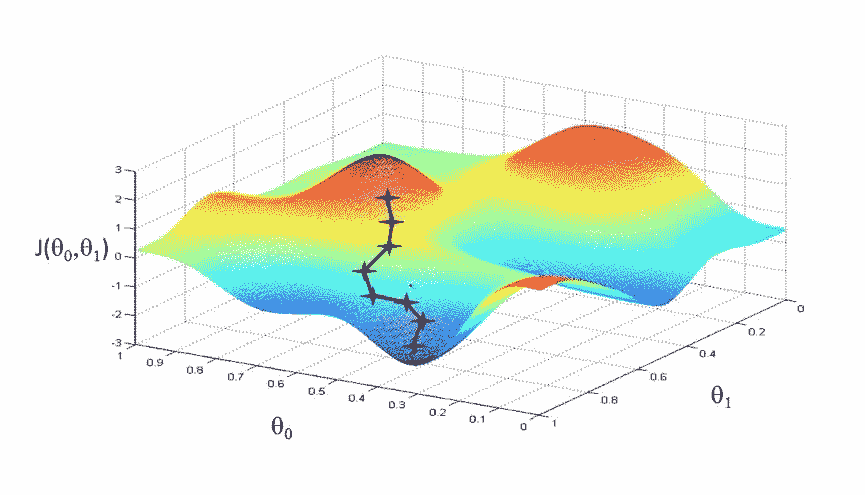
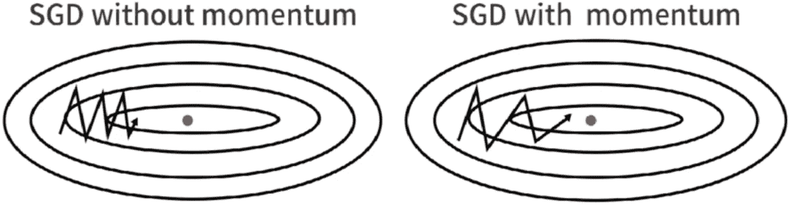
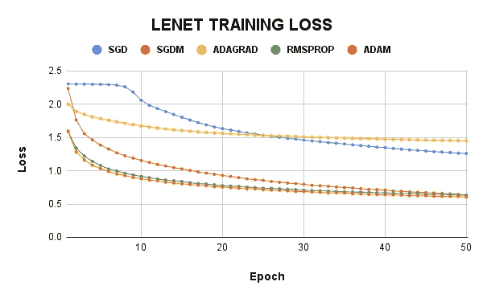
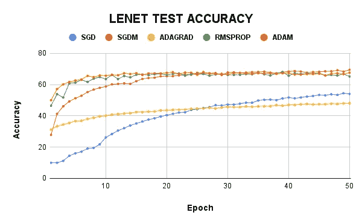
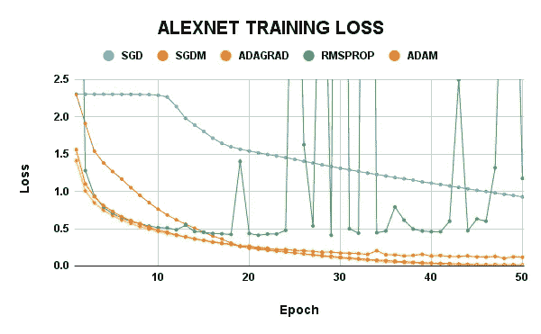
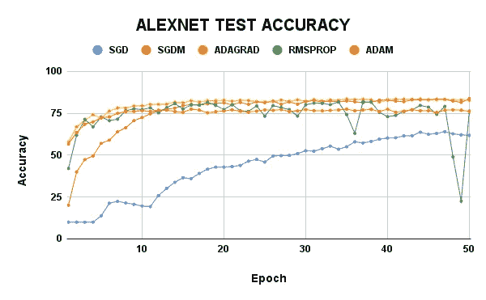
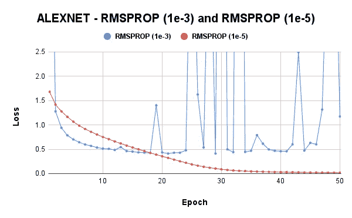
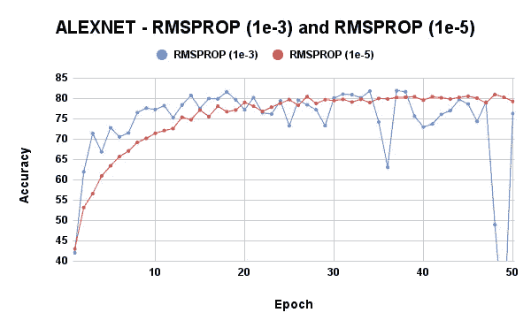
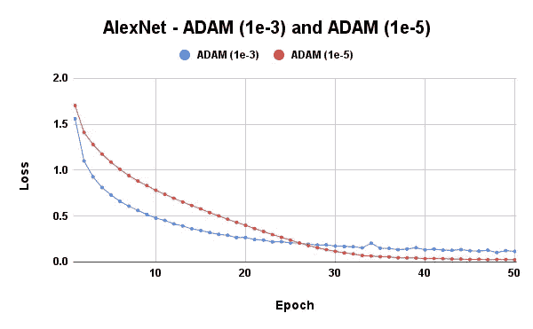
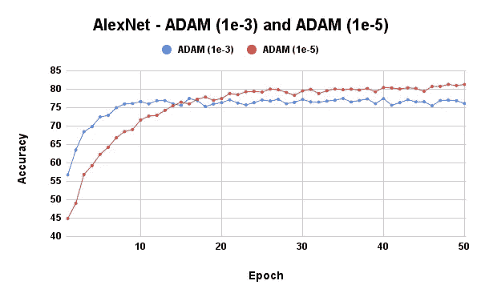

# 优化器对图像分类器的影响

> 原文：<https://pub.towardsai.net/impact-of-optimizers-in-image-classifiers-3b04ed20823a?source=collection_archive---------1----------------------->

由 [Ales Krivec](https://unsplash.com/@aleskrivec?utm_source=medium&utm_medium=referral) 在 [Unsplash](https://unsplash.com?utm_source=medium&utm_medium=referral) 上拍摄的照片

# 介绍

有没有想过为什么 DNN 在准确性方面没有达到预期的高性能，特别是当有官方或非官方的专家和爱好者报告在您使用的相同网络和相同数据集上获得了最高性能时？我记得有段时间我很难接受这样的想法:我的模型在预期表现良好的时候却失败了。这是什么原因造成的？事实上，有许多因素都有不同程度的潜在可能影响您的体系结构的性能。然而，在本文中我将只讨论其中的一个。这个因素就是“要使用的优化算法的选择”。

什么是优化器？优化器是被创建并用于神经网络属性修改(即，权重、学习速率)的函数或算法，目的是加速收敛，同时最小化损失并最大化精度。DNN 使用数十亿个参数，您需要正确的权重来确保您的 DNN 能够从给定数据中很好地学习，同时能够很好地归纳和适应未知相关数据的良好性能。

多年来，已经建立了不同的优化算法，其中一些算法相对于其他算法有其优点，也有其缺点。因此，有必要了解这些算法的基础，以及理解正在处理的问题，以便我们能够选择最佳的优化器来工作。

此外，我注意到许多研究人员使用 SGD-M(带动量的随机梯度下降)优化器，但在行业中，Adam 更受青睐。在这篇文章中，我将对人工智能世界中最流行的优化器进行简要的描述。实际上，我必须做大量的实验来了解这些优化器之间的区别，回答一些关于使用这些优化器的问题，并根据我的观察给出关于哪个优化器是最好的以及何时/如何使用它们的线索。

# 不同优化器的基本描述

[https://Ruth wik . github . io/machine learning/2018-01-15-gradient-descent/](https://ruthwik.github.io/machinelearning/2018-01-15-gradient-descent/)

在本节中，我将简要讨论带动量的随机梯度下降(SGDM)、自适应梯度算法(ADAGRAD)、均方根传播(RMSProp)和 Adam 优化器。

**SGDM:** 由于梯度下降(GD)优化器使用整个训练数据来更新模型的权重，当我们有数百万个数据点时，它的计算变得非常昂贵。因此，随机梯度下降法(SGD)通过使用每个数据点来更新权重，从而解决了这个问题。然而，这对于神经网络(NN)来说在计算上是昂贵的，NN 中使用的每个数据点都需要前向和后向传播。此外，对于 SGD，当它试图达到全局最小值时，我们无法提高学习速率。这使得在使用 SGD 时收敛速度非常慢。SGDM 解决了这个问题，因为它在普通 SGD 中增加了一个动量项，从而提高了收敛速度。更深入的解释，点击[这里](https://towardsdatascience.com/deep-learning-optimizers-436171c9e23f)。

图片来自[塞巴斯蒂安·鲁德](https://ruder.io/optimizing-gradient-descent/index.html#momentum)

**ADAGRAD:** 自适应梯度算法(ADAGRAD)是一种基于梯度的优化算法，它试图使学习速率适应参数。学习率通过结合来自过去观察的见解来逐个组件地拟合参数。它对与经常出现的特性相关的参数进行小的更新，对那些不经常出现的特性进行大的更新。Adagrad 还消除了手动调整学习率的需要，因为它会根据参数自动更新学习率。然而，学习速率收缩得很快，使得模型认为它接近实现收敛，并在预期性能之下停止。要了解更多信息，请点击[此处](https://www.jmlr.org/papers/volume12/duchi11a/duchi11a.pdf)。

**RMSProp:** 由 Geoffrey Hinton 提出(尽管尚未发表)，RMSProp 是梯度下降的 GD 和 AdaGrad 版本的扩展，它在每个参数的步长调整中使用部分梯度的衰减平均值。发现梯度的大小对于不同的参数可以是不同的，并且可以在训练期间改变。因此，Adagrad 对学习速率的自动选择可能是非优化的选择。Hinton 通过使用平方梯度的移动平均值更新学习的权重来解决这个问题。要了解更多信息，请点击[此处](https://machinelearningmastery.com/gradient-descent-with-rmsprop-from-scratch/#:~:text=Root%20Mean%20Squared%20Propagation%2C%20or,step%20size%20for%20each%20parameter.)。

**Adam:** 这个优化器是由 Diederik Kingma 和 Jimmy Ba 在 2015 年提出的，可以说是有史以来最受欢迎的优化器。它结合了 SGDM 和 RMSProp 的优点和好处，既利用了 SGDM 的动力，又利用了 RMSProp 的伸缩性。与 GD 和 SGD 不同，它的计算效率很高，并且只需要很少的内存。它被设计用于处理非常嘈杂/稀疏的梯度问题。要了解更多信息，请点击[此处](https://machinelearningmastery.com/adam-optimization-algorithm-for-deep-learning/)或[此处](https://arxiv.org/pdf/1412.6980.pdf)。

# 实验

凯文·Ku 在 [Unsplash](https://unsplash.com?utm_source=medium&utm_medium=referral) 上的照片

由于我的计算资源的规模，我决定在 CIFAR-10 数据集上重点使用 LeNet 和 AlexNet。CIFAR-10 数据集由 50000 幅训练图像和 10000 幅测试图像组成。我使用 SGD、SGDM、Adagrad、RMSProp 和 Adam 优化器对这些模型进行了 50 个时期的训练。对于 SGDM，我使用了 0.9 的动量。我的第一组实验的全局学习率是 0.001 (1e-3)。

注意:我不寻求非常好的结果。相反，我试图了解每个优化器对模型性能的影响。

我首先调用重要的库:

然后，我加载并转换了 CIFAR-10 数据集:

LeNet 和 AlexNet 模型:

**要获得完整的代码，请查看这个** [**资源库**](https://github.com/Ti-Oluwanimi/Impact-of-Optimizers) **(如果你不介意，给它一颗星)。**

**结果如下。**

在 LeNet 模型上，SGDM 的测试准确率最高，接近 70%，而其训练损失为 0.635。亚当的训练损失最小，但是他们的测试准确率只有 67%。与阿达格拉德的 LeNet 是可悲的，有 48%的测试准确率远低于 54.03%的 SGD。RMSProp 给出了 65%的测试准确度和 0.630 的训练损失。

至于 AlexNet 模型，SGDM 的测试准确率仍然最高，为 83.75%，其次是 Adagrad，为 82.79%。然而，SGD 的训练损失是 0.016，而 Adagrad 是 0.005，这是如此之小，使得模型几乎没有改进的空间。鉴于它在人工智能领域的高度评价，Adam 的结果出人意料地低。RMSProp 似乎没有收敛信心，但与 Adam 具有相似的测试准确性。

从 LeNet 结果中，人们可以很容易地得出结论，Adagrad 是一个糟糕的优化器，而从 AlexNet 结果中，RMSProp 看起来像一个能够帮助模型适应训练数据的优化器，但这不仅仅是做出这个早期结论。必须进行更多的实验来研究这个问题。

# 进一步的实验

由于 RMSProp 和 Adam 的结果，在使用 AlexNet 模型的同时，进行了另一个实验，这次使用 1e-5 的学习率。

现在，这才像话。较低的学习率稳定了 RMSProp 优化器，提高了 Adam 的性能。我们可以很容易地得出结论，对于采用缩放的优化器，最好使用较低的学习速率。然而，我们需要确定这不是一般的，所以我尝试用较低的 SGDM 学习率，结果很差。因此，较低的学习速率更适合缩放优化器。

尽管如此，我们还没有足够的实验来进行其他观察，所以在下一节中，我将讨论每个优化器上的当前短期实验的当前观察结果。

# 讨论和结论

**新币:** **不推荐！**虽然它肯定会收敛，但通常需要时间来学习。SGDM 或 Adam 能在 50 个时代学到的东西，SGD 将在大约 500 个时代学到。然而，当你以较大的学习率(即 1e-1)开始时，你很有可能获得一些不错的结果。如果有足够的时间等待收敛，也可以使用；否则，远离。

**SGDM:推荐！这个优化器在实验中给出了最好的结果。然而，如果开始的学习率很低，它可能不会很好地工作。否则，它收敛快，也有助于模型的推广。完全推荐！**

**阿达格拉德:推荐！**从实验来看，可以说这个优化器是最不适合使用的，尤其是在复杂数据集上使用 LeNet 这样的小模型时。然而，在更深的网络中，它可以提供良好的结果，但不能保证最佳性能。

**RMSProp:推荐！**这个优化器也有非常好的性能。当以较低的学习速率使用时，它可以提供更好的性能。除了性能之外，它的收敛速度很快，我们可以看到它有时被用于生产部门(工业)的原因。

**亚当:推荐！**根据一些专家的说法，亚当学习所有模式，包括训练集中的噪声，因此收敛很快。然而，在上面的实验中，我们可以看到它没有 SGDM 收敛得好，但它收敛和学习速度很快。此外，我敢打赌，它在更大的数据集上的性能(当然，这将包含更多的噪声)将优于上面讨论的其他优化器。

通过对目前使用的流行优化器的实际观察，我希望您对为什么需要优化器以及这些优化器如何影响模型性能有了一些了解和直觉。如果您有建议和反馈，请在 [LinkedIn](https://www.linkedin.com/in/toluwaniaremu/) 上留言或联系我。谢谢你。

要了解这些优化器，以及本文没有提到的其他优化器，请使用这个[链接](https://d2l.ai/chapter_optimization/)。

访问这里使用的代码， [**储存库**](https://github.com/Ti-Oluwanimi/Impact-of-Optimizers) 。