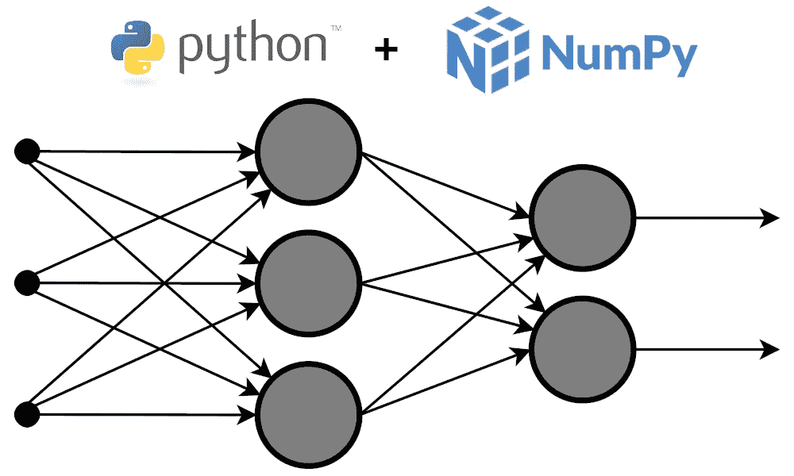
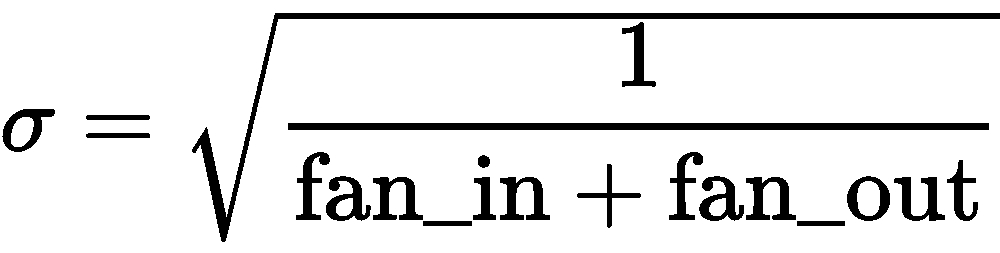

# 用 NumPy 从头实现一个神经网络

> 原文：<https://pub.towardsai.net/implement-a-neural-network-from-scratch-with-numpy-67db290771b?source=collection_archive---------1----------------------->

## [机器学习](https://towardsai.net/p/category/machine-learning)，[编程](https://towardsai.net/p/category/programming)

## …一件没有你想象的那么难的事情

背景图片来源:[维基共享资源](https://commons.wikimedia.org/wiki/File:Multi-Layer_Neural_Network-Vector-Blank.svg)

我认为真正理解神经网络如何工作的最好方法是从头开始实现一个神经网络。这正是我在这篇文章中要做的。我将创建一个神经网络类，我想以这样一种方式来设计它，以便更加灵活。我不想在其中硬编码特定的激活或损失函数，或优化器(即 SGD，Adam，或其他基于梯度的方法)。我将把它设计成从类外部接收这些，这样人们就可以获取该类的代码，并向它传递他想要的任何激活/丢失/优化。因此，我将实现激活和损失函数，以及优化器类，我们希望在这里将它们作为独立于`NeuralNetwork`类的东西使用。我们需要激活/损失函数及其导数。

为了允许批量大于 1，我们的激活和损失函数应该处理矩阵输入。这些矩阵中的行将代表不同的数据点，列将是特征。我们的网络将允许 2 种激活功能:隐藏层和输出层。隐藏层激活应该对它们的输入向量进行元素化操作，因此它们的导数也是元素化的，为每个数据点返回一个向量。但是输出激活应该允许基于输入向量中的所有元素来计算输出向量中的每个元素。那就是能够使用 softmax 激活。正因为如此，它们的导数需要返回一个雅可比矩阵(一个由每个输出函数对每个输入分量的偏导数组成的矩阵；你可以在[维基百科](https://en.wikipedia.org/wiki/Jacobian_matrix_and_determinant)上阅读更多关于每个数据点的信息。

这里我们将只使用 ReLU 作为隐藏激活；identity 和 softmax 将用作输出激活。

我们使用 EPS 变量，它是 float64 类型的最小正表示数，以避免被 0 除。为了避免 softmax 函数中的溢出错误，我们从输入中减去了每个数据点的最大值。我们可以这样做，因为它不会改变函数的输出，因为它的效果与将该分数的两项除以相同的量相同。

损失函数应该将两个矩阵作为输入:预测的 y 和真实的 y，这两个矩阵的形式与激活函数中的相同。这些损失函数应该为每个数据点输出一个数字。它们的导数应该为每个数据点输出一个行向量，所有数据点都堆叠成一个 3 维的数组。这个输出形状需要能够使用 NumPy 的`matmul()`函数与输出激活的导数相乘。注意下面的`expand_dims()`函数的使用，该函数用于返回所需的形状。

这里我们将只使用带动量的随机梯度下降作为优化方法，但是还有更多基于梯度的方法。一些流行的选择是亚当，RMSprop，阿达格拉德。为了让我们的神经网络类能够处理所有这些，我们将把优化器作为一个单独的类来实现，使用一个返回更新参数的`.update(old_params, gradient)`方法。神经网络类将接收一个优化器作为参数。所以，想要使用其他优化方法的人可以创建一个具有所需接口的类，并在实例化时将其传递给我们的神经网络类。

下面是新币+动量优化器:

为了将分类任务中的分类标签转换为一键编码，我们将使用`to_categorical()`实用函数:

现在，让我们从 NeuralNetwork 类的代码开始。实例化方法需要以下参数:

*   **层**:由每层(包括输入和输出层)的节点数组成的列表
    例如:【5，10，2】表示 5 个输入，10 个隐层节点，2 个输出节点
*   **隐藏 _ 激活**:激活隐藏层；一个元组形式(activation_function，its_derivative)
    这个激活函数和它的导数应该在输入数组
    上执行它们的任务，例如:(relu，d_relu)
*   **输出 _ 激活**:输出层激活；一个形式元组(activation_function，its_derivative)
    这个激活函数将一个形状数组(n，m)作为输入；n 个样本，m 个神经元在输出层；并返回 shape (n，m)数组；输出数组中一行上的每个元素都是输入数组中该行上所有元素的函数输出。
    它的导数将一个类似于激活所采用的数组作为输入，但它返回一个 shape (n，m，m)数组，该数组是一堆雅可比矩阵，每个样本一个。
*   **loss** :一个形式元组(loss_function，its _ derivative)
    loss 函数取形状(n，m)的两个数组(预测 y 和真实 y)作为输入；n 个样本，输出层 m 个神经元；并返回 shape (n，1)数组，其元素是每个样本的损失。
    它的导数将 shape (n，m)的数组作为输入，并返回 shape (n，1，m)中的一个，该数组是由 m 个输入变量中的每一个的导数 w.r.t .组成的行向量的堆栈。
    例如:(分类 _ 交叉熵，d _ 分类 _ 交叉熵)
*   **优化器**:有方法的对象。update(old_params，gradient)返回新的参数
    ，例如:SGD()

然后，它使用 Xavier 初始化方法的变体初始化其权重和偏差。也就是说，我们从均值为 0 且标准差为的正态分布中得出权重和偏差:

其中`fan_in`和`fan_out`分别是前一层的节点数和下一层的神经元数。权重矩阵中的行数与前一层中的节点数相匹配，列数与下一层中的节点数相匹配。偏差是行向量，其元素数量与下一层中的节点数量相匹配。

为了方便地进行参数更新过程，我们将创建一个`.__flatten_params(weights, biases)`方法，将权重矩阵列表和作为输入接收的偏差向量转换为扁平向量。我们还需要一个`.__restore_params(params)`方法，将参数的扁平向量转换回权重和偏差列表。注意，方法名前面的 2 个下划线仅仅意味着该方法在 OOP 术语中是私有的。这只是意味着该方法应该只在类内部使用。

`.__forward(x)`方法通过网络传递输入数组 x，在这样做的同时，它跟踪每层的输入和输出数组。然后，它将此作为一个列表返回，其中第 I 个元素是一个形式为[第 I 层的输入，第 I 层的输出]的列表。我们将需要这些数组来计算后向传递中的导数。

`.__backward(io_arrays, y_true)`方法计算梯度。它将一个由`.__forward(x)`方法返回的表单列表和一个包含基本事实 y 的数组作为输入。它使用反向传播算法计算权重和偏差的梯度。然后它返回一个元组(d_weights，d _ biases)。

协调所有培训的方法是`.fit(x, y, batch_size, epochs, categorical)`，其中:

*   `x`是输入数据
*   `y`是地面真理
*   `batch_size`是一批数据的大小
*   `epochs`是所有输入数据的迭代次数
*   `categorical`是一个可选参数，当设置为 true 时，将 y 转换为一键编码

对于每批数据，它使用`.__forward()`和`.__backward()`方法计算梯度，然后使用`.__flatten_params()`拉平网络的当前参数和梯度。之后，使用`self.optimizer.update()`计算新的参数，然后使用`.__restore_params()`将返回的向量恢复为正确的格式，并将其分配给`self.weights, self.biases`。每批结束时，打印进度和平均损失。维护并返回每个时期结束时所有损失值的列表。

默认情况下，在输入 x 通过网络后，`.predict()`方法将返回输出节点中的精确值。如果 labels 参数设置为 true，则返回预测的标签；这大概就是你在一个分类问题中想要的。

默认情况下，`.score()`方法返回平均损失。如果 accuracy 设置为 true，那么将返回精度。请注意，在分类问题中，如果您想要损失，那么 y 应该以一键编码格式提供，否则，如果您想要返回准确性，那么 y 应该是常规的类标签。

最后，我们希望能够在本地保存参数，这样我们就不必在每次想要进行预测时训练我们的模型。注意，下面的方法只能保存和加载权重和偏差，而不能保存和加载关于层、激活、损失函数和优化器的全部信息。因此，您还应该保存用于实例化神经网络的代码。

以下是完整代码:

*我希望这些信息对您有用，感谢您的阅读！*

这篇文章也贴在我自己的网站[这里](https://www.nablasquared.com/implement-a-neural-network-from-scratch-with-numpy/)。随便看看吧！