# 从头开始实现你的第一个人工神经元

> 原文：<https://pub.towardsai.net/implement-your-first-artificial-neuron-from-scratch-dc01b9505c18?source=collection_archive---------0----------------------->

## [深度学习](https://towardsai.net/p/category/machine-learning/deep-learning)

## 使用 python 从头开始理解、实现和可视化人工神经元。

由[杰西·奥里科](https://unsplash.com/@jessedo81?utm_source=unsplash&utm_medium=referral&utm_content=creditCopyText)在 [Unsplash](https://unsplash.com/s/photos/science?utm_source=unsplash&utm_medium=referral&utm_content=creditCopyText) 上拍摄的照片

# 介绍

沃伦麦卡洛克和沃尔特皮茨在 1943 年首次提出了人工神经元，这是一个高度简化的计算模型，类似于人脑所拥有的神经元的行为。在我们深入研究人工神经元的概念之前，让我们先来看看生物神经元。

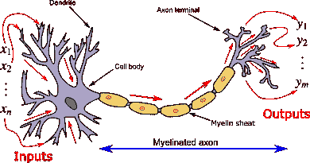

图片来源:维基百科

# 生物神经元

生物神经元通过树突接收输入信号，并将它们发送到作为神经元处理单元的胞体或细胞体，然后经过处理的信号通过轴突传递到其他神经元。两个神经元相遇的连接点被称为突触，突触的程度决定了传递给其他神经元的信号强度。

# 人工神经元——麦卡洛克皮茨神经元(MP 神经元)

麦卡洛克皮茨神经元模型也称为**阈值逻辑单元(TLU)**或**线性阈值单元**，因神经元的输出值取决于一个**阈值**而得名。生物神经元的工作激发了这个人工神经元，它的结构和行为与生物神经元相似。

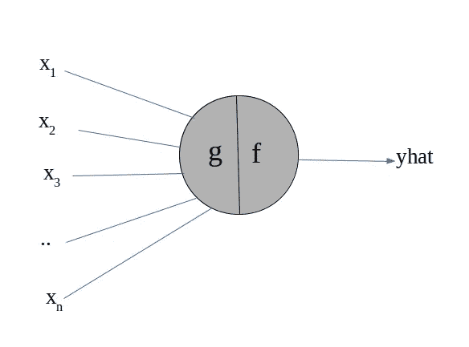

作者图片

**输入向量【x₁x₂x₃…xₙ】**—在人工神经元中，输入向量充当神经元的输入，其行为类似于生物神经元中的树突。

**函数 f(x)** —在人工神经元中，函数 f(x)是一个求和函数，其行为类似于生物神经元中的体细胞。

# A.MP 神经元模型

> **我们可以将模型定义为因变量和自变量之间真实关系的近似函数。**

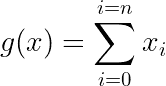

**【x₁x₂x₃…xₙ】—MP 神经元模型的输入或属性。**

**b —阈值，这是 MP 神经元模型中的唯一参数。**

函数 g(x)对所有输入进行求和，函数 f(x)对函数 g(x)返回的输出应用阈值。函数 f(x)返回的值是一个布尔值，也就是说，如果输入的总和大于固定阈值(b ),则该神经元被激活，否则该神经元被激发。

## 关于 MP 神经元你需要知道的事情

1.  它只接受二进制数据，即输入向量 **X ϵ {0，1}。**
2.  神经元执行的任务是二元分类，即 **Y ϵ {0，1}。**

## MP 神经元的几何解释

为了简单起见，让我们考虑在数据集中只有两个特征，因此输入向量看起来像，**x =【x₁x₂】，**并且函数看起来像…

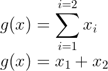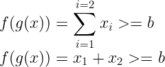

将其转换成线性方程 ie， **y = m*x + c** 的形式

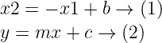

比较等式(1)和(2)，我们发现…

线的斜率 **m = -1** (对于任何数据集都是固定的)。

线的 y 截距 **c= b** (我们唯一能改变的就是调优模型)。

> **注意:**位于该线上方的所有点被归类为正(1)，位于该线下方的所有点被归类为负(0)。

**当我们绘制直线 x2 = -x1 + 1**

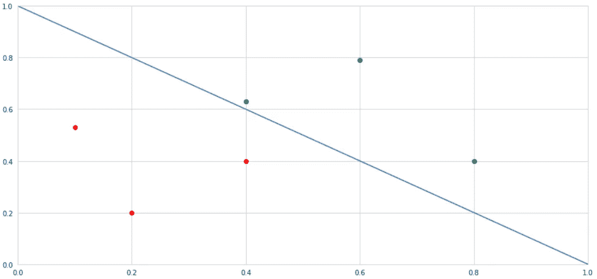

作者图片

## 总结:

1.  线以上的所有点(绿点)都被归类为阳性。
2.  线以下的所有点(红点)都被归类为负值。
3.  MP 神经元模型只有在点是**线性可分的时候才起作用。**
4.  MP 神经元模型中线的斜率是固定的，即-1。
5.  我们有能力改变 y 轴截距(b)的值。

# B.损失函数

损失是模型在其训练阶段发生的误差或错误，可以使用均方误差损失函数来计算。

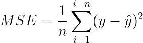

# C.最优化算法

由于模型中唯一的参数是 b，我们需要选择 b 的最佳值，以减少损失。

我们可以使用**强力方法**选择 b 值，因为 b 的范围是从**【0，n】**，其中 n 是数据中特征的数量。

1.  当 **x₁ + x₂ + x₃ … xₙ =0 时，**即当特征向量看起来像**【x₁x₂x₃…xₙ]=[0 0 0…0]时，b 取最小值**
2.  **当 **x₁ + x₂ + x₃ … xₙ =n** 时，即当特征向量看起来像[x₁ x₂ x₃ … xₙ] = [1 1 1 … 1]时，b 取最大值**

**由于 b 的值位于[0，n]之间，我们可以计算 b 的每个值引起的模型损失，并从中选择最佳值。**

# **D.估价**

**我们可以使用这个简单的公式来评估模型的性能**

**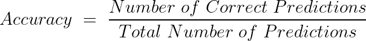**

# **E.MP 神经元模型的局限性**

*   **该模型只接受{0，1}形式的数据，我们无法向其提供真实值。**
*   **它仅用于二元分类。**
*   **只有当数据是线性可分时，它才表现良好**
*   **线方程有一个固定的斜率，所以没有改变线斜率的灵活性。**
*   **我们不能判断哪个特征更重要，也不能优先考虑哪个特征。**
*   **学习算法不是那么令人印象深刻，我们是用蛮力的方法来找阈值。**

# **让我们编码…**

****

**格伦·卡斯滕斯-彼得斯在 [Unsplash](https://unsplash.com?utm_source=medium&utm_medium=referral) 上拍摄的照片**

## **数据要求**

**我们使用 **sklearn 数据集包**中的乳腺癌数据集，我们的任务是根据提供的数据预测该人是否患有癌症**

## **A.导入基本库**

## **B.加载数据**

## **C.可视化数据**

**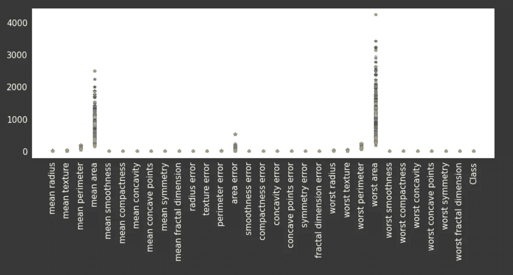**

**作者提供的图片(上述代码片段的输出)**

**从上面的图中，我们推断数据不是二进制形式，但是对于 MP 神经元模型，我们要求数据是{0，1}的二进制形式。所以让我们把这些数据转换成二进制形式。在此之前，我们需要将数据分为训练数据和测试数据**

## **D.将数据分为训练和测试数据**

## **E.宁滨数据**

**在这里，我们将数据转换为 0 和 1，以使其与 MP 神经元模型兼容，我们使用 pandas 库中的 cut 方法来完成此操作。**

**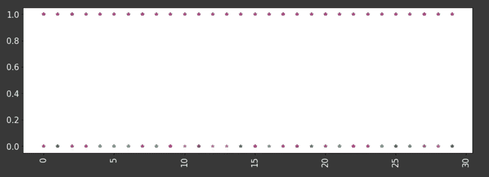**

**图片由作者提供(数据在宁滨之后)**

## **F.定义 MP 神经元**

## **G.估价**

**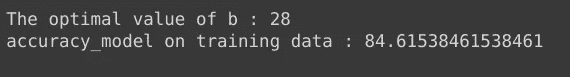**

**作者提供的图片(上述代码片段的输出)**

**在训练数据上，模型的性能相当好，即 **84.6%，**让我们可视化模型对于不同 b 值的性能。**

**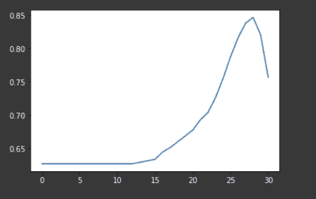**

**作者图片**

## **测试数据的性能**

****

**作者图片**

# **结论**

**我们建立了一个非常简化的生物神经元计算模型，我们在测试数据上获得了 78%的准确率，对于这样一个简单的模型来说，这已经不错了。我希望你能从这篇文章中学到一些新的东西。**

# **参考**

*   **维基百科(一个基于 wiki 技术的多语言的百科全书协作计划ˌ也是一部用不同语言写成的网络百科全书ˌ 其目标及宗旨是为全人类提供自由的百科全书)ˌ开放性的百科全书**
*   **关于深度学习的 NPTEL 课程**

# **感谢阅读😃过得愉快**