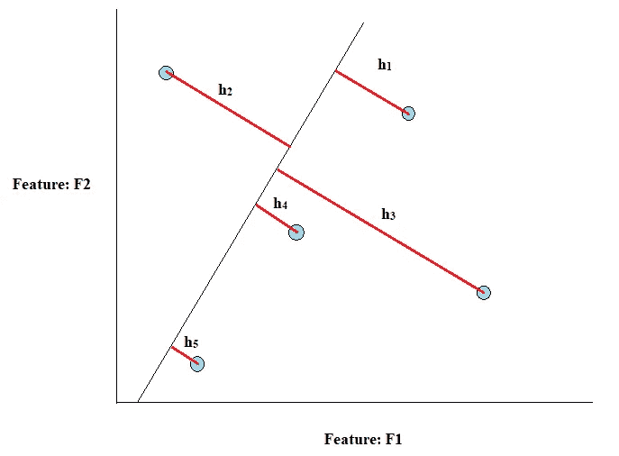
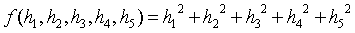
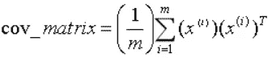
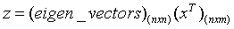
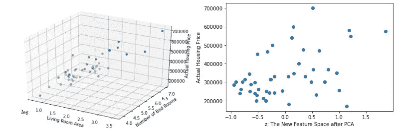

# 从零开始实现主成分分析

> 原文：<https://pub.towardsai.net/implementation-of-principal-component-analysis-from-scratch-df07c39128a8?source=collection_archive---------0----------------------->

## 我们开始吧

实时数据可能具有大量属性，这通常会使基本的探索性数据分析变得非常困难。这种数据被称为高度多维数据，其中每个属性被称为一个维度。继续处理多维数据通常会导致:

1.  **缺乏适当的数据可视化**:由于二维以上的数据无法绘制在二维空间上，决策边界可视化是不可能的。在这种情况下，模型的决策/模式识别逻辑不能被正确解释。
2.  **数据分析的麻烦**:对于这样的高维数据，数据分析变得不必要的麻烦。
3.  **有缺陷的机器学习模型开发**:很多机器算法，主要是基于树的集成模型，包括随机森林、梯度提升等。高维数据表现不佳。
4.  **深度神经网络的复杂性增加**:为高维数据设计的 DNNs 在架构方面通常很复杂，并且还会导致过拟合和随后的性能不佳。

这些问题统称为 ***维度诅咒！！！***

因此，为了避免这种情况，一种常用的技术是**主成分分析(PCA)** 。经典的说法是卡尔·皮尔逊在 1901 年发明的 ***正交线性变换***【1】。

> **PCA 背后的直觉**

所以，基本上，PCA 是一种降维算法。假设有一个二维数据，具有两个特征(维度)f1 和 f2(请看图 1):



**图一。图解解释 PCA 背后的直觉**

这里，在图 1 中，h1、h2、h3、h4 和 h5 是绘制在二维坐标空间上的 5 个数据点的垂直距离，其中坐标轴代表在**线**上的特征。这条线是代表 2 个轴(特征，F1 和 F2)的修改轴，这条线被称为 ***PCA 线*** 。现在，有无限条这样的线，但是选择最佳拟合线，使得函数 f



被最小化。因此，函数 f 是 PCA 线的代表，取决于从每个点到该线的垂直距离的平方和。

> **算法解**

*   协方差矩阵的计算:



*   计算协方差矩阵的特征向量，*cov _ matrix*【2】。
*   现在，新的特征空间被定义为，



> **用 Python 实现**

现在，转到 PCA 的实际实现。让我们以俄勒冈州波特兰市的房价数据集为例。它包含房子的大小(平方英尺)和一些卧室作为特征，房子的价格作为目标变量。该数据集可从以下网址获得

[](https://github.com/navoneel1092283/multivariate_regression) [## navoneel 1092283/多元回归

### 通过在 GitHub 上创建帐户，为 navoneel 1092283/multivariate _ regression 开发做出贡献。

github.com](https://github.com/navoneel1092283/multivariate_regression) 

**数据读入 Numpy 数组**:

```
import numpy as np
data = np.loadtxt('data2.txt', delimiter=',')
X_train = data[:,[0,1]] #feature set
y_train = data[:,2] #label set
```

**特征归一化或特征缩放**:

```
mean = np.ones(X_train.shape[1])
std = np.ones(X_train.shape[1])for i in range(0, X_train.shape[1]):
    mean[i] = np.mean(X_train.transpose()[i])
    std[i] = np.std(X_train.transpose()[i])
    for j in range(0, X_train.shape[0]):
        X_train[j][i] = (X_train[j][i] - mean[i])/std[i]
```

**PCA 算法:**

```
def PCA(X_train, k):
    **# 1\. Computation of Co-Variance Matrix:**
    cov = np.zeros((X_train.shape[1], X_train.shape[1]))
    for i in range(0, X_train.shape[0]):
        cov = cov + np.matmul(X_train[i].transpose(), X_train[i])
    avg_cov = (1/X_train.shape[0]) * cov
    **# 2\. Obtaining the eigen vectors:**
    from numpy import linalg as LA
    eigen_values, eigen_vectors = LA.eig(avg_cov)
    **# 3\. Selecting k (here 1) Principal Components:**
    z = np.matmul(eigen_vectors, X_train.T)[:k]
    return zz = PCA(X_train, 1) # Calling the PCA function
```

**原始非标准化数据和新特征空间数据的数据可视化:**

I .重新缩放或特征反规格化

```
# **Re-scaling or De-normalization:** for i in range(0, X_train.shape[1]):
    for j in range(0, X_train.shape[0]):
        X_train[j][i] = X_train[j][i] * std[i] + mean[i]
```

二。三维数据(原始特征图)和二维图(PCA 后)

```
**# Plotting the 3-D Data (extra dimension for target):**
from mpl_toolkits.mplot3d import Axes3D
import matplotlib.pyplot as plt
sequence_containing_x_vals = list(X_train.transpose()[0])
sequence_containing_y_vals = list(X_train.transpose()[1])
sequence_containing_z_vals = list(y_train)
fig = plt.figure()
ax = Axes3D(fig)
ax.scatter(sequence_containing_x_vals, sequence_containing_y_vals,
           sequence_containing_z_vals)
ax.set_xlabel('Living Room Area', fontsize=10)
ax.set_ylabel('Number of Bed Rooms', fontsize=10)
ax.set_zlabel('Actual Housing Price', fontsize=10)**# Plotting the PCA new 2-D Data (extra dimension for target):**
plt.scatter(z[0], y_train)
plt.xlabel('z: The New Feature Space after PCA')
plt.ylabel('Actual Housing Price')
```



**图二。使用 PCA 将三维绘制成二维**

从图 2 可以看出，三维坐标空间中的三维数据已经有效地拟合到图中，并映射到二维坐标空间，因此，主成分分析(PCA)已经从零开始成功地实现。

> **参考文献:**

[1][https://en.wikipedia.org/wiki/Principal_component_analysis](https://en.wikipedia.org/wiki/Principal_component_analysis)

[2][https://towards data science . com/visualizing-enforcern-and-features vectors-e 2 F9 E3 AC 58d 7](https://towardsdatascience.com/visualizing-eigenvalues-and-eigenvectors-e2f9e3ac58d7)