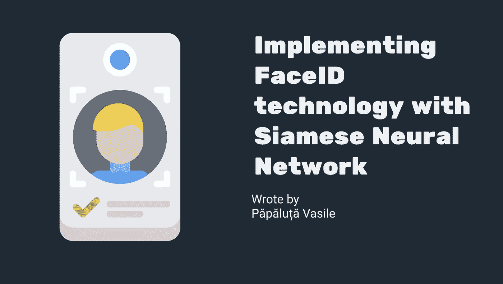
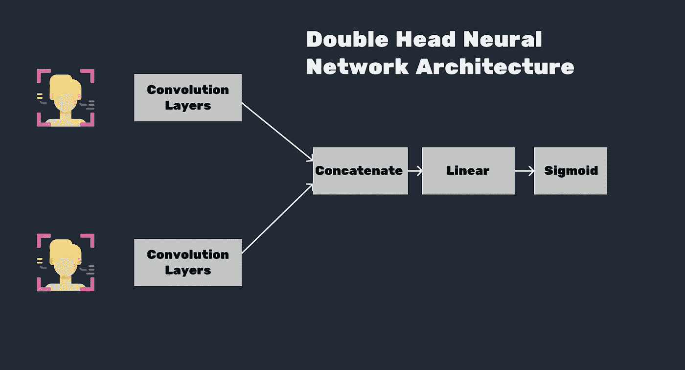
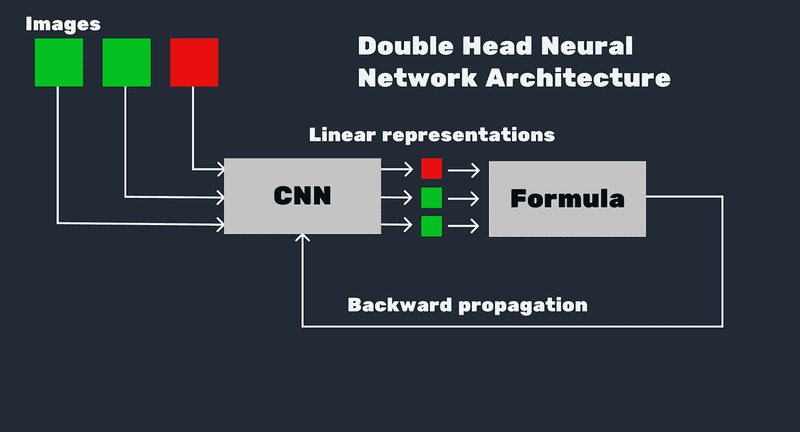
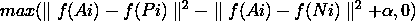

# 用连体神经网络实现 FaceID 技术

> 原文：<https://pub.towardsai.net/implementing-faceid-technology-with-siamese-neural-network-177d33ac0bc4?source=collection_archive---------4----------------------->

## [机器学习](https://towardsai.net/p/category/machine-learning)

## 了解更多奇怪的网络。



Nikita Golubev 的 flaticon 图标

Face ID 是一种技术，它允许设备只允许被允许的身份访问自己。它利用这一点来看这个人的脸，如果它被认为是一个有权限的人，系统就会给它。很长一段时间以来，它是通过不同的技术来实现的，但是现在，在人工神经网络的大规模发展和 CNN 在计算机视觉中实现高性能之后，神经网络已经成为一种更有吸引力的实现方式。

# 第一种方式——简单的 CNN。

最直接的方法是建立一个简单的 CNN，将用户的脸分类为这个设备的“拥有者”/“非拥有者”。然而，这种实现有一些缺点。

*   训练一个神经网络需要大量的时间和计算能力，尤其是 CNN。
*   CNN 应该为每个人分别培训。

因此，如果用户必须等待 3 到 5 个小时来训练能够识别自己的模型，他/她就不会购买设备。另外，它需要大量的图像。想象一下，用户必须拍摄大约 1000 张自己的自拍才能进行人脸识别。

# 第一种方式—双头神经网络。

第二种方式是采取更硬的神经网络架构——双头神经网络。这个想法很简单。网络拍摄 2 幅图像，一幅保存在所有者的设备中，另一幅来自相机。CNN 应该把他们归类为“相同的”/“不相同的”，或者给他们一个排名。



Freepik 的 flaticon 中的图标

即使这种架构是一种更好的方法，它也有其局限性。

*   它可能不是在所有情况下都有效，即使它是在许多不同人的图像上训练的。
*   此外，即使 CNN 将在服务器上而不是在终端设备上被训练，这也可能是计算和耗时的。

所以我们需要一个更好的方法。

# 暹罗神经网络

暹罗神经网络(简称 SNN)实际上是一个简单的 CNN，需要一点点不同的方式来训练。在几乎所有的网络中，我们将数据集分成几批，加载器将它们发送到网络。snn 正在使用一种叫做三联体训练的方法。所以它是如何工作的。
基本上，我们需要两种类型的图像，一种是“车主脸”的照片，另一种是“非车主脸”的照片，通常是随机的人物照片。在创建数据集的过程中，我们从这些图像中创建三个一组，同一个人的两张不同的照片，以及一个随机的人的一张照片。下面的代码展示了在 PyTorch 中实现的 Dataset 类。

```
# Defining the Dataset
class SNN_Dataset(data.Dataset):
    def __init__(self, root, ME_DIR, NOT_ME_DIR):
        self.root = root
        ME_PATHS = listdir(ME_DIR)
        NOT_ME_PATHS = listdir(NOT_ME_DIR)
        ME_PATHS = [join(ME_DIR, img_path) for img_path in ME_PATHS]
        NOT_ME_PATHS = [join(NOT_ME_DIR, img_path) for img_path in NOT_ME_PATHS]
        ME_PAIRS = list(itertools.permutations(ME_PATHS, 2))
        self.TRIPLETS = list(itertools.product(ME_PAIRS, NOT_ME_PATHS))
        self.TRIPLETS = [list(triplet) for triplet in self.TRIPLETS]
        for i in range(len(self.TRIPLETS)):
            self.TRIPLETS[i] = list(self.TRIPLETS[i])
            self.TRIPLETS[i][0] = list(self.TRIPLETS[i][0])
            self.TRIPLETS[i][0].append(self.TRIPLETS[i][1])
            self.TRIPLETS[i].pop(-1)
            self.TRIPLETS[i] = self.TRIPLETS[i][0]
        random.shuffle(self.TRIPLETS)
    def __getitem__(self, index):
        img_triplet = [Image.open(img).convert('RGB') for img in self.TRIPLETS[index]]
        img_triplet = [transforms.Scale((244, 244))(img) for img in img_triplet]
        img_triplet = [transforms.ToTensor()(img) for img in img_triplet]
        return img_triplet[0], img_triplet[1], img_triplet[2]
    def __len__(self):
        return self.TRIPLETS
```

网络从三元组中取出每一幅图像，并计算图像的线性表示。从线性代数的观点来看，神经网络实际上是一个非常庞大和复杂的线性和非线性变换。因此，人工神经网络的每个输出都是输入的线性表示。采用线性表示后，输出将进入下面的公式。如果第一个到第二个图像的线性表示彼此靠近(欧几里德范数低)，并且第一个和最后一个图像的线性表示远离(欧几里德范数高)，则在加上α之前，max 函数的第一项的值将是负的。因此，当 alpha 为 0 时，如果第一个图像是同一个人，则该公式的将为 0。这就是为什么我们在公式中需要α。



这里 A 是新图像的线性表示，P 是正片，N 是负片。

Alpha 可以解释为设置网络灵敏度的参数(从-1 到 1)。因此，灵敏度越高，对同一个人图像的要求就越低，反之亦然。同样，如果你有很多图像，你可以将 alpha 设置为较高的值，当图像较少时，可以设置为较小的负值。
当我在我的图像上训练网络时，a 将 alpha 设置为 0.5，并使用 7 张我的图像和 10 张随机图像，花了 5 个小时在具有 8 个内核的 PC 上训练网络(我使用组合来生成数据集)。然而，当我只使用我的一位同事的 2 张照片和 5 张随机照片来训练网络时，训练网络的时间不超过 15 分钟，但它也采用了更低的 alpha，甚至是负值。所以你可以训练一个 alpha 值很高的网络来推动网络更好地学习，在生产阶段降低它。

对于反向传播，使用从公式中得到的值。
下面是结果。
注:瓦西里卡——意思是对我的名字——瓦西里的爱抚。


代码库:[https://github.com/ScienceKot/SNN.git](https://github.com/ScienceKot/SNN.git)

灵感——安德烈·布尔科夫的百页机器学习书