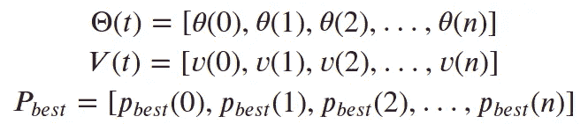
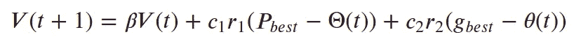
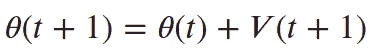
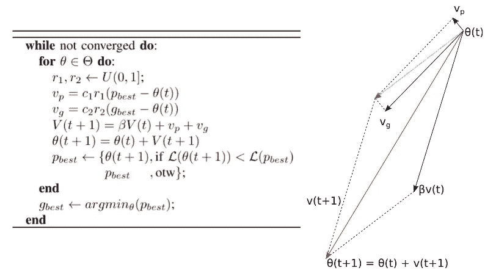
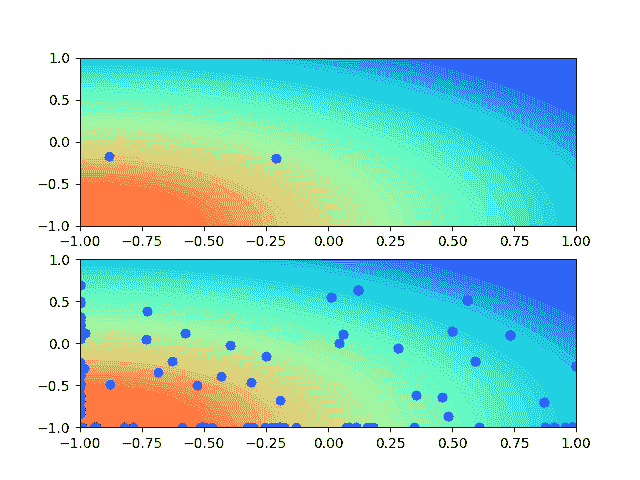
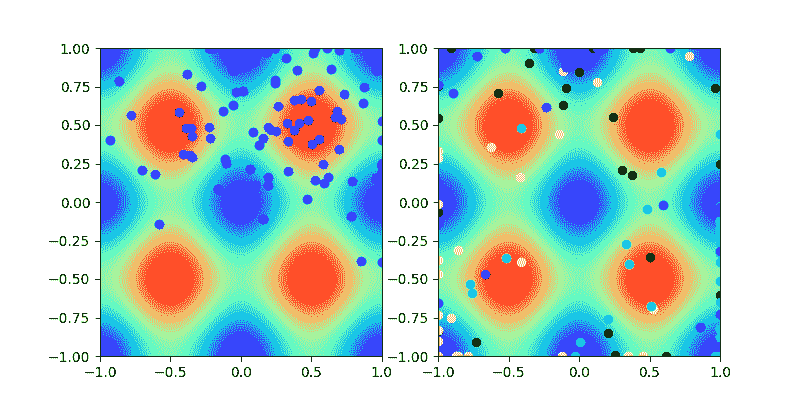

# 在 Tensorflow 中实现粒子群优化

> 原文：<https://pub.towardsai.net/implementing-particle-swarm-optimization-in-tensorflow-b501ca4a3c17?source=collection_archive---------2----------------------->

嘿，你们！！我在这里展示的是粒子群优化算法的 TensorFlow 实现。简述 PSO(粒子群优化)及其在 Tensorflow 中的实现。

> TL/DR:使用 tensorflow 的 PSO 实现。[链接到 colab](https://colab.research.google.com/drive/1sbjMwPR9L8gqopqawhsMMAgNvVjUEFIZ?usp=sharing) 。

照片由[迈赫迪·塞佩赫里](https://unsplash.com/@mehdisepehri?utm_source=medium&utm_medium=referral)在 [Unsplash](https://unsplash.com?utm_source=medium&utm_medium=referral) 拍摄

PSO 有大量的资源，所以我将避免详细解释算法，并在这里留下[原始论文](https://ieeexplore.ieee.org/abstract/document/488968?casa_token=nzrs9VtO2iQAAAAA:IO-ohAPG_GzEqF7SQ-G9Lriz4KTQprThJrh0MHFzbEJ5HdBI6Lri5vbk0bzUpbUVUYT-lX2gGg)和[维基百科文章的链接。](https://en.wikipedia.org/wiki/Particle_swarm_optimization)目前，可以说 PSO 是一种基于蜂群的元启发式优化。群体中的每个粒子将使用其个人信息加上群体信息，试图找到函数的最优值。那些信息分别被称为 *p-best* best 和 *g-best* ，它们基本上是粒子访问的最佳地点，也是所有蜂群看到的最佳地点。

> 使用 tensorsflow 进行 PSO 的一个好处是，你可以将所有的群体信息作为 tensor 来处理。然后，您可以一次性更新。所有的群体速度和位置可以一次更新。

每个粒子都会有一个位置 **( *𝜃*** )、一个速度( ***𝑣*** )、一个个体最佳( ***𝑝𝑏𝑒𝑠𝑡*** )。并且蜂群会有全局最优( ***𝑔𝑏𝑒𝑠𝑡*** )，这是任何粒子曾经访问过的最优位置。因为我们正在使用`tensorflow`，我们可能在一个张量中有这个信息，避免在群体上循环，所以我们将有:

然后，我们可以在一次操作中更新整个群体的速度:

，其中 ***𝑐1*** 和 ***𝑐* 2** 分别为认知和社会系数， ***𝑟* 1** 和 ***𝑟* 2** 为[-1，1]范围内均匀分布的随机数。则粒子位置被更新为:

下面，我将所有这些步骤放在 PSO 算法中，右图帮助我们理解单个粒子的行为。请注意，合成向量 ***v(t+1)*** (红色)基本上是由给定迭代中粒子的三种运动组成的，即惯性( **βv(t)** ，这是一个与上一次迭代指向相同方向的向量)、本能运动( ***vp*** ，这是一个指向 ***pbest*** 的向量)和集体运动(**)**

还有这个算法的`tensorflow`实现(你也可以查看 [colab](https://colab.research.google.com/drive/1sbjMwPR9L8gqopqawhsMMAgNvVjUEFIZ?usp=sharing) ):

你注意到了吗？只有一个`for`循环，用于迭代。因为我们处理的是张量，所以没有必要遍历群中的每个粒子。

最后，我们来举个例子。我们可以尝试在一个球面上找出最优解，这是一个简单的函数，有助于可视化群体的行为。所以我们的适应度函数将被定义为:

然后，我们可以实例化上面定义的类来找到这个球体的中心:

这段代码将创建一个由 100 个均匀分布在[-1，1]之间的粒子组成的群体(因为它是用之前定义的类的默认参数来构建群体的)。优化过程可以在下一个动画中看到:

作者图片

现在，让我们比较不同大小的蜂群。贝娄，我们有一个仅由 2 个粒子组成的蜂群，另一个由 100 个粒子组成(我将轨迹留在顶部图中，因为很难跟踪只有 2 个粒子的运动)。请注意，对于较小的群体来说，找到收敛点有多难:

作者图片

这就是所谓的香草粒子群算法，基本和最简单的版本。它是一个单峰优化器，这意味着它只能在不超过一个最优点的函数中找到最优。有许多不同版本的粒子群算法，其中许多提出了改变来处理这一问题。但是一个简单的解决方案是多个群体。下面，在左图中，我们只有一个 100 人的群体试图找到多个最佳点。在右边，我们把这个群体分成四组，每组 25 个个体，很容易注意到他们可以更容易地找到多个最优解。记住:那只是一个例子。有更好的方法来处理多模态优化。

作者图片

就是这样！希望你喜欢这本书。如果您有任何问题或建议，请联系我！祝你愉快！