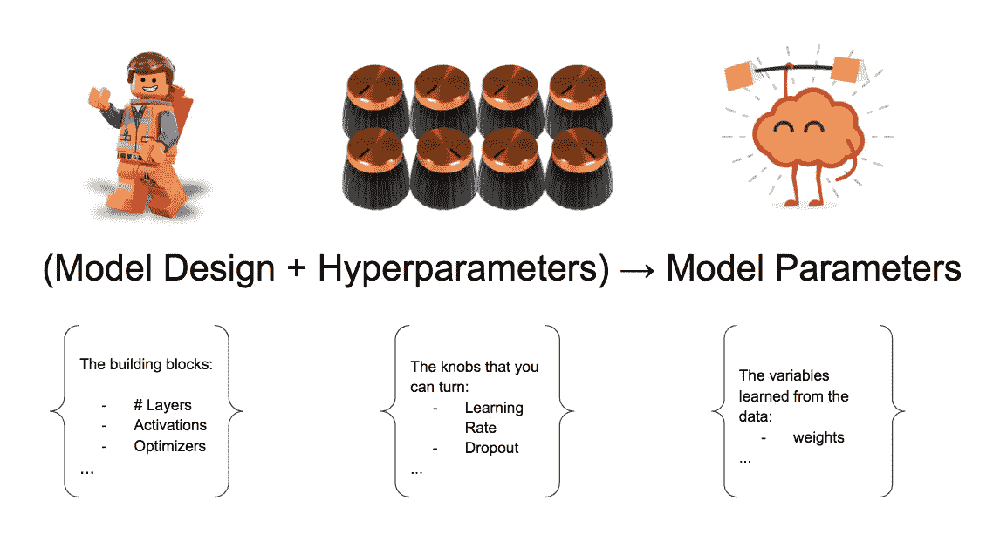
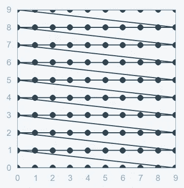
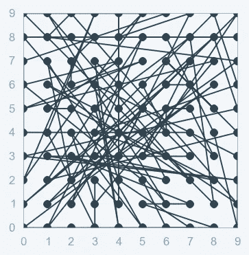
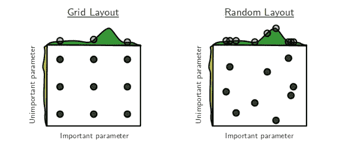

# 定义模型时选择正确超参数的重要性

> 原文：<https://pub.towardsai.net/importance-of-choosing-the-correct-hyper-parameters-while-defining-a-model-c6084bc49fc2?source=collection_archive---------3----------------------->


资料来源:联合国人类住区规划署

## 面向 AI 的超参数优化|

> 通常被认为是优化机器学习算法最棘手的部分。正确的超参数调整可以节省大量时间，并有助于更快地部署 ML 模型

我们所有的机器学习爱好者肯定都参加过黑客马拉松，以测试我们在机器学习方面的技能。嗯，我们需要解决的一些问题陈述可能与回归有关，一些可能与分类有关。让我们假设，我们在一个，我们已经完成了 ***预处理数据的所有艰苦工作，努力生成新的特征，将它们应用于我们的数据以获得基础模型。***

所以，现在我们有了基本模型，我们想在看不见的数据上测试这个模型，我们这样做了。我们看到一个**(可能是基于问题陈述的其他东西)*，我们觉得还可以。但是，我们仍然可以通过调整参数来改善模型的性能。 ***熟悉这种感觉？****

*我们该怎么做？ ***参数*** *和* ***超参数*** 。我相信我们在机器学习中一定听过很多这些术语，在深度学习中更是如此。让我们看看这些术语是什么意思。*

****模型参数*** 是分类器或其他 ML 模型在训练过程中学习到的训练数据的属性。*例如*，在一些 NLP 任务的情况下:*词频、句子长度、每句话的名词或动词分布、每个单词的特定字符 n 元文法的数量、词汇多样性*等。*每个实验的模型参数*不同，取决于数据类型和手头的任务。*

****另一方面，模型超参数*** 对于类似的模型是通用的，不能在训练期间学习，而是预先设置的。 **NN** ( *神经网络*)的一组典型超参数包括*隐层的数量和大小、权重初始化方案、学习率及其衰减、漏失和梯度限幅阈值等。**

*换句话说， ***参数*** 是那些像*权重和偏差*一样被机器学习的参数。 ***超参数*** 是我们提供给神经网络的参数，例如- *隐藏层数、输入特征、学习率、激活函数等*。*

> *超参数是我们在构建机器/深度学习模型时可以调整的旋钮。简单的..！！！*

**

*超参数设计的简要描述*

*现在，让我们来看看机器学习算法的超参数调整的类型。我们将一个一个地看到他们。*

****网格搜索(GS)*:**——顾名思义， ***网格搜索是在*** 网格中扫描数据为给定模型配置最优参数的过程。这意味着参数搜索是在所选数据的整个网格中进行的。*

**

*上图显示了使用 SVM 模型的网格搜索*

*这很重要，因为模型的整体性能取决于指定的超参数。*让我们看一个在超参数调整模型上执行网格搜索的基本代码片段。**

```
****#Example of Grid Search*** *# Load the dataset*
x, y = load_dataset()*# Create model for KerasClassifier*
def create_model(hparams1=dvalue, hparams2=dvalue, ... hparamsn=dvalue): ...model = KerasClassifier(build_fn=create_model) *# Define the range*
hparams1 = [2, 4, ...]
hparams2 = ['elu', 'relu', ...]
...
hparamsn = [1, 2, 3, 4, ...]*# Prepare the Grid*
param_grid = dict(hparams1=hparams1, 
                  hparams2=hparams2, 
                  ...
                  hparamsn=hparamsn)*# GridSearch in action*
grid = GridSearchCV(estimator=model, 
                    param_grid=param_grid, 
                    n_jobs=, 
                    cv=,
                    verbose=)
grid_result = grid.fit(x, y)*# Show the results*
print("Best: %f using %s" % (grid_result.best_score_, grid_result.best_params_))
means = grid_result.cv_results_['mean_test_score']
stds = grid_result.cv_results_['std_test_score']
params = grid_result.cv_results_['params']
for mean, stdev, param in zip(means, stds, params):
    print("%f (%f) with: %r" % (mean, stdev, param))*
```

****执行网格搜索时要记住的一点*** 就是我们的参数越多，参数执行搜索所占用的时间和空间就越多。这也是 ***维度的诅咒*** 出现的原因。这意味着我们添加的维度越多，搜索的时间复杂度就越大(*增加一个指数因子*，最终使这种策略变得不可行。*

******

****随机搜索(RS):*** 另一种超参数调优叫做随机搜索。随机搜索完成随机选择参数的工作。它类似于网格搜索，但它比网格搜索产生更好的结果。 ***随机搜索的缺点是，在计算*时会产生很高的方差。**由于参数的选择是完全随机的；由于没有智力被用来对这些组合进行取样，所以运气发挥了它的作用。*

**

**上图显示了随机搜索的基本直觉**

*它擅长测试大范围的值，通常它很快达到一个非常好的组合，但问题是它不能保证给出最佳的参数组合。*

```
****## Example of Random Search***
*# Load the dataset*
X, Y = load_dataset()*# Create model for KerasClassifier*
def create_model(hparams1=dvalue, hparams2=dvalue, ... hparamsn=dvalue): ...model = KerasClassifier(build_fn=create_model) *# Specify parameters and distributions to sample from*
hparams1 = randint(1, 100)
hparams2 = ['elu', 'relu', ...]
...
hparamsn = uniform(0, 1)*# Prepare the Dict for the Search*
param_dist = dict(hparams1=hparams1, 
                  hparams2=hparams2, 
                  ...
                  hparamsn=hparamsn)*# Search in action!*
n_iter_search = 16 *# Number of parameter settings that are sampled.*
random_search = RandomizedSearchCV(estimator=model, 
                                   param_distributions=param_dist,
                                   n_iter=n_iter_search,
                                   n_jobs=, 
								   cv=, 
								   verbose=)
random_search.fit(X, Y)*# Show the results*
print("Best: %f using %s" % (random_search.best_score_, random_search.best_params_))
means = random_search.cv_results_['mean_test_score']
stds = random_search.cv_results_['std_test_score']
params = random_search.cv_results_['params']
for mean, stdev, param in zip(means, stds, params):
    print("%f (%f) with: %r" % (mean, stdev, param))*
```

**

**上图通过在两个超参数空间上搜索最佳配置来比较这两种方法。**

*但是，不幸的是，网格搜索和随机搜索都有一个共同的缺点，那就是 ***“每个新的猜测都独立于之前的运行！”*** 这意味着 **GS** 和 **RS** 都不考虑超参数搜索的先前计算。*

*因此，需要一种新型的超参数搜索，其既有效又通过使用过去作为资源来改进接下来的运行，从而有效地驱动搜索和实验。*欢迎贝叶斯优化。**

****贝叶斯优化* :** 贝叶斯优化试图用最少的步骤找到全局最优。基于称为代理的目标函数的模型选择下一组超参数。为了清楚地理解贝叶斯优化，首先，我们需要理解代理函数的概念。*替代函数，也称为响应面，是使用先前评估的目标函数的概率表示*。代理函数比目标函数更容易优化。*

****贝叶斯优化*** *的工作原理是构建一个最能描述你想要优化的函数的后验(*可能未观测值分布，以观测值为条件*)函数分布(高斯过程)。随着观察值数量的增加，后验分布得到改善，算法变得更加确定参数空间中的哪些区域值得探索，哪些区域不值得探索。**

**高斯过程是一种随机过程(*由时间或空间索引的随机变量的集合*)，使得这些随机变量的每个有限集合都具有多元正态分布，即它们的每个有限线性组合都是正态分布的。*在概率论和统计学中，*多元正态分布、多元高斯分布或联合正态分布是一维(单变量)正态分布向更高维度的推广。**

*高斯过程属于称为***【基于模型的连续优化(SMBO)*** *的算法类别。* [**序贯模型优化(SMBO)方法(SMBO)**](https://papers.nips.cc/paper/4443-algorithms-for-hyper-parameter-optimization.pdf) 是贝叶斯优化的一种形式化。序列是指一个接一个地运行试验，每次都通过应用贝叶斯推理和更新概率模型(代理)来尝试更好的超参数。替代模型的几种常见选择是[](https://en.wikipedia.org/wiki/Gaussian_process)****[**随机森林回归**](http://aad.informatik.uni-freiburg.de/papers/13-GECCO-BBOB_SMAC.pdf)**和树 Parzen 估计器(TPE)。*******

```
**********The Steps in Bayesian Distribution(Sequential Model-Based Optimization (SMBO)):-******1.A domain of hyperparameters over which to search******2.An objective function which takes in hyperparameters and outputs a score that we want to minimize (or maximize)******3.The surrogate model of the objective function******4.A criteria, called a selection function, for evaluating which hyperparameters to choose next from the surrogate model******5.A history consisting of (score, hyperparameter) pairs used by the algorithm to update the surrogate model**********
```

********代码中的贝叶斯优化:-********

```
**********#Bayesian Optimization in code***def data():"""
    Defining a function that defines the data
    """*# Load / Cleaning / Preprocessing*
    ...
    return x_train, y_train, x_test, y_test

def model(x_train, y_train, x_test, y_test):"""
    Model providing function:
    Create Keras model with double curly brackets dropped-in as needed.

    """

    return {'loss': <metrics_to_minimize>, 'status': STATUS_OK, 'model': model}

*# SMBO - TPE in action*
best_run, best_model = optim.minimize(model=model,
                                      data          =data,
                                      algo=tpe.suggest,
                                      max_evals=,
                                      trials=Trials())*# Show the results*
x_train, y_train, x_test, y_test = data()
print("Evalutation of best performing model:")
print(best_model.evaluate(x_test, y_test))
print("Best performing model chosen hyper-parameters:")
print(best_run)*******
```

*********Bayes SMBO*** 只要资源对我们来说不是约束，大概是最好的候选，但是也要考虑用随机搜索建立基线。毕竟，超参数调整的最终目标是减少搜索最佳参数的时间，我们希望在尽可能短的时间内实现这一目标。 ***那么，可以优化训练时间吗？”。*********

*********是的，我们可以。* *进入提前停止*** *。* *当训练没有朝着正确的方向进行时，提前停止提供了防止资源浪费的伟大机制。*******

******许多著名的深度学习框架都提供了提前停止的功能，甚至更好的是一套超级有用的 ***回调*** *。*******

```
*********A callback is a set of functions to be applied at given stages of the training procedure.*** **#Example in Keras**
keras.callbacks.Callback()**#EarlyStopping**
keras.callbacks.EarlyStopping(monitor='val_loss', min_delta=0, patience=0, 
              verbose=0, mode='auto', baseline=None, restore_best_weights=False)******
```

******如果我们还记得，在文章的开始，我们将其命名为 ***定义模型时选择正确超参数的重要性。*** *我想现在可以看出背后的想法了。*由于超参数调整占用了处理模型的大部分时间，并且它们决定了性能，从长远来看，我们需要采取措施来调整它们，这反过来又决定了模型的稳定性。*为我们的模型选择正确的超参数不仅会决定模型达到收敛所需的时间，还会决定更快获得更好结果所需的决策和迭代*。******

******下次见…再见..！！！******