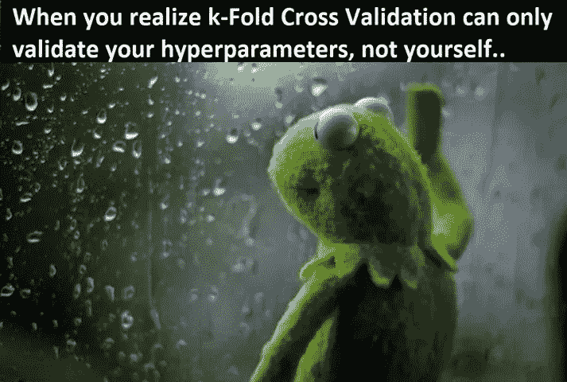
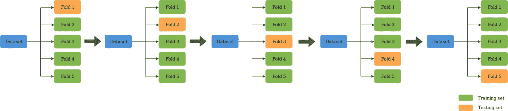
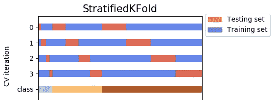
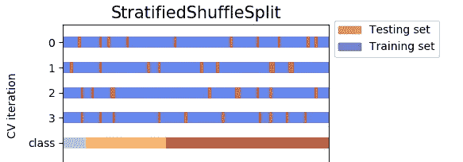

# K 重交叉验证在机器学习中的重要性

> 原文：<https://pub.towardsai.net/importance-of-k-fold-cross-validation-in-machine-learning-a0d76f49493e?source=collection_archive---------1----------------------->

图片来源:Unsplash

## K-Fold 交叉验证| [朝向 AI](https://towardsai.net)

> *将数据输入我们的模型之前最重要的步骤之一*

在我们开始为数据训练模型之前，我们通常会进行交叉验证过程。对于机器学习流水线来说，这是非常重要的一点。

在本文中，我们将更详细地了解 K 折叠的重要性，以及通过各种随机样本来查看数据是一个多么重要的过程。

# 什么是 K-Fold 交叉验证？

> 交叉验证是一种统计方法，用于评估机器学习模型的技能。交叉验证是一种重采样过程，用于在有限的数据样本上评估机器学习模型。

这是一种流行的方法，因为它易于理解，并且与其他方法(例如简单的训练/测试分割)相比，它通常会导致对模型技能的更少偏差或更少乐观的估计。

KFold 将提供训练/测试索引，将数据分成训练和测试集。它会将数据集分割成 **k** 个连续的折叠(默认情况下没有洗牌)。然后，每个折叠被用作一次验证集，而剩余的 **k-1** 折叠形成训练集。

一般程序如下:

1.  随机打乱数据集。
2.  将数据集分成 k 个组
3.  对于每个独特的组:
4.  将该组作为维持或测试数据集
5.  将剩余的组作为训练数据集
6.  在训练集上拟合模型，并在测试集上评估它
7.  保留评估分数并丢弃模型
8.  使用模型评估分数的样本总结模型的技巧

K 型褶皱的一般加工

# K 型褶皱的构型

对于我们的数据样本，必须仔细选择 k 值。

选择不当的 k 值可能会导致对模型技能的错误描述，如具有高方差的分数(可能会根据用于拟合模型的数据发生很大变化)，或高偏差(如对模型技能的高估)。

现在，为 **k** 选择一个值有三种常用策略，如下所示:

*   **代表**:选择 k 值，使每个训练/测试组的数据样本足够大，能够在统计上代表更广泛的数据集。
*   **k = 10**:k 的值固定为 10，这是一个通过实验发现的值，通常会导致模型技能估计具有较低的偏差和适度的方差。
*   **k = n**:k 的值固定为 n，其中 n 是数据集的大小，为每个测试样本提供在维持数据集中使用的机会。这种方法被称为留一交叉验证。

# K 型褶皱的类型

**层状 K 褶皱:**

*   StratifiedKFold 是 KFold 的变体。首先，StratifiedKFold 打乱我们的数据，之后将数据分割成 **n_splits** 个部分并完成。现在，它将使用每个部分作为测试集。请注意，**在分割之前，它只会并且总是将数据混洗一次**。

使用 **shuffle=True** ，数据被我们的 random_state 打乱。否则数据被 **np.random** 洗牌(默认)。比如 **n_splits= 4** ，我们的数据对于 y(因变量)有 3 类(标签)。4 个测试集覆盖所有数据，没有任何重叠。

层状 K 形褶皱在起作用

**分层洗牌 K 倍:**

*   **StratifiedShuffleSplit** 是 ShuffleSplit 的变种。首先，StratifiedShuffleSplit 打乱了我们的数据，然后它还将数据拆分成 n_splits 个部分。然而，它还没有完成。在这一步之后，StratifiedShuffleSplit 立即挑选一部分作为测试集。然后重复相同的过程 n_splits-1 次，以得到 **n_splits-1** 个其他测试集。如果我们看下面的图片，有相同的数据，4 个测试集没有覆盖所有的数据，即测试集之间有重叠。

层状褶皱

所以，这里的区别在于，StratifiedKFold **只洗牌和拆分一次，因此测试集不会重叠**，而 StratifiedShuffleSplit **每次洗牌后都会拆分** n_splits **次，这样测试集就可以重叠**。

# 结论

*在 k 重交叉验证中，存在与 k 的选择相关的偏差-方差权衡。我们使用* ***k = 5 或 k = 10*** *进行 k 重交叉验证，因为这些值已经被经验地显示为产生测试误差率估计值，其既不遭受过高的偏差，也不遭受非常高的方差。*

> 如果选择的 k 值没有平均分割数据样本，则一个组将包含剩余的示例。优选地，将数据样本分成 k 个具有相同样本数量的组，使得模型技能得分的样本全部相等。

# 进一步阅读

 [## k-fold 交叉验证的简单介绍

### 交叉验证是一种统计方法，用于评估机器学习模型的技能。它通常用于…

machinelearningmastery.com](https://machinelearningmastery.com/k-fold-cross-validation/)  [## 使用交叉验证(在 Python 和 R 中)提高模型性能

### 数据科学黑客马拉松最有趣和最具挑战性的事情之一是在两个公共领域获得高分…

www.analyticsvidhya.com](https://www.analyticsvidhya.com/blog/2018/05/improve-model-performance-cross-validation-in-python-r/) 

*这一张就这么多了。*

下次见…！！