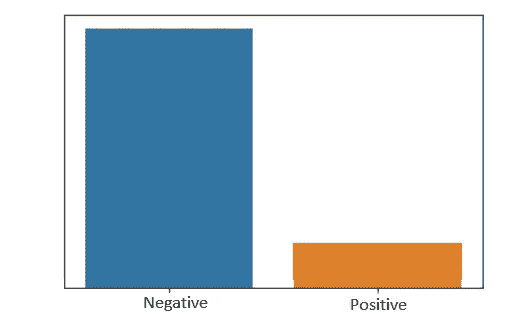
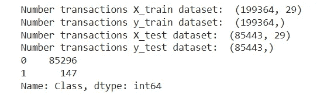
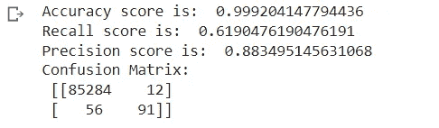
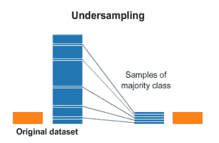
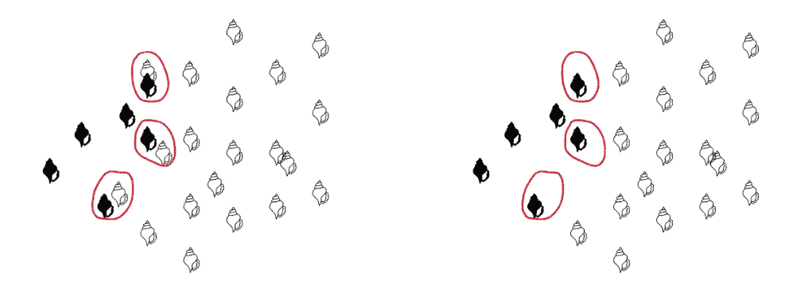
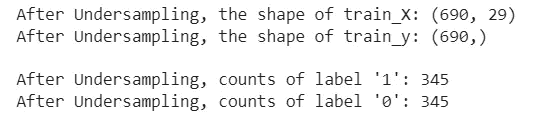
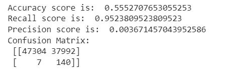
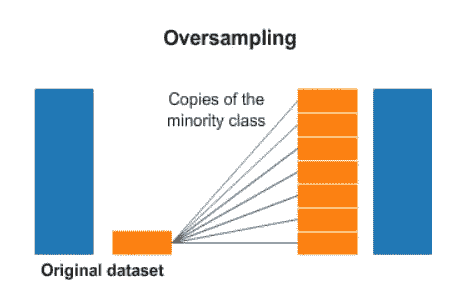
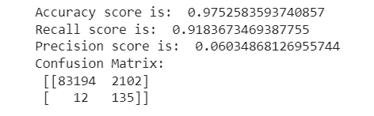
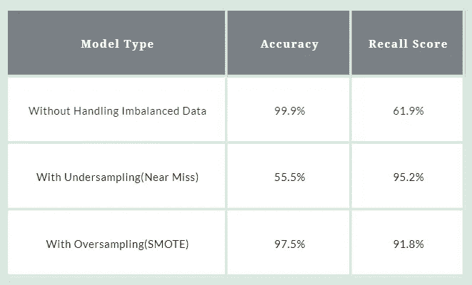

# 如何使用 Python 处理 ML 分类中的不平衡数据

> 原文：<https://pub.towardsai.net/important-techniques-to-handle-imbalanced-data-in-machine-learning-python-3b0cb44a12bf?source=collection_archive---------1----------------------->

在本文中，我们将讨论什么是不平衡数据，我们应该使用哪些指标来评估具有不平衡数据的模型，以及用于处理不平衡数据的技术。

在进行二元分类时，几乎每个数据科学家都可能遇到过处理不平衡数据的问题。通常，当数据集分布不均时，即当一个类中的数据点频率或行数比其他类中的数据点频率或行数多得多时，就会出现不平衡数据。

例如，假设我们有一个 covid 数据集，我们的目标类是一个人是否有 covid，如果我们类中的正比率是 10%，负比率是 90%，那么我们可以说我们的数据是不平衡的。



作者图片

## 不平衡数据的问题

大多数机器学习算法的设计都是为了提高准确性和减少错误。在这个过程中，他们不考虑阶级的分布。此外，决策树和逻辑回归等标准机器学习算法偏向多数类，往往会忽略少数类。因此，在这些情况下，即使模型具有 95%的准确性，也不能说它是完美的模型，因为测试数据中类别数量的频率可能是 95%，并且 5%的错误预测数据必须来自少数类别。

## 准确性陷阱

在深入处理不平衡数据集之前，让我们了解一下在评估模型时应该使用的度量标准。通常，accuracy_score 的计算方法是正确预测数与预测总数的比率。

准确度=正确预测数/预测总数。

所以我们可以看到，accuracy_score 是不会考虑班级分布的。它只关注正确预测的数量。因此，即使我们获得了 95+的准确性，如上面的示例所示，我们也不能保证模型的性能及其对少数类的预测。

因此，对于分类技术，建议使用混淆矩阵、精确度分数、召回分数和 ROC 曲线下面积(AUC)代替精确度分数作为评估指标。

## **处理不平衡数据**

处理不平衡数据时广泛使用的一种技术是采样。有两种类型的取样—

*   欠采样
*   过采样

在欠采样中，样本从多数类中移除，而在过采样中，样本被添加到少数类中。

为了演示上述技术的使用，首先，我们将考虑一个不处理不平衡数据的例子。使用的数据集可以在 [**这里找到**](https://www.kaggle.com/datasets/mlg-ulb/creditcardfraud) 。

## 导入库

```
# import necessary modulesimport pandas  as pd
import matplotlib.pyplot as plt
import numpy as np
from sklearn.linear_model import LogisticRegression
from sklearn.preprocessing import StandardScaler
from sklearn.metrics import confusion_matrix, accuracy_score, precision_score, recall_score, f1_score
```

## 加载数据

```
df  = pd.read_csv("/content/drive/MyDrive/creditcard.csv")
```

## 准备数据

```
# normalise the amount columndf['normAmount'] = StandardScaler().fit_transform(np.array( df['Amount']).reshape(-1, 1))# drop Time and Amount columns as they are not relevant for prediction purpose
data = df.drop(['Time', 'Amount'], axis = 1)# as you can see there are 492 fraud transactions.
data['Class'].value_counts()
```


输出

```
X = data.drop(['Class'], axis = 1)
y = data["Class"]
```

## 分割列车测试数据

```
from sklearn.model_selection import train_test_split# split into 70:30 ratio
X_train, X_test, y_train, y_test = train_test_split(X, y, test_size = 0.3, random_state = 0)# describes info about train and test setprint("Number transactions X_train dataset: ", X_train.shape)
print("Number transactions y_train dataset: ", y_train.shape)
print("Number transactions X_test dataset: ", X_test.shape)
print("Number transactions y_test dataset: ", y_test.shape)
```



输出

## 分类

```
# logistic regression object
lr = LogisticRegression()# train the model on train set
lr.fit(X_train, y_train.ravel())
predictions = lr.predict(X_test)# print classification report
print("Accuracy score is: ",accuracy_score(y_test, predictions))
print("Recall score is: ",recall_score(y_test, predictions))
print("Precision score is: ",precision_score(y_test, predictions))
print("Confusion Matrix: \n",confusion_matrix(y_test, predictions))
```



输出

我们可以看到，即使准确率分数是 99.9%，我们可以看到召回分数是 61.9%，这是相对较低的，精确度分数是 88.3%。

这是因为数据集是不平衡的，现在我们将尝试使用上述技术来提高这些分数。

## 利用欠采样处理不平衡数据

欠采样包括从多数类中删除记录，以平衡少数类。



欠采样涉及的最简单技术是随机欠采样。这种技术包括从多数类中移除随机记录。但是，如果我们随机删除这些行，将会丢失重要的信息。因此实现了各种技术来对数据进行欠采样。一种这样的导入技术是接近缺失欠采样。

## 接近欠采样

在这种技术中，数据点是根据多数类和少数类之间的距离来选择的。它有 3 个不同的版本，每个版本都考虑了来自多数类的不同数据点。

*   版本 1-它选择与少数类的 K 个最近实例的平均距离最小的多数类的数据点
*   版本 2-选择与少数类的 K 个最远实例的平均距离最小的多数类的数据点
*   版本 3 —它分两步工作。首先，对于每个少数类实例，它们的 **M 个最近邻居**将被存储。最后，选择到 N 个最近邻居的平均距离最大的多数类实例。

简而言之，版本 3 是更准确的版本，因为它将删除 tomek 链接，并使分类过程更容易，因为它形成了决策边界。



接近欠采样

```
# apply near miss
from imblearn.under_sampling import NearMissnr = NearMiss()X_train_miss, y_train_miss = nr.fit_resample(X_train, y_train.ravel())print('After Undersampling, the shape of train_X: {}'.format(X_train_miss.shape))print('After Undersampling, the shape of train_y: {} \n'.format(y_train_miss.shape))print("After Undersampling, counts of label '1': {}".format(sum(y_train_miss == 1)))print("After Undersampling, counts of label '0': {}".format(sum(y_train_miss == 0)))
```



输出

我们对多数类-0 进行了欠采样，并与少数类-1 进行了平衡。现在让我们训练和评估数据。

```
lr2 = LogisticRegression()lr2.fit(X_train_miss, y_train_miss)predictions = lr2.predict(X_test)# print evaluation metrics
print("Accuracy score is: ",accuracy_score(y_test, predictions))
print("Recall score is: ",recall_score(y_test, predictions))
print("Precision score is: ",precision_score(y_test, predictions))
print("Confusion Matrix: \n",confusion_matrix(y_test, predictions))
```



输出

所以即使回忆分数更多，我们可以看到准确性更少。但是通过我们的观察，当少数类的预测是优先的时候，我们可以使用这种技术。

## 使用过采样处理不平衡数据

与欠采样不同，在欠采样中，我们从多数类中删除记录，在过采样中，我们将添加少数类中的记录。当我们拥有大量数据时，可以使用欠采样，而当我们拥有较少数据时，可以使用过采样。



过采样

过采样中涉及的最简单的技术是随机过采样，其中我们向少数类随机添加更多的副本，以与多数类平衡，但过采样的缺点是它会导致数据的过拟合和泛化，从而降低准确性。为此，我们使用 SMOTE 技术。

## 合成少数过采样技术

SMOTE 技术的工作原理是从少数类中随机选取一个数据点，并计算该点的 K-最近邻，然后在这个选定的点和它的邻居之间添加随机点。


重击

SMOTE 算法分 4 步工作—

*   选择少数民族类作为输入向量。
*   使用欧几里德距离找到它的 K 个最近邻。
*   选择这些相邻点中的一个，并在所选点及其相邻点之间添加一个合成点。
*   重复上述步骤，直到达到平衡。

```
from imblearn.over_sampling import SMOTEsm **=** SMOTE(random_state **=** 2)X_train_res, y_train_res **=** sm.fit_resample(X_train, y_train.ravel())print('After OverSampling, the shape of train_X: {}'.format(X_train_res.shape))
print('After OverSampling, the shape of train_y: {} \n'.format(y_train_res.shape))
print("After OverSampling, counts of label '1': {}".format(sum(y_train_res == 1)))
print("After OverSampling, counts of label '0': {}".format(sum(y_train_res == 0)))
```


输出

我们对少数类 1 进行了过采样，并用多数类 0 对其进行了平衡。让我们对数据进行训练和评估。

```
lr1 = LogisticRegression()
lr1.fit(X_train_res, y_train_res.ravel())predictions = lr1.predict(X_test)# print Evaluation Metricsprint("Accuracy score is: ",accuracy_score(y_test, predictions))
print("Recall score is: ",recall_score(y_test, predictions))
print("Precision score is: ",precision_score(y_test, predictions))
print("Confusion Matrix: \n",confusion_matrix(y_test, predictions))
```



输出

正如我们可以看到的，与原始统计数据相比，recall_score 在精确度上有极小的下降，但却显著增加了。

## 比较模型性能

下面是模型在不处理不平衡数据、欠采样和过采样的情况下的比较



作者图片

通过以上度量，可以理解 SMOTE 技术具有良好的效果。

## 结论

在本文中，我们讨论了如何使用不同的技术处理不平衡数据。我们在上面的例子中使用了逻辑回归，我们可以尝试各种算法，提高模型性能。

希望这有帮助…快乐编码…..