# 如何在 Pandas 中使用条件格式改进您的分析报告

> 原文：<https://pub.towardsai.net/improve-your-analytical-report-with-conditional-formatting-in-pandas-76039fd3ccb5?source=collection_archive---------1----------------------->

## Pandas 中使用 Styler API 的类似 Excel 的条件格式

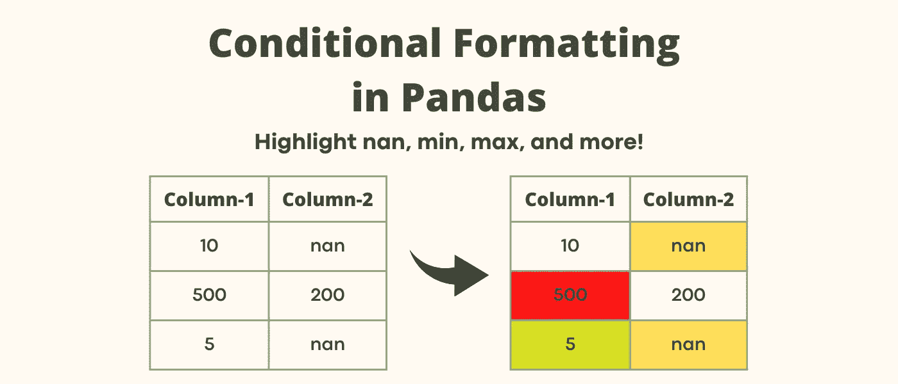

作者图片

> 对于数据科学家/分析师来说，与利益相关方清楚地交流分析见解至关重要。

在分析报告中使用**条件格式**有助于快速识别数据框架(表格)中的细节。

先说个例子。以下数据透视表显示了 2016 年至 2022 年不同产品的总销售额。

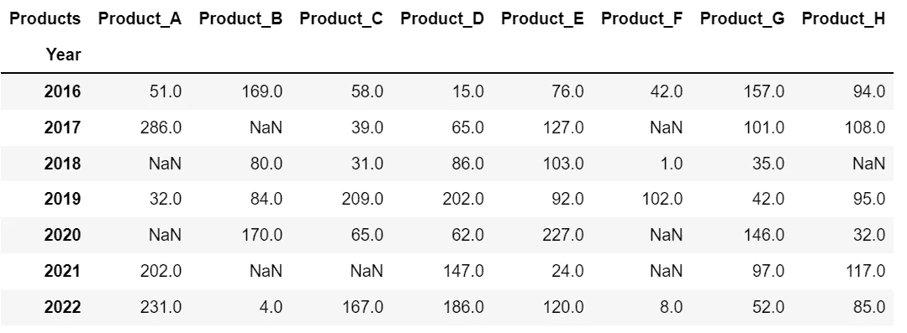

显示 2016 年至 2022 年产品总销售额的数据透视表—您能确定 2016 年的最高销售额吗？(图片由作者提供)

*   **你能找出销量最大的吗**💰**2016 年产品？** —是的，它是总销售额为 169 的产品 _B，但仅通过外观很难识别**👀在餐桌上。**

现在让我们给销量最大的产品上色💰每年的产品。突出显示后，回答上面的问题就变得容易多了，不是吗？

突出显示每年最畅销的产品-现在很容易识别产品 _B 是 2016 年最畅销的产品，销量为 169(图片由作者提供)

让我告诉你如何在熊猫身上做到这一点。

## **主题:**

1.[高亮显示缺失值](#a08d)
2。[高亮显示每行/每列的最大(或最小)值](#7783)3。[高亮显示一个范围内的数值](#ad64)
4。[绘制柱内条形图](#3acf)
5。[使用颜色渐变](#f6b9)
6 高亮显示数值。[奖金](#435e)🎁

**注意:我强烈建议使用最新版本的 Pandas，以避免意外错误。可以运行** `**pip install --upgrade pandas**` **获取熊猫最新稳定发布。**

## **1。突出显示缺失值**

使用`dataframe.style.highlight_null()`,您可以如下所示为空值着色。我将数据透视表存储在变量`df_pivoted`中。

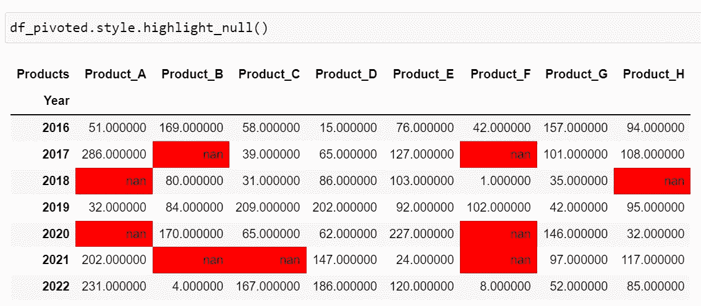

使用`. highlight_null `以红色突出显示 nan 值(图片由作者提供)

没事的😀如果你不喜欢红色。让我们**使用参数`props=’color:white;background-color:black’`自定义缺失值的文本和背景颜色**。

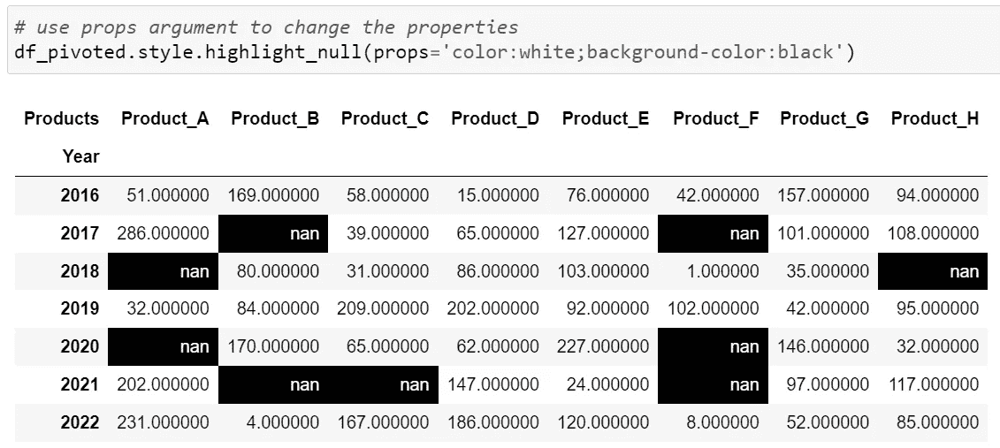

` props '参数允许自定义突出显示的文本和背景颜色(图片由作者提供)

突出显示后，我们可以**快速获得 2018 年 Product_H 未售出的洞察**。

## 2.突出显示最大(或最小)值

要突出显示每列中的最大值，可以使用`dataframe.style.highlight_max()`。默认情况下，该方法对每列中**的最大值进行着色，如下图所示。**

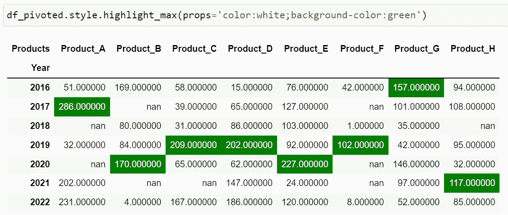

` . highlight_max `默认颜色每列中的最大值(图片由作者提供)

为了给**每行中的最大值着色，**可以指定参数`axis=1`。

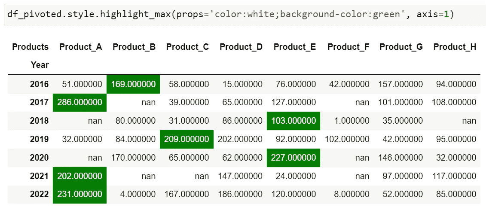

设置 axis=1 in `.highlight_max` colors 每行的最大值(图片由作者提供)

**注意:同样地，你可以使用** `dataframe.style.highlight_min()` **方法，通过适当的参数来给行/列中的最小值着色。**

## 3.突出显示某个范围内的值

现在让我们考虑想要突出显示 100 到 200 之间的值——用`dataframe.style.highlight_between(left, right)`很容易。

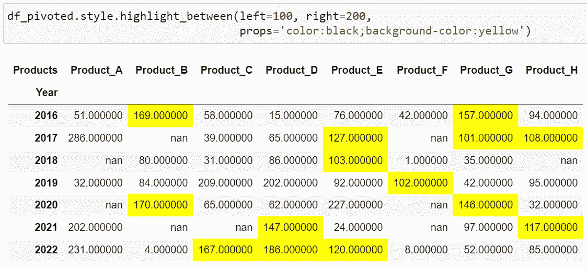

使用“. highlight_between”方法以黄色突出显示 100 到 200 之间的值(图片由作者提供)

## 4.绘制柱内条形图

柱形图绘制在柱形图内，视觉上很吸引人，也很有用。这种条形图可以使用如下所示的`dataframe.style.bar()`方法创建。

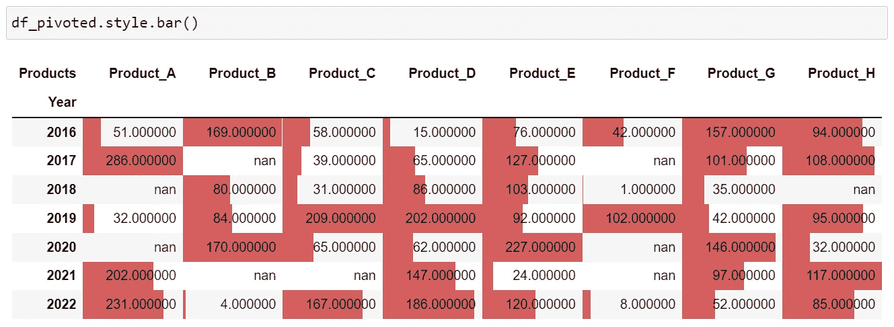

使用“dataframe.style.bar”方法在每个列中绘制的条形图(图片由作者提供)

让我们自定义条形图来改变它的颜色和大小。

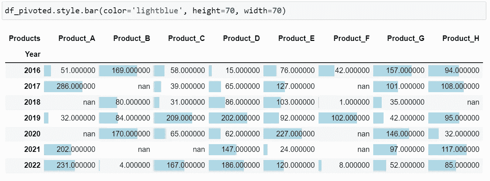

列中的自定义条形图(图片由作者提供)

## 5.使用颜色渐变突出显示值

如果你想用颜色渐变突出显示整列。可以使用如下图所示的`dataframe.style.background_gradient()`来完成。在图像中，随着值的增加，颜色从红色变为绿色。您可以设置`subset=None`将渐变应用于整个数据框。

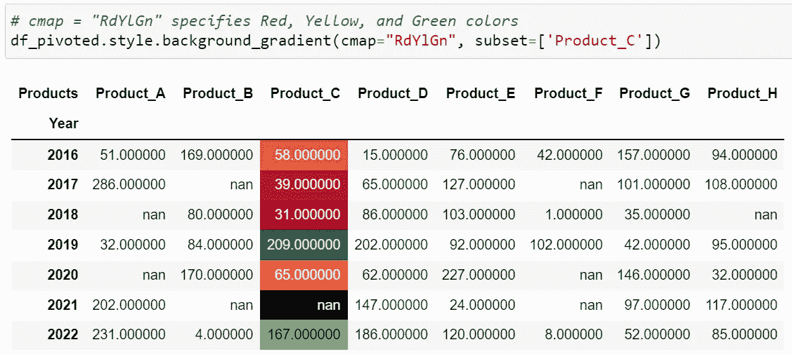

列“Product_C”使用红色、黄色和绿色的渐变进行着色(图片由作者提供)

## 6.奖金🎁

**如何在数据中同时突出显示最小值、最大值和缺失值？嗯，你可以定义一个函数，如下图所示。该函数突出显示列'`Product_C`'中的最小值、最大值和 nan 值。通过设置`subset=None`，高亮显示整个数据帧中的值。这个功能是不是真的很酷？请在评论中告诉我你的想法！**

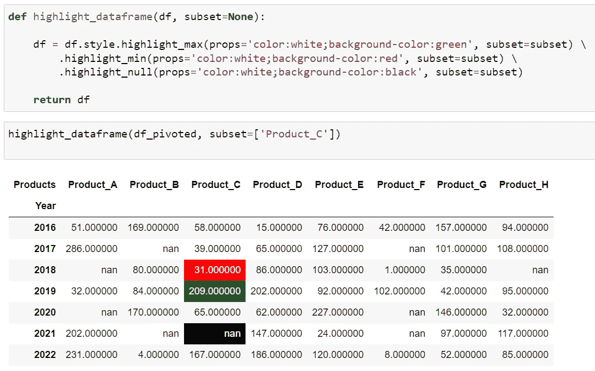

定义并使用函数高亮显示数据框中的最小值、最大值和缺失值(图片由作者提供)

请随意探索[熊猫文档](https://pandas.pydata.org/docs/user_guide/style.html#Builtin-Styles)中的高亮显示方法。

**走之前！**

我希望你喜欢这个故事，并发现它很有用。如果你想听更多这样的故事，请在 [Medium](https://medium.com/@hrishikesh.pe) 上关注我，并且请[给我买杯咖啡](https://www.buymeacoffee.com/hrishikeshds)😊。

*我的其他故事你可能会喜欢…*

 [## 在您的下一个分析中尝试这些熊猫显示配置

### 在这些有用的熊猫展示定制后，满怀信心地分享您的分析笔记本

pub.towardsai.net](/try-these-pandas-display-configurations-in-your-next-analysis-72589648d9a0)  [## Python 中的正则表达式:基础知识

### 正则表达式允许你从文本中提取重要信息。看看这个中型故事，学习正则表达式的基础知识…

pub.towardsai.net](/regular-expression-regex-in-python-the-basics-b8f2cd041bdb)