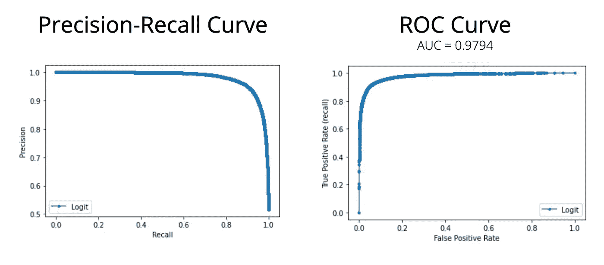
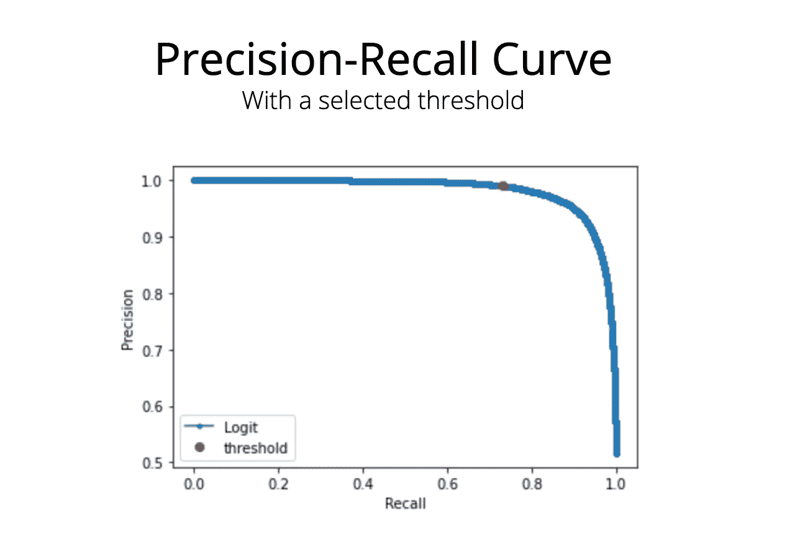
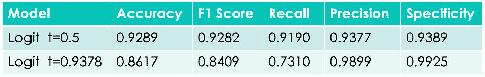

# 通过阈值调整改进您的分类模型

> 原文：<https://pub.towardsai.net/improve-your-classification-models-with-threshold-tuning-bb69fca15114?source=collection_archive---------0----------------------->

## 实用而重要的指南

照片由[丹尼斯·莱昂](https://unsplash.com/@denisseleon?utm_source=medium&utm_medium=referral)在 [Unsplash](https://unsplash.com?utm_source=medium&utm_medium=referral) 上拍摄

**阈值调整**是数据科学管道中**重要且必要的**步骤。它与应用领域密切相关，需要**常识和批判性思维**。

阈值调整允许您**定制成品模型**和**使其适应不同的需求**。

在本文中，我将演示如何通过调整决策阈值来提高模型的性能。我们开始吧。

## 大纲:

1.  ***超越精度***
2.  ***【预测概率】的绝招***
3.  ***选择最大化的重要指标***
4.  ***一些真实的用例&场景***
5.  ***动手阈值调优***
6.  ***结论***

## 1.超越准确性

通常，**准确性不足以**报告分类模型的性能，我们必须**引入额外的度量**。具体来说:**精度**、**召回**、 **F1 得分**、**特异性**。我们还需要考虑 **ROC 曲线**、 **ROC AUC** 和**精确召回曲线**。

让我们从解释这些指标和曲线的**含义开始:**

*   ***精度:*** 真阳性数超过所有阳性数。 *P=TP/(TP+FP)*
*   ***回忆(灵敏度):*** 真阳性数超过真阳性数加上假阴性数。 *R=TP/(TP+FN)*
*   ***F1 评分:*** 精度和召回率之间的调和平均值。
*   ***特异性:*** 真阴性数超过真阴性数加上假阳性数。 *Spec=TN(TN+FP)*
*   ***受试者工作特征(ROC)曲线:*** 该曲线显示了真阳性率和假阳性率之间的权衡。表示模型的性能。
*   ***ROC 曲线下面积(AUC):***ROC 曲线下面积。如果这个面积等于 1，我们就有了一个完美的分类器。如果等于 0.5，我们就有了一个随机分类器。
*   ***精度-召回曲线:*** 这条曲线显示了不同阈值下的精度和召回值。它用于可视化精确度和召回率之间的权衡。

通常，我们必须**考虑所有这些指标和曲线**。为了让**他们中的一些人一目了然**，我使用了这个**自定义** **方法**:

控制分类模型性能的自定义方法。

## 2.“预测概率”的把戏

当我们测试和评估我们的模型时，我们**将预测的 Y 与来自测试集**的 Y 进行比较。一般我们使用一种`model.predict(X_test)`方法，即**直接返回分配给测试集**中每个实例的标签。我们可以用概率来代替这样做。

SK-learn 提供了一个叫做`model.predict_proba(X_test)`的方法来**预测类别概率**。然后我们可以写一个方法，让**根据一个决策阈值参数**返回每个实例**的最终标签**。

方法根据特定阈值将概率转换为类标签。

在 SK-learn 中， **thresh = 0.5 是默认阈值**，用于在我们调用`model.predict(X_test)`方法时分配标签。**概率方法的优势**在于**我们可以测试不同的阈值**。

> 移动阈值将改变模型的性能。根据应用领域的不同，我们可以选择一个最大化重要指标(通常是精确度或召回率)的阈值。

[engin akyurt](https://unsplash.com/es/@enginakyurt?utm_source=medium&utm_medium=referral) 在 [Unsplash](https://unsplash.com?utm_source=medium&utm_medium=referral) 上拍照

## 3.选择最大化的重要指标

但是，**最大化的重要度量是什么？**怎么确定？让我解释一下:

在一个**二元分类**任务中，有**两种类型的错误**我们的模型可以提交:

1.  ***I 型错误:*** 预测 Y 为真而实际为假。又叫**假阳性错误。**
2.  ***第二类错误:*** 当 Y 实际为真时预测为假。又称**假阴性错误。**

**误分类实例的数量**决定了模型的**优度。**

> 这些错误并不同等重要:犯第一类错误可能比犯第二类错误更糟糕。反之亦然。

这一事实被称为**误分类成本**或**T23【一个错误相对于另一个错误有多糟糕】。同样，选择**取决于应用领域**。**识别最差误差**(最小化更重要的误差)允许我们**识别我们的模型应该最大化**的度量。**

假设**误报的代价>误报的代价**。在这种情况下，我们需要**最小化误报的数量**，因此**最大化的重要度量是精度**。

另一方面，如果**假阴性的成本>假阳性的成本**，我们需要**最小化假阴性的数量**。最大化的**重要指标是召回**。

**为了最大化一个指标，我们移动阈值**，直到我们在所有指标之间达到一个良好的平衡。我们可以**为此使用精确召回曲线**并在我们的应用领域中选择最佳阈值。我们也可以使用 **ROC 曲线**。

> 记住:我们不能最大化所有的指标。这总是一个需要在应用领域进行推理的权衡。

了解了这些初步信息后，让我们来探索一些不同的场景:)

## 4.一些真实的使用案例和场景

为了更好地**理解第一类和第二类错误之间的区别**以及**识别最糟糕的**错误，**让我们探索一些真实的场景:**

1.  ***Covid 测试*** 。FN 的**成本>FP 的**成本。如果我们预测 Covid 居民是健康的，将会有大量的感染。**最大化召回**。
2.  ***垃圾邮件过滤*** 。FP 的**成本>FN 的**成本。错过重要邮件比收到垃圾邮件更糟糕。**最大化精度**。
3.  ***好/坏账*** 。FN 的**成本>FP 的**成本。如果不良贷款被预测为好贷款，银行将损失一大笔钱。**最大化召回**。

现在我要报告一个**真实的&动手阈值调优方法**。

照片由[阿迪·戈尔茨坦](https://unsplash.com/@adigold1?utm_source=medium&utm_medium=referral)在 [Unsplash](https://unsplash.com?utm_source=medium&utm_medium=referral) 拍摄

## 5.动手阈值调谐

假设我们正在处理一个二元分类任务的逻辑回归模型。我们都进行了**训练**、**超参数调整**和**测试**阶段。该模型已经过**交叉验证**。我们必须**调整模型的阈值**。

我通过使用`model.predict_proba(X_test)`方法**得到类概率**来开始这个过程。我用这些概率来:

*   ***计算 ROC AUC，等于 0.9794***
*   ***计算并绘制 ROC 曲线***
*   ***计算并绘制精度-召回曲线***

以下代码块代表这些步骤:

计算 ROC AUC 并绘制 ROC 和精度-召回曲线

该图像显示了**产生的曲线**。我们可以立即发现**该型号的性能良好**。

精确召回和 ROC 曲线与 AUC 值。作者图片

现在，我们必须**考虑错误分类成本**并选择模型可能犯下的最大错误**。这一步需要在应用领域进行推理。在这个例子中，假设 FP 的**成本为 FN 的>成本。我们需要选择一个阈值，在不降低召回率太多的情况下，使精确度最大化。**前面提到的取舍。**

**我们可以使用精确召回曲线**对可能的阈值**进行初步选择。在下面的代码块中，我**绘制了带有候选阈值**的精确召回曲线。**

**用选定的阈值绘制精度-召回曲线**

****

**具有选定阈值的精确召回曲线。作者图片**

**此时，我们可以**使用选定的阈值**来**获得最终的分类标签**并且**计算性能指标**。如果我们不满意，我们可以**选择另一个阈值并再次尝试**。**

**打印阈值和性能指标。**

**正如我们在下图中看到的，选择的**阈值以召回为代价最大化了精度**。事实上，根据我们应用的决策阈值，相同的模型可以**以不同的方式执行。****

****

**不同阈值下的模型性能比较。作者图片**

**一旦对结果满意，模型**就可以用于生产**。**

## **6.结论**

**到底什么是**带回家的消息**？**

**为二元分类模型**选择**最重要的** **评估指标**并不容易**。这种选择一般**与应用领域**有关，必须考虑**误分类的代价**。在某些情况下，可能有必要**咨询领域专家**来找出**哪个错误代表最大的风险**。**

****模型的行为在很大程度上受到阈值选择**的影响，这就是为什么**阈值调整一点也不简单**。该操作也**增加了模型的灵活性。****

**也就是说，存在**不同的技术**你可以应用**评估你的模型**和**调整阈值**到**得到预期的结果**。在本文中，我解释了精确召回曲线方法。**

***感谢阅读，快乐阈值调谐:)***

## **参考资料:**

**SK-learn，逻辑回归—[https://sci kit-learn . org/stable/modules/generated/SK learn . linear _ model。LogisticRegression.html](https://scikit-learn.org/stable/modules/generated/sklearn.linear_model.LogisticRegression.html)**

**SK-learn、Precision 和 Recall—[https://scikit-learn . org/stable/auto _ examples/model _ selection/plot _ Precision _ Recall . html](https://scikit-learn.org/stable/auto_examples/model_selection/plot_precision_recall.html)**

**SK-learn，ROC 曲线—[https://sci kit-learn . org/stable/auto _ examples/model _ selection/plot _ ROC . html](https://scikit-learn.org/stable/auto_examples/model_selection/plot_roc.html)**

**维基百科，第一类和第二类错误——https://en.wikipedia.org/wiki/Type_I_and_type_II_errors**