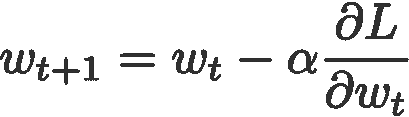
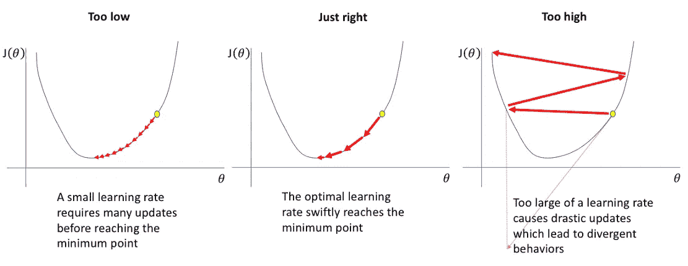
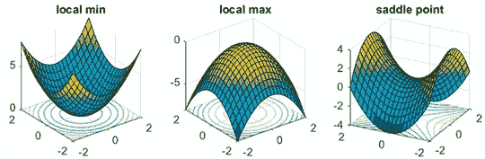
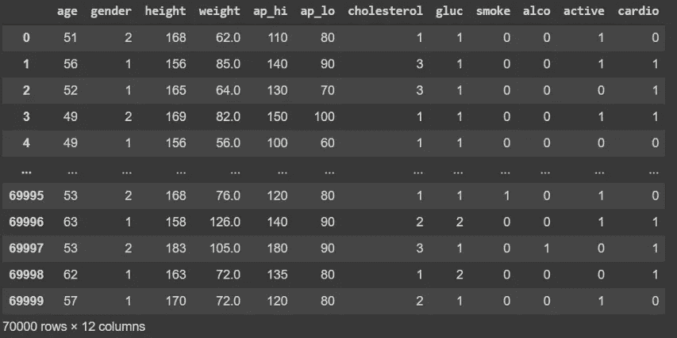
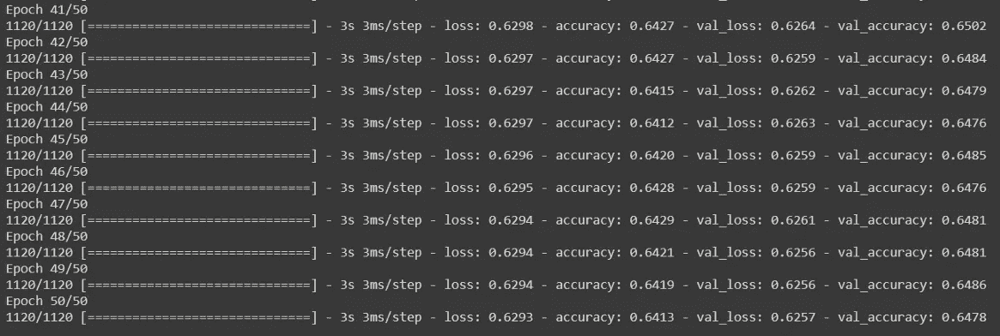
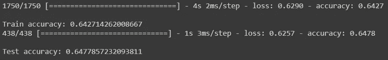
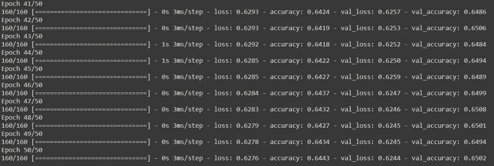
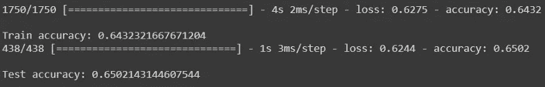
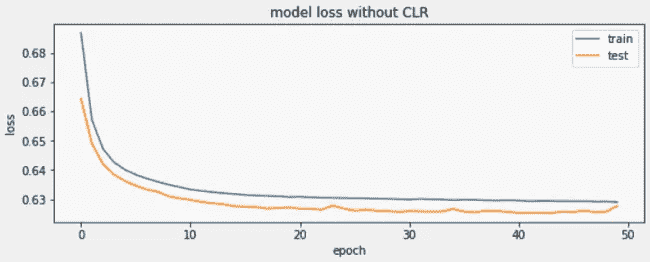
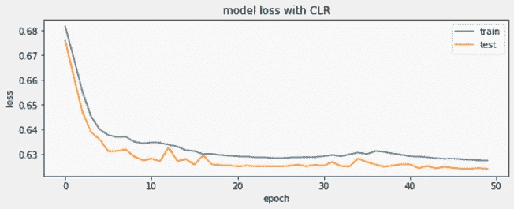

# 提高您的 ML 模型培训

> 原文：<https://pub.towardsai.net/improve-your-ml-models-training-fc0b7a49da4?source=collection_archive---------1----------------------->

## [深度学习](https://towardsai.net/p/category/machine-learning/deep-learning)

## Tensorflow 2.0 中的循环学习率

深度学习在当今时代已经进入了各种研究领域，也成为了我们生活中不可或缺的一部分。吴恩达的[话帮助我们很好地总结了这一点，](https://www.wipo.int/wipo_magazine/en/2019/03/article_0001.html)

> *“人工智能是新的电力。”*

然而，任何重大的技术突破都会带来大量的挑战。从 Alexa 到 Google Photos，再到你的网飞推荐，一切的核心都只是深度学习，但它本身也有一些障碍:

*   海量数据的可用性
*   适合高性能的硬件的可用性
*   对可用数据的过度拟合
*   缺乏透明度
*   超参数优化

本文将帮助您解决其中一个障碍，即*优化*。

# 典型方法的问题是:

深度神经网络通常通过使用随机梯度下降进行学习，参数θ(或权重ω)更新如下:

随机梯度下降

其中 L 是损失函数， *α* 是学习率。

我们知道，如果我们把学习率设置得太小，算法完全收敛的时间就会太长，如果太大，算法就会发散而不是收敛。因此，重要的是**用各种学习率**和时间表进行实验，看看什么最适合我们的模型。

[神经网络的学习速率行为](https://www.jeremyjordan.me/nn-learning-rate/)

实际上，由于这种方法，还会出现一些问题:

*   深度学习模型和优化器对我们的初始学习速率很敏感。初始学习速率的错误选择会从一开始就极大地妨碍我们模型的性能**。**
*   这可能导致模型**陷入局部最小值或鞍点**。当这种情况发生时，即使我们继续降低学习速度，我们也可能无法下降到一个损失更低的地方。

[学习率和搜索空间](https://www.pyimagesearch.com/2019/07/29/cyclical-learning-rates-with-keras-and-deep-learning/)

# 循环学习率帮助我们克服这些问题

使用循环学习率，您可以大大减少调整和找到模型的最佳学习率所需的实验次数。

现在，我们不再单调递减学习速率，而是:

1.  在我们的学习率上定义一个**下限**(*base _ lr*)。
2.  定义学习率的**上限**(*max _ lr*)。

因此**学习率在训练时在这两个界限之间振荡**。每次批量更新后，它会慢慢增加和减少。

使用这种 CLR 方法，我们不再需要手动调整学习率，我们仍然可以达到接近最佳的分类精度。此外，与自适应学习率不同，CLR 方法不需要额外的计算。

通过看一个例子，你会清楚这种改进。

# 在数据集上实现 CLR

现在，我们将训练一个简单的神经网络模型，并比较不同的优化技术。我在这里使用了一个关于心血管疾病的数据集。

这些是您在实施过程中需要的所有导入:

这是数据的样子:

[心血管数据集](https://www.kaggle.com/sulianova/cardiovascular-disease-dataset) —预览

列`cardio`是目标变量，我们对数据进行一些简单的缩放，并将其分成特征(`X_data`)和目标(`y_data`)。

现在，我们使用`train_test_split`来获得 80–20 的标准训练测试比。然后我们使用 Keras 的`Sequential`模型定义一个非常基本的神经网络。我在我的模型中使用了 3 个密集层，但是你可以选择任意数量的层或者激活函数。

# 不带 CLR 的培训:

在这里，我使用基本的[*【SGD】*](https://www.tensorflow.org/api_docs/python/tf/keras/optimizers/SGD)优化器编译了这个模型，它的默认学习率是 0.01。然后，该模型被训练超过 50 个时期。

为了向您展示最近的几个时期，该模型每个时期花费 3s，最终给出 64.1%的训练准确度和 64.7%的验证准确度。简而言之，这是我们的模型在大约 150 秒的训练后给出的结果:

# 使用 CLR 进行培训:

现在我们使用循环学习率，看看我们的模型表现如何。TensorFlow 已经内置了这个优化器，随时可供我们使用。我们从 TensorFlow [*插件*](https://www.tensorflow.org/addons/api_docs/python/tfa/optimizers/CyclicalLearningRate) 中调用它，定义如下:

`step_size`的值可以很容易地从一个时期内的迭代次数中计算出来。这里，每个时期的迭代次数

=(训练样本数)/(batch_size)

= 70000/350

= 200.

> *“实验表明，将步长设置为一个历元中迭代次数的 2-10 倍通常是好的。”*

现在使用这个新定义的优化器编译我们的模型，

我们看到现在我们的模型火车**比**快得多，总共用时甚至不到 50 秒。

损失值**收敛更快**并且如我们所料在 CLR 模型中轻微振荡。

训练准确率从 **64.1%** 提高到 **64.3%。**

测试精度也提高了，从**的 64.7%** 提高到**的 65%。**

# 结论

当您开始处理任何新数据集时，您在以前的数据集中使用的相同学习率值将不适用于您的新数据。因此，您必须执行一个 **LR 范围测试**，该测试将为您提供一个适合您的数据的学习率的良好范围。然后，您可以将您的 CLR 与固定学习率优化器进行比较，就像我们在上面看到的那样，看看什么最适合您的性能目标。因此，为了获得学习率的最佳范围，只要学习率保持线性增长，就可以在较少的时期运行模型。那么在这些界限之间摆动学习速率就足以在几次迭代中给你一个接近最优的结果。

这种优化技术显然是一个福音，因为我们不再需要自己调整学习速度。我们在更少的迭代中实现了更好的准确性。

# 参考资料:

[1] [Smith，Leslie N .“训练神经网络的循环学习率”2017 年](https://arxiv.org/pdf/1506.01186.pdf)