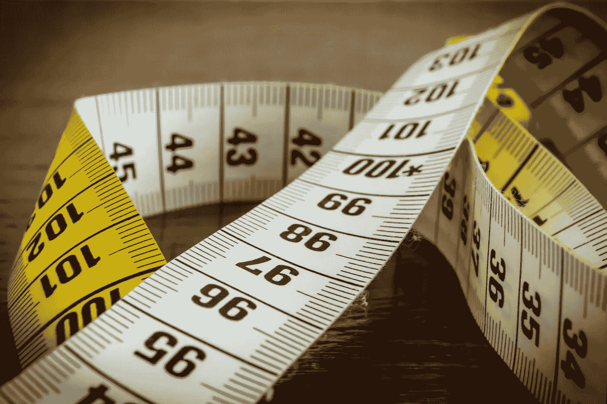
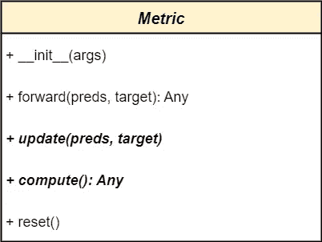
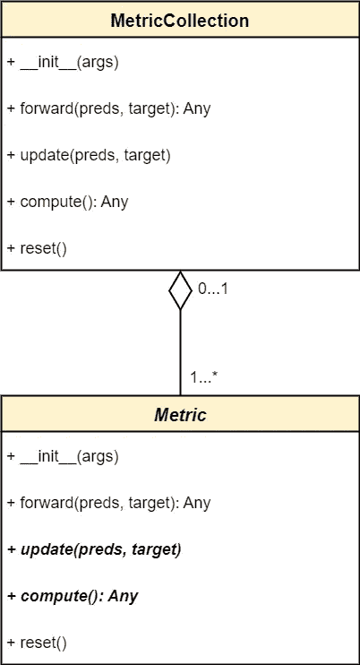
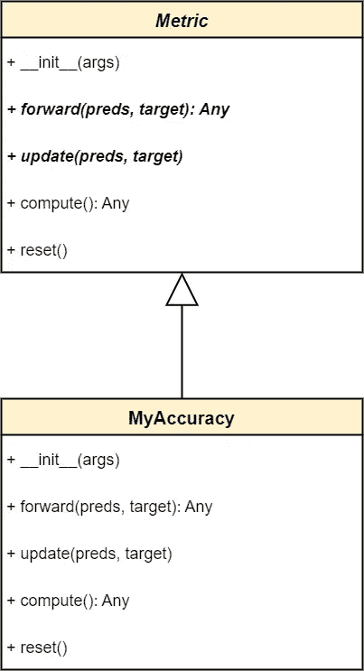

# 如何使用火炬计

> 原文：<https://pub.towardsai.net/improve-your-model-validation-with-torchmetrics-b457d3954dcd?source=collection_archive---------3----------------------->

## PyTorch 或 PyTorch Lightning 火炬矩阵使用指南



图片来自 [Pixabay](https://pixabay.com//?utm_source=link-attribution&amp;utm_medium=referral&amp;utm_campaign=image&amp;utm_content=1186496) 的[托马斯·沃尔特](https://pixabay.com/users/thomaswolter-92511/?utm_source=link-attribution&amp;utm_medium=referral&amp;utm_campaign=image&amp;utm_content=1186496)

良好培训的一个关键部分是正确管理验证指标。这是为了监控模型的哪个状态执行得最好所必需的。不同的任务需要不同的度量来评估模型的准确性，实现它们通常需要编写样板代码。 [TorchMetrics](https://torchmetrics.readthedocs.io) 通过提供一种模块化方法来定义和跟踪所有评估指标，解决了这个问题。

## **目录**

1.  度量类如何工作
2.  什么是度量集合
3.  如何实现自定义指标
4.  使用火炬和 PyTorch 闪电

要从 PyPI 安装最新版本的 TorchMetrics，请使用:

```
pip install torchmetrics
```

# 1.度量类如何工作

TorchMetrics 提供了许多现成的[指标](https://torchmetrics.readthedocs.io/en/stable/all-metrics.html)，如*准确度*、骰子、 *F1 分数*、召回、*平均绝对误差、*等等。它们都继承自`Metric`，这是每个指标的父类:



度量类的主要方法。使用[图](https://www.diagrams.net/)生成的图像。

在使用指标之前，必须对其进行实例化。之后，对于从 dataloader 中读取的每个批处理，目标和预测都被传递给 metric 对象。然后，它计算当前批处理的度量结果，并将其保存在其内部状态中，该状态跟踪到目前为止看到的数据。当批处理完成时，可以从度量对象中提取最终结果。

每个指标都从`Metric`类继承了以下方法:

*   `metric.forward(preds, target)` —使用`preds`和`target`计算度量，它们是当前批次的预测和目标。然后，它更新度量状态并返回度量结果。作为一种快捷方式，可以使用`metric(preds, target)`，这两种语法没有区别。
*   `*metric.update(preds, target)*` —与 forward 相同，但不返回效率的度量结果。如果不需要记录或打印每个批次的指标结果，这是应该使用的方法，因为它更快。
*   `*metric.compute()*` —返回到目前为止所有数据的计算结果。应该在所有批处理结束后调用它。
*   `metric.reset()` —清除度量状态。必须在每个验证阶段结束时调用它。

**总结:**

1.  对于每一批，调用`forward`或`update`。
2.  在验证加载器循环之外，调用`compute`获得最终结果。
3.  最后调用`reset`清除度量状态。

以下代码显示了完整的过程:

如果不需要打印批次指标，只需将第*行 12* 替换为`metric.update(preds, target)`(并删除第*行 13)* 。

# 2.什么是公制集合？

在上面的例子中，验证只使用一个指标，但是大多数验证可能会使用多个指标。TorchMetrics 提供了`MetricsCollection`，它将一个度量列表或字典包装到一个可调用的度量类中，该类具有与任何其他度量相同的接口(复合模式)。这种方式从集合中调用一次`forward`、`update`、`compute`和`reset`，而不是针对每个指标。



公制集合。使用[图](https://www.diagrams.net/)生成的图像。

下面的代码显示了`MetricCollection`是如何工作的:

# 3.如何实现自定义指标

尽管 TorchMetrics 为不同的任务提供了广泛的度量标准，但是可能有必要实现自定义的度量标准。要实现一个指标，创建一个从`Metric`继承的类。然后您应该扩展`__init__`方法并覆盖`update`和`compute`方法:

1.  `__init__()`是每次创建对象时调用的方法。在其中，通过使用方法`self.add_state(state_name, default)`，添加所需的内部状态:`state_name`是您选择的字符串，`default`是初始值(以及复位后的值 *)* 。
2.  在`update(preds, target)`方法中，使用`preds`和`target`更新状态。
3.  `compute()`方法必须使用状态值返回最终结果。

例如，准确性是返回预测和目标之间相同元素的百分比的度量。



自定义指标。使用[图](https://www.diagrams.net/)生成的图像。

从头开始实施该指标的步骤是:

1.  创建一个状态`total`来记忆总值。
2.  创建一个状态`corrects`来记忆与目标值相等的值。
3.  `*update(preds, target)*`必须用值的数量增加`total`状态，用来自`preds`的值的数量增加`correct`状态，其值等于`target`。
4.  `compute()`返回`corrects`除以`total`再乘以 *100* 。

这是完整的实现:

# 4.使用火炬和 PyTorch 闪电

TorchMetrics 是 PyTorch Lightning 的一个很好的组合，可以进一步减少样板代码。如果您从未听说过 PyTorch Lightning，它是一个简化模型编码的框架。更多信息，请参考[他们的网站](https://www.pytorchlightning.ai/)。如果你不用 PyTorch Lightning，直接跳过这一节。

通过 PL 方法`self.log_dict(collection, on_step, on_epoch)`可以记录度量收集对象。通过记录度量对象，PyTorch Lightning 负责计算或重置度量的时间。
设置`on_step=True`记录每个批次的指标。设置`on_epoch=True`记录纪元指标(因此，所有批次的计算结果)。如果它们都被设置为*真*，则步长度量和时元度量都被记录。有关 PyTorch 闪电测井的更多信息，请查看他们的文档。

以下代码显示了使用 TorchMetrics 处理指标的 PyTorch Lightning 模块:

通过这种方式，在培训阶段，将为每批记录指标。而在验证阶段，步骤度量被累积以仅记录在时期结束时的最终度量。在这种情况下，`compute`和`reset`方法不会被调用，因为 PyTorch Lightning 会自己处理它们。

要在每次验证结束时打印指标，必须添加这段代码:

```
def validation_epoch_end(self, outputs):
    results = metric_collection.compute()
    print(results)
    self.metric_collection.reset()
```

但是在大多数情况下，记录指标就足够了。

# 结束语

你已经发现了火炬之力。我认为这个库是管理度量的一种非常干净的方式，并且显著地提高了代码的质量。更多信息，请查看[的文档](https://torchmetrics.readthedocs.io/en/stable/)。

感谢阅读，我希望你发现这是有用的。

*如果你喜欢读我的故事，并且想支持我成为一名作家，考虑注册成为一名灵媒会员。每月 5 美元，你可以无限制地阅读所有的故事。如果你用我的链接注册，我会赚一点佣金，你也一样。*[https://mattiagatti.medium.com/membership](https://mattiagatti.medium.com/membership)