# 用正则化和最优化方法改进人工神经网络

> 原文：<https://pub.towardsai.net/improving-artificial-neural-network-with-regularization-and-optimization-489befd6fa1e?source=collection_archive---------1----------------------->

## [机器学习](https://towardsai.net/p/category/machine-learning)

[阿丽娜·格鲁布尼亚](https://unsplash.com/@alinnnaaaa?utm_source=medium&utm_medium=referral)在 [Unsplash](https://unsplash.com?utm_source=medium&utm_medium=referral) 上的照片

在本文中，我们将讨论正则化和优化技术，程序员使用这些技术来构建一个更加健壮和通用的神经网络。我们将研究最有效的正则化技术，如 L1、L2、早期停止和退出，这有助于模型的推广。我们将深入研究不同的优化技术，如批量梯度下降、随机梯度下降、AdaGrad 和 AdaDelta，以更好地收敛神经网络。

# 模型概化的正则化

过度拟合和欠拟合是程序员在使用深度学习模型时面临的最常见的问题。对数据进行良好概括的模型被认为是数据的最佳拟合。当模型捕捉到数据的噪声时，会出现过度拟合的问题。准确地说，当学习模型具有低偏差和高方差时，会发生过度拟合。而在欠拟合的情况下，学习模型不能捕捉数据的内在本质。当模型不能很好地拟合数据时，拟合不足的问题仍然存在。欠拟合问题反映了低方差和高偏差。

**正则化**，在神经网络的背景下，是一个防止学习模型过度适应训练数据的过程。它包括减少学习模型的泛化错误的机制。请看下图，该图显示了拟合不足，它描述了学习模型无法捕捉数据的内在本质。这导致看不见的数据的错误结果。此外，我们在下图中看到过度拟合训练数据。此图还显示了最佳拟合，该拟合显示了学习模型针对之前未看到的数据预测正确输出的能力。

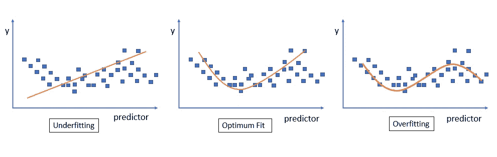

学习模型中的曲线拟合

**泛化误差**是衡量学习模型对未知数据正确预测响应能力的尺度。可以通过避免过度拟合训练数据来最小化它。L1、L2、提前停止和退出是帮助提高学习模型概化能力的重要正则化技术。

让我们详细讨论这些技术。

## L1 正则化

正则化是防止学习模型过度适应数据的过程。在 L1 正则化中，引入惩罚来抑制学习模型过度拟合。通过在神经网络的权值梯度损失函数中加入正则项，引入了一个新的代价函数。随着正则化项的加入，我们在某种程度上惩罚了损失函数，它将变得一般化。

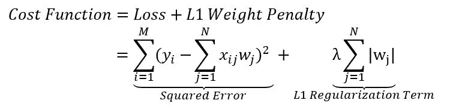

L1 正则化

在上述方程中，L1 正则项表示神经网络的权重或参数的绝对值总和的系数λ的大小。

## L2 正则化

与 L1 正则化类似，L2 正则化通过在损失函数中添加一个称为 L2 权重惩罚的惩罚项来引入一个新的成本函数。

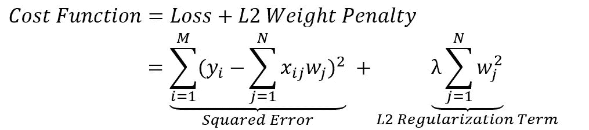

L2 正则化

如上式所示，L2 正则化项表示通过取神经网络的平方权重总和的系数λ的平方值计算的权重罚值。该系数λ的值越大，学习模型的复杂特征的惩罚越高。

## 退出

神经网络每层中的大量节点捕获数据的复杂特征以及噪声，这导致学习模型的过度拟合。在这种正则化技术中，节点是随机选择和丢弃的，以使学习模型更加一般化，以便它在新到达的数据上表现得更好，如下图所示。

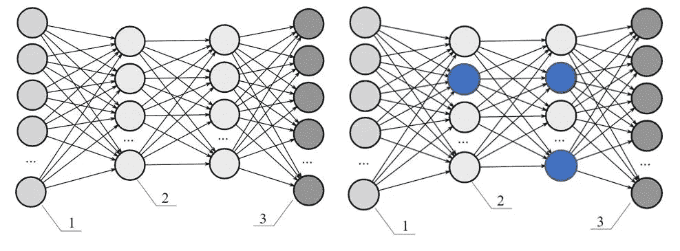

辍学正规化

在上图中，左侧的网络显示了完全连接的密集神经网络，而右侧的网络显示了很少随机选择的节点被丢弃，这在很大程度上有助于防止学习模型在训练数据集上过度拟合，并最大限度地减少正则化错误。

## 提前停止

早期停止是一种正则化，用于避免学习模型的过度拟合。大量的训练迭代或时期导致学习模型在数据集上过度拟合，而少量的时期导致学习模型的欠拟合。在早期停止中，神经网络同时根据训练数据进行训练，并根据测试数据进行验证，以确定在验证误差开始增加之前，需要进行多少次迭代才能更好地收敛学习模型，如下图所示。

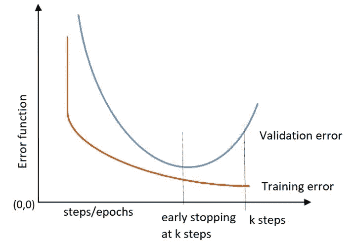

早期停止正则化

在神经网络的情况下，随着我们增加训练迭代的次数，学习模型得到改进，如果我们不在早期阶段停止，它可能会过度适应训练数据。在这种形式的正则化中，模型通过梯度下降在数据集上迭代训练，直到验证误差收敛到最小值。学习者的表现可以通过更大数量的训练迭代来进一步提高，但是以更高的验证误差为代价。考虑到不应该过度拟合训练数据集，早期停止确定学习者应该进行多少次迭代以获得更好的准确性。通过提前停止，神经网络可以获得最佳权重，从而以最小的泛化误差更好地收敛学习。

# 模型性能优化

理解不同的优化技术是很重要的，例如批量梯度下降、随机梯度下降、小批量梯度下降、AdaGrad、AdaDelta，以便更好地收敛神经网络。

优化技术通过优化误差函数的梯度来帮助神经网络更好地收敛。梯度下降有许多变体，它们基于正在处理多少数据来计算误差函数(目标函数)的梯度而彼此区分。在学习模型更好地收敛于数据的能力和做到这一点所需的计算资源之间存在权衡。

## 批量梯度下降(普通梯度下降)

批处理梯度下降是提高模型性能最常用的优化算法。它使用一阶近似以迭代的方式寻找目标函数的最小值。它使用一种学习算法，为多层网络中神经元层之间的连接更新与目标函数梯度的负值成比例的权重或参数。

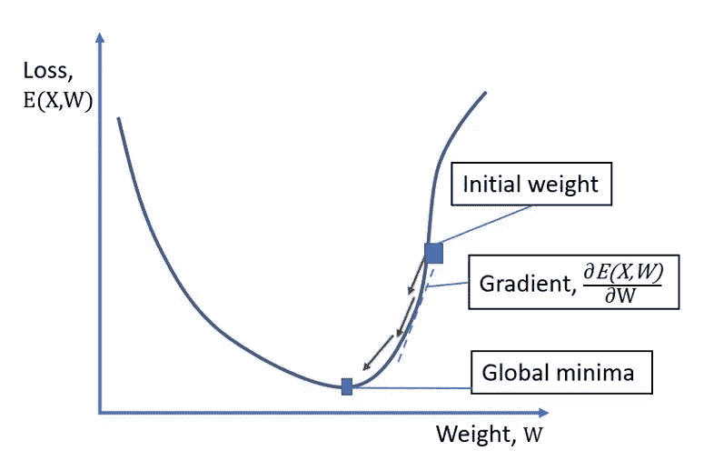

梯度下降

换句话说，它试图为神经层的不同节点之间的连接找出一组最佳的权重或参数，这将给出可预测性的最小误差。在批量梯度下降中，损失函数(如上图所示)是通过正确响应 y 与计算响应、所有单个 n 个数据点的 ŷ或数据集中的观察值之间的平方差的聚合来计算的。

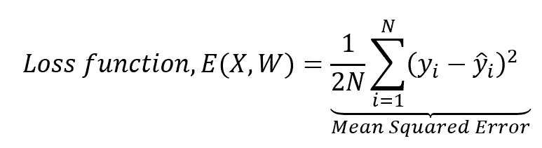

一旦损失函数被计算出来，那么神经网络的权重就用反向传播算法来更新，这是反复进行的，直到损失函数达到全局最小值。

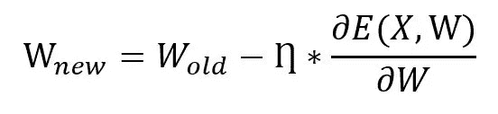

上面的等式表示权重更新公式，其中 *W_old* 表示神经网络的旧权重，而 *W_new* 表示神经网络的新权重，该新权重相对于损失函数的梯度 *E(X，W)* 、学习速率η和数据点集 X 而更新。简而言之，批量梯度下降考虑每个迭代或时期中损失计算的所有数据点。批量梯度下降优于具有更高预测性的神经网络，但是以计算时间和资源为代价。

## 随机梯度下降

这是模型优化的梯度下降法的一个变种。它在每次迭代或历元中只考虑数据集的一个数据点或观测值来计算损失函数，如下面的等式所示，

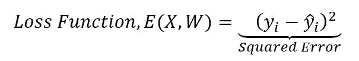

它提供了与批量梯度下降类似的性能，但由于频繁更新，需要更多的时间来收敛。权重具有很高的方差，使得损失函数在不同的值范围内变化。

## 小批量梯度下降

在小批量损失函数 *E(X，W)* 的计算中，小批量梯度考虑数据集的小批量数据点或观测值，而不是考虑所有数据点(如批量梯度下降)或单个数据点(如随机梯度下降)。它相应地更新神经网络中神经元层之间连接的权重。

在上面的公式中，K 表示数据集的数据点批的大小，N 被考虑用于在每个迭代或时期中的 K 个数据点上计算损失函数 *E(X，W)* 。小批量梯度下降变体有助于比随机梯度下降更快地收敛，这是由于在损失函数中具有更低方差的神经网络的权重或参数的更新相对较少， *E(X，W)。*

## 阿达格拉德

Adagrad(自适应梯度)是一种基于梯度的优化算法，其中学习速率相对于权重进行更新。它为神经网络中不同层神经元之间的连接的权重设置低学习速率，同时为与数据的不常见特征相关联的权重或参数设置较高的学习速率。Adagrad 通常基于权重或参数与稀疏或密集特征的关联，在每次迭代或时期为每个权重或参数调整不同的学习速率。adagrad 中的权重更新公式表示如下:

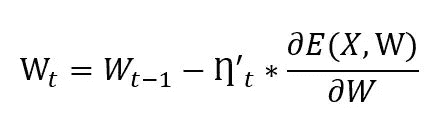

在上式中，η_t 表示在步骤 t 相对于损失函数的梯度计算的自适应学习率，如下所示，

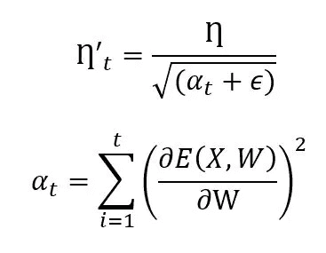

在上面的等式中，η表示全局学习速率，αt 表示损失函数的过去的平方梯度的和， *E(X，W)* 具有小的正数ϵ。每当α_t 增加到一个较高的界限，反过来，它会大大降低学习率，从而影响权重的更新。为了避免这种情况，Adadelta 是本节接下来讨论的答案。使用自适应梯度优化的主要好处是，它消除了手动更新学习速率的需要。

## 阿达德尔塔

Adadelta 是 Adagrad 的扩展版本，它抑制了反过来影响学习率的侵略性增长。Adadelta 基于损失函数的梯度的滑动窗口更新学习率，而不是聚集所有过去的梯度。

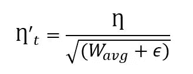

Adadelta 给出了基于梯度更新的自适应学习率。这里，在上式中， *W_avg* 表示梯度平方的指数衰减平均值，这反过来有助于最小化过去梯度的影响，其计算如下:

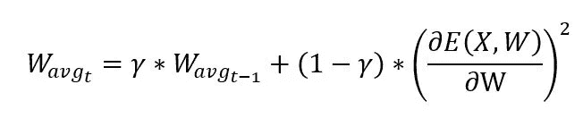

最初， *W_avg_0* 被设置为 0，因为 t = 0。γ代表阿达德尔塔衰减因子；它表示在每个时间步长 t 中要保持的损失函数梯度的分数部分。如果将其设置为更高的值，我们就能够限制损失函数梯度的增长，这反过来有助于神经网络的权重或参数更好地收敛。

## 摘要

在本文中，我们学习了不同的正则化技术，如 L1、L2、退出和提前停止，以防止学习模型过度拟合训练数据，并进一步使模型更一般化以获得更好的可预测性。我们还学习了梯度下降的不同变体，以获得神经网络节点层之间连接的最佳权重集。我们研究了不同的优化技术，如随机梯度下降、小批量梯度下降、自适应梯度、adadelta，以便更快、更平滑地收敛损失函数的梯度，并提高学习模型的准确性。