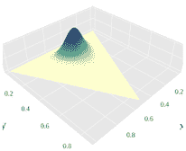
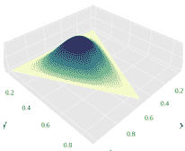
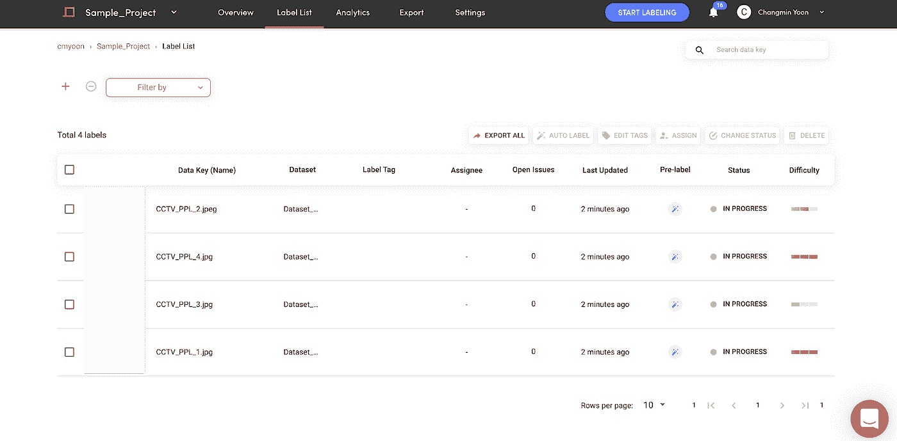
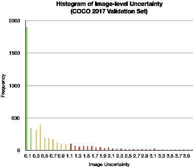
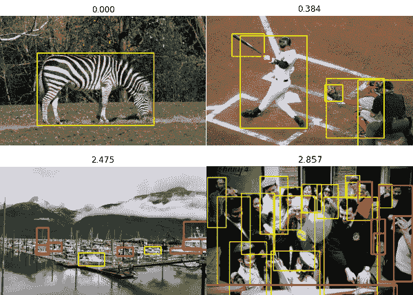
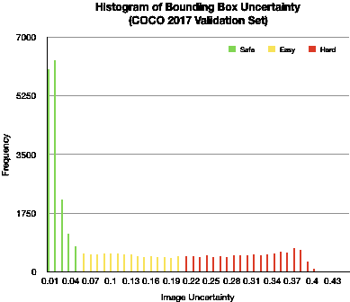
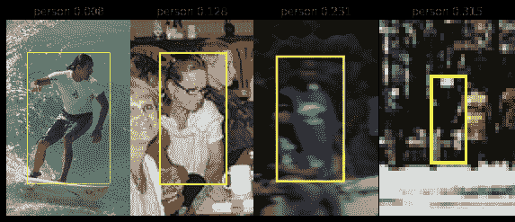

# 如何通过自动标注、不确定性估计和主动学习来提高数据标注效率

> 原文：<https://pub.towardsai.net/improving-data-labeling-efficiency-with-auto-labeling-uncertainty-estimates-and-active-learning-5848272365be?source=collection_archive---------0----------------------->

## [机器学习](https://towardsai.net/p/category/machine-learning)

如何判断这个被标记的图像对训练模型是否“有用”？多读点了解一下。来源:知识共享的衍生，照片由[弗兰克·科恩托普](https://sv.m.wikipedia.org/wiki/Fil:Sixth_Avenue_and_Central_Park_South_(Unsplash).jpg)拍摄

在这篇文章中，我们将深入研究机器学习理论和技术，这些理论和技术是为了评估我们在 [Superb AI](http://www.superb-ai.com) 的自动标记 AI 而开发的。更具体地说，我们的数据平台如何估计自动标注的不确定性，并将其应用于主动学习。

在开始之前，最好先了解一下最流行的方法可以被归类到哪些类别。根据我们的经验，深度学习不确定性估计的大多数工作分为两类。第一种属于*蒙特卡罗抽样*的范畴，对每个原始数据进行多种模型推断，并使用这些推断之间的差异来估计不确定性。第二种方法*通过让神经网络学习分布参数来模拟模型输出*的概率分布。这里的主要目的是给我们探索的技术种类以广度，并希望提供一些关于我们如何和为什么在这个主题上达到我们独特的位置的清晰性。我们还希望有效地证明我们的特定不确定性估计方法的可扩展性。

# 1.自动标注功效的快速回顾

在我们深入研究评估自动标记性能的各种方法之前，有一点需要注意。自动标记人工智能虽然非常强大，但并不总是 100%准确。因此，我们需要测量和评估在使用自动标记时，我们可以在多大程度上信任输出。一旦我们可以做到这一点，那么使用自动标注的最有效的方法就是让人类用户根据这一度量来区分查看和编辑哪个自动标注的注释的优先级。

测量模型输出的“可信度”是一种流行的方法。然而，这种方法的一个众所周知的缺点是，如果模型过度拟合给定的训练数据，即使预测结果是错误的，置信水平也可能会错误地高。因此，置信度不能用来衡量我们可以“信任”多少自动标注的注释。

相比之下，估计模型输出的“不确定性”是一种更有根据的方法，因为这种方法从统计上衡量了我们对模型输出的信任程度。利用这一点，我们可以获得与模型预测误差的概率成比例的不确定性度量，而不管模型置信度得分和模型过度拟合。这就是为什么我们认为一个有效的自动标记技术需要与一个健壮的方法相结合来估计预测的不确定性。

# 2.方法 1:蒙特卡罗抽样

研究团体提出的一种可能的不确定性估计方法是获得每个输入数据(即图像)的多个模型输出，并使用这些输出计算不确定性。这种方法可以看作是一种基于蒙特卡罗抽样的方法。

让我们看看下面的一个 3 类分类输出的例子。

> y1 = [0.9，0.1，0]
> 
> y2 = [0.01，0.99，0]
> 
> y3 = [0，0，1]
> 
> y4 = [0，0，1]

这里， ***y1 ~ y4*** 中的每一个是来自四个不同模型对相同输入数据的模型输出(即，第一个模型给予类#1 最高的概率，等等。).最天真的方法是使用四个不同的模型来获得这四个输出，但使用贝叶斯深度学习或辍学层可以为单个模型提供随机性，并允许我们从单个模型获得多个输出。

一种特殊类型的基于蒙特卡罗的方法被称为贝叶斯主动学习(BALD) [1，2]。BALD 对不确定性的定义如下:

> 不确定性(x) =熵(Avg[y1，…，yn])-Avg[熵(y1)，…，熵(yn)]

就像我们上面的示例输出一样，BALD 假设我们可以为单个输入数据(x)获得多个输出( ***y1 ~ yn*** )。例如，x 可以是图像，每个 ***y*** 可以是多类 softmax 输出向量。

根据 BALD 公式，只有当多个模型输出将高概率分配给同一类别时，模型预测才具有低不确定性。例如，如果一个模型输出以高概率预测了“人”类，而另一个模型输出以高概率预测了“车”类，则组合不确定性将非常高。类似地，如果两个模型对“汽车”类和“人”类赋予近似相同的概率，则不确定性会很高。似乎很合理。

然而，使用像 BALD 这样的蒙特卡罗采样方法来估计自动标签不确定性的一个缺点是，需要为每个输入数据创建多个模型输出，从而导致更多的推理计算和更长的推理时间。

在下一节中，我们将看看解决这个问题的另一种方法。

# 3.方法 2:分布建模

让我们假设模型预测遵循特定的概率分布函数(PDF)。我们可以让模型直接学习预测 PDF，而不是让模型优化预测精度。

如果我们这样做，神经网络输出将不是对输入数据的单一预测，而是定义或确定概率分布形状的参数。一旦我们获得了这个分布，我们就可以通过从这些参数描述的概率分布中进行采样来容易地获得最终输出***【y】***(即 softmax 输出)。当然，我们可以从该分布中进行蒙特卡罗采样，并像我们在上一节中所做的那样计算模型不确定性，但这将超出不确定性分布建模的目的。

通过使用分布建模方法，我们可以使用众所周知的分布均值和方差(或其他类似的随机性度量)的标准公式来直接计算输出方差。

因为我们只需要对每个数据进行一次模型预测来计算自动标记的不确定性，所以在推断时间内，这种方法在计算上比蒙特卡罗*有效得多。然而，分布建模有一个警告。当模型直接学习概率分布时，类得分 ***y*** 是概率定义的，因此模型必须在“预期损失”上进行优化。通常这使得精确的计算变得不可能，或者封闭形式的方程可能极其复杂，这意味着在训练时间*期间它可能是低效的*。*

幸运的是，这在实际意义上不是一个问题，因为对于神经网络来说，计算损失及其梯度的计算时间，无论是简单的损失还是复杂的损失公式，与总的反向计算时间相比都是微不足道的。

有一项关于将这种不确定性分布建模方法应用于多类图像分类任务的现有工作，称为“证据深度学习”[3]。我们将在下一节更深入地研究这项工作。

# 4.用于多类分类的证据深度学习

证据深度学习(EDL)是一种不确定性估计方法，它使用上面解释的不确定性分布建模方法。具体来说，EDL 假设模型预测概率分布遵循狄利克雷分布。

出于几个原因，狄利克雷分布是用于此目的的明智选择:

1.)狄利克雷分布用于对总和为 1 的非负向量进行随机采样，因此适用于对 softmax 输出进行建模。

2.)计算狄利克雷分布的期望损失及其梯度的公式是精确和简单的。

(关于计算狄利克雷分布的期望损失的更多细节，看一看文献[3]的等式 3、4 和 5。每个方程分别对应于多项式分布、交叉熵损失和平方和损失。)

3.)最重要的是，狄利克雷分布不仅有一个计算方差测度的公式，还有一个计算落在 0 和 1 之间的理论不确定性测度的公式。

(这是因为我们可以将证据的 Dempster-Shafer 理论映射到 Dirichlet 分布。如果你很好奇，可以在这里【4】阅读更多关于这个[的内容。)](http://citeseerx.ist.psu.edu/viewdoc/download?doi=10.1.1.545.917&rep=rep1&type=pdf)

让我们更进一步讨论最后一点，第三点。我们可以使用以下公式计算狄利克雷分布的不确定性:

> 不确定性(x) =总和[**1**/总和[ **1** + **z** ]

在哪里，

*   **1** 和 **z** 是长度为 N 的向量，其中 N 是类的数量(因此，Sum[ **1** ] = N)。
*   **z** 是定义狄利克雷分布的参数，是一个非负向量(不一定总和为 1)。
*   因为 Sum[**1**+**z**]≥Sum[**1**](等式为当 **z** 的所有元素都为 0 时)，所以不确定度总是在 0 和 1 之间。

神经网络输出 **z** 等于狄利克雷分布参数，并且在语义上，向量 **z** 的每个元素的大小对应于每个类别的确定性的水平。

让我们想象一下两种情况下的狄利克雷分布。

随着 Sum[ **z** ]变大，分布变窄，以平均值为中心。

随着 Sum[ **z** 变小，分布变宽变平，当 **z** = **0** 时成为均匀分布。

例如，当给定输入 ***x*** 接近决策边界时(一个“硬例子”)，有更高的可能性:

1.  模型预测将是不正确的，
2.  该模型将获得高损失值，并且
3.  预期损失增加。

为了对预期损失进行优化，模型在训练期间学习减少 **z** 值，从而使预测概率分布变平并减少预期损失。

另一方面，当输入 x 远离决策边界时(一个“简单的例子”)，模型学习增加 **z** 来缩小分布，以便它接近指向预测类的独热向量。

# 5.高超的人工智能的不确定性估计

我们上面讨论的两种类型的不确定性估计，蒙特卡罗方法(如 BALD)和不确定性分布建模方法(如 EDL ),都是为图像分类问题而设计的。我们看到这两种方法各有缺点:蒙特卡罗方法需要从每个输入得到多个输出，在推理时效率很低；不确定性分布建模要求预测概率分布遵循某种已知类型的分布。

我们将这两种方法结合起来，发明了一种专利混合方法，并应用于我们的自动标签引擎。下面是使用我们的自动标记功能及其不确定性估计的两个最佳实践，用于**主动学习**。

## **Ex。1)** 高效的数据标注和质量保证

使用不确定性估计的最有效方法之一是标注训练数据。

用户可以首先运行 Superb AI 的自动标记，以获得自动标记的注释以及估计的不确定性。不确定性测量以两种方式显示:

1) **图像级难度** —我们的自动标记引擎将每张图像分为容易、中等或困难。基于这种难度度量，人类审查者可以集中于更难的图像，并且更有效地对数据进行采样以供审查。

2) **注释级不确定性** —自动标注引擎还对每个注释(边界框、多边形)的不确定性进行评分，并要求您对低于阈值的注释进行审核。在下面的例子中，大多数车辆都被自动标记，你可以看到我们的人工智能要求用户查看场景中较小或较远的注释(用黄色标记)。

## 《出埃及记》2)通过挖掘硬例子进行有效的模型训练

使用不确定性估计的另一种方法是有效地提高生产级模型的性能。

事实上，训练数据集中的大多数样本都是“简单的例子”，对提高模型的性能没有多大帮助。具有高度不确定性的罕见数据点或“硬例子”才是有价值的。因此，如果可以从干草堆中找到“硬例子”，模型性能可以更快地提高。

为了说明这一点，我们在 [COCO 2017 验证集](https://cocodataset.org/#download)标签上应用了不确定性估计技术。这是结果。

首先，我们绘制了图像级不确定性的直方图。如您所见，大多数图像的不确定性非常低，低于 0.1，不确定性水平呈长尾分布，最高约为 4.0。绿色、黄色和红色表示它们在我们的套件平台上将显示为简单、中等和困难。

下面是图像级不确定性差异的一个示例。随着不确定性度量的增加，您可以看到图像变得更加复杂——更多的对象、更小的对象以及它们之间更多的遮挡。

接下来，我们绘制了注释(边界框)不确定性的直方图。同样，大多数边界框注释具有非常低的不确定性(低于 0.05)，有趣的是，对于这种情况，直方图对于 0.1 和 0.3 之间的不确定性度量或多或少是一致的。

同样，为了说明注释不确定性的差异，上面有四个不同不确定性级别的“人类”边界框。随着不确定性的增加，您可以看到这个人被遮挡、模糊和变小(在场景的更后面)。

总之，即使是像 COCO 这样使用最广泛的数据集，也是以简单的例子为中心的。您的数据集可能也是如此。然而，正如本文所述，能够整合不确定性评估框架以快速识别决策边界附近的硬示例无疑将有助于整体优先化和主动学习。

# 即将推出

在我们技术系列的下一部分中，我们将讨论**“通过类别不可知的细化提高自动标记的准确性”**，然后是**“使自动标记 AI 适应具有少量数据的新任务(纠正冷启动问题)”。**要想在《走向 AI》发布后第一时间得到通知，请在这里订阅******。******

# ***关于 Superb AI***

***[SUPERB AI](http://www.superb-ai.com?from=tai) 的套件是一个强大的训练数据平台，使 ML 团队能够创建可互操作和可扩展的训练数据管道。无论您是在为自动驾驶、癌症预测或威胁检测构建感知系统，Superb AI 都提供了一种从训练数据管理开始构建 AI 的更快方法。如果你想试平台出来， [***今天就免费报名***](http://suite.superb-ai.com/auth/create) ！***

# ***参考***

***[1] [Houlsby，Neil 等.“用于分类和偏好学习的贝叶斯主动学习”ArXiv abs/1112.5745 (2011 年)。](https://arxiv.org/abs/1112.5745)***

***【2】[Gal，Yarin 等，“利用图像数据的深度贝叶斯主动学习”ICML (2017 年)。](https://arxiv.org/abs/1703.02910)***

***[3] [Sensoy，Murat 等，“量化分类不确定性的证据深度学习” *NeurIPS* (2018)。](https://arxiv.org/abs/1806.01768)***

***[4][j sang，Audun 等人，“将信念函数解释为狄利克雷分布”不确定性推理的符号和定量方法(2007)。](http://citeseerx.ist.psu.edu/viewdoc/download?doi=10.1.1.545.917&rep=rep1&type=pdf)***