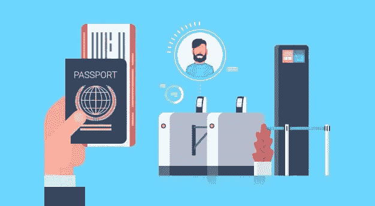

# 通过视觉人工智能对身份证明文件进行深入分析

> 原文：<https://pub.towardsai.net/in-depth-analysis-of-identification-documents-through-vision-ai-2c85651e80b0?source=collection_archive---------4----------------------->

## [人工智能](https://towardsai.net/p/category/artificial-intelligence)，[计算机视觉](https://towardsai.net/p/category/computer-vision)

来源: [Vecteezy](https://www.vecteezy.com/free-vector/airplane-door)

**作者:Sean Chua，Martin Gomez**

在国外多年后，胡安终于有了一个很好的理由回到菲律宾伊洛伊洛的家。他的父母和妻子都在充满活力的节日城，和他们呆在一起的是他唯一的儿子 Kiko。新冠肺炎·疫情来到了他的工作场所，接待他工作的国家已经要求所有的外国人被遣送回国，并实行在家工作的模式。这是该国政府宣布的，希望这将有助于缓解其已经不堪重负的医疗保健系统。

在 Juan 飞回菲律宾的三天前，Juan 勤奋地填写了一份被称为电子案件调查表格，也称为 e-CIF。e-CIF 系统是菲律宾红十字会和菲律宾政府之间的一个合作项目，它使任何和所有进入菲律宾的乘客能够提前输入他们的个人和旅行细节，在他们着陆时有一个快速的测试过程，跟踪他们的样本，获得他们的测试结果，并从菲律宾红十字会和卫生部检疫局获得许可证书。

当然，这个流畅、简单、快速的过程假设 Juan 完全、准确、适当地填写了表格，并遵循了表格中每个字段的所有详细说明。

让我们以他的好友托马斯为例，他也是 OFW 的一员。托马斯非常烦恼，他不得不回到菲律宾，以至于他完全忘记了在他的航班之前填写 e-CIF。抵达尼诺·阿基诺国际机场后，托马斯受到了菲律宾海岸警卫队的欢迎，并被要求出示他的 e-CIF 二维码。由于没有，托马斯被要求当场填写一份 e-CIF 表格。托马斯一边摸索着手机，一边匆忙填写表格，最后一步是自拍，上传到表格，然后点击“提交”

由于他是最后一个接受值班安检人员检查的乘客，托马斯的 e-CIF 二维码很快被扫描，他的数据被浏览，并被分配了一个条形码。托马斯去了洗衣店。

这就是问题所在。

你看，任何系统都是垃圾进垃圾出。当托马斯匆忙填写 e-CIF 表格时，他再也没有真正检查过自己的表格。于是，他输入的手机号码全被搞乱了；他的电子邮件地址有一个错别字——Gmail . con 而不是 gmail.con 而且他没有按照说明填写他的身份照片。

让我们讨论最后一点。在 e-CIF 中，每个人都需要上传身份证件的照片。对于像托马斯这样从国际航班入境的乘客来说，这非常容易，因为每个人都应该有护照。默认情况下，所有国际乘客都使用护照。

虽然一些乘客信息可能来自 e-CIF 表格数据，但这种护照照片的输入是至关重要的，因为它可以用作在疫情期间进入该国的人的可信来源。

具体来说，上传到 e-CIF 的护照经过一种称为 OCR(光学字符识别)的图像处理。

OCR 能够将包含文字的图像转换成机器可读的数据。使用 OCR 从护照数据页的图像中提取信息。

为了帮助 OCR 过程，护照和其他形式的身份识别，如国民身份证，已经标准化了它们向机器提供信息的方式。护照数据页最重要的部分之一是机器可读区(MRZ)。MRZs 包含一个人的相关信息，如姓名、国籍、身份证号、护照签发国、出生日期、性别等。因为对于多种类型的文件有多种类型的 mrz，所以护照 mrz 被称为类型 3。国际民用航空组织(ICAO)将 MRZ 的用途定义为:“它可用于获取数据以进行抵离登记，或仅指向数据库中的现有记录。”

我感兴趣的是理解这个过程是如何工作的，以及我可以从中获得的见解。在 Google-fu 和 Github 上的开放库的帮助下，我能够创建一个基本的过程来满足我的好奇心。

我决定用上传到 e-CIF 系统的 36，000 张护照图像的数据集来测试我的方法。

对于目录中的每个图像，我运行了以下命令:

1.  该算法首先初始化一个“变换矩阵”，它包含图像可能经历的一组可能的操作，以检测 MRZ 的存在，假设确实存在一个。
2.  为了保持一致，我们首先将所有图像的大小调整为 500 像素。这将使我们能够在以后设置具体的测量值。
3.  由于 MRZ 是护照中的文本区域，我们需要设计一种方法来访问和处理它。为此，我们实现了包围盒算法。这种算法的工作原理是在整个照片中寻找文本区域，并获得每个区域周围的“不可见文本框”的坐标。具体来说，这些坐标指的是所述“文本框”的角的坐标注意，由于 MRZ 总是出现在护照中大致相同的位置，因此该算法是可行的。
4.  在实现了边界框算法之后，我们仍然需要操纵图像本身来正确地处理护照中的文本区域，因为并非所有的图像都是彼此一致的。该算法对图像本身执行变换，例如改变其颜色、执行平移和旋转等，能够更准确地确定 MRZ 是否存在以及 MRZ 的位置。这种特定算法中的操作包括将图像转换为灰度、模糊图像，以及通过使图像中的某些元素(如文本)的轮廓变亮和使背景变暗来使其更加突出。
5.  另一方面，如果算法无法检测到 MRZ(通常称为“感兴趣区域”)的存在，我们将无法获得我们想要的输出。然后我们的代码抛出一个“没有找到 roi”的错误。

让我们深入研究第 4 步。对于有效图像，该算法会生成多个版本:

1.  第一个版本是转换成灰度的调整大小的图像。
2.  第二个版本是应用高斯滤波器调整大小的图像。[高斯滤波器](https://homepages.inf.ed.ac.uk/rbf/HIPR2/gsmooth.htm)是一种卷积，一组特定的操作，应用于图像，通过降低清晰度和引入额外的“噪声”来“模糊”图像由于 MRZ 是由一个文本块组成的，并且位于护照的底部，该算法能够很容易地检测出它的位置。
3.  第三个版本是应用了 [blackhat 变换](https://www.geeksforgeeks.org/top-hat-and-black-hat-transform-using-python-opencv/)的调整后的图像。这种变换使图像中较暗的元素在较亮的背景下更加突出。因此，变换会使较暗的对象(如文本)更加突出。
4.  第四个版本是应用了[沙尔滤镜](https://plantcv.readthedocs.io/en/v3.0.5/scharr_filter/)的调整后的图像。Scharr 滤镜通过考虑 x 的一阶导数(沿水平或 x 轴突出显示图像的一部分)和 y 的一阶导数(沿垂直或 y 轴突出显示图像的一部分)来突出显示图像的边缘和曲线。简而言之，它产生了图像的不同元素的轮廓。
5.  最终版本是调整大小后的图像，除了 MRZ(如果检测到的话)之外，护照上不相关的部分被裁剪掉。这是我们理想中需要的。

我们制作同一个图像的多个版本，这样我们就可以欣赏这个过程，我们也可以使用这些版本进行调试。

使用这 36，704 张照片并通过这种算法运行，我发现其中的 29，034 张(79.103%)被认为是可读的或“有效的”(如胡安的照片)。另一方面，大多数被算法忽略的图像包括自拍、极度模糊的图像(如托马斯的图像)、手指覆盖部分 MRZ 的图像等等。

为了验证并从图像中提取数据，我随后通过谷歌的视觉人工智能运行了有效集。这证实了之前的过程是有效的！然而实际上，成千上万的海外菲律宾工人的护照已经通过 e-CIF 表格处理了。在进行这项研究时，已经提交了大约 225，000 份表格。考虑到这一点，我们可以假设，如果所有到达的乘客中有 80%提交了带有适当身份验证图片的 e-CIF 表格，那么系统效率就达到了。我们可以利用统计学找到满足这个阈值的最小人数！

我们可以使用负二项分布这个函数。该函数接受 3 个参数—尝试次数(即到达乘客的数量)、成功概率和阈值概率—在本例中分别为 225，000、79.103%和 80%。然后，它提供满足阈值的成功试验的估计最小数量。在考虑了这些参数后，我感到惊讶的是，大约 178，000 名乘客必须成功提交适当的 e-CIF 文件。然而，从我们看到的情况来看，让一大批人做这样一件简单的事情可能并不像看起来那么容易。

去年 10 月 6 日，菲律宾红十字会进行了 100 万次检测。胡安和托马斯也已经有一段时间没有回家了。

我们只能希望在这段时间里，有更多的人上传了正确的身份证明文件。但那是另一篇文章。:)