# 深入的 Azure 机器学习模型通过 Web APIs 的端点在云上训练、测试和部署管道

> 原文：<https://pub.towardsai.net/in-depth-azure-machine-learning-model-train-test-and-deploy-pipelines-on-cloud-with-endpoints-for-b062d8d758ff?source=collection_archive---------3----------------------->

## 对数据科学家有益的理解

作者的一幅图像

## 工作空间由各种工件组成

*   **管理资源**:包括计算实例和计算集群。
*   **联动服务**:

1.  数据存储:这是一种存储各种数据的服务。例如— Blob 存储、hive 存储和 SQL 数据库。
2.  计算目标:这些是我们运行模型、进行训练和测试的机器。

*   **资产**:

1.  环境
2.  实验
3.  管道
4.  数据集
5.  模型
6.  端点

工作空间的整个范围取决于一些依赖关系，将会有各种日志、各种笔记本、资产条目等。对他们来说，工作空间需要储物空间。

*   **依赖关系**

1.  Azure 存储帐户:用于工作区的管理和工作。
2.  Azure container registry:当我们将模型部署到生产和 docker 实例时。
3.  Azure key vault:存储各种密钥、秘密信息和隐私信息。
4.  Azure application insight:它用于监控我们的机器学习应用程序和各种信息，如响应时间、请求、失败条件、性能等。

## **基本概念**

*   数据集

它是以行和列的形式组成的信息，即数据的集合。azure 中有很多方法可以上传/获取机器学习实验的数据集。

*   数据存储

当我们想从本地系统获取数据集时，我们需要一些存储，这就是数据存储的作用。数据存储只是各种存储类型的连接，如帐户存储、数据库或作为数据湖的分析。

*   各种存储类型

Blob，文件存储，数据湖，Azure SQL，Azure PostgreSQL，MySQL，Azure 数据砖。这些都是 azure 系统支持的。

## 创建机器学习工作空间

下面是创建工作区的步骤

1.  打开 azure 仪表盘，搜索机器学习资源，点击然后创建。如果您没有 azure 帐户，请点击下面的链接。

 [## 如何用借记卡开立 Azure 云账户

### 适用于所有数据科学家的简单易行的流程

amitprius.medium.com](https://amitprius.medium.com/how-to-open-an-azure-cloud-account-with-debit-card-87e0d0dd66c) 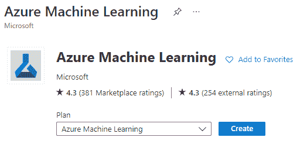

作者的一幅图像

2.填写所有信息。

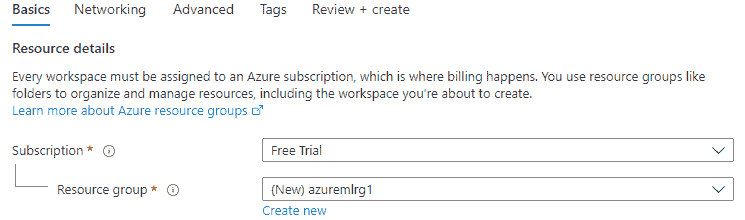

如果没有资源组名，则创建一个新的。当我们写入工作区名称时，其他信息(如密钥库、存储帐户和应用洞察)会自动填充。我们现在将保持容器注册为‘None ’,因为在部署时需要它。

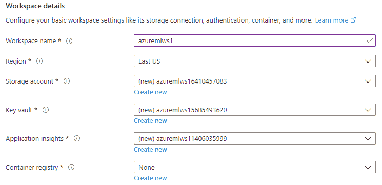

作者的一幅图像

我们可以选择任何地区，但如果我们有大量的数据，我们可以选择最近的快速数据传输的地区。

*   在网络选项中，选择公共访问来练习实验。
*   在高级选项中，有许多选项，并保持原样，在数据影响中，如果我们启用，那么我们告诉微软，我们将上传的数据是敏感的。

3.通过验证后，单击 create 创建工作区。它将创建如下所示的四个资源。

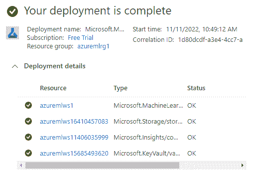

作者的一幅图像

4.现在，单击 go to the resource，workspace dashboard 将打开，并显示 launch studio 选项，如下所示。

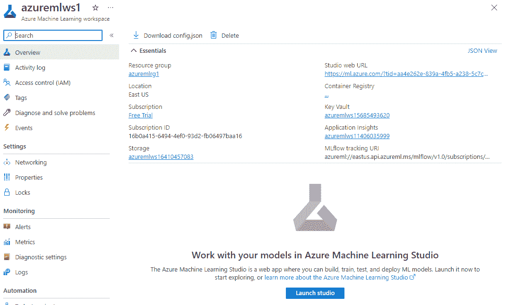

作者的一幅图像

在上图中，访问控制(IAM)用于创建更多用户来使用此工作区。

## 启动机器学习工作室

1.  创建工作区后，就该启动 ML studio 了，它看起来会像下图一样。

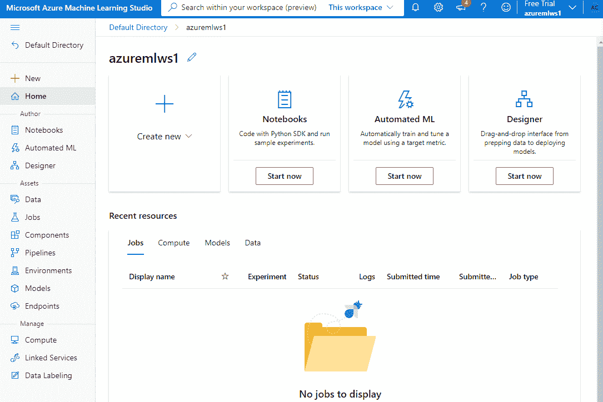

作者的一幅图像

上图中的作者负责制作机器学习实验和流水线。

2.创建新的存储帐户，以避免其他存储系统的文件。

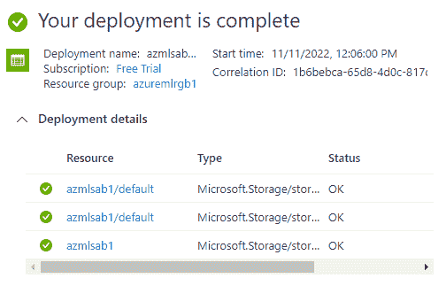

作者的一幅图像

3.现在，在这个存储帐户中创建一个容器。

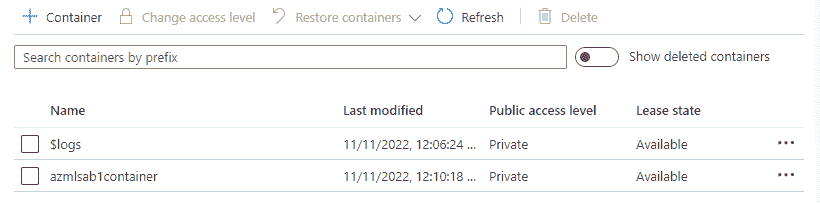

作者的一幅图像

4.现在，在 ML studio 中创建一个数据存储，它将连接到这个新创建的存储帐户。

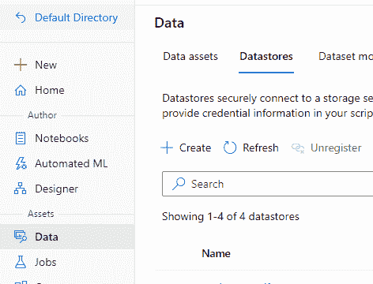

作者的一幅图像

5.填写信息。

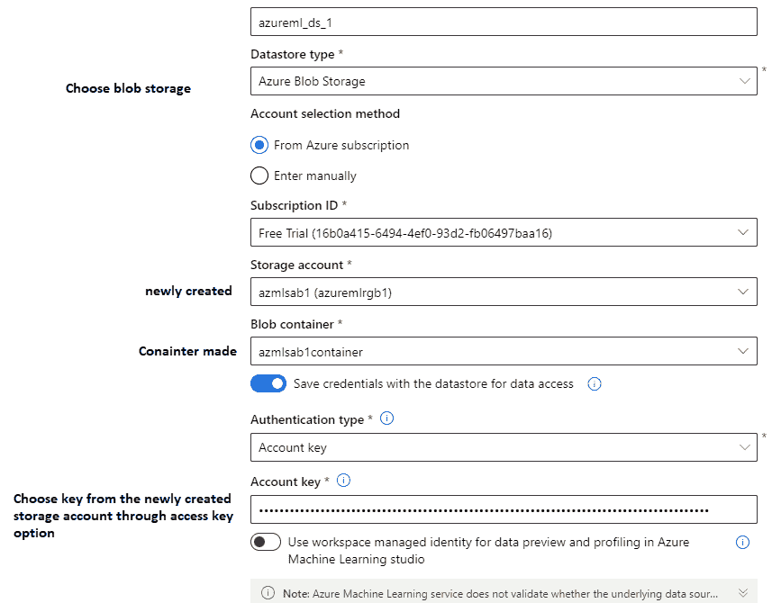

作者的一幅图像

要获取访问密钥，请转到步骤 2 中的新存储帐户，并从访问密钥选项中复制密钥，如下所示。

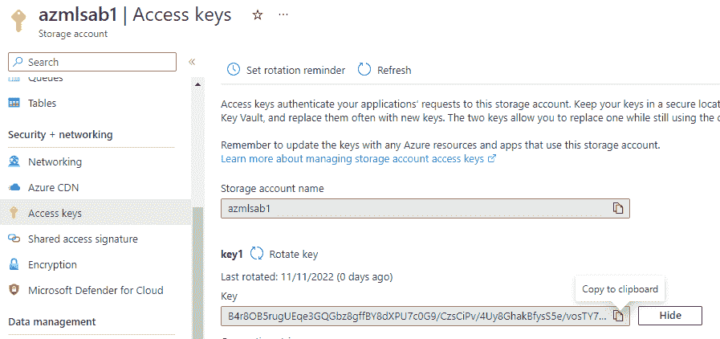

作者的一幅图像

现在，单击数据存储的 create 按钮。创建数据存储，并将其与存储帐户一起注册到工作区。

6.现在，将数据集上传到我们在步骤 3 中在存储帐户中创建的容器中。

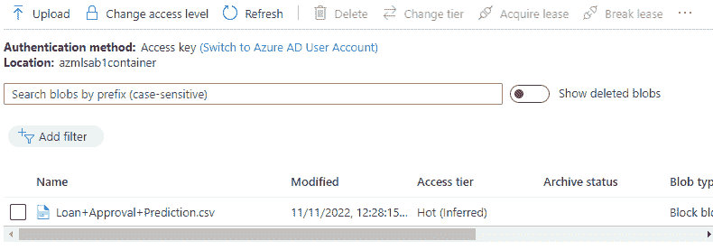

作者的一幅图像

我们还通过存储帐户中的存储浏览器选项来检查文件。

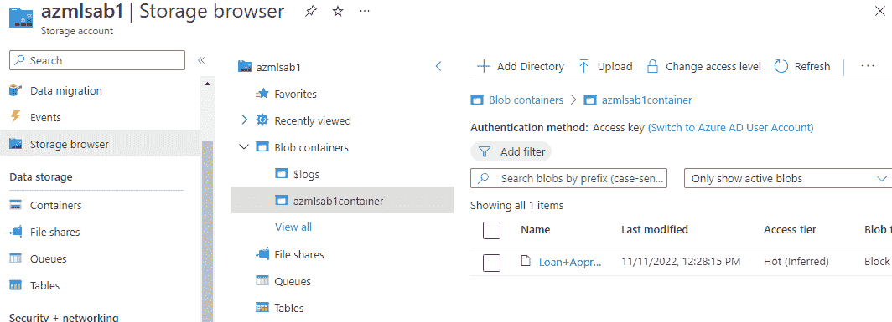

作者的一幅图像

7.现在，创建数据集并从数据存储中选择文件。

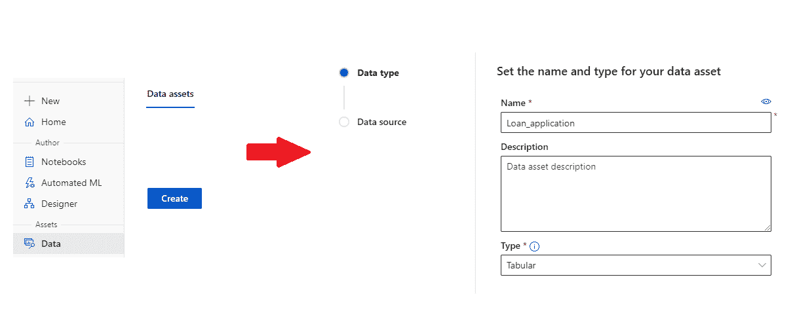

作者的一幅图像

单击“下一步”按钮；当我们选择“从 Azure 存储”时，其他选项将出现在左侧。我们选择这个选项是因为我们的存储是 blob 类型的。

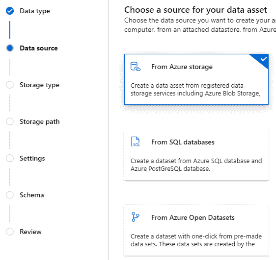

作者的一幅图像

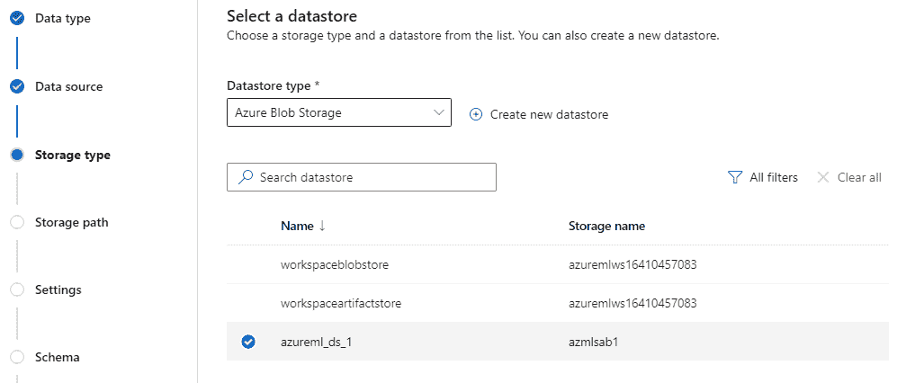

作者的一幅图像

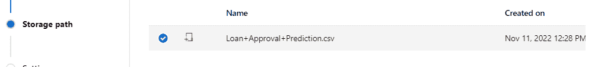

作者的一幅图像

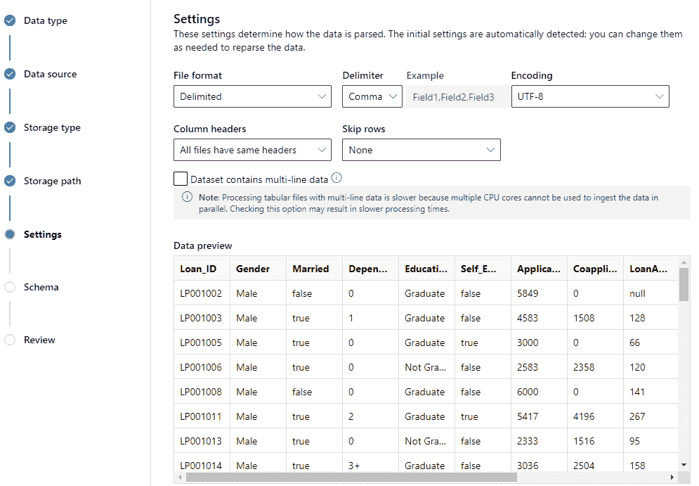

作者的一幅图像

现在，我们可以取消选择 Schema 选项中的 Loan_ID 和 Gender 列。

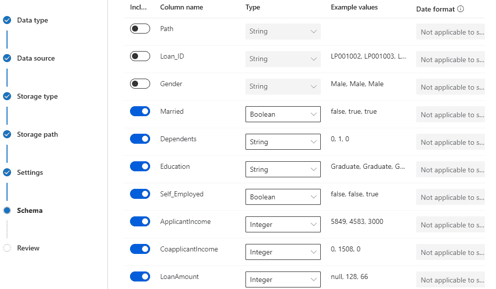

作者的一幅图像

我们的数据被上传到数据集中。

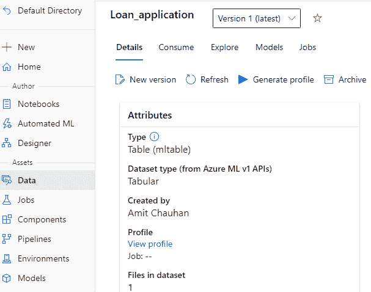

作者的一幅图像

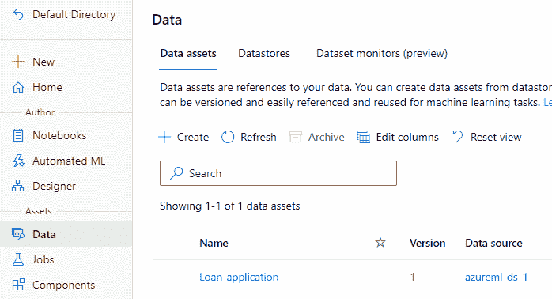

作者的一幅图像

## 计算资源

在本主题中，我们将讨论托管资源工件，即机器学习工作区中的计算实例和计算集群。

这些只是计算机和虚拟机的不同名称。计算目标与工作空间中的链接服务相连接。

我们为什么需要计算资源？

对于任何机器学习建模，我们都需要一个计算资源来训练我们的模型。

1.  **计算实例**:它是一种用于云计算的虚拟机/服务器或计算机。它不仅仅是一台机器，而是连接到工作空间，并且配置了 Python、R、Docker 和 Azure ML SDK。创建工作区时的默认存储帐户与此实例相关联，这意味着我们可以访问所有笔记本和存储的其他数据。主要用于开发过程中的培训、测试和推理。推断意味着为 web 服务创建端点。
2.  **计算集群**:它也是一个托管资源，是一组虚拟机。我们可以将集群用于所有三个作者，即计算实例、设计者或 autoML，用于培训和有限的部署。
3.  **计算目标**:这些计算由远程/附属计算和推理集群组成。

*   **远程计算**:目标的主要目的是用于训练和测试部署。我们可以使用任何本地机器、计算实例或虚拟机作为计算目标。我们还可以在计算集群上使用批量推理。
*   **推理集群**:它用于使用我们的模型在生产中进行实时预测。它们可以是 Azure Kubernetes 服务(AKS)。

## 创建计算集群

1.  转到 compute 选项卡，在 ML studio 中找到 compute cluster 选项，如下所示:

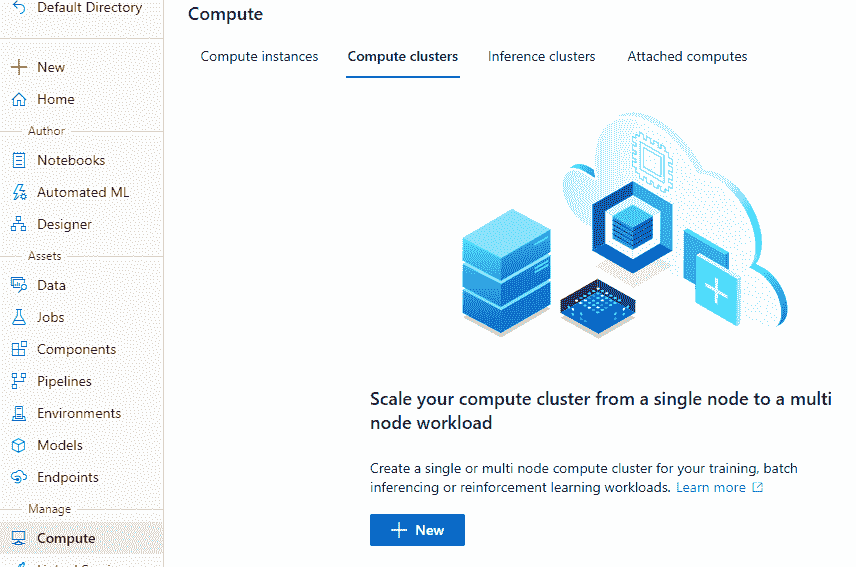

作者的一幅图像

2.现在，选择预算较低的计算，因为我们只是在练习。

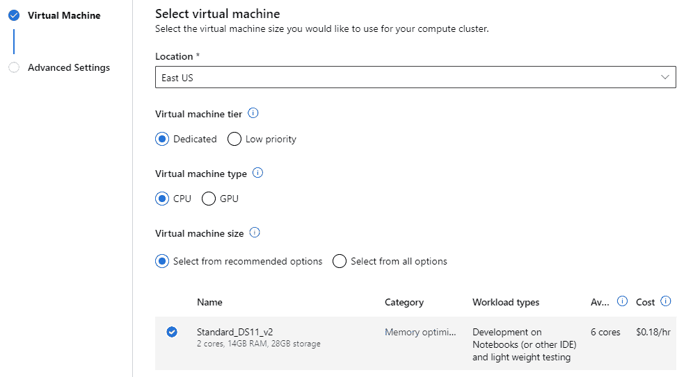

作者的一幅图像

3.给出集群的名称，然后单击 create 按钮。

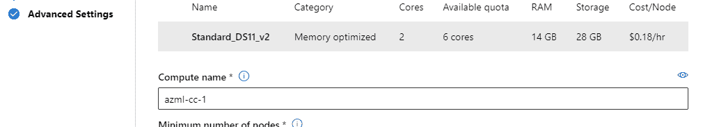

作者的一幅图像

4.此外，使用与上面相同的信息创建一个计算实例，如下所示。

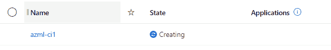

作者的一幅图像

## 什么是管道？

它只是从数据处理到部署的一系列测试或工作流。

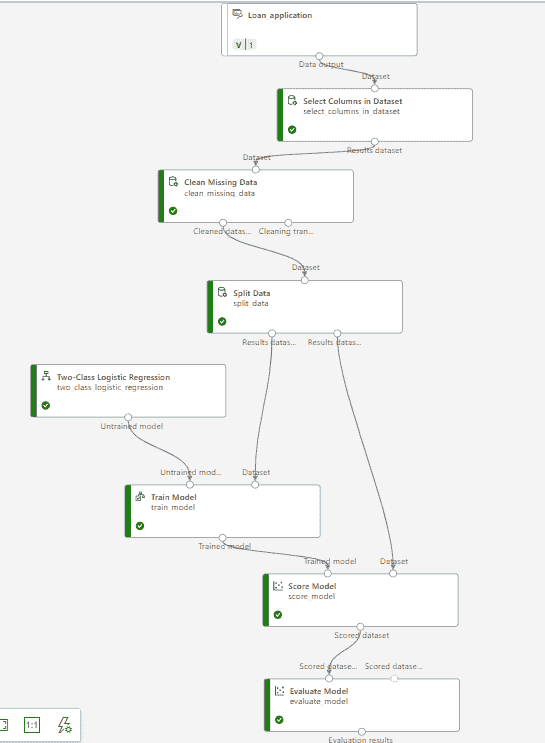

作者的一幅图像

我们可能需要在清理和培训过程中创建计算实例。

## 使用 ML studio 仪表板中的设计器创建新的培训管道

1.  单击设计器选项中的“立即开始”按钮，如下所示:

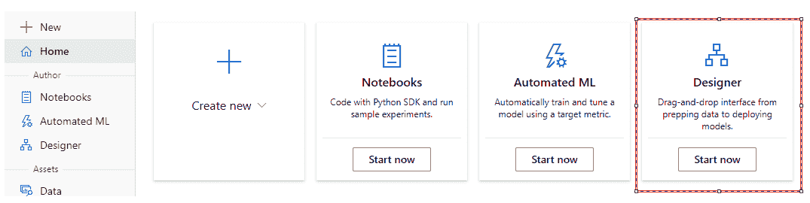

作者的一幅图像

2.现在，单击加号按钮创建管道。

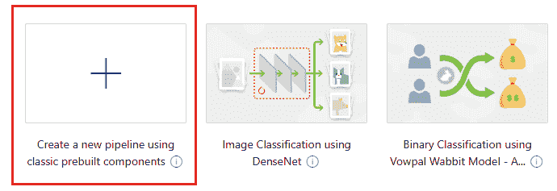

作者的一幅图像

3.单击加号按钮后，管道界面将打开。

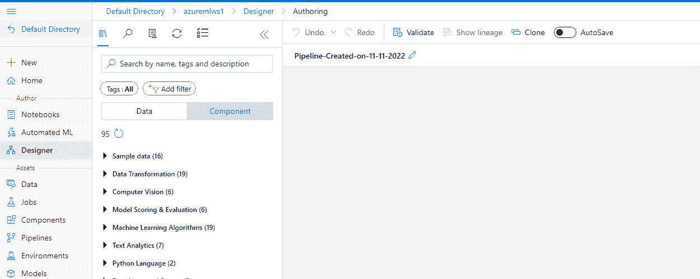

作者的一幅图像

4.在我们的数据选项中，我们的数据集如下图所示:

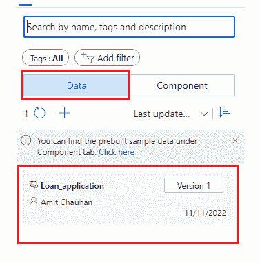

作者的一幅图像

5.只需将数据拖放到右侧。

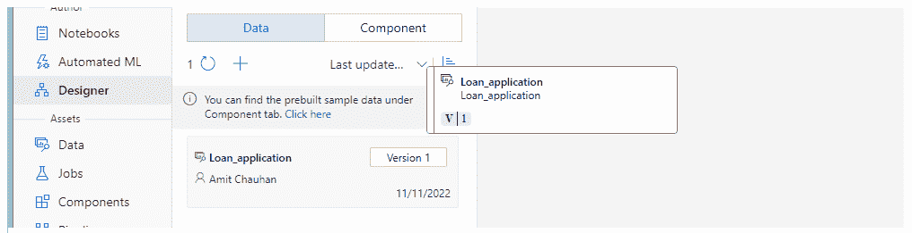

作者的一幅图像

6.现在，在 component 选项中检查从数据集中选择的列，并将它们放到右侧。将数据集的输出连接到选择列的输入。

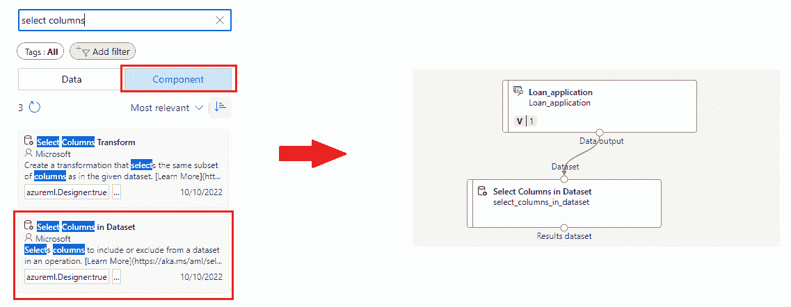

作者的一幅图像

7.现在，双击选择列，然后单击编辑列。

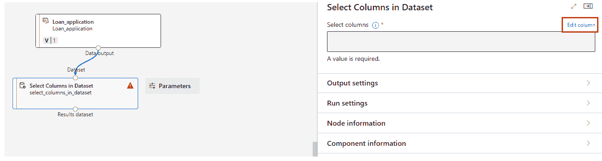

作者的一幅图像

8.现在选择“清除缺失”选项，并在“编辑列”按钮中选择列。

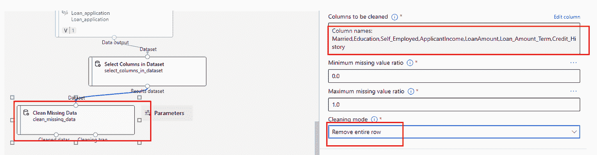

作者的一幅图像

9.现在选择分割选项，然后选择分数为“0.7”，并通过编辑列选择列名为“loan_status”的分层列。

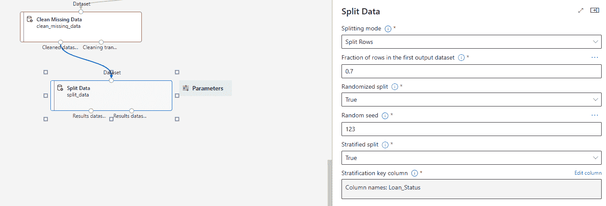

作者的一幅图像

10.现在，我们准备训练我们的两类逻辑回归模型。

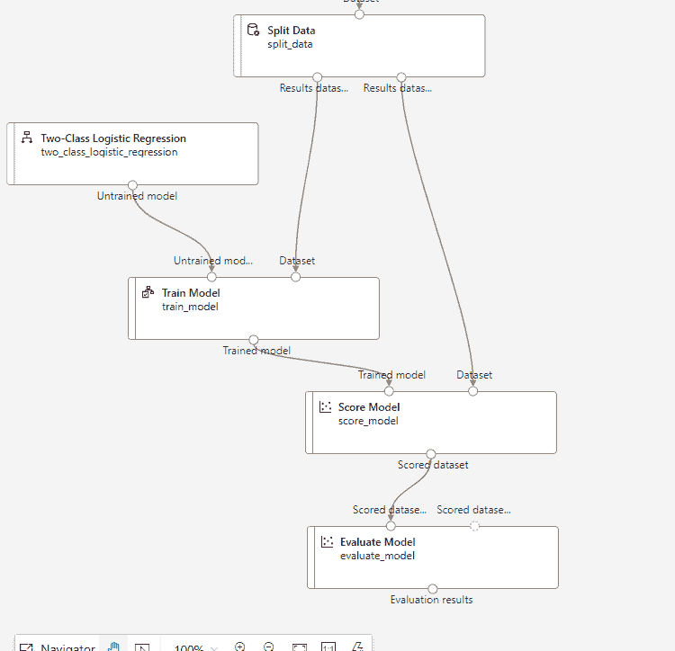

作者的一幅图像

11.完成画布中的所有选项后，我们的管道就完成了。现在转到设置选择计算集群。

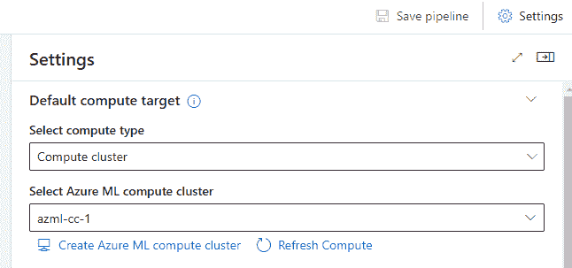

作者的一幅图像

12.假设我们的培训模型很大，我们需要使用不同的计算集群。然后，我们可以选择训练模型选项，并在运行设置中选择另一台计算机，如下所示:

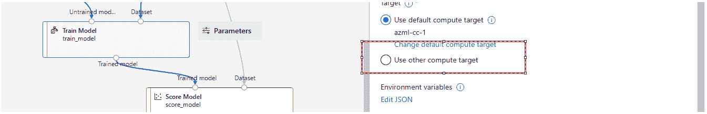

作者的一幅图像

13.我们的管道已经完成，我们可以点击提交按钮来运行管道。

作者的一幅图像

我们的管道运行成功完成。

14.完成后，右键单击评估模型以查看 ROC 曲线。

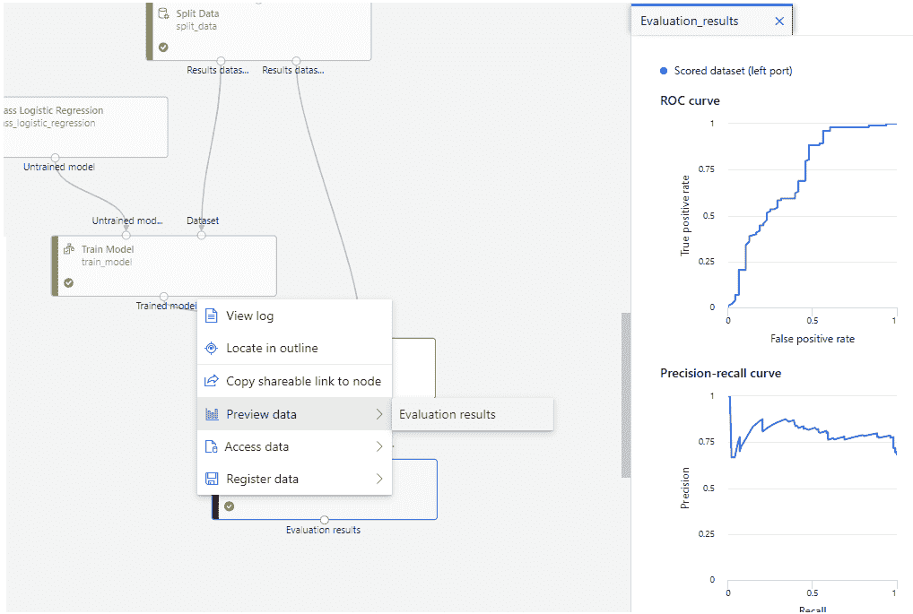

作者的一幅图像

包括混淆矩阵

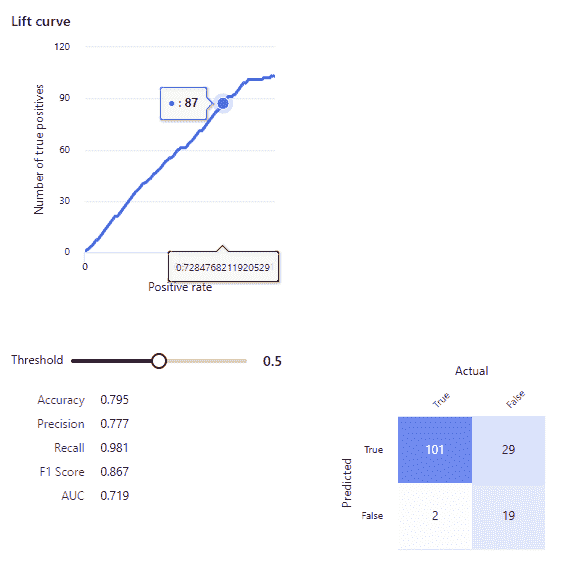

作者的一幅图像

## 创建推理管道并将其部署为 web 服务

1.  完成管道后，我们可以获得如下所示的创建推理管道选项:

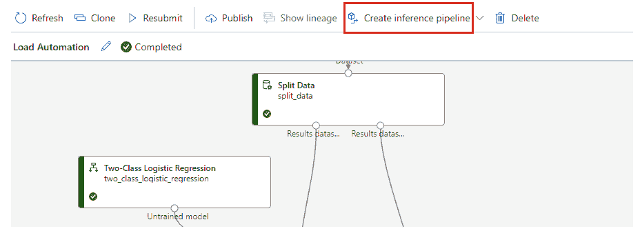

作者的一幅图像

2.当我们选择实时推理时，azure 会在管道中做一些更改，如下所示:

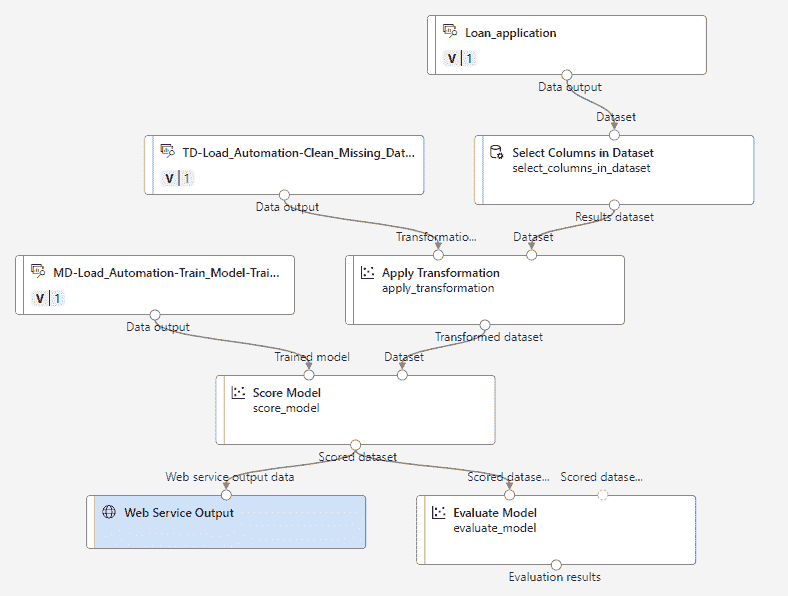

作者的一幅图像

3.我们在管道中做了一些改变，如下所示:

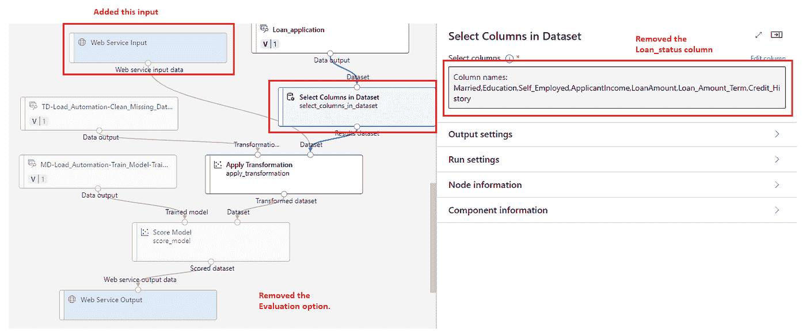

作者的一幅图像

4.现在，单击提交按钮运行实时推理。完成自动化后，我们可以查看分数。

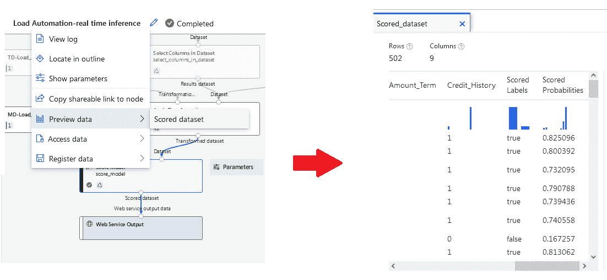

作者的一幅图像

我们也得到了分数和概率。

5.但是我们只需要 web 服务输出中的分数标签，所以我们需要画布中的选择列选项来限制输出。

作者的一幅图像

6.为了进行预测，我们需要在云中部署模型，如果显示了 deploy 按钮，那么在提交运行完成后刷新页面。

但是在部署之前，我们需要一个 Azure Kubernetes 集群服务来满足从 ML studio 创建新的推理集群的需求。

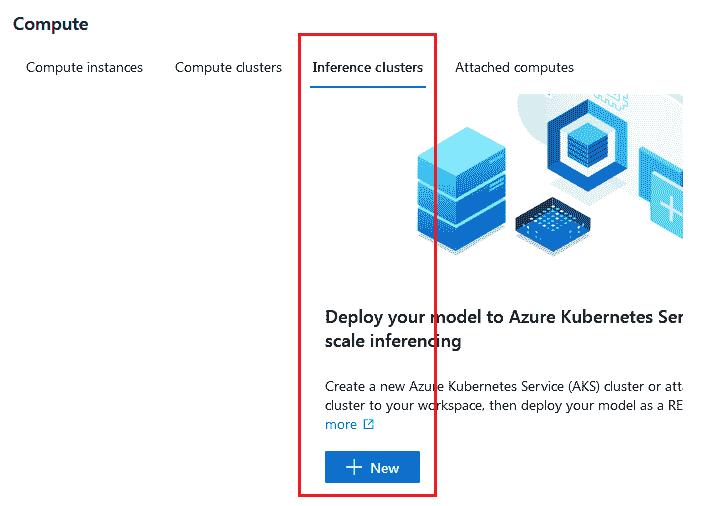

作者的一幅图像

选择虚拟机配置。

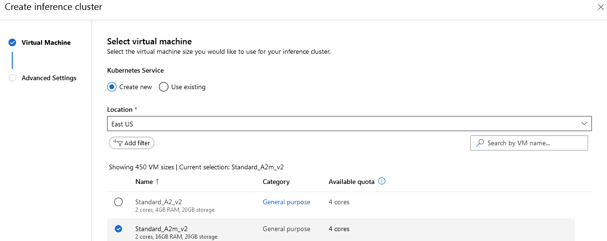

作者的一幅图像

写下端点的群集名称。

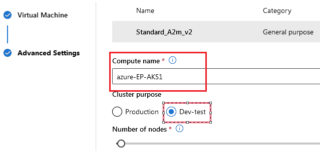

作者的一幅图像

现在，单击“create”按钮来创建集群，几分钟后它就成功完成了。

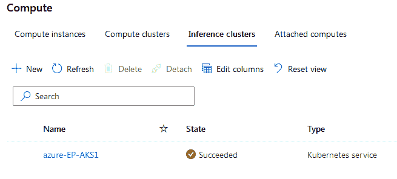

作者的一幅图像

创建推理集群之后，现在是时候部署模型和制作端点了。

作者的一幅图像

给出端点的名称，选择新创建的推理集群，然后单击 deploy 按钮，如下所示:

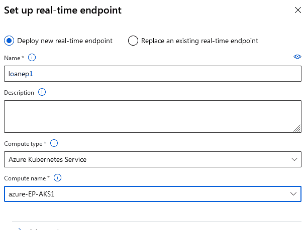

作者的一幅图像

几分钟后，部署完成，在端点部分，我们将看到端点处于健康状态。

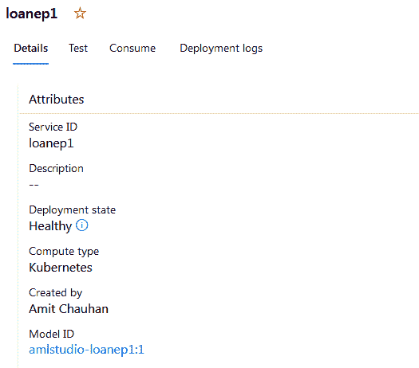

作者的一幅图像

在测试部分，我们可以根据输入参数进行预测。

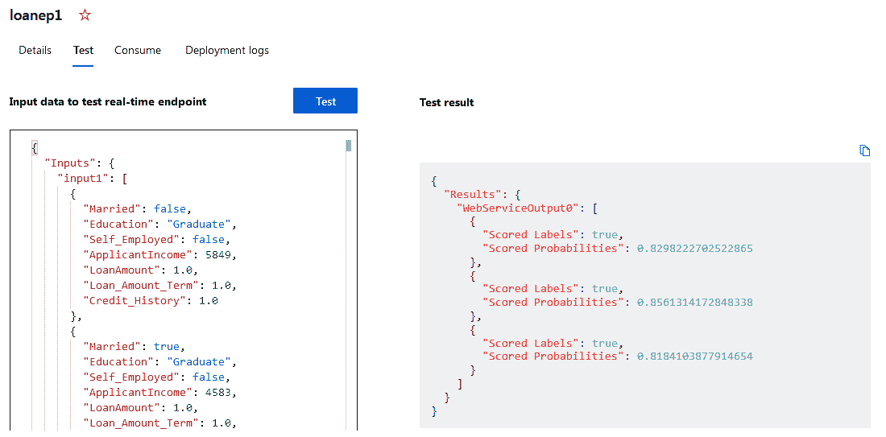

作者的一幅图像

在消费部分，我们可以使用分数的 URL。

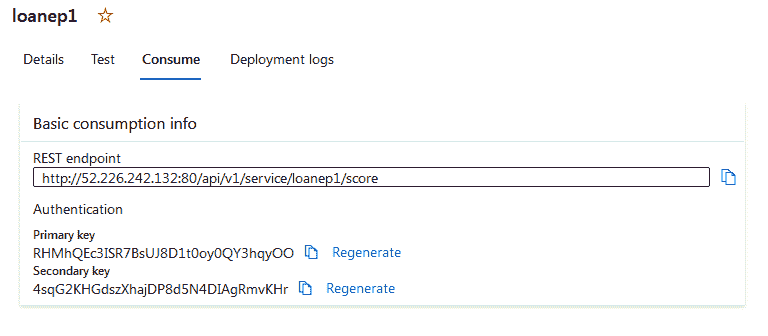

作者的一幅图像

## 结论

这篇文章正在清理 Azure cloud 中机器学习管道的工作流。重要的步骤是处理连接在一起的连接和服务。

我希望你喜欢这篇文章。通过我的 [LinkedIn](https://www.linkedin.com/in/data-scientist-95040a1ab/) 和 [twitter](https://twitter.com/amitprius) 联系我。

# 推荐文章

[1。Python](/15-most-usable-numpy-methods-with-python-4d20eb93e149?sk=911d2bebf042b148be8f366b907af158)
2 中最有用的 NumPy 方法。 [NumPy:图像上的线性代数](/numpy-linear-algebra-on-images-ed3180978cdb?source=friends_link&sk=d9afa4a1206971f9b1f64862f6291ac0)
3。[Python 中的异常处理概念](/exception-handling-concepts-in-python-4d5116decac3?source=friends_link&sk=a0ed49d9fdeaa67925eac34ecb55ea30)
4。[熊猫:处理分类数据](/pandas-dealing-with-categorical-data-7547305582ff?source=friends_link&sk=11c6809f6623dd4f6dd74d43727297cf)
5。[超参数:机器学习中的 RandomSeachCV 和 GridSearchCV](/hyper-parameters-randomseachcv-and-gridsearchcv-in-machine-learning-b7d091cf56f4?source=friends_link&sk=cab337083fb09601114a6e466ec59689)
6。[用 Python 充分解释了线性回归](https://medium.com/towards-artificial-intelligence/fully-explained-linear-regression-with-python-fe2b313f32f3?source=friends_link&sk=53c91a2a51347ec2d93f8222c0e06402)
7。[用 Python](https://medium.com/towards-artificial-intelligence/fully-explained-logistic-regression-with-python-f4a16413ddcd?source=friends_link&sk=528181f15a44e48ea38fdd9579241a78)
充分解释了 Logistic 回归 8。[使用 Numpy 与 Python](/data-distribution-using-numpy-with-python-3b64aae6f9d6?source=friends_link&sk=809e75802cbd25ddceb5f0f6496c9803)
9 进行数据分发。[Python 中 40 个最疯狂可用的方法](https://medium.com/pythoneers/40-most-insanely-usable-methods-in-python-a983c78f5bfd?sk=07df9058ea3e8c2fce4318a73cd8fce9)
10。[Python 中最常用的 20 种熊猫快捷方式](https://medium.com/pythoneers/20-most-usable-pandas-shortcut-methods-in-python-c9bc065ce11e?sk=1faf673d0cdfb46234975cbdeed12beb)