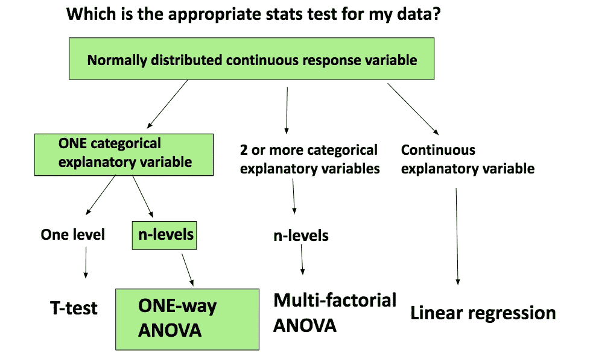
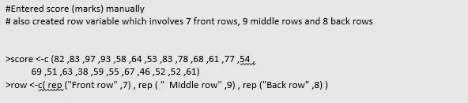
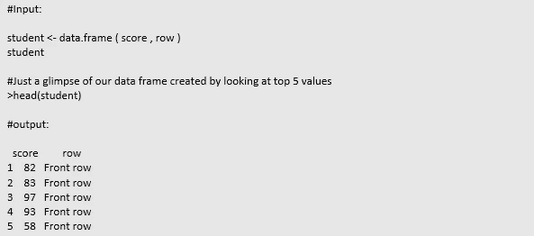
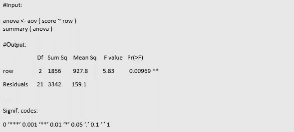
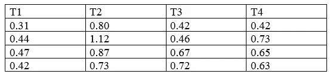
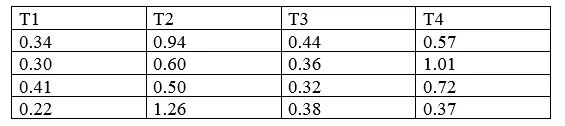
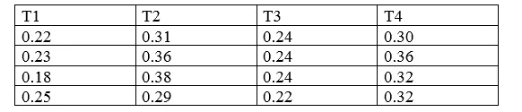
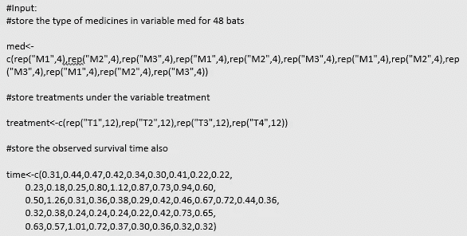
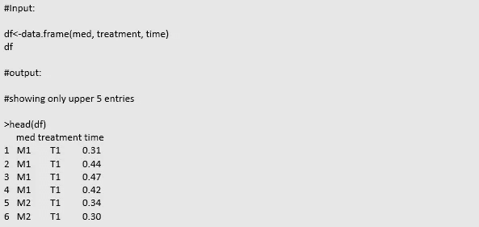
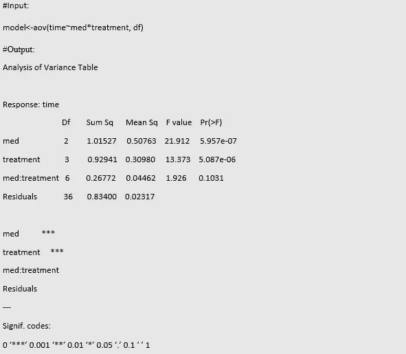

# 用 R 个例子深入介绍方差分析(ANOVA)

> 原文：<https://pub.towardsai.net/in-depth-introduction-of-analysis-of-variance-anova-with-r-examples-47c2805d9524?source=collection_archive---------2----------------------->

## [机器学习](https://towardsai.net/p/category/machine-learning)

## 特征关系分析的统计工具



图片[来源](https://ourcodingclub.github.io/tutorials/anova/)

方差分析技术是由罗纳德·费雪于 1918 年创立的。之所以这样命名，是因为这种方法使用方差来确定三组或更多组数据(样本)之间的均值是相同还是不同。

为什么是三组或更多组？因为，每当我们有两个组时，t 检验是优选的，但是对于两个以上的组，方差分析是优选的。

它基本上有三种类型。

*   单向方差分析
*   双向方差分析
*   n 向方差分析

在继续之前，我们必须了解自变量(也称为因子)和因变量。顾名思义，因变量依赖于其他变量，自变量不依赖于其他变量。例如，酒精会影响驾驶表现。这里，酒精被认为是自变量，驾驶表现被认为是因变量。

此外，我们可以添加几个可能影响驾驶性能的原因。比方说，一个人的驾驶经验，驾驶时使用手机等。

这里，我们的因变量是驾驶表现，自变量是酒精、驾驶经验和电话。所以，这里有 3 个自变量和 1 个因变量。

级别是任何因子可以取的可能值。如果我们的因素是性别，那么它的两个层次是男性和女性。同样，如果我们的因子是月份，那么我们得到 12 个级别。

> ***单向方差分析***

方差分析的一种方法是单因素方差分析。它使用一个独立变量，或者说一个有两个或更多层次的因子。此方法仅用于数值数据。

它将简单地表明自变量对因变量的影响。

## ***必要假设***

*   *独立性*

确保从总体(超集)中抽取的样本(子集)是独立的，这意味着一个样本不能影响另一个样本。要做到这一点，应该正确地进行随机取样的实验。应该是适当的随机选择。

*   *常态*

数据应该服从正态分布

*   *方差齐性(相同)*

每个样本内的方差与其余样本相同。

*   *因变量类型*

必须是可测量的。例如，距离(单位为米)、重量(单位为千克)等。

## **例子**

从教室中随机抽取学生样本，现在我们正在测试每排(前排、中间、后排)学生的平均分数(获得的分数)是否有显著差异。

有 7 个前排、9 个中间和 8 个后排。

```
Let’s say the mean score obtained by students is82 ,83 ,97 ,93 ,58 ,64 ,53 ,83 ,78 ,68 ,61 ,77,54 ,69 ,51 ,63 ,38 ,59 ,55 ,67 ,46 ,52 ,52 ,61 from the rows respectively.
```

我们确定行的类型是否影响学生的平均分数。

这里，我们采用了如上所述的三种类型的行。

自变量显然是“行的类型”，因变量是“获得的平均分数”。

## ***陈述假设***

**Null:** 所有组(三行型组)的均值相等，组间无差异。或者说，所有类型的行的平均分数几乎是相同的。

**交替:**所有组的均值不相等，组间有差异。或者说，行类型的平均分数是不同的。

## **实用带 R**

*   ***输入数据***



*   ***创建一个数据帧***



*   ***进行测试***



独立变量是这里的“行的类型”,我们可以在输出中看到残差。这是完全无法解释的变化，也就是自变量无法解释的变化。

Df 列是“行类型”和残差的自由度。

```
DF for row= 2 (we are taking only category rows)DF for residuals= Total observations — 1 — DF of row = 24–1–2= 21Sum Sq: It stands for the sum of squares
```

总体均值和组均值之间的总变差。

```
Mean Sq: Mean sum of squaresIt is (Sum Sq/ DF) for each cell
```

检验统计量是从 f 检验中得到的。它是平均 Sq(行)和平均 Sq(残差)的比值

```
PR (>F): p-value of F-statistic
```

## ***结论***

此处 p 值为 0.00928，即<0.05\. We, reject the null hypothesis.

We have compared the obtained statistic value to 0.05 because this is the standard value of alpha, that is level of significance.

In layman terms, our chances of being wrong are 0.93%, which is far less than 5% (alpha).

So, we will reject our null hypothesis assumption.

## ***解释***

我们测试的无效假设是，行的类型对获得的分数的影响是相同的。

有足够的证据表明，各种行类型的平均得分是不一样的。

[](/chi-square-test-examples-with-r-da05dc90b76e) [## 带 R 的卡方检验示例

### 变量关联与分布分析

pub.towardsai.net](/chi-square-test-examples-with-r-da05dc90b76e) [](https://medium.com/pythoneers/forget-html-and-flask-start-using-streamlit-1b394cfe4595) [## 忘记 HTML 和 Flask，开始使用 Streamlit

### 数据科学和机器学习的 WebApp 框架

medium.com](https://medium.com/pythoneers/forget-html-and-flask-start-using-streamlit-1b394cfe4595) 

> ***双因素方差分析***

这只是单向方差分析的扩展，它将找出两个不同的分类自变量对一个连续因变量的影响。

当有 2 组以上时，用于分析均值之间的差异。

我们说，它将告诉如何根据两个分类变量的水平，数量变量的平均变化。

在这里，我们有两个自变量和一个因变量。两个自变量都应该是分类的。

例如，假设我们想知道“性别、类型”和“运动类型”是如何影响“减肥”的。

这里，因素(独立变量)=运动类型和性别

响应变量(因变量)=体重减轻

执行时的一个重要假设是所有组的样本量必须相同。

## ***主效果和交互效果***

最简单的效应(主效应)与单向方差分析相同。它是一个自变量对因变量的影响。

当自变量与因变量上的另一个独立变量相互作用时，就会发生相互作用。当细胞有多重观察时，我们的过程就容易了。

## **举例**

这些数据是从一些实验室收集的，这些实验室在 48 只蝙蝠身上测试有毒物质，这些蝙蝠被分配到 3 种药物——M1、M2、M3，以及 4 种治疗方法，即 T1、T2、T3、T4。

我们有 4 个重复的数据，这意味着每个细胞 4 次观察。

响应/因变量是求蝙蝠的存活时间(小时)。

数据在每个单元格中都有许多条目。

*   对于 M1 医学，观察结果是



*   对于 M2 医学，观察结果是



*   对于 M3 医学，观察结果是



## ***陈述假设***

**每当我们在双向方差分析中进行假设检验时，我们都有三组数据。**

*   ***设置一个*** *(考虑自变量‘药品’)*

空:变量“药物”的均值没有差异，意味着均值相等。

交替:手段不对等

*   **(考虑自变量‘处理’)**

*空:变量“处理”的均值没有差异，意味着均值相等。*

*交替:手段不对等*

*   ****设定 C*** *(考虑两个自变量)**

*空:两个独立变量之间没有交互作用*

*交替:两个独立变量之间存在交互作用。*

## ***实用带 R***

*   ****输入数据****

**

*   ****创建数据帧****

**

*   ****执行测试****

**

*当我们进行双向方差分析时，总是考虑因素之间的交互作用项。*

*在输出表中，我们可以看到 med:处理(交互作用)不显著，但主要影响显著。*

*这可以从分析输出表中他们前面的***中看到。*

## ****结论****

*这里我们有三个效应值要考虑。一个交互效应和两个主效应。*

*药物和治疗之间相互作用的 p 值为 0.1031，大于标准α值(0.05)。在这种情况下，我们不拒绝零假设。*

*medicine 变量的 p 值为 0.0000005957，远小于 0.05。我们拒绝我们的无效假设。*

*治疗变量的 p 值是 0.000005087，也远小于 0.05。我们在这里也拒绝我们的无效假设。*

## ****释义****

*结果表明，没有交互作用的影响，但单独两个因素是显着的。*

*治疗和药物之间不存在相互作用。*

*也就是手段不对等。那就是治疗和药物，两者都对蝙蝠的存活时间有影响。*

*我希望你喜欢这篇文章。通过我的 [LinkedIn](https://www.linkedin.com/in/data-scientist-95040a1ab/) 和 [twitter](https://twitter.com/amitprius) 联系我。*

# *推荐文章*

*1.[8 Python 的主动学习见解收集模块](/8-active-learning-insights-of-python-collection-module-6c9e0cc16f6b?source=friends_link&sk=4a5c9f9ad552005636ae720a658281b1)
2。 [NumPy:图像上的线性代数](/numpy-linear-algebra-on-images-ed3180978cdb?source=friends_link&sk=d9afa4a1206971f9b1f64862f6291ac0)3。[Python 中的异常处理概念](/exception-handling-concepts-in-python-4d5116decac3?source=friends_link&sk=a0ed49d9fdeaa67925eac34ecb55ea30)
4。[熊猫:处理分类数据](/pandas-dealing-with-categorical-data-7547305582ff?source=friends_link&sk=11c6809f6623dd4f6dd74d43727297cf)
5。[超参数:机器学习中的 RandomSeachCV 和 GridSearchCV](/hyper-parameters-randomseachcv-and-gridsearchcv-in-machine-learning-b7d091cf56f4?source=friends_link&sk=cab337083fb09601114a6e466ec59689)
6。[用 Python](https://medium.com/towards-artificial-intelligence/fully-explained-linear-regression-with-python-fe2b313f32f3?source=friends_link&sk=53c91a2a51347ec2d93f8222c0e06402)
7 全面讲解了线性回归。[用 Python](https://medium.com/towards-artificial-intelligence/fully-explained-logistic-regression-with-python-f4a16413ddcd?source=friends_link&sk=528181f15a44e48ea38fdd9579241a78)
充分解释了 Logistic 回归 8。[数据分发使用 Numpy 与 Python](/data-distribution-using-numpy-with-python-3b64aae6f9d6?source=friends_link&sk=809e75802cbd25ddceb5f0f6496c9803)
9。[机器学习中的决策树 vs 随机森林](/decision-trees-vs-random-forests-in-machine-learning-be56c093b0f?source=friends_link&sk=91377248a43b62fe7aeb89a69e590860)
10。[用 Python 实现数据预处理的标准化](/standardization-in-data-preprocessing-with-python-96ae89d2f658?source=friends_link&sk=f348435582e8fbb47407e9b359787e41)*