# 使用 Python 的深度机器学习 HR 分析项目

> 原文：<https://pub.towardsai.net/in-depth-machine-learning-hr-analysis-project-with-python-2bfcaac0ff24?source=collection_archive---------0----------------------->

## [机器学习](https://towardsai.net/p/category/machine-learning)

## 用于查找、筛选、招聘和培训求职者的分析


由[塞巴斯蒂安·赫尔曼](https://unsplash.com/@officestock?utm_source=medium&utm_medium=referral)在 [Unsplash](https://unsplash.com?utm_source=medium&utm_medium=referral) 上拍摄的照片

人力资源是组织的一个部门，负责寻找、筛选、招聘和培训求职者，并管理员工福利计划。

这种管理是在任何组织中有效管理人员的战略方法，可以帮助他们的企业获得竞争优势。这项服务旨在提高员工的绩效。

因此，在这里，我们必须站在人力资源分析专家的角度，通过利用提供的数据，我们应该确定工资是如何随着其他重要因素而变化的。

解决这个问题也有助于我们对人力资源行业有一个基本的了解，也有助于我们了解分析和数据科学在这个领域的实际应用。

## 问题陈述

这里首先让我们通过导入所有需要的库来看看数据。

```
#Importing all the libraries needed for the processimport numpy as np
import pandas as pd
import matplotlib.pyplot as plt
import seaborn as snsimport statsmodels.api as sm
from statsmodels.stats.outliers_influence import 
                                variance_inflation_factorhr_data=pd.read_csv("HRdataset.csv")
hr_data.head(10)
```

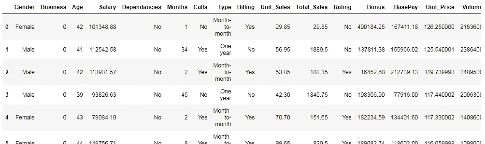

其目的是确定工资如何随着其他重要因素而变化。

所以，这里的格言是找到影响薪水栏的变量，这是一个回归问题。要遵循的步骤是

1.  检查数据，分析见解。
2.  必要时将进行数据清理和工程设计。
3.  如果特性和目标之间存在线性关系，我们将进行线性回归。
4.  如果数据不能呈现线性关系，则选择非线性回归模型。
5.  将调整超参数并在必要时执行交叉验证。
6.  用另一个模型检查该模型的行为。
7.  哪个模型产生最好的分数将被计算在内。

## **数据分析和可视化**

```
hr_data.hist(edgecolor='black', linewidth=1.2, figsize=(20, 20));
```

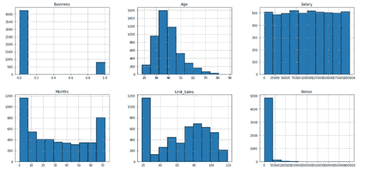

```
hr_data.shape#output:
(5049, 19)
```

在这里，我将所有数字列可视化，以下是我们从图表中获得的见解:

1.  商业专栏似乎只有 0 和 1，0 比 1 多。
2.  年龄一栏看起来有点像右偏数据。大多数年龄喜欢在 30-50 岁之间。
3.  工资栏是统一分配的。
4.  在该月的列中，大部分值接近 0 值且高于 60。
5.  unit_sales 在 20-30 个值之间有一个峰值，从那时起有高点和低点。
6.  随着值的增加，音量逐渐减小。0–1000 是开始值。也有异常值。
7.  奖金的值只集中在 0-500 之间。1500 年后没有显著的数值。这说明它有极端的价值观。
8.  大部分基本工资在 10 万到 15 万英镑之间。
9.  Unit_Price 的大部分值都在 0-100 之间。然后 600 就没几个了。显然也有异常值。
10.  该卷的图形与奖金列相似。
11.  期初余额、期末余额、最低价都有相同类型的图表。其中它们在开始时具有高值，并且随着 x 轴上的值的增加而减小。这些列也有极值。

[](/8-active-learning-insights-of-python-collection-module-6c9e0cc16f6b) [## 8 Python 集合模块的主动学习见解

### 数据收集容器

pub.towardsai.net](/8-active-learning-insights-of-python-collection-module-6c9e0cc16f6b) [](https://medium.com/pythoneers/fully-explained-mean-shift-clustering-with-python-51aef7a17c5d) [## 用 Python 全面解释均值漂移聚类

### 基于无监督质心的算法学习

medium.com](https://medium.com/pythoneers/fully-explained-mean-shift-clustering-with-python-51aef7a17c5d) 

seaborn 库给出了散点图中每个特性及其关系的 pairplot 图。这里用一个配对图来显示数据。

```
sns.pairplot(hr_data)
```

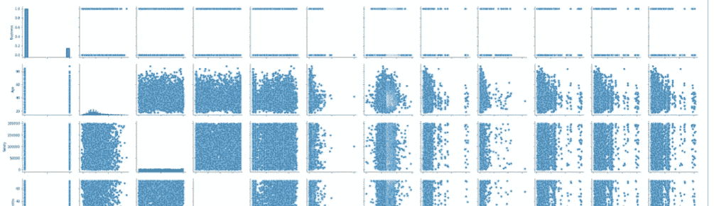

根据上面的配对图

*   salary 和数据集中的任何其他列之间没有线性关系。
*   opening_balance、closing_balance、low 与 Unit_Price 列具有明显的线性关系。
*   期初余额与期末余额和下限成正线性关系。

数据集中的任何其他列之间没有明显的关系。

现在，我将设想目标可变工资。

```
sns.histplot(x='Salary',data=hr_data)
```

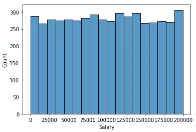

```
sns.boxplot(x='Salary',data=hr_data)
```

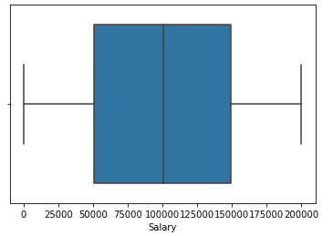

可视化目标可变工资。它是均匀分布的，没有任何异常值。

这里的分类列是性别、依赖关系、呼叫、类型、账单、总销售额和评级。尽管 total_sales 列看起来有数值，但它是作为分类值给出的。

我还可视化了数据集中的所有分类列。

```
sns.countplot(x="Gender",data=hr_data)
sns.countplot(x='Dependencies',data=hr_data)
sns.countplot(x='Calls',data=hr_data)
sns.countplot(x='Type',data=hr_data)
sns.countplot(x='Billing',data=hr_data)
```

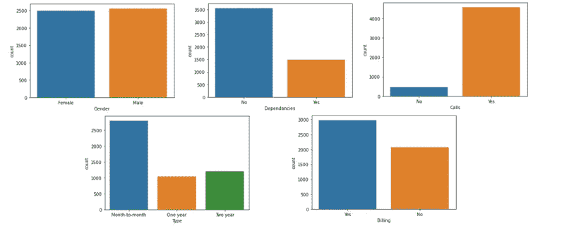[](/pandas-dealing-with-categorical-data-7547305582ff) [## 熊猫:处理分类数据

### 用 python 创建系列和数据帧

pub.towardsai.net](/pandas-dealing-with-categorical-data-7547305582ff) 

## **数据清理**

将检查数据中的异常值。

```
for column in hr_data:
    if hr_data[column].dtype in ['int64', 'float64']:
        plt.figure()
        hr_data.boxplot(column = [column])
```

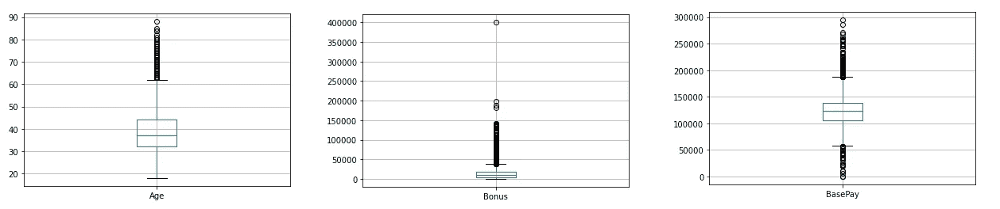

“年龄”、“奖金”、“基本工资”、“单价”、“数量”、“期初余额”、“期末余额”和“下限”列有异常值。现在，我们必须处理离群值，以创建一个好的模型。

让我们用中间值来代替异常值，使数据不那么扭曲。我们用中间值或平均值代替极值，但建议不要使用平均值，因为它很容易受到异常值的影响。

```
sns.boxplot(x='Bonus',data=hr_data)
```

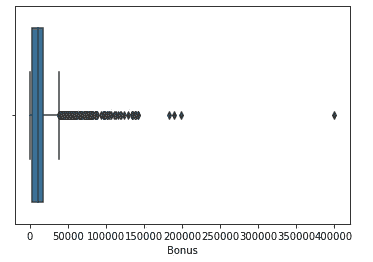

```
print(hr_data['Bonus'].median())
print(hr_data['Bonus'].quantile(0.75))hr_data['Bonus']=np.where(hr_data['Bonus']>17176.63,10114.01,hr_data
                                           ['Bonus'])sns.boxplot(x='Bonus',data=hr_data)#output:
10114.01
17176.63
```

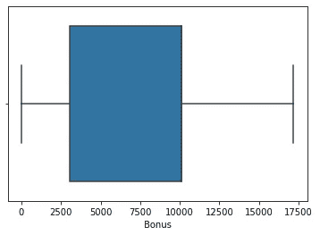

```
hr_data.skew()
```

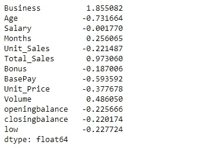

当我们处理异常值时，偏斜度也降低了。众所周知，当我们处理极值时，甚至偏斜度也变得正常。

我们知道这一点

*   对于对称的，偏斜度在-0.5 和 0.5 之间。
*   如果数据是中度偏斜的，那么偏斜度在-1 到-0.5 之间。
*   如果数据高度偏斜，那么偏斜度小于-1 或大于 1。

这里，除了业务列之外，所有值都在 0.5 到-0.5 之间。当我们仔细观察时，它只有 0 和 1，也就是说，要么有业务，要么没有。因此，我们将把它转换成假人，以便于计算。因此，我们现在忽略它的偏斜度，因为它是一个分类值。

现在，我们使用虚拟对象将分类值转换为连续值。

```
def dummies(x,hr_data):
    temp = pd.get_dummies(hr_data[x], drop_first = True)
    hr_data = pd.concat([hr_data, temp], axis = 1)
    hr_data.drop([x], axis = 1, inplace = True)
    return hr_datahr_data = dummies('Gender',hr_data)
hr_data = dummies('Dependancies',hr_data)
hr_data = dummies('Calls',hr_data)
hr_data = dummies('Type',hr_data)
hr_data= dummies('Billing',hr_data)
hr_data = dummies('Rating',hr_data)
hr_data=dummies('Business',hr_data)
```

现在，让我们看看将分类数据转换成虚拟变量后的数据。

```
hr_data.head(10)
```

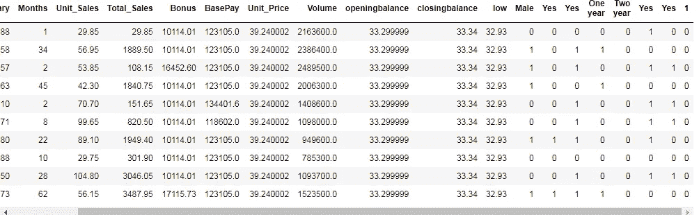

由于有许多列具有相同的名称是的，为了方便起见，我们将更改列名。

```
hr_data.columns = ['Age','Salary','Months','Unit_Sales','Total_Sales','Bonus'               'BasePay','Unit_Price','Volume','openingbalance','closingbalance',
'low','Male','dep','calls','One year',
'Two year','billing','rating','business']
```

使用热图检查列之间的相关性。

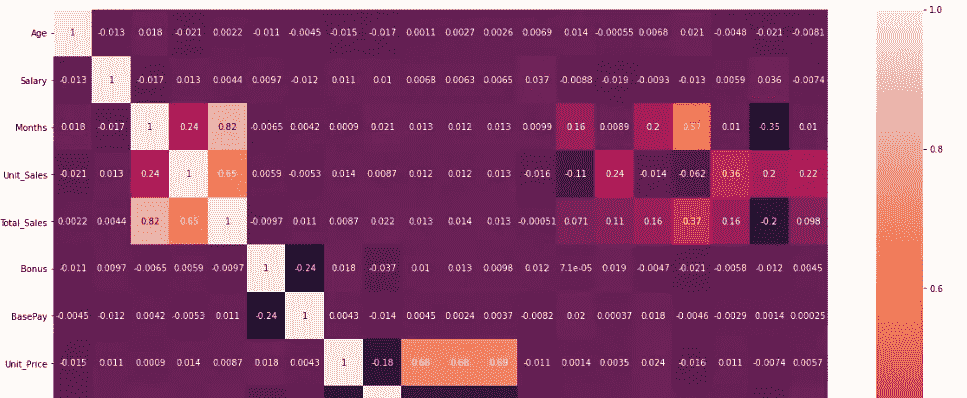

从上面的图可以清楚地看出，期初余额、期末余额和下限之间有更多的关系。那就是存在多重共线性。

多重共线性意味着一个要素与数据中的多个要素相关。数据集中的多重共线性会带来很多麻烦。所以，建议在我们训练一个模型之前先处理一下。

现在，让我们将数据分成 x 和 y，以便进一步处理。

```
y=hr_data['Salary']
x=hr_data.drop(columns=['Salary'])
```

识别多重共线性的最佳方法是计算方差膨胀因子(VIF)。VIF 判断自变量是否对数据集有贡献。更多的 VIF 是不可取的。它检测计算方差的回归模型中是否存在多重共线性。

而且最好去掉一些高度相关的自变量。

因此，我们在这里计算训练数据集中每一列的方差。

```
vif = pd.DataFrame()
vif["VIF Factor"] = [variance_inflation_factor(x.values, i) for i in range(x.shape[1])]
vif["features"] = x.columnsvif.round(1)
```

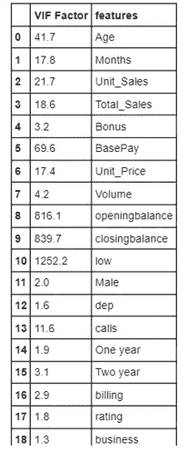

VIF ~ 1:可以忽略|| 1 <vif :="" moderate="" vif="">5:极端</vif>

差异较大的列应被删除，以便使数据更可靠，更易于建模。这里我们有许多变化更大的列。

由于低列有最高的方差，我首先从集合中删除它。

```
x=x.drop(columns=['low'],axis=1)#Now again calculating the VIF to see the change in data.vif = pd.DataFrame()
vif["VIF Factor"] = [variance_inflation_factor(x.values, i) for i in range(x.shape[1])]
vif["features"] = x.columns
vif.round(1)
```

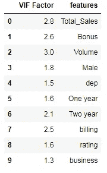

现在，让我们使用相关图来查看多重共线性是否在控制之中。

```
plt.figure(figsize=[10,8])
sns.heatmap(x.corr(),annot=True)
```

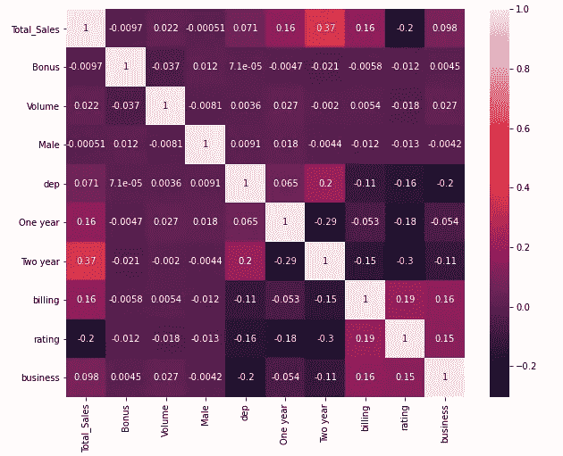

现在，我们可以看到数据中没有多重共线性。因此，现在我们可以更进一步，对我们的数据进行建模。

## 数据建模

这里我们将使用决策树回归器，因为它是一个回归问题。选择决策树回归器，因为目标变量薪金和数据中的任何其他特征变量之间没有线性关系。当数据中存在非线性关系时，决策树回归器会带来最佳结果。它们可以很好地处理均匀分布的数据。

我们将使用回归函数来拟合 x_train 和 y_train。

```
from sklearn.model_selection import train_test_split
x_train,x_test,y_train,y_test=train_test_split(x,y,test_size=0.2,random_state=1)from sklearn.tree import DecisionTreeRegressor
regressor = DecisionTreeRegressor(random_state=100)
regressor.fit(x_train, y_train)print(x_train.shape)
print(x_test.shape)#output:
(4039, 10)
(1010, 10)
---------------------------------------------------------print(y_train.shape)
print(y_test.shape)#output:
(4039,)
(1010,)
```

知道测试和训练数据的分数。

```
print("Training score:",regressor.score(x_train,y_train))
print("Testing score:",regressor.score(x_test,y_test))#output:
Training score: 1.0
Testing score: -0.8967580213939657
```

我们可以看到，该模型在训练数据集上表现良好，而在测试数据集上表现不佳，这表明该模型过度拟合。现在，让我们来看看指标。

```
pred=regressor.predict(x_test)from sklearn import metrics
print('Mean Absolute Error:', metrics.mean_absolute_error(y_test, 
                                    pred))print('Root Mean Squared Error of test dataset:',      
                 np.sqrt(metrics.mean_squared_error(y_test, pred)))#output:
Mean Absolute Error: 64909.09488118812
Root Mean Squared Error of test dataset: 80323.76501177333
-----------------------------------------------------------------from sklearn.metrics import r2_score
r2 = r2_score(y_test,pred)
print('r2 score for perfect model is', r2)#output:
r2 score for perfect model is -0.8967580213939657
```

## 使用 GridSearchCV 进行超参数调整

GridSearchCV 是一种从给定参数的网格中穷举搜索候选最佳参数的方法。需要为此交叉验证搜索方法提供搜索的目标估计值(模型)和参数。当我们为目标模型和数据集寻找最佳参数时，GridSearchCV 非常有用。

所以这里我使用 GridSearchCV 方法来为决策树回归器寻找最佳参数。

```
from sklearn.model_selection import GridSearchCV
from sklearn.tree import DecisionTreeRegressor
#making the instance
model= DecisionTreeRegressor(random_state=1205)
#Hyper Parameters Set
params = {'max_features': ['auto', 'sqrt', 'log2'],
          'min_samples_split': [2,3,4,5,6,7,8,9,10,11,12,13,14,15], 
          'min_samples_leaf':[1,2,3,4,5,6,7,8,9,10,11],
          'random_state':[123]}
#Making models with hyper parameters sets
model = GridSearchCV(model, param_grid=params, n_jobs=-1)
#Learning
model.fit(x_train,y_train)
#The best hyper parameters set
print("Best Hyper Parameters:",model.best_params_)
#Prediction
grid_cv_prediction=model.predict(x_test)#output:
Best Hyper Parameters: {'max_features': 'sqrt', 'min_samples_leaf': 11, 'min_samples_split': 2, 'random_state': 123}
```

上面给出的是我们的模型的最佳参数。

```
print("Training score:",model.score(x_train,y_train))
print("Testing score:",model.score(x_test,y_test))#output:
Training score: 0.14876469974509265
Testing score: -0.09869253838487135
-------------------------------------------------------from sklearn import metrics
print('Mean Absolute Error:', metrics.mean_absolute_error(y_test, grid_cv_prediction))
print('Root Mean Squared Error of test dataset:', np.sqrt(metrics.mean_squared_error(y_test, grid_cv_prediction)))from sklearn.metrics import r2_score
r2 = r2_score(y_test, grid_cv_prediction)
print('r2 score for perfect model is', r2)#output:
Mean Absolute Error: 51684.006219741175
Root Mean Squared Error of test dataset: 61133.06632846143
r2 score for perfect model is -0.09869253838487135
```

我们现在正在用最好的参数创建一个最好的模型，即使现在我们也可以看到 r2 分数并不令人满意。

正如我们所知，决策树回归器倾向于过度拟合数据。正如所看到的，很明显，它在训练模型上工作得很好，而不是在测试上，这意味着它是过度拟合的。所以，现在我们将使用随机森林来使模型更加可靠。

## 这是随机森林回归模型。

```
from sklearn.ensemble import RandomForestRegressor
rf_1_regressor = RandomForestRegressor(n_estimators = 100,
                                                  random_state =1)
rf_1_regressor.fit(x_train, y_train)print("Training score:",rf_1_regressor.score(x_train,y_train))
print("Testing score:",rf_1_regressor.score(x_test,y_test))#output:
Training score: 0.8474146255308276
Testing score: -0.07967104711600737
-----------------------------------------------------------rf_1_prediction=rf_1_regressor.predict(x_test)from sklearn import metrics
print('Mean Absolute Error:', metrics.mean_absolute_error(y_test,
                                                 rf_1_prediction))print('Root Mean Squared Error of test dataset:', np.sqrt(metrics.mean_squared_error(y_test, rf_1_prediction)))from sklearn.metrics import r2_score
r2 = r2_score(y_test, rf_1_prediction)
print('r2 score for perfect model is', r2)#output:
Mean Absolute Error: 51464.25526891089
Root Mean Squared Error of test dataset: 60601.56223728373
r2 score for perfect model is -0.07967104711600737
```

以下是随机森林模型的度量值。与决策树模型相比，MAE 和 RMSE 的价值较低。这意味着随机森林比决策树工作得更好。

为了获得更好的结果，我们还将调整随机森林中的超参数。

[](/hyper-parameters-randomseachcv-and-gridsearchcv-in-machine-learning-b7d091cf56f4) [## 超参数:机器学习中的 RandomSeachCV 和 GridSearchCV

### 提高算法精确度的技术

pub.towardsai.net](/hyper-parameters-randomseachcv-and-gridsearchcv-in-machine-learning-b7d091cf56f4) 

## 基于 GridSearchCV 方法的随机森林算法超参数调整

```
from sklearn.model_selection import GridSearchCVparam_grid = {'bootstrap': [True], 'max_depth': [5, 10, None], 
              'max_features': ['auto', 'log2']}
              }rfr = RandomForestRegressor(random_state = 1)g_search.fit(x_train, y_train);
print(g_search.best_params_)#output:
{'bootstrap': True, 'max_depth': 5, 'max_features': 'log2',
                                            'n_estimators': 15}
--------------------------------------------------------------
```

这些是最好的参数。现在用这些参数建立一个模型。

```
from sklearn.ensemble import RandomForestRegressor

rfr = RandomForestRegressor(bootstrap= True, max_depth= 5,
                            max_features='log2', n_estimators=15)rfr.fit(x_train, y_train)#output:
RandomForestRegressor(max_depth=5, max_features='log2',
                                          n_estimators=15)
--------------------------------------------------------------print("Training score:",rfr.score(x_train,y_train))
print("Testing score:",rfr.score(x_test,y_test))#output:
Training score: 0.03627401309472211
Testing score: 0.0016225374683012106
---------------------------------------------------------------rfr_pred=rfr.predict(x_test)from sklearn import metrics
print('Mean Absolute Error:', metrics.mean_absolute_error(y_test,
                                                     rfr_pred))print('Root Mean Squared Error of test dataset:',
              np.sqrt(metrics.mean_squared_error(y_test, rfr_pred)))from sklearn.metrics import r2_score
r2 = r2_score(y_test, rfr_pred)
print('r2 score for perfect model is', r2)#output:
Mean Absolute Error: 50178.12205393546
Root Mean Squared Error of test dataset: 58275.42863413414
r2 score for perfect model is 0.0016225374683012106
```

我们得到了测试数据集的正分数，但我们也将尝试使用随机 cv 进行调整，看看是否有任何变化。

## 随机森林的 RandomizedSearchCV 方法

```
from sklearn.model_selection import RandomizedSearchCVmax_features = ['auto', 'log2']
max_depth.append(None)
bootstrap = [True, False]r_grid = {'n_estimators': n_estimators, 'max_features':
         max_features,'max_depth': max_depth,'bootstrap': bootstrap}
```

## 现在，拟合模型 3 倍

```
rfr_random = RandomizedSearchCV(estimator=rfr, param_distributions=r_grid, n_iter = 20,
            scoring='neg_mean_absolute_error', cv = 3, verbose=2,
            random_state=42, n_jobs=-1, return_train_score=True)rfr_random.fit(x_train, y_train);#Fitting 3 folds for each of 20 candidates, totalling 60 fitsprint(rfr_random.best_params_)#output:
{'n_estimators': 6, 'max_features': 'log2', 'max_depth': 5,
                                           'bootstrap': True}
```

这些是它的最佳参数。现在我将使用这些参数创建一个模型。

```
from sklearn.ensemble import RandomForestRegressor
rand_cv_rfr = RandomForestRegressor(n_estimators=6,    
                    max_features='log2',max_depth=5, bootstrap=True)rand_cv_rfr.fit(x_train, y_train)#output:
RandomForestRegressor(max_depth=5, max_features='log2', 
                                               n_estimators=6)
------------------------------------------------------------------print("Training score:",rand_cv_rfr.score(x_train,y_train))
print("Testing score:",rand_cv_rfr.score(x_test,y_test))#output:
Training score: 0.03377887516438849
Testing score: 0.000352599003412557
-----------------------------------------------------------------rand_predict=rand_cv_rfr.predict(x_test)from sklearn import metrics
print('Mean Absolute Error:', metrics.mean_absolute_error(y_test,
                                                    rand_predict))print('Root Mean Squared Error of test dataset:', 
         np.sqrt(metrics.mean_squared_error(y_test,rand_predict)))from sklearn.metrics import r2_score
r2 = r2_score(y_test, rand_predict)
print('r2 score for perfect model is', r2)#output:
Mean Absolute Error: 50093.86614957989
Root Mean Squared Error of test dataset: 58312.480096178886
r2 score for perfect model is 0.000352599003412557
```

同样，我们将检查 2、4 和 5 倍的分数。现在，让我们创建一个数据框，看看哪个模型能产生最佳值。

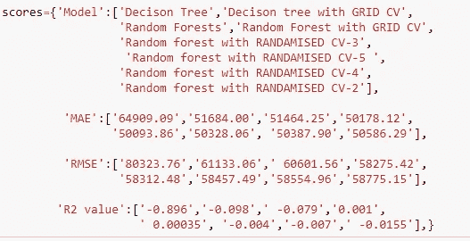

```
df = pd.DataFrame(scores, columns = ['Model','MAE','RMSE','R2 value'])
df
```

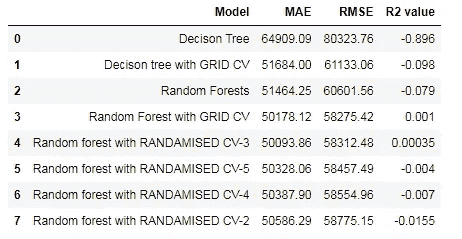

如果 r > 0 表示正相关。r < 0 indicates a negative association. The weak linear relationship shows a ‘0’ value of r. When the r slides away from the ‘0’ value on either side of ‘1’ and ‘-1’ the strength of the linear relationship increases.

When we analyze the above values of the metrics for all the models, we trained the Random Forest with GRID CV technique has a good score compared to all others.

```
MAE =50178.12 || RMSE=58275.42 || R2 value=0.001
```

## Result and recommendations

Random Forest with GRID CV that has 3 folds gave us good values they are

```
MSE:50178.12 || RMSE:58275.42 || R2 Value:0.001
```

## Conclusion:

The decision trees and random forests work well when there is plenty of data. Hereafter removing the columns that had extremely high VIF values like base_pay, business, openingbalance, closingbalance, low was removed, the data got reduced to 10 columns. So if we had more columns that influence the salary then the model would have yielded much better R2 values.

I hope you like the article. Reach me on my [LinkedIn](https://www.linkedin.com/in/data-scientist-95040a1ab/) 和 [twitter](https://twitter.com/amitprius) 。

# 推荐文章

[1。NLP —零到英雄与 Python](https://medium.com/towards-artificial-intelligence/nlp-zero-to-hero-with-python-2df6fcebff6e?sk=2231d868766e96b13d1e9d7db6064df1)
2。 [NumPy:图像上的线性代数](/numpy-linear-algebra-on-images-ed3180978cdb?source=friends_link&sk=d9afa4a1206971f9b1f64862f6291ac0)3。[Python 中的异常处理概念](/exception-handling-concepts-in-python-4d5116decac3?source=friends_link&sk=a0ed49d9fdeaa67925eac34ecb55ea30)
4。[用 Python 进行主成分分析降维](/principal-component-analysis-in-dimensionality-reduction-with-python-1a613006d531?source=friends_link&sk=3ed0671fdc04ba395dd36478bcea8a55)
5。[用 Python 全面讲解 K-means 聚类](https://medium.com/towards-artificial-intelligence/fully-explained-k-means-clustering-with-python-e7caa573176a?source=friends_link&sk=9c5c613ceb10f2d203712634f3b6fb28)
6。[用 Python](https://medium.com/towards-artificial-intelligence/fully-explained-linear-regression-with-python-fe2b313f32f3?source=friends_link&sk=53c91a2a51347ec2d93f8222c0e06402)
7 全面讲解了线性回归。[用 Python](https://medium.com/towards-artificial-intelligence/fully-explained-logistic-regression-with-python-f4a16413ddcd?source=friends_link&sk=528181f15a44e48ea38fdd9579241a78)
充分解释了 Logistic 回归 8。[concat()、merge()和 join()与 Python](/differences-between-concat-merge-and-join-with-python-1a6541abc08d?source=friends_link&sk=3b37b694fb90db16275059ea752fc16a)
的区别 9。[与 Python 的数据角力—第一部分](/data-wrangling-with-python-part-1-969e3cc81d69?source=friends_link&sk=9c3649cf20f31a5c9ead51c50c89ba0b)
10。[机器学习中的混淆矩阵](https://medium.com/analytics-vidhya/confusion-matrix-in-machine-learning-91b6e2b3f9af?source=friends_link&sk=11c6531da0bab7b504d518d02746d4cc)