# 向伯努瓦·曼德尔布罗致敬

> 原文：<https://pub.towardsai.net/in-homage-to-benoit-mandelbrot-8aad485ce274?source=collection_archive---------1----------------------->

图片由作者提供。

## [数据可视化](https://towardsai.net/p/category/data-visualization)，[数学](https://towardsai.net/p/category/mathematics)，[编程](https://towardsai.net/p/category/programming)

## 多重分形时间中的布朗运动

> 我必须感谢我的好朋友 Daniel Luftspring 在整个项目开发过程中的贡献和指导。

# 缺乏风险评估

在金融市场理论的核心，有一个庞大而不稳定的假设。假设金融工具的风险可以通过其波动性来确定，并且这种度量与时间的平方根成比例。要理解这一假设的起源，你必须回到 2008 年次贷危机、2000 年互联网泡沫、1987 年黑色星期一、1929 年华尔街崩盘之前，然后又是一百年。在这里，你会发现罗伯特·布朗正通过显微镜观察悬浮在水中的一粒花粉。他观察到微尘不规则地跳动。1900 年，路易斯·巴切莱特(Louis Bachelier)在他的论文《股票市场建模》中用高等数学将这一观察应用于金融。假设一只股票的价格像花粉一样随机波动，他就能计算出这只股票期权的价格。1905 年，阿尔伯特·爱因斯坦研究了同样的过程，并提供了一种用数学方法描述粒子运动的方法。爱因斯坦证明了这种运动是由单个水分子轰击花粉微粒引起的。此外，他还提供了数学来证明微粒从其原点移动的距离与经过时间的平方根成比例。为了纪念罗伯特·布朗，一个以统计上类似于花粉斑点的方式运动的过程被称为布朗运动。

直到今天，金融市场理论都是建立在巴切莱特和爱因斯坦在 20 世纪早期所做的工作基础上的。花粉移动的距离与金融资产的波动性相当，其中在给定时间长度内，从平均调整累积偏差序列的最小值到最大值的价格范围应与该时间段长度的平方根成比例。也就是说，时间周期越长，预期价格区间越大。对风险进行适当的评估是必要的，因为这是评估金融资产和构建有效投资组合的基础。

布朗运动的运动由标准的正态分布描述。这个著名的分布方便地描述了许多复杂的系统。因此，可以理解 Bachelier 会假设股票市场可以用这种分布来描述。然而，这是一个错误的分类。爱因斯坦证明了布朗运动过程从原点出发的距离是时间的平方根；然而，通常情况下，股票市场的波动会比时间的平方根增长得更快。埃德加·E·彼得斯为分形市场分析中的真实比例提供了极好的经验证据。这就是说，市场比布朗运动所暗示的更加不稳定。波动性长期以来一直被认为是风险的本质，如果没有对风险的正确评估，金融工具就无法得到正确的估值，投资者也会被市场中的破坏性事件吓到。

> 这很像海浪理论，它禁止海浪超过 6 英尺。
> ——曼德勃罗，伯努瓦。分形如何解释华尔街的问题？

# 本华·B·曼德博

伯努瓦·曼德尔布罗认识到金融市场理论模型的缺陷，并试图提供一个替代方案——一个更准确地评估风险的方案。该模型将生成一个真实的时间序列，其中包含价格的大幅波动和一系列波动。现有模型没有考虑到这些问题。

Mandelbrot 对数学界的贡献是巨大而有影响力的，但也许他最显著的贡献是他在分形几何方面的工作。分形有一个共同的特征:结构在局部是随机的，在整体上是确定的。埃德加·E·彼得斯在*哺乳动物肺支气管的分形市场分析*中提供了例子。微观层面上支气管的分支是随机的，但肺的整体结构几乎总是确定的。类似地，一只股票的微观波动在短时间内看起来是随机的，但在全球范围内有一个更确定的结构。Mandelbrot 认为一个简单的分形形状可以解释复杂的市场结构。在向他和他的同事道歉的同时，本文试图描述他模拟金融市场的最伟大的方法:*多重分形时间中的布朗运动*。

# 支离破碎的市场

> 分形是一种可以分成几个部分的几何形状，每个部分都是整体的缩小版。
> ——曼德勃罗，伯努瓦。金融价格的缩放:III。多重分形时间中的卡通布朗运动。

在观察到市场在所有尺度下看起来都相似时，他相信一个合适的分形可以模拟市场并捕捉其关键属性:大幅波动和集群波动。

## 分形价格生成器

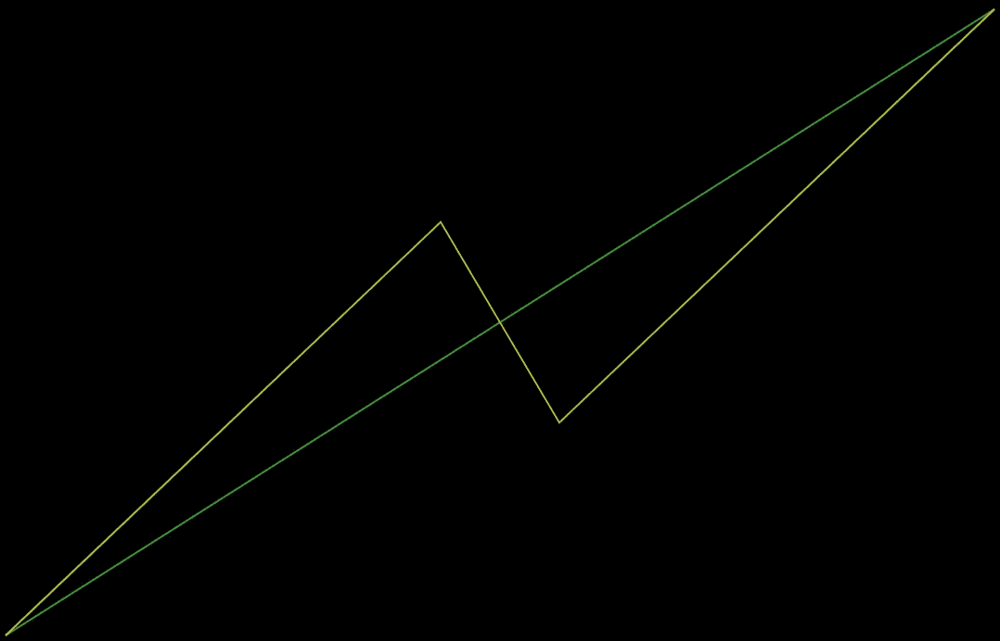

**图 1:** 金融分形的发起者和生成者

分形的根是启动器和生成器。在图 1 所示的 Mandelbrot 金融分形的例子中，发起者是一条代表价格变化的直线，发生者是一个有两个转折点的闪电形状，并以一种上-下-上的方式进行。涨跌过程考虑到了市场的涨跌周期。生成器的三条直线段中的每一条都成为启动器的下一次迭代。通过无限迭代，分形建立起来。图 2 重复这个过程四次。

**图 2:** 迭代分形价格生成器四次

如图 3 所示，可以通过随机化生成器的三个部分中的每一个来扩展该模型。

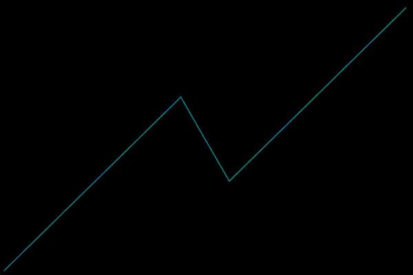

**图 3:** 分形价格生成器的随机分段

布朗运动过程有一个特殊的发生器——金融理论就是从这个过程建立起来的。与`y=2/3`和`x=4/9`处的第一个转折点对称。迭代布朗运动生成器，使得三个线段的宽度和高度成比例，并且该过程将始终是布朗运动。迭代布朗运动生成器创建了一个视觉上真实的市场画面，如图 4 所示。

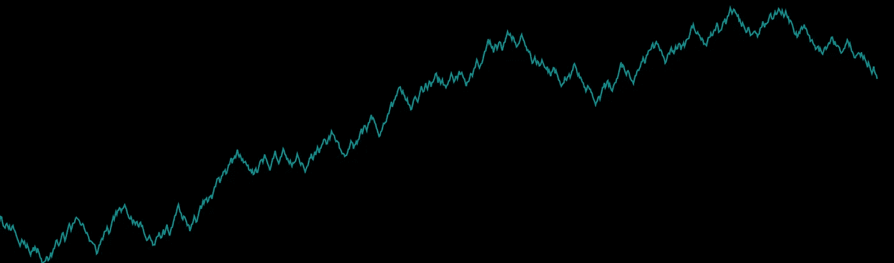

**图 4:** 布朗运动时间序列

这是一个漂亮的图片，可能通过视觉测试，但布朗运动发生器的统计特性与真实市场截然不同。在确定模型的适合度时，查看时刻之间的价格差异通常比查看价格图表更容易。例如，图 4 通过了市场价格图的视觉测试，但从视觉上可以清楚地看出，图 5 所示的价格时刻变化并不代表真实市场的价格变化(见图 6)。布朗运动的时刻价格变化，如图 5 所示，在整个时间内均匀分布，很少有变化的幅度超出正常范围。

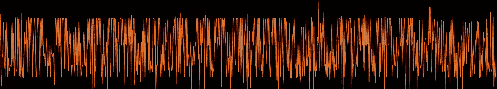

**图 5:** 布朗运动(白噪声)波动率

一个真实的市场的瞬间价格变化将如图 6 所示。该图显示了波动性的集群，不同于图 5 中的统一波动性。在图 6 中，更有可能的情况是，大的变化之后是更大的变化，小的变化之后是更小的变化。Mandelbrot 称之为长期依赖。长期相关性是在真实市场中发现的，而不是在布朗运动模型市场中。

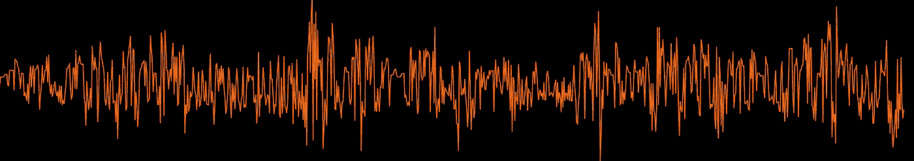

**图 6:** 真实市场的集群波动

然而，布朗运动生成器可以被修改以产生如图 6 所示的真实图表。这将在下一节讨论。

# 多重分形时间中的布朗运动

Mandelbrot 表明，分形是多才多艺的，足以精确地模拟布朗运动市场，这是金融市场理论的基础。他采用布朗运动，这被认为是*单一分形，*是一个多重分形价格生成器，如下所述。这种适应是产生大幅波动和波动集群所必需的。

## 多重分形价格生成器

人们通常认为市场活动有快有慢的周期。布朗运动发生器可以被改变，以解释这些快速和缓慢的时间周期，Mandelbrot 认为这是波动的本质。

**图 7:** 将单一分形转换为多重分形(为了细节而放大)

迭代的每个阶段从布朗运动生成器(unifractal)开始，然后以规定的方式收缩或延长每个片段，如图 7 所示。由此产生的生成器被认为是多重分形的。转折点的价格(y 坐标)保持不变，但达到该价格所需的时间(x 坐标)发生了变化。因为市场活动由 y 的变化表示，所以图 7 显示了相同数量的市场活动在段 1 和段 3 中出现的时间较短，而在段 2 中出现的时间较长。

图 8 显示了多重分形发生器的瞬间价格变化图有很大的波动和波动簇。

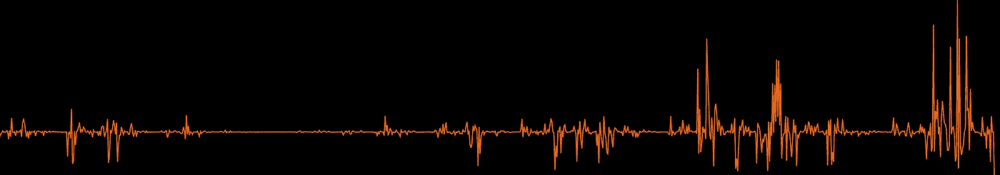

**图 8:** 多重分形价格生成器的聚集波动

问题来了，布朗运动的单分形价格生成器应该以什么样的方式被改变，才能变成多重分形，并产生一个真实的时间序列？

## 时钟时间与交易时间

时钟时间可以表示为一条直线，它总是以相同的速度前进。然而，市场会观察时间的快慢，就好像它们遵循时钟时间的某些导数一样。Mandelbrot 硬币这个过程交易时间，交易时间不是线性进步的。图 9 显示了时钟时间(直线)转换成交易时间。

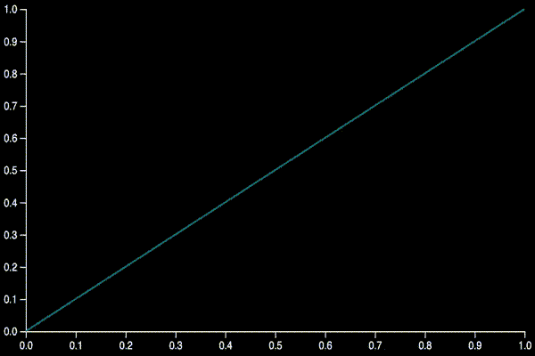

**图 9:** 时钟时间和交易时间

Mandelbrot 认为交易时间是以多重分形的方式进行的。二项式乘法级联，如下所述，用于将时钟时间转换为交易时间，因为它是多重分形的。

二项式乘法级联是一种分形。启动器是一条水平线，生成器是放置在该水平线之上的阶跃函数。要创建级联，首先将时钟时间表示为发起者，并定义两个合计为一的权重。对于时钟时间每个发起者，将该发起者分叉，并将权重 1 分配给前半部分下面的区域，将权重 2 分配给后半部分下面的区域。启动器下的总面积保持为发生器下的总面积。这个过程的一个迭代如图 10 所示。

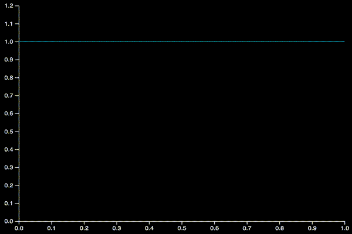

**图 10:** 权重 1 = 0.6 的二项式乘法级联

在图 10 中，启动器下面的区域是`base x height = area`或`1 x 1 = 1`。权重 1 选择为 0.6，权重 2 选择为 0.4。一次迭代后，`weight 1`下总面积的发起者被分配到生成器的前半部分。同样，启动器下总面积的`weight 2`被分配给生成器的后半部分。这产生了两个宽度为`0.5`高度未知的矩形。第一个矩形的等式是`0.5 x height = 0.6`，因为分叉启动器提供了一个已知的`base`和`weight 1`确定矩形 1 的面积是`0.6`。求解`height`产生`1.2`。同样的过程适用于矩形 2。原启动器下的`1`面积保持不变，计算为生成器两个矩形的累计面积:`(1.2 x 0.5) + (0.8 x 0.5) = 1`。图 11 重复这个过程四次。

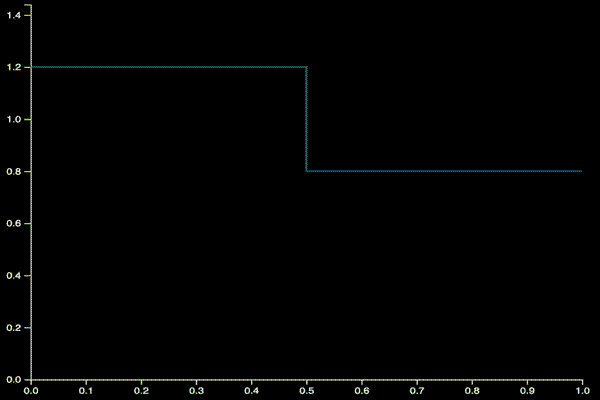

**图 11:** 二项式级联迭代四次

在迭代的每个阶段随机分配权重，并且多次迭代产生乘法级联。如上所述，乘法级联下的总面积等于原始启动器下的总面积。因此，乘法级联通过构造是概率密度函数(“PDF”)。图 12 显示了一个例子。

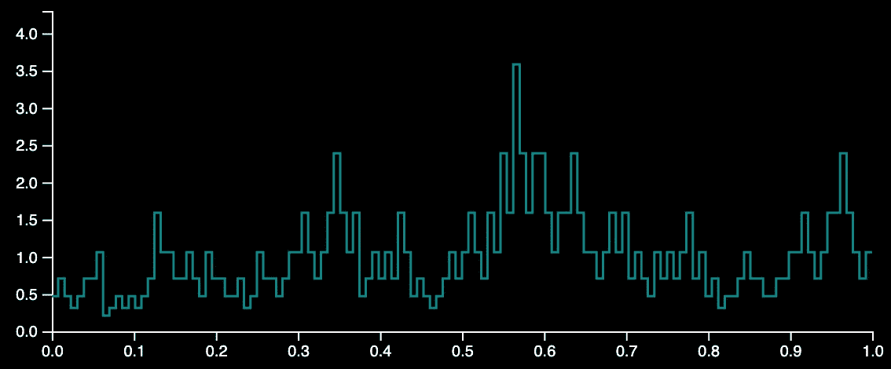

**图 12:** 交易时间 PDF

将时钟时间转换为交易时间的最后一步是计算乘法级联 PDF 的累积密度函数(“CDF”)。图 13 显示了交易时间 CDF。

**图 13:** 时钟时间和交易时间

## 交易时间对布朗运动的影响

交易时间将布朗运动发生器转变为多重分形价格发生器。这个过程在图 14 中用三个图形很好的说明了:布朗运动发生器，交易时间，以及由此产生的多重分形发生器。

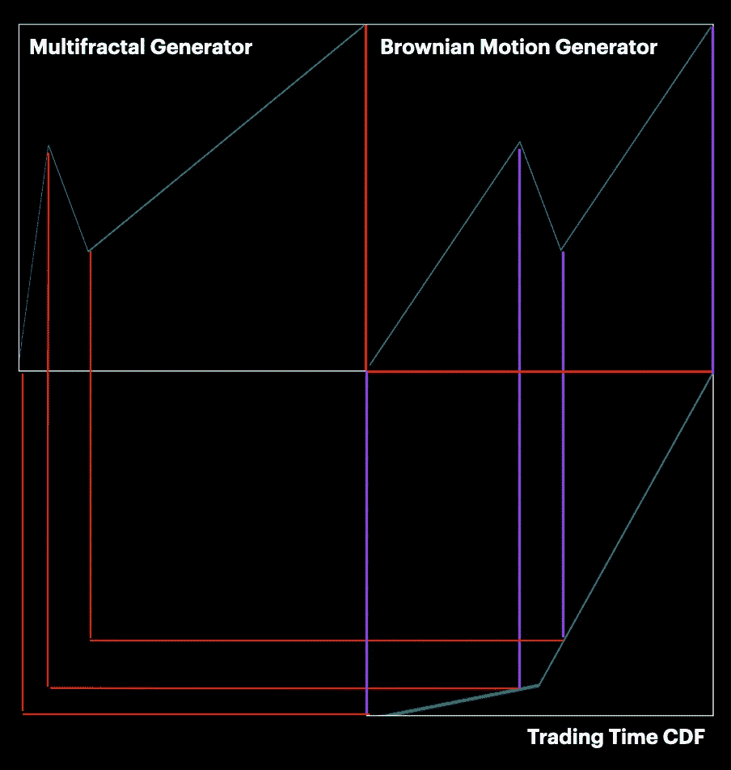

**图 14:** 用交易时间变换布朗运动发生器

图 14 可视化了布朗运动发生器(单分形)的转折点到多重分形时间发生器(多重分形)中布朗运动的新转折点的转换。图 14 是从右上象限的布朗运动发生器的转折点开始，向下到右下象限的交易时间 CDF，然后向左，直到多重分形发生器的新转折点。如图 14 所示，交易时间 CDF 在布朗运动发生器的每个转折点进行评估。当投影到 CDF(紫色线)上时，连续转折点之间的高度差成为相应多重分形生成器段的宽度(红线)。转换后，布朗运动发生器的三个部分的宽度都随着交易时间而改变。这种改变改变了每个细分市场活动发生的时间长度。因为交易时间是多重分形的，所以产生的生成器是一个在多重分形时间中前进的布朗运动。

> 注意:
> 我很难找到描述确切过程的信息，该过程确保由 CDF 生成的宽度值的新总和保持布朗运动生成器的宽度值的总和。我选择遵循[这个](https://users.math.yale.edu/public_html/People/frame/Fractals/RandFrac/Market/TradingTime/Example1/Ex1Step3.html)过程。

图 14 为了效果被夸大了，并且 CDF 仅由一次迭代构成。实际上，在通过分形价格生成器进行第一次迭代之前，CDF 是通过二项式级联的多次迭代完全形成的。在分形价格生成器的每次迭代中，评估 CDF 以调整分形价格生成器的每个转折点的 x 坐标。这个过程将单一分形价格生成器转换为多重分形价格生成器。如图 15 和图 16 所示，由此产生的时间序列包含大的波动和波动簇。

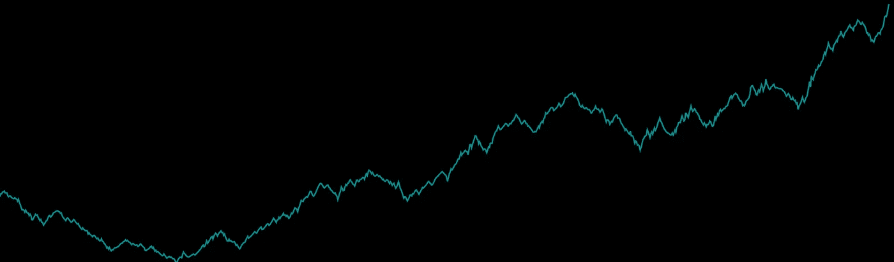

**图 15:** 多重分形时间序列中的布朗运动

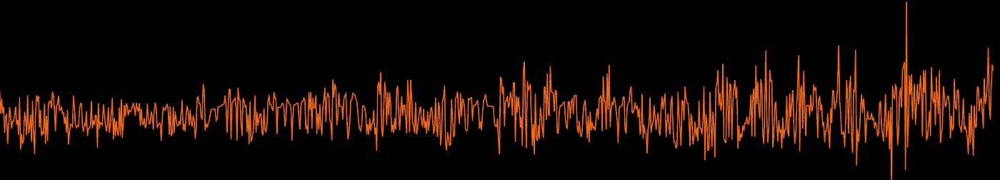

**图 16:** 多重分形时间波动簇中的布朗运动

图 15 和 16 完成了多重分形时间模型中的伯努瓦·曼德尔布罗*布朗运动。这个模型比普通的金融市场理论更好地解释了市场的复杂结构，从而提供了对市场风险的更好的评估。*

# 结束语

本文提供的信息是对多重分形时间中*布朗运动的总结。*它试图以简化的方式解释 Mandelbrot 出版物中的概念。关于多重分形时间中的*布朗运动的更多信息，*我鼓励您访问构成本文知识库的四个来源:

*   [资产收益的多重分形模型](https://users.math.yale.edu/~bbm3/web_pdfs/Cowles1164.pdf)。伯努瓦·曼德尔布罗。1997.
*   [金融价格换算:三。多重分形时间中的卡通布朗运动](https://users.math.yale.edu/users/mandelbrot/web_pdfs/cartoonBrownianMotions.pdf)。伯努瓦·曼德尔布罗。2001.
*   [股票市场的代理人](https://users.math.yale.edu/public_html/People/frame/Fractals/RandFrac/Market/TradingTime/TradingTime.html)来自耶鲁的资源。
*   市场的(错误)行为:风险、破产和回报的分形观点。伯努瓦·曼德尔布罗。2004.

要构建一个时间序列，请访问这个[交互式](https://cloud-tack.com/fma-ui/create)网站。如果您对生成这些时间序列的代码感兴趣，请安装 python 包 [fractalmarkets](https://pypi.org/project/fractalmarkets) 并遵循 [Github](https://github.com/hyperstripe50/fractal-market-analysis) 上的说明。