# Python 熊猫数据帧的索引和切片

> 原文：<https://pub.towardsai.net/indexing-and-slicing-python-pandas-dataframe-ed79f9a08176?source=collection_archive---------0----------------------->

## [数据科学](https://towardsai.net/p/category/data-science)，[编程](https://towardsai.net/p/category/programming)

## 熊猫数据帧的不同索引方法


来自 [Pexels](https://www.pexels.com/photo/pink-corded-headphones-on-pink-and-teal-wall-1037996/?utm_content=attributionCopyText&utm_medium=referral&utm_source=pexels) 的[驼鹿照片](https://www.pexels.com/@moose-photos-170195?utm_content=attributionCopyText&utm_medium=referral&utm_source=pexels)的照片

## 熊猫数据帧的索引和切片

索引和切片熊猫数据帧可以通过它们的索引位置/索引值来完成。

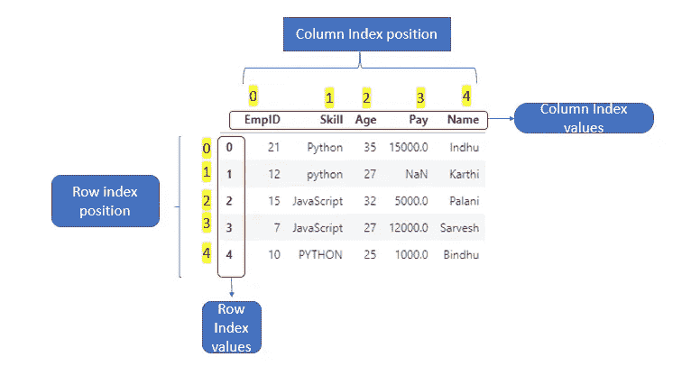

索引位置/索引值-[作者图片]

参考我在 Python 中的[索引 vs 切片](https://medium.com/dev-genius/indexing-vs-slicing-in-python-de01cd99c499)的故事

## 不同的索引方式

1.  标准索引
2.  通信线路（LinesofCommunication）
3.  iloc

**如何从 csv_file 创建数据帧。**

让我们看看如何从下面提到的数据帧中选择行和列。

```
**import** pandas **as** pd
df=pd.read_csv(**"C:\pandas_experiment\pandas_indexing_slicing\data.csv"**)
df
```

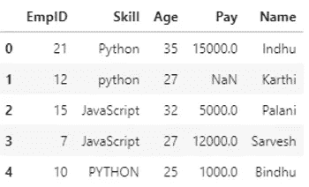

数据帧

## 标准索引

标准索引可以通过`[]`符号来完成。

1.  **选择单个列**

`df[“Skill”]`

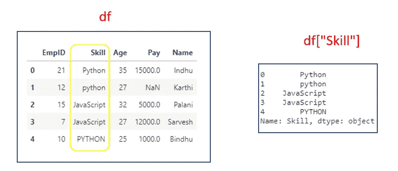

如果我们选择一列，它将返回一个系列。

```
type(df[**"Skill"**])
*#Output:pandas.core.series.Series*
```

## 2.选择多列

要选择多个列，我们必须给出列名列表。

`df[[“EmpID”,”Skill”]]`

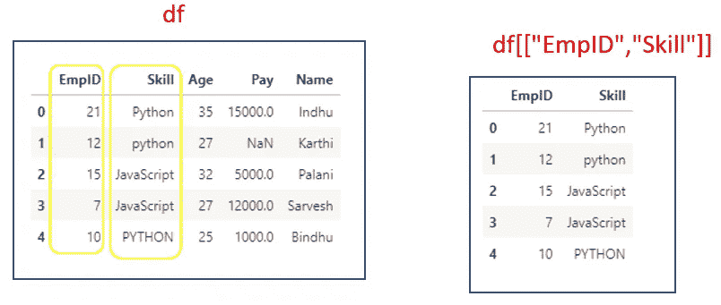

如果我们选择多列，它将返回一个 dataframe。

```
type(df[[**"EmpID"**,**"Skill"**]])
*#Output:pandas.core.frame.DataFrame*
```

## 3.使用切片对象选择行

`df[0:2]`

它将选择行 0 和行 1。结束索引为**独占**，与 python slice 相同。


## 4.切片对象中也提到了 Step

`df[0:4:2]`

它将从第 0 行开始，并按第 2 步递增，到第 4 行结束(不包括第 4 行)。与 python 切片相同。

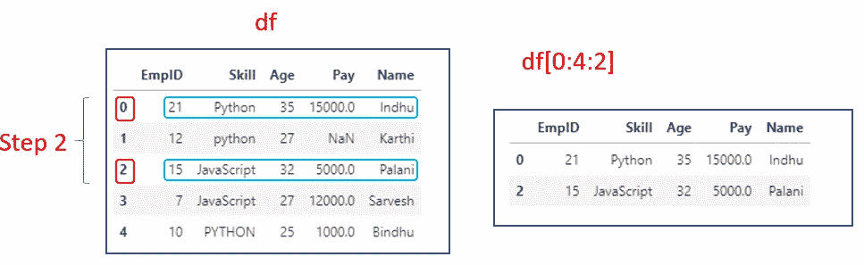

## 4.选择多行和单列

`df[0:2][“EmpID”]`

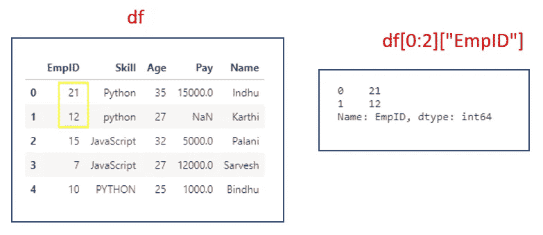

## 5.使用 row_index 值的切片选择行

首先，我们将把列`“Name”`设置为 row_index

```
df1=df.set_index(**"Name"**)
df1
```

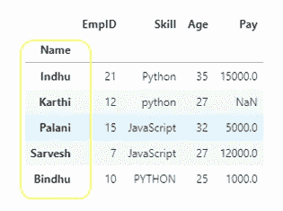

df1

`df1[“Indhu”:”Palani”]`

如果我们提到一片 row_index 值，那么结束索引是**包含**。

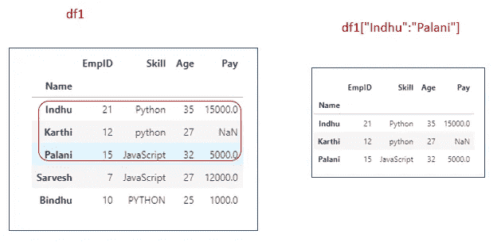

## 6.使用 row_index 值选择多行和单列

`df1[“Indhu”:”Palani”][“Age”]`

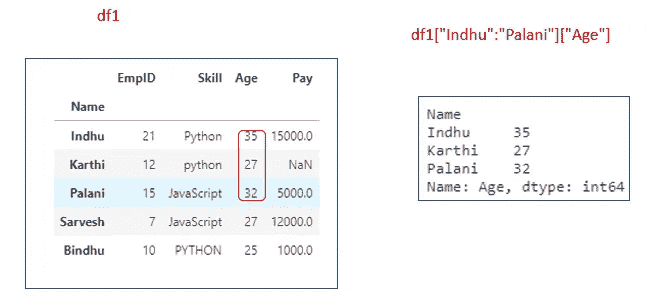

**注:**

*   我们可以通过仅指定 column_names 来选择列。
*   我们可以通过提及 row_index 值/row_index 位置的切片来选择行。
*   在选择行时，如果我们使用一个片的 row_index 位置，则结束索引为 **exclusive** 。但是如果我们使用一片 row_index 值/label，那么结束索引就是**包含**。
*   如果我们选择单个列或带有单个列的多个行，它将返回一个系列。
*   我们必须只通过提到 slice 来选择行。如果我们提到 row_index 或 list of row_index，就会引发 **KeyError** 。

## iloc

`.iloc`主要基于整数位置(从轴的`0`到`length-1`)，但也可用于布尔数组。如果请求的索引器越界，除了允许越界索引的*片*索引器外，
`.iloc`将引发`IndexError`。- [Python docs](https://pandas.pydata.org/pandas-docs/stable/user_guide/indexing.html)
允许的输入有:

*   一个整数，例如`5`。
*   整数列表或数组`[4, 3, 0]`
*   带有 int`1:7`的切片对象。
*   布尔数组(任何`NA`值都将被视为`False`)。
*   一个带有一个参数(调用序列或数据帧)的`callable`函数，返回索引的有效输出(上述之一)。

布尔数组和可调用函数→将保存此内容以备将来发布。

## 句法

`df.iloc[row_index_position,col_index_position]`

## **1。使用 iloc 选择单行。**

`df.iloc[0]`

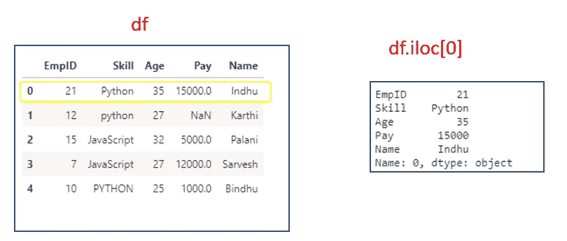

如果我们单独选择一行，它将返回一个系列。

```
type(df.iloc[0])
*#Output:pandas.core.series.Series*
```

## 2.使用 iloc 选择多行

如果我们必须选择多行，必须指定一个 row_index 列表。

`df.iloc[[0,1]]`

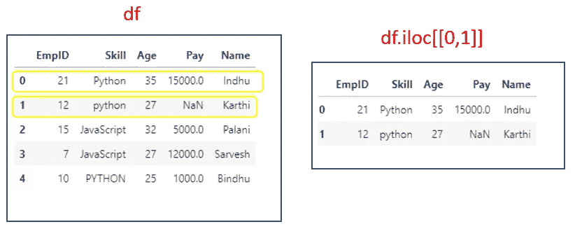

如果我们选择多行，它将返回一个 dataframe。

```
type(df.iloc[[0,1]])
*#Output:pandas.core.frame.DataFrame*
```

`df.iloc[[0,3]]`

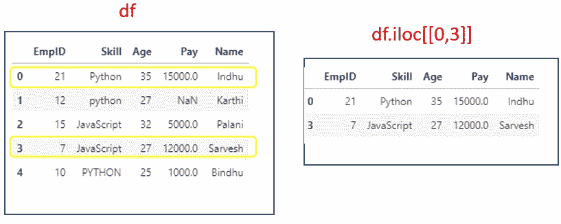

## 3.使用 iloc 选择多行和多列

`df.iloc[[0,1],[0,1]]`

行和列都只作为索引位置提及。

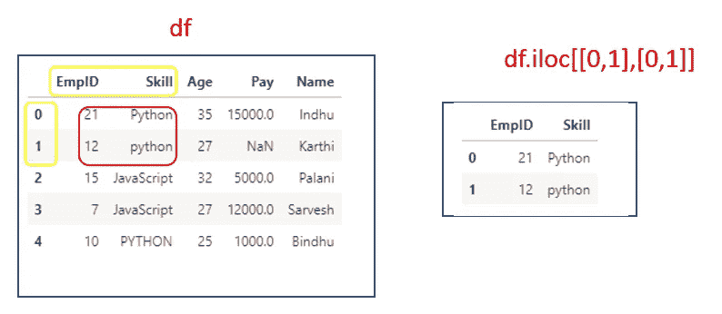

作者图片

## 4.使用 iloc 选择单行和多列

`df.iloc[[0],[0,1]]`

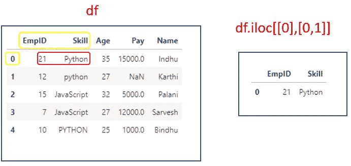

## 5.使用 iloc 选择多行和单列

`df.iloc[[0,1],[0]]`

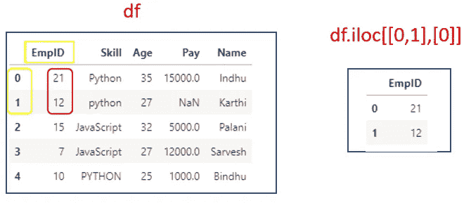

## 6.将列设置为 row_index 后，使用 row_index 位置选择行。

`df1.iloc[[0,2]]`

只提到了 row_index 位置。

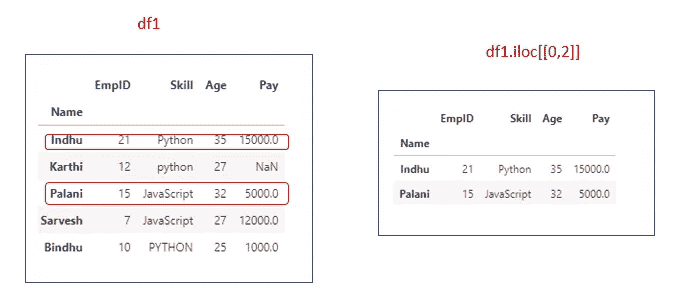

## 7.使用 iloc 中的切片对象选择行

`df.iloc[::-1]`

如果没有提到开始和停止索引，默认情况下，它将从第 0 行开始，在最后一行结束

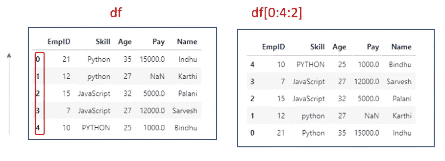

## 8.使用 iloc 中的切片对象选择行和列

`df1.iloc[0:4:2,0:2]`

`0:4:2` Row_index 位置。从第 0 行开始，在第 4 行停止，增量为 2(步长=2)

`0:2`列 _ 索引位置。从第 0 列开始，到第 2 列结束。

如果我们使用切片对象中的**索引位置**，则停止索引为 `exclusive`

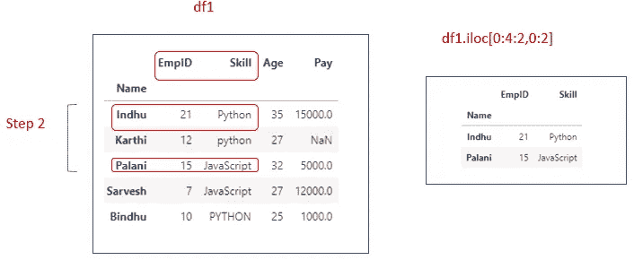

## 9.索引错误

如果我们在 iloc 中指定列索引标签，它将引发**索引错误**

```
df1.iloc[[0,2],[**"EmpID"**]]
*#Output:IndexError: .iloc requires numeric indexers, got ['EmpID']*
```

如果我们提到 row_index 值和 column_index 值，就会引发 **IndexError**

```
df1.iloc[[**"Indhu"**,**"Palani"**],[**"EmpID"**]]
*#Output:IndexError: .iloc requires numeric indexers, got ['Indhu' 'Palani']*
```

**注**

*   通过使用 iloc，我们不能单独选择一列或多列。
*   我们只需要提到 row_index 位置和 column_index 位置。
*   如果我们提到 row_index 值或 column_index 值，就会引发 **IndexError** 。
*   当我们在 iloc 中使用 slice 对象时，停止索引是 `exclusive`
*   如果我们选择单行，它将返回一系列。

## 返回类型

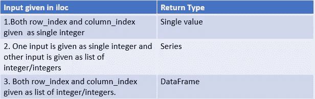

作者图片

## 通信线路（LinesofCommunication）

`loc`主要基于标签，但也可用于布尔数组。
`loc`找不到项目时会引发`KeyError`。- [Python 文档](https://pandas.pydata.org/pandas-docs/stable/user_guide/indexing.html)

允许的输入有:

1.  单一标签 `‘a’`
2.  标签列表`[‘a’,’b’,’c’]`
3.  带有标签`[‘a’:’c’]`的切片对象。开始和停止索引都是
4.  布尔数组(任何`NA`值将被视为`False`)。
5.  带有一个参数(调用序列或数据帧)的`callable`函数，返回索引的有效输出(上述之一)。

布尔数组和可调用函数→将保存此内容以备将来发布。

## 语法:

`df.loc[row_index_label,col_index_label]`

## 1.使用 loc 选择单行

`df.loc[0]`

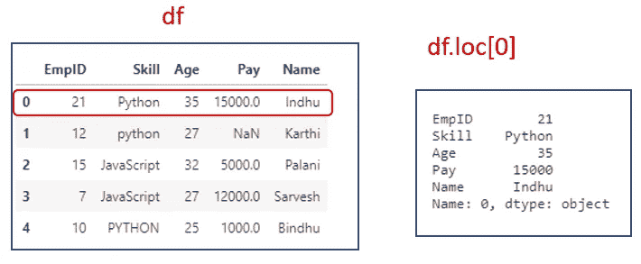

如果我们选择单行，它将返回一系列。

`df1.loc[“Indhu”]`

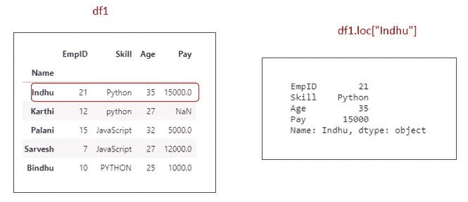

**2。使用 loc** 选择多行

要选择多行，我们必须提到标签列表。

`df.loc[[0,1]]`

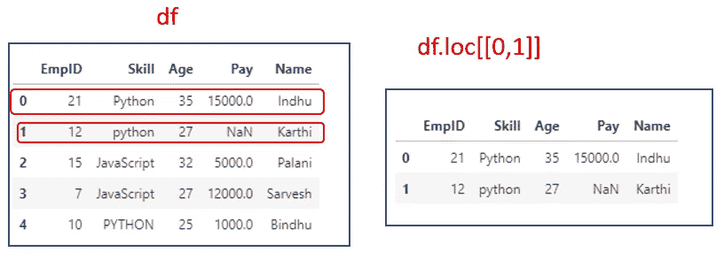

`df1.loc[[“Indhu”,”Karthi”]]`

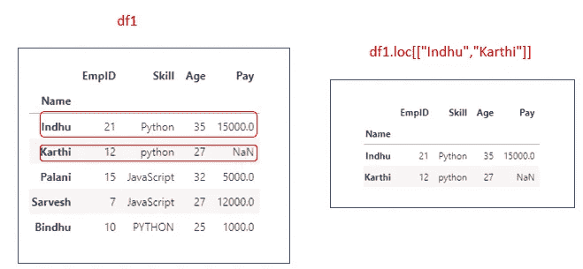

如果我们选择多行，它将返回一个 dataframe。

## 3.使用 loc 选择单行和单列

`df.loc[[0],’EmpID’]`

或者

`df.loc[0,’EmpID’]`

整数是有效的标签，但它们指的是标签，而不是位置。这里的`0`指的是标签。

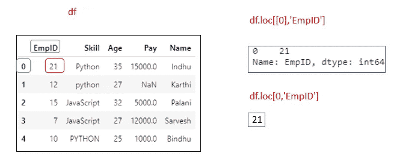

## 4.使用 loc 选择单行和多列

`df.loc[[0],[‘EmpID’,’Skill’]]`

或者

`df.loc[0,[‘EmpID’,’Skill’]]`

如果我们将行和列标签称为列表方式，它将返回一个数据帧

如果我们将行标签称为单个标签，将列标签称为列表方式，它将返回一个系列。

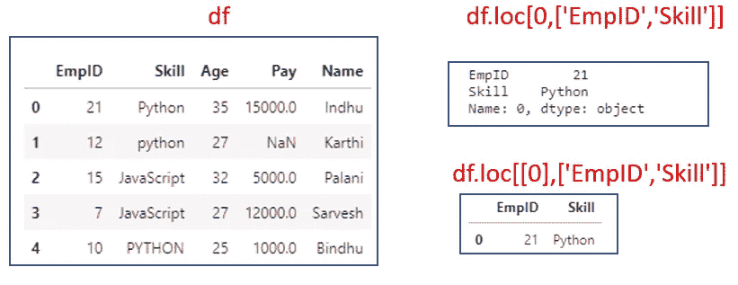

`df1.loc[[“Indhu”],[‘EmpID’,’Skill’]]`

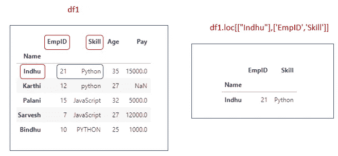

## 6.在 loc 中使用切片对象选择行

`df.loc[0:4:2]`

从第 0 行开始，到第 4 行结束，增量为 2。如果我们在切片对象中使用**索引标签**，则结束索引为 `inclusive`

如果我们使用`loc`，它就是**纯粹基于标签的索引。**整数是有效标签，但指的是标签，不是位置。这里的`0`指的是标签。

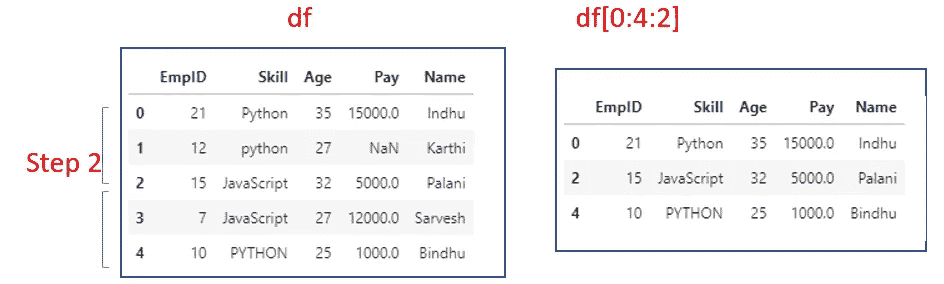

## 7.使用 loc 中的切片对象选择行和列

`df1.loc[::2,”EmpID”:”Age”]`

`::2` →从第一行到最后一行按步骤 2 递增。

`”EmpID”:”Age”` - >包括从`“EmpID”`到`“Age”`的列

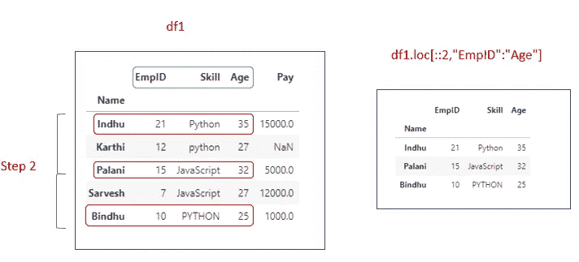

**注**

*   通过使用 loc，我们不能单独选择单个列或多个列。
*   我们只需要提到 row_index 标签和 column_index 标签。
*   如果我们提到 row_index 位置或者 column_index 位置，就会引发 **KeyError** 。
*   如果我们选择单行，它将返回一系列。
*   如果我们给一个 slice 对象作为 row_index /column_index，它就不应该写在 list[]中。

## 返回类型

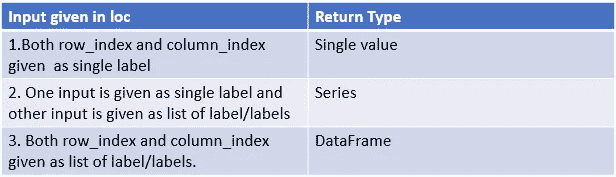

作者图片

## 示例:

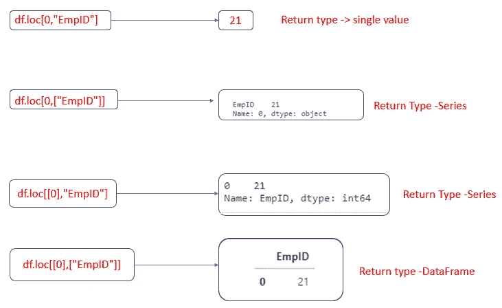

作者图片

## 结论:

*   使用`Standard indexing[]`，我们可以选择一列或多列。但是通过使用 loc 和 iloc，我们不能单独选择单个列或多个列。
*   使用`standard indexing[]`，我们可以仅使用一个切片对象来选择行。我们可以提到切片对象中的 row_index 值/位置。如果我们使用 row_index 值，end_index 是包含的。如果我们使用 row_index 位置，则结束索引是排他的
*   使用 loc，它是**纯粹基于标签的索引。**当在 loc 中使用切片时，开始和停止索引都是**和**。
*   使用 iloc，**完全基于整数的索引**。这些是`0-based`索引。当在 iloc 中使用切片时，开始边界是*包含*，而上限是*不包含*。

## Github 链接:

我的 jupyter 笔记本和代码中用到的 csv 文件可以从我的 [GitHub 链接](https://github.com/IndhumathyChelliah/pandas_experiment/tree/master/pandas_indexing_slicing)下载。

## 资源(Python 文档):

*   [分度和切片](https://pandas.pydata.org/pandas-docs/stable/user_guide/indexing.html)

## **延伸阅读**

[](https://betterprogramming.pub/sorting-a-python-pandas-dataframes-by-index-and-value-7306ac754014) [## 按索引和值对 Python 熊猫数据帧进行排序

### 更好的分类

better 编程. pub](https://betterprogramming.pub/sorting-a-python-pandas-dataframes-by-index-and-value-7306ac754014) [](https://medium.com/dev-genius/indexing-vs-slicing-in-python-de01cd99c499) [## Python 中的索引与切片

### 了解索引和切片

medium.com](https://medium.com/dev-genius/indexing-vs-slicing-in-python-de01cd99c499) 

*观看此空间，了解更多关于 Python 和数据科学的文章。如果你喜欢看我的更多教程，就关注我的* [***中***](https://medium.com/@IndhumathyChelliah)[***LinkedIn***](https://www.linkedin.com/in/indhumathy-chelliah/)*[***推特***](https://twitter.com/IndhuChelliah) ***。****

*感谢阅读！*