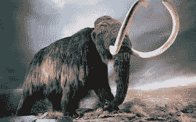
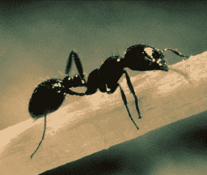
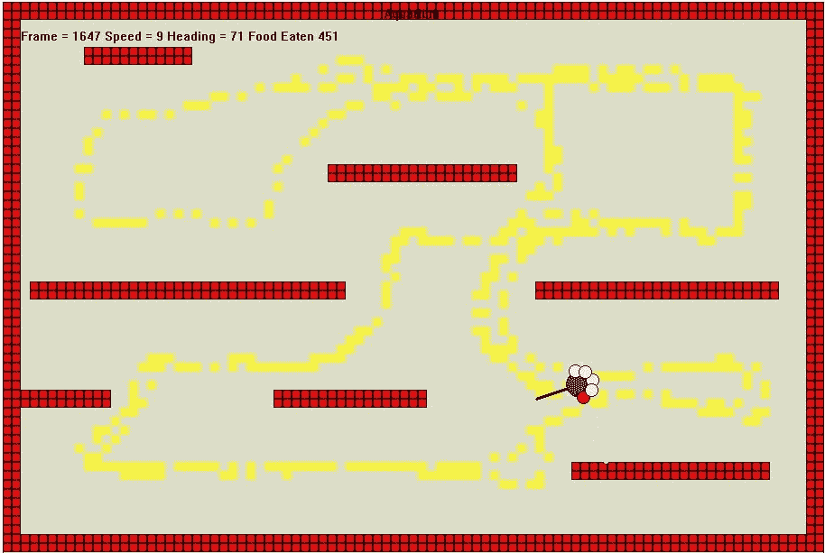
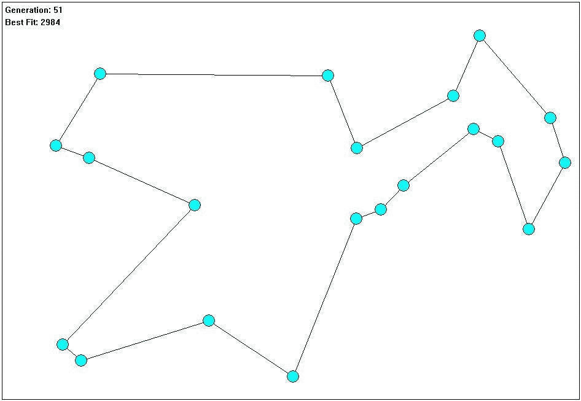
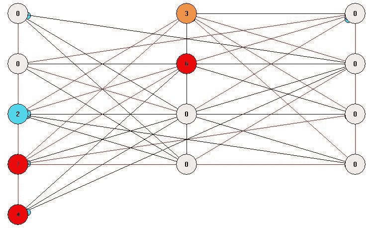
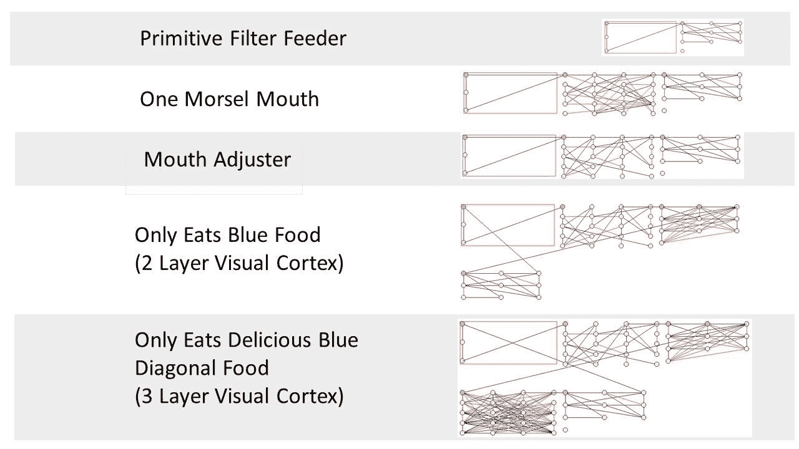
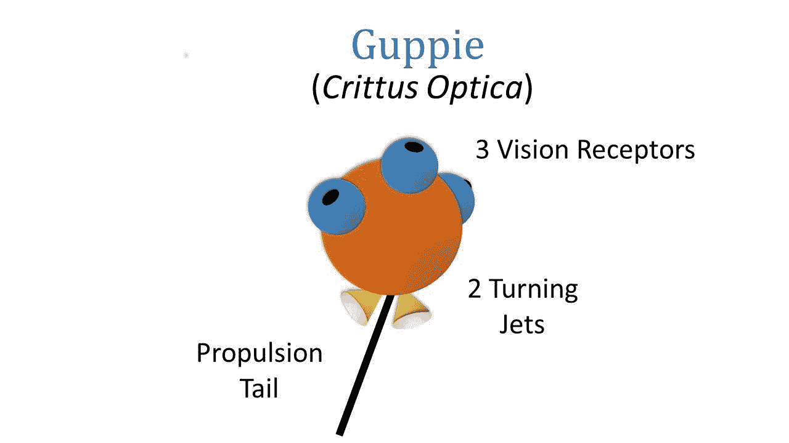

# 工业实力进化、遗传学和人工智能

> 原文：<https://pub.towardsai.net/industrial-strength-evolution-genetics-and-ai-db2d8c9b861?source=collection_archive---------0----------------------->

## 商业化遗传算法| [走向 AI](https://towardsai.net)

# 给遗传算法带来规模和商业

在商业人工智能应用中使用遗传算法已经让位于深度学习神经网络技术。机器学习已经占据了所有的头条，几年前的实验现在已经成为现实世界的应用。遗传算法没有出现这种情况。和它们一起玩肯定很有趣。在 YouTube 上快速浏览一下，你会发现一些例子，比如玩拍打翅膀的鸟、马里奥兄弟、驾驶汽车，以及让模拟的软硬体生物行走。我们如何从科学实验到工业实践进行同样的转变？任何商业化都需要这种严格程度。

我们从理论上把遗传算法技术应用于人工智能。我们能否进化出有意义的解决方案，与更商业化的机器学习技术所取得的结果相比较？你可以发展非常简单和小规模的实验。进化出一个玩视频游戏的解决方案是非常有趣的，但是，这些实验会导致什么结果呢？

当你开始考虑商业规模的遗传算法时，你会碰到一堵墙。你可以用几十万个模拟神经元，设计一个很好的适应函数，让它在一夜之间过滤，得到像蚂蚁一样聪明的东西，这种想法根本行不通。很明显，它对更复杂的大脑不起作用(无意冒犯蚂蚁大脑)。我们甚至不能模拟蠕虫体内的几百个神经元。

[这里的](https://en.wikipedia.org/wiki/List_of_animals_by_number_of_neurons)是一个动物物种及其神经元数量的伟大列表。前面提到的蚂蚁大脑大约有 25 万个神经元。一个现代的 Nvidia GPU 有足够的马力来模拟这样规模的网络。我有一个实现很差的神经模拟器，运行在一台 5 年前的笔记本电脑上，每秒钟处理一百万个假神经元。

我们如何利用遗传算法技术和思想，并将其推广到我们在自然界中看到的规模水平？

# 这是一个过程

遗传算法正试图从大自然中获得灵感。我们创造表现型、基因型和染色体。我们模拟遗传育种(杂交),发明确定“有机体”生存能力和育种可能性的方法。它的功能不完全像自然，但这种灵感确实产生了结果。

缺少了一部分自然灵感。历史不见了。一个典型的遗传算法实验包括创建问题的数学模型，创建染色体表示和决定谁繁殖的“适应度函数”。你点燃它，看看会出现什么。

人类是特化的鱼。我们在室内携带的许多东西都可以追溯到我们的水祖先。我们的大脑是一样的。我们有传承下来的层次和部分。我们逃离危险并想要交配的原因是由我们的杏仁核驱动的。我们都是蜥蜴的时候就有了。

我们的 GA 开发模型没有考虑到这一点。我们进行实验，得到有趣的、有时有用的结果，然后重新开始。这是一个限制规模的根本问题。

# 进化平台

我准备摘掉进化生物学家的帽子(我是一个幼稚的业余爱好者)，戴上软件工程的帽子(比较适合)。这迫切需要一个平台解决方案。需要一个一致的平台。我们看到这种情况出现在机器学习中(TensorFlow，Google.ai，FaceBook 的 FAIR)。Matlab 有可用的 GA 工具，还有一些其他的工具包。然而，没有大规模的平台专注于神经模拟、遗传算法和这一历史组成部分。

# 主要特点:

1.  **一套标准接口和方法**。让我们定义神经模拟如何工作的基础。我们可以创建染色体的定义，包括如何改变它。你可以想象一个定义适应度函数的标准机制。
2.  **将工作建立在过去工作基础上的能力**。神经系统和部分神经系统可以使用和重复使用。人工脑源控制应该显示出你在自然界看到的谱系和分支类型。每个实验都不是从零开始的。
3.  **一个多元且不同贡献的环境**。软件世界已经知道如何做到这一点。我们需要创建一个代码库(适应度函数、模拟环境、与其他系统的连接、遗传算法规则等)。)和可以被社区使用的进化数据集。

# 原型环境

为了测试这些想法，我搭建了一个实验平台。最后有演示视频的链接以及源代码。这个项目并不意味着形成任何系统的基础，而是测试如何建立这样一个平台的想法。我提前向所有浏览代码的人道歉。我已经离开编码领域 15 年多了，所以我的技能有点生疏了，我的工具选择可能看起来古雅且非常老派。一切都是用 C++，MS Visual Studio 2017 完成的，目标是作为 Windows 桌面应用程序。一个真正的平台将采用更现代的方法。把这当成邀请其他人加入的邀请。

在这个实验中，我进化出了各种生物，从简单的滤食动物到四处游动并能躲避物体的动物。该原型平台具有通用 GA 平台、简单的神经仿真模型和数据管理工具。

# 第一步—GA 平台

我首先开发了创建控件和显示结果的基本框架。然后我实现了一组可以执行遗传算法的基本 C++对象。为了测试这一点，我让它解决了旅行推销员问题。

我们的目标不是解决这个问题，而是创建和测试构建更大平台所需的脚手架。这个对象集允许重载以下内容:适应度函数、交叉方法、育种选择和染色体设计。该平台保留了运行 TSP 的能力。

# 第二步——设计一个神经模拟环境

视频演示更详细。大脑由一组神经元和连接组成，它们的行为非常简单。每个神经元简单地通过对其输入求和来确定其状态。这个总和然后被传递给它所连接的下一个神经元。

用于遗传算法的染色体只是一个模拟突触的指针。突触有起始神经元、终止神经元和极性(正或负)。进化发生在这一系列突触的重组中，而不是神经元。这可能需要重新审视。由此产生的神经模拟器又快又小。如前所述，在我优化任何代码之前，我获得了大约每秒一百万个神经元的性能。我目前正在增加这个网络上的节点引用其他网络的能力。

# 第三步——顺其自然

我把这个神经模拟环境分层放到我的 GA 平台上，开始进化小生物。我创造了各种感官能力的小型滤食动物，以及能四处游动和穿越障碍跑道的生物。同样，看看最后的视频，看看这些在行动中。

这个实验的一个关键方面是体现一种历史的方法。每种生物都不是独立实验的结果，而是逐步进化成功的集合。

这是一张所有滤食性动物的照片，它们被称为我进化出来的生物。它们都共享早期进化的神经硬件。每一个都更有能力进行复杂的食物分类，并以先前成功的有机体为基础。

我的游泳生物叫做孔雀鱼，它们的运动和眼睛可以在模拟世界中探测到物体(第二集——视频)。我的计划是看看我是否能把这个基本的大脑加上一个联想学习能力，后进化。

# 感兴趣吗？

使用进化和遗传算法构建商业应用程序和解决更大的人工智能问题将采取工业平台的方法。我的目标是开始这个对话。

你可以在[danlovy.com/critter](http://danlovy.com/critter/)跟随旅程并注册更新等

脸书集团:

[生物人工智能](https://www.facebook.com/groups/195911171010616/)

第一集详细描述了平台和第一批生物:[https://www.youtube.com/watch?v=BaAqFHr0nts](https://www.youtube.com/watch?v=BaAqFHr0nts)

第二集以游泳的孔雀鱼为特色:【https://www.youtube.com/watch?v=0D6B1sU_Fiw 

第三集的主角是一个更有能力的游泳生物:https://www.youtube.com/watch?v=Z6fmkZW9JCM

YouTube 上一些以 GA 解决方案为特色的最搞笑的视频:[马里奥](https://www.youtube.com/watch?v=qv6UVOQ0F44)、[软体生物、](https://www.youtube.com/watch?v=CXTZHHQ7ZiQ) [驾驶汽车](https://www.youtube.com/watch?v=5lJuEW-5vr8)、[扑翼鸟](https://www.youtube.com/watch?v=aeWmdojEJf0)。还有几十个。

